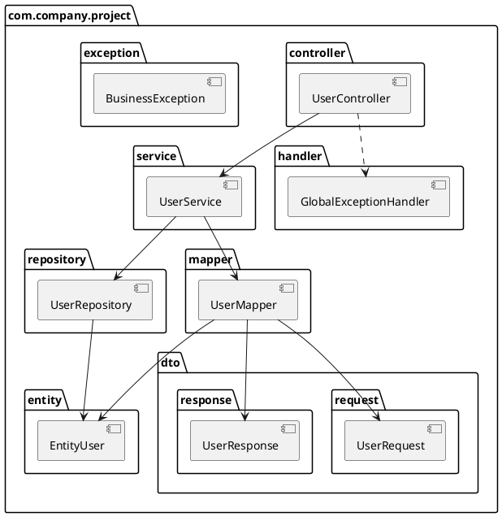
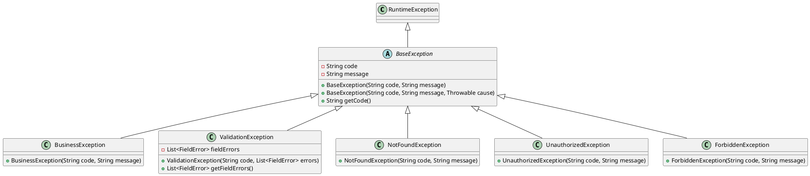

# Стандарты разработки на Java и Spring Boot

**Версия:** 1.0  
**Целевая аудитория:** Enterprise-команды разработки на Spring Boot 4  
**Версия Java:** 25

---

## Содержание

1. [Структура пакетов](#1-структура-пакетов)
2. [Соглашения по именованию](#2-соглашения-по-именованию)
3. [Организация импортов](#3-организация-импортов)
4. [Логирование](#4-логирование)
5. [Обработка исключений](#5-обработка-исключений)
6. [Форматирование кода](#6-форматирование-кода)
7. [Комментарии и документация](#7-комментарии-и-документация)
8. [Рекомендации по REST API](#8-рекомендации-по-rest-api)
9. [JPA и работа с базой данных](#9-jpa-и-работа-с-базой-данных)
10. [Управление транзакциями](#10-управление-транзакциями)
11. [Тестирование](#11-тестирование)
12. [Конфигурация](#12-конфигурация)
13. [Маппинг, валидация и интеграции](#13-маппинг-валидация-и-интеграции)
14. [Сложность кода](#14-сложность-кода)

---

## 1. Структура пакетов

### 1.1 Слоистая архитектура

Организация кода по техническим слоям внутри одного Maven модуля:

```
com.company.project
├── config          # Классы конфигурации
├── controller      # REST контроллеры
├── service         # Бизнес-логика
├── repository      # Слой доступа к данным
├── entity          # JPA сущности
├── dto             # Объекты передачи данных (DTO)
│   ├── request     # DTO для запросов
│   └── response    # DTO для ответов
├── mapper          # Мапперы объектов (Entity <-> DTO)
├── exception       # Пользовательские исключения
├── handler         # Обработчики исключений и событий
├── interceptor     # HTTP перехватчики
├── filter          # Сервлетные фильтры
├── converter       # Пользовательские конвертеры
└── util            # Утилитные классы
```

### 1.2 Правила именования пакетов

- **Только строчные буквы**: `com.company.project.service`
- **Существительные в единственном числе**: `entity`, а не `entities`
- **Без сокращений**: `controller`, а не `ctrl`

### 1.3 UML диаграмма пакетов



---

## 2. Соглашения по именованию

### 2.1 Классы

| Тип | Шаблон | Пример |
|-----|--------|--------|
| **Сущность** | `Entity{Название}` | `EntityUser`, `EntityOrder` |
| **Контроллер** | `{Название}Controller` | `UserController`, `OrderController` |
| **Интерфейс сервиса** | `{Название}Service` | `UserService`, `OrderService` |
| **Реализация сервиса (единственная)** | `Custom{Название}Service` | `CustomUserService` |
| **Реализация сервиса (несколько)** | `{Специфика}{Название}Service` | `EmailNotificationService`, `SmsNotificationService` |
| **Репозиторий** | `{Название}Repository` | `UserRepository` |
| **DTO запрос** | `{Название}Request` | `UserRequest`, `CreateOrderRequest` |
| **DTO ответ** | `{Название}Response` | `UserResponse`, `OrderResponse` |
| **Маппер** | `{Название}Mapper` | `UserMapper` |
| **Исключение** | `{Назначение}Exception` | `UserNotFoundException`, `InvalidDataException` |
| **Обработчик** | `{Назначение}Handler` | `GlobalExceptionHandler`, `AuthenticationHandler` |
| **Конфигурация** | `{Назначение}Config` | `SecurityConfig`, `DatabaseConfig` |
| **Фильтр** | `{Назначение}Filter` | `AuthenticationFilter`, `LoggingFilter` |
| **Перехватчик** | `{Назначение}Interceptor` | `RequestLoggingInterceptor` |
| **Конвертер** | `{Источник}To{Цель}Converter` | `StringToDateConverter` |
| **Утилита** | `{Назначение}Utils` | `DateUtils`, `ValidationUtils` |

### 2.2 Методы

- **Глаголы или глагольные фразы**: `findUser()`, `createOrder()`, `isValid()`
- **Методы, возвращающие boolean**: используйте префиксы `is`, `has`, `can`
  ```java
  public boolean isActive() { }
  public boolean hasPermission() { }
  public boolean canExecute() { }
  ```
- **Геттеры/сеттеры**: стандартные соглашения JavaBeans
  ```java
  public String getName() { }
  public void setName(String name) { }
  ```

### 2.3 Переменные

- **camelCase**: `userName`, `orderTotal`
- **Константы**: `UPPER_SNAKE_CASE`
  ```java
  public static final int MAX_RETRY_COUNT = 3;
  public static final String API_VERSION = "v1";
  ```
- **Осмысленные имена**: избегайте однобуквенных переменных, кроме циклов
  ```java
  // Хорошо
  for (int index = 0; index < users.size(); index++) { }
  
  // Допустимо в коротких циклах
  for (int i = 0; i < 10; i++) { }
  ```

### 2.4 Пакеты

- **Строчные буквы, единственное число**: `service`, `controller`, `entity`
- **Без сокращений**: `repository`, а не `repo`

### 2.5 Запрещенные конструкции

**ОБЯЗАТЕЛЬНЫЕ ОГРАНИЧЕНИЯ:**

#### 2.5.1 Ключевое слово `var`

Ключевое слово `var` для вывода типов локальных переменных **СТРОГО ЗАПРЕЩЕНО** к использованию.

```java
// ❌ ЗАПРЕЩЕНО - использование var
var users = userRepository.findAll();
var result = calculateTotal(items);
var mapper = new UserMapper();
var response = new UserResponse();

// ✅ ПРАВИЛЬНО - явное указание типов
List<EntityUser> users = userRepository.findAll();
BigDecimal result = calculateTotal(items);
UserMapper mapper = new UserMapper();
UserResponse response = new UserResponse();
```

**Причины запрета:**
- Снижает читаемость кода, особенно при code review
- Затрудняет понимание типов без использования IDE
- Усложняет анализ кода и рефакторинг
- Может скрывать ошибки приведения типов
- Создает неоднозначность в сложных выражениях

#### 2.5.2 Generic Wildcards в параметрах методов

Generic wildcards (`?`, `? extends`, `? super`) **СТРОГО ЗАПРЕЩЕНЫ** в параметрах методов.

```java
// ❌ ЗАПРЕЩЕНО - wildcards в параметрах методов
public void processUsers(List<?> users) { }
public void addItems(List<? extends Item> items) { }
public void saveEntities(List<? super EntityUser> entities) { }
public UserResponse findUser(Optional<? extends EntityUser> user) { }

// ✅ ПРАВИЛЬНО - конкретные типы или type parameters
public void processUsers(List<EntityUser> users) { }
public void addItems(List<OrderItem> items) { }
public <T extends EntityUser> void saveEntities(List<T> entities) { }
public UserResponse findUser(Optional<EntityUser> user) { }
```

**Причины запрета:**
- Усложняет понимание контракта метода
- Ограничивает возможности использования параметров внутри метода
- Затрудняет отладку и unit-тестирование
- Создает неопределенность в типах данных
- Усложняет мокирование в тестах

**Исключения (использовать с осторожностью):**
- В возвращаемых типах методов (когда действительно необходимо)
- Во внутренних приватных вспомогательных методах (в исключительных случаях)

```java
// Допустимо в возвращаемом типе (если требуется гибкость)
public List<? extends UserResponse> findUsersByStatus(UserStatus status) {
  // реализация
}

// Но предпочтительнее конкретный тип
public List<UserResponse> findUsersByStatus(UserStatus status) {
  // реализация
}
```


## 3. Организация импортов

### 3.1 Правила

✅ **ДЕЛАЙТЕ:**
- Используйте явные импорты
- Группируйте импорты: Java стандартная библиотека → Сторонние библиотеки → Пакеты приложения
- Сортируйте по алфавиту внутри групп
- Используйте статические импорты для констант и утилитных методов

❌ **НЕ ДЕЛАЙТЕ:**
- **СТРОГО ЗАПРЕЩЕНО** использовать wildcard импорты (`import java.util.*;`)
- **СТРОГО ЗАПРЕЩЕНО** использовать wildcard импорты даже для статических импортов (`import static org.junit.jupiter.api.Assertions.*;`)
- Не импортируйте неиспользуемые классы

**КРИТИЧЕСКИ ВАЖНО**: Каждый импорт должен быть явным и конкретным. Wildcard импорты (`*`) запрещены во всех случаях, включая:
- Обычные импорты: ❌ `import java.util.*;`
- Статические импорты: ❌ `import static org.mockito.Mockito.*;`
- Импорты из Jakarta/JEE: ❌ `import jakarta.servlet.*;`
- Импорты из Spring: ❌ `import org.springframework.web.bind.annotation.*;`

### 3.2 Порядок импортов

```java
// 1. Стандартная библиотека Java
import java.time.LocalDateTime;
import java.util.List;
import java.util.Optional;

// 2. Сторонние библиотеки (Spring и др.)
import org.springframework.stereotype.Service;
import org.springframework.transaction.annotation.Transactional;

import com.fasterxml.jackson.annotation.JsonProperty;

// 3. Пакеты приложения
import com.company.project.entity.EntityUser;
import com.company.project.repository.UserRepository;

// 4. Статические импорты (при необходимости)
import static com.company.project.util.Constants.MAX_PAGE_SIZE;
import static org.springframework.http.HttpStatus.OK;
```

### 3.3 Статические импорты

Статические импорты **разрешены**, но **ТОЛЬКО** с явным указанием импортируемых элементов:

✅ **ПРАВИЛЬНО:**
```java
// Константы - явное указание
import static com.company.project.constant.ErrorCodes.USER_NOT_FOUND;
import static com.company.project.constant.ErrorCodes.VALIDATION_ERROR;

// Утилитные методы - явное указание
import static com.company.project.util.ValidationUtils.isNotEmpty;
import static com.company.project.util.ValidationUtils.isValidEmail;

// Утверждения в тестах - явное указание
import static org.junit.jupiter.api.Assertions.assertEquals;
import static org.junit.jupiter.api.Assertions.assertNotNull;
import static org.junit.jupiter.api.Assertions.assertTrue;
import static org.junit.jupiter.api.Assertions.assertThrows;

// Методы Mockito - явное указание
import static org.mockito.Mockito.when;
import static org.mockito.Mockito.verify;
import static org.mockito.Mockito.any;
import static org.mockito.Mockito.never;
```

❌ **НЕПРАВИЛЬНО - wildcard статические импорты ЗАПРЕЩЕНЫ:**
```java
import static com.company.project.constant.ErrorCodes.*;
import static org.junit.jupiter.api.Assertions.*;
import static org.mockito.Mockito.*;
```

---

## 4. Логирование

### 4.1 Фреймворк

Используйте **SLF4J** с реализацией **Log4j2**.

```java
import org.slf4j.Logger;
import org.slf4j.LoggerFactory;

@Service
public class CustomUserService implements UserService {
  
  private static final Logger log = LoggerFactory.getLogger(CustomUserService.class);
  
  // ...
}
```

### 4.2 Уровни логирования

| Уровень | Использование |
|---------|---------------|
| **INFO** | Нормальный поток работы приложения, бизнес-операции, события запуска/остановки |
| **ERROR** | Ошибки, требующие внимания, исключения, неудачные операции |

**НЕ используйте:** TRACE, DEBUG, WARN в production коде.

### 4.3 Структурированное логирование (JSON формат)

Настройте Log4j2 для вывода в JSON с маскировкой чувствительных данных.

**log4j2.xml:**
```xml
<?xml version="1.0" encoding="UTF-8"?>
<Configuration status="WARN">
  <Appenders>
    <Console name="ConsoleAppender" target="SYSTEM_OUT">
      <JsonTemplateLayout eventTemplateUri="classpath:EcsLayout.json"/>
    </Console>
  </Appenders>
  
  <Loggers>
    <Root level="INFO">
      <AppenderRef ref="ConsoleAppender"/>
    </Root>
    
    <Logger name="com.company.project" level="INFO" additivity="false">
      <AppenderRef ref="ConsoleAppender"/>
    </Logger>
  </Loggers>
</Configuration>
```

**Конфигурация конвертера для маскировки чувствительных данных:**

```xml
<?xml version="1.0" encoding="UTF-8"?>
<Configuration status="WARN" packages="com.company.project.logging">
  <Appenders>
    <Console name="ConsoleAppender" target="SYSTEM_OUT">
      <PatternLayout>
        <pattern>%d{yyyy-MM-dd HH:mm:ss} [%t] %-5level %logger{36} - %msg%n</pattern>
      </PatternLayout>
      <Policies>
        <SizeBasedTriggeringPolicy size="10MB"/>
      </Policies>
    </Console>
    
    <RollingFile name="JsonAppender" fileName="logs/application.log"
                 filePattern="logs/application-%d{yyyy-MM-dd}.log.gz">
      <JsonLayout complete="false" compact="true">
        <KeyValuePair key="timestamp" value="$${date:yyyy-MM-dd'T'HH:mm:ss.SSSZ}"/>
        <KeyValuePair key="level" value="$${level}"/>
        <KeyValuePair key="logger" value="$${logger}"/>
        <KeyValuePair key="message" value="$${message}"/>
        <KeyValuePair key="thread" value="$${thread}"/>
      </JsonLayout>
      <Policies>
        <TimeBasedTriggeringPolicy interval="1"/>
        <SizeBasedTriggeringPolicy size="50MB"/>
      </Policies>
      <!-- Конвертер для маскировки чувствительных данных -->
      <Filters>
        <SensitiveDataMaskingFilter/>
      </Filters>
    </RollingFile>
  </Appenders>
  
  <Loggers>
    <Root level="INFO">
      <AppenderRef ref="ConsoleAppender"/>
      <AppenderRef ref="JsonAppender"/>
    </Root>
  </Loggers>
</Configuration>
```

**Класс конвертера для маскировки чувствительных данных:**

```java
package com.company.project.logging;

import org.apache.logging.log4j.core.Filter;
import org.apache.logging.log4j.core.LogEvent;
import org.apache.logging.log4j.core.config.plugins.Plugin;
import org.apache.logging.log4j.core.config.plugins.PluginFactory;
import org.apache.logging.log4j.core.filter.AbstractFilter;

import java.util.regex.Pattern;

/**
 * Фильтр для маскировки чувствительных данных в логах.
 *
 * @author Название команды
 * @since 1.0
 */
@Plugin(name = "SensitiveDataMaskingFilter", category = "Core", 
        elementType = Filter.ELEMENT_TYPE, printObject = true)
public class SensitiveDataMaskingFilter extends AbstractFilter {
  
  private static final Pattern PASSWORD_PATTERN = 
    Pattern.compile("(password|passwd|pwd)[\"']?\\s*[:=]\\s*[\"']?([^\"',\\s}]+)", 
      Pattern.CASE_INSENSITIVE);
  
  private static final Pattern CARD_PATTERN = 
    Pattern.compile("(\\d{4})[\\s-]?(\\d{4})[\\s-]?(\\d{4})[\\s-]?(\\d{4})");
  
  private static final Pattern EMAIL_PATTERN = 
    Pattern.compile("([a-zA-Z0-9._%+-]+)@([a-zA-Z0-9.-]+\\.[a-zA-Z]{2,})");
  
  private static final Pattern TOKEN_PATTERN = 
    Pattern.compile("(token|authorization|bearer)[\"']?\\s*[:=]\\s*[\"']?([^\"',\\s}]+)", 
      Pattern.CASE_INSENSITIVE);
  
  @PluginFactory
  public static SensitiveDataMaskingFilter createFilter() {
    return new SensitiveDataMaskingFilter();
  }
  
  @Override
  public Result filter(LogEvent event) {
    String message = event.getMessage().getFormattedMessage();
    String maskedMessage = maskSensitiveData(message);
    
    // Здесь можно модифицировать событие, если необходимо
    return Result.NEUTRAL;
  }
  
  private String maskSensitiveData(String message) {
    if (message == null) {
      return null;
    }
    
    String masked = message;
    
    // Маскировка паролей
    masked = PASSWORD_PATTERN.matcher(masked)
      .replaceAll("$1: ********");
    
    // Маскировка номеров карт
    masked = CARD_PATTERN.matcher(masked)
      .replaceAll("****-****-****-$4");
    
    // Частичная маскировка email
    masked = EMAIL_PATTERN.matcher(masked)
      .replaceAll("$1***@$2");
    
    // Маскировка токенов
    masked = TOKEN_PATTERN.matcher(masked)
      .replaceAll("$1: ********");
    
    return masked;
  }
}
```

### 4.4 Логирование HTTP запросов и ответов

**ОБЯЗАТЕЛЬНО**: Все входящие и исходящие HTTP запросы должны логироваться через кастомный фильтр.

**RequestResponseLoggingFilter:**

```java
package com.company.project.filter;

import com.fasterxml.jackson.databind.ObjectMapper;
import jakarta.servlet.Filter;
import jakarta.servlet.FilterChain;
import jakarta.servlet.ServletException;
import jakarta.servlet.ServletRequest;
import jakarta.servlet.ServletResponse;
import jakarta.servlet.http.HttpServletRequest;
import jakarta.servlet.http.HttpServletResponse;
import org.slf4j.Logger;
import org.slf4j.LoggerFactory;
import org.springframework.stereotype.Component;
import org.springframework.web.util.ContentCachingRequestWrapper;
import org.springframework.web.util.ContentCachingResponseWrapper;

import java.io.IOException;
import java.nio.charset.StandardCharsets;
import java.util.Enumeration;
import java.util.HashMap;
import java.util.Map;

/**
 * Фильтр для логирования всех входящих и исходящих HTTP запросов.
 * Логирует URL, метод, headers, request body, response body и время обработки.
 *
 * @author Название команды
 * @since 1.0
 */
@Component
public class RequestResponseLoggingFilter implements Filter {
  
  private static final Logger log = LoggerFactory.getLogger(
    RequestResponseLoggingFilter.class
  );
  
  private final ObjectMapper objectMapper;
  
  public RequestResponseLoggingFilter(ObjectMapper objectMapper) {
    this.objectMapper = objectMapper;
  }
  
  @Override
  public void doFilter(
    ServletRequest request,
    ServletResponse response,
    FilterChain chain
  ) throws IOException, ServletException {
    
    HttpServletRequest httpRequest = (HttpServletRequest) request;
    HttpServletResponse httpResponse = (HttpServletResponse) response;
    
    ContentCachingRequestWrapper requestWrapper = 
      new ContentCachingRequestWrapper(httpRequest);
    ContentCachingResponseWrapper responseWrapper = 
      new ContentCachingResponseWrapper(httpResponse);
    
    long startTime = System.currentTimeMillis();
    
    try {
      chain.doFilter(requestWrapper, responseWrapper);
    } finally {
      long duration = System.currentTimeMillis() - startTime;
      
      logRequestResponse(requestWrapper, responseWrapper, duration);
      
      responseWrapper.copyBodyToResponse();
    }
  }
  
  private void logRequestResponse(
    ContentCachingRequestWrapper request,
    ContentCachingResponseWrapper response,
    long duration
  ) {
    try {
      Map<String, Object> logData = new HashMap<>();
      
      // Request данные
      logData.put("type", "HTTP_REQUEST_RESPONSE");
      logData.put("method", request.getMethod());
      logData.put("url", request.getRequestURL().toString());
      logData.put("queryString", request.getQueryString());
      logData.put("requestHeaders", getHeaders(request));
      logData.put("requestBody", getRequestBody(request));
      
      // Response данные
      logData.put("status", response.getStatus());
      logData.put("responseHeaders", getResponseHeaders(response));
      logData.put("responseBody", getResponseBody(response));
      
      // Метрики
      logData.put("processingTimeMs", duration);
      logData.put("timestamp", System.currentTimeMillis());
      
      String jsonLog = objectMapper.writeValueAsString(logData);
      log.info(jsonLog);
      
    } catch (Exception e) {
      log.error("Ошибка при логировании request/response", e);
    }
  }
  
  private Map<String, String> getHeaders(HttpServletRequest request) {
    Map<String, String> headers = new HashMap<>();
    Enumeration<String> headerNames = request.getHeaderNames();
    
    while (headerNames.hasMoreElements()) {
      String headerName = headerNames.nextElement();
      headers.put(headerName, request.getHeader(headerName));
    }
    
    return headers;
  }
  
  private Map<String, String> getResponseHeaders(HttpServletResponse response) {
    Map<String, String> headers = new HashMap<>();
    
    for (String headerName : response.getHeaderNames()) {
      headers.put(headerName, response.getHeader(headerName));
    }
    
    return headers;
  }
  
  private String getRequestBody(ContentCachingRequestWrapper request) {
    byte[] content = request.getContentAsByteArray();
    
    if (content.length > 0) {
      return new String(content, StandardCharsets.UTF_8);
    }
    
    return "";
  }
  
  private String getResponseBody(ContentCachingResponseWrapper response) {
    byte[] content = response.getContentAsByteArray();
    
    if (content.length > 0) {
      return new String(content, StandardCharsets.UTF_8);
    }
    
    return "";
  }
}
```

**Регистрация фильтра:**

```java
package com.company.project.config;

import com.company.project.filter.RequestResponseLoggingFilter;
import org.springframework.boot.web.servlet.FilterRegistrationBean;
import org.springframework.context.annotation.Bean;
import org.springframework.context.annotation.Configuration;

/**
 * Конфигурация фильтров.
 *
 * @author Название команды
 * @since 1.0
 */
@Configuration
public class FilterConfig {
  
  /**
   * Регистрирует фильтр логирования запросов/ответов.
   *
   * @param loggingFilter фильтр логирования
   * @return bean регистрации фильтра
   */
  @Bean
  public FilterRegistrationBean<RequestResponseLoggingFilter> loggingFilter(
    RequestResponseLoggingFilter loggingFilter
  ) {
    FilterRegistrationBean<RequestResponseLoggingFilter> registrationBean = 
      new FilterRegistrationBean<>();
    
    registrationBean.setFilter(loggingFilter);
    registrationBean.addUrlPatterns("/api/*");
    registrationBean.setOrder(1);
    
    return registrationBean;
  }
}
```

### 4.5 Логирование межсервисных взаимодействий через RestTemplate

**ОБЯЗАТЕЛЬНО**: Все запросы между сервисами через RestTemplate должны логироваться.

**RestTemplateLoggingInterceptor:**

```java
package com.company.project.interceptor;

import com.fasterxml.jackson.databind.ObjectMapper;
import org.slf4j.Logger;
import org.slf4j.LoggerFactory;
import org.springframework.http.HttpRequest;
import org.springframework.http.client.ClientHttpRequestExecution;
import org.springframework.http.client.ClientHttpRequestInterceptor;
import org.springframework.http.client.ClientHttpResponse;
import org.springframework.stereotype.Component;
import org.springframework.util.StreamUtils;

import java.io.IOException;
import java.nio.charset.StandardCharsets;
import java.util.HashMap;
import java.util.Map;

/**
 * Перехватчик для логирования всех исходящих HTTP запросов через RestTemplate.
 *
 * @author Название команды
 * @since 1.0
 */
@Component
public class RestTemplateLoggingInterceptor implements ClientHttpRequestInterceptor {
  
  private static final Logger log = LoggerFactory.getLogger(
    RestTemplateLoggingInterceptor.class
  );
  
  private final ObjectMapper objectMapper;
  
  public RestTemplateLoggingInterceptor(ObjectMapper objectMapper) {
    this.objectMapper = objectMapper;
  }
  
  @Override
  public ClientHttpResponse intercept(
    HttpRequest request,
    byte[] body,
    ClientHttpRequestExecution execution
  ) throws IOException {
    
    long startTime = System.currentTimeMillis();
    
    logRequest(request, body);
    
    ClientHttpResponse response = execution.execute(request, body);
    
    long duration = System.currentTimeMillis() - startTime;
    
    logResponse(request, response, duration);
    
    return response;
  }
  
  private void logRequest(HttpRequest request, byte[] body) {
    try {
      Map<String, Object> logData = new HashMap<>();
      logData.put("type", "OUTGOING_HTTP_REQUEST");
      logData.put("method", request.getMethod().name());
      logData.put("url", request.getURI().toString());
      logData.put("headers", request.getHeaders().toSingleValueMap());
      
      if (body.length > 0) {
        logData.put("requestBody", new String(body, StandardCharsets.UTF_8));
      }
      
      logData.put("timestamp", System.currentTimeMillis());
      
      String jsonLog = objectMapper.writeValueAsString(logData);
      log.info(jsonLog);
      
    } catch (Exception e) {
      log.error("Ошибка при логировании исходящего запроса", e);
    }
  }
  
  private void logResponse(
    HttpRequest request,
    ClientHttpResponse response,
    long duration
  ) {
    try {
      Map<String, Object> logData = new HashMap<>();
      logData.put("type", "OUTGOING_HTTP_RESPONSE");
      logData.put("method", request.getMethod().name());
      logData.put("url", request.getURI().toString());
      logData.put("status", response.getStatusCode().value());
      logData.put("headers", response.getHeaders().toSingleValueMap());
      
      byte[] responseBody = StreamUtils.copyToByteArray(response.getBody());
      if (responseBody.length > 0) {
        logData.put("responseBody", new String(responseBody, StandardCharsets.UTF_8));
      }
      
      logData.put("processingTimeMs", duration);
      logData.put("timestamp", System.currentTimeMillis());
      
      String jsonLog = objectMapper.writeValueAsString(logData);
      log.info(jsonLog);
      
    } catch (Exception e) {
      log.error("Ошибка при логировании ответа", e);
    }
  }
}
```

### 4.6 Примеры логирования в сервисах

```java
@Service
public class CustomUserService implements UserService {
  
  private static final Logger log = LoggerFactory.getLogger(CustomUserService.class);
  
  @Override
  public UserResponse createUser(UserRequest request) {
    log.info("Создание пользователя с email: {}", request.getEmail());
    
    try {
      EntityUser user = userMapper.toEntity(request);
      EntityUser savedUser = userRepository.save(user);
      
      log.info("Пользователь успешно создан с id: {}", savedUser.getId());
      return userMapper.toResponse(savedUser);
      
    } catch (Exception ex) {
      log.error("Не удалось создать пользователя с email: {}. Ошибка: {}", 
        request.getEmail(), ex.getMessage(), ex);
      throw new UserCreationException("Не удалось создать пользователя", ex);
    }
  }
  
  @Override
  public Optional<UserResponse> findUserById(Long userId) {
    log.info("Поиск пользователя по id: {}", userId);
    
    Optional<EntityUser> user = userRepository.findById(userId);
    
    if (user.isEmpty()) {
      log.info("Пользователь не найден с id: {}", userId);
    }
    
    return user.map(userMapper::toResponse);
  }
}
```

### 4.7 Лучшие практики логирования

✅ **ДЕЛАЙТЕ:**
- Логируйте начало выполнения важных операций
- Логируйте успешное завершение бизнес-операций
- Логируйте все исключения со stack trace
- Используйте плейсхолдеры `{}` для параметров
- Включайте контекстную информацию (ID, email и т.д.)
- Используйте JSON формат для структурированного логирования
- Обязательно маскируйте чувствительные данные

❌ **НЕ ДЕЛАЙТЕ:**
- Не логируйте чувствительные данные без маскировки (пароли, токены, данные банковских карт)
- Не используйте конкатенацию строк в log-выражениях
- Не логируйте внутри циклов (проблемы с производительностью)
- Не логируйте одну и ту же информацию на нескольких уровнях

---

## 5. Обработка исключений

### 5.1 Иерархия исключений

Все пользовательские исключения **ДОЛЖНЫ** наследоваться от `RuntimeException`.



### 5.2 Классы исключений

**Базовое исключение:**
```java
package com.company.project.exception;

public abstract class BaseException extends RuntimeException {
  
  private final String code;
  
  protected BaseException(String code, String message) {
    super(message);
    this.code = code;
  }
  
  protected BaseException(String code, String message, Throwable cause) {
    super(message, cause);
    this.code = code;
  }
  
  public String getCode() {
    return code;
  }
}
```

**Бизнес-исключение:**
```java
package com.company.project.exception;

public class BusinessException extends BaseException {
  
  public BusinessException(String code, String message) {
    super(code, message);
  }
  
  public BusinessException(String code, String message, Throwable cause) {
    super(code, message, cause);
  }
}
```

**Исключение валидации:**
```java
package com.company.project.exception;

import java.util.List;

public class ValidationException extends BaseException {
  
  private final List<FieldError> fieldErrors;
  
  public ValidationException(String code, List<FieldError> fieldErrors) {
    super(code, "Ошибка валидации");
    this.fieldErrors = fieldErrors;
  }
  
  public List<FieldError> getFieldErrors() {
    return fieldErrors;
  }
  
  public static class FieldError {
    private final String fieldName;
    private final String message;
    
    public FieldError(String fieldName, String message) {
      this.fieldName = fieldName;
      this.message = message;
    }
    
    public String getFieldName() {
      return fieldName;
    }
    
    public String getMessage() {
      return message;
    }
  }
}
```

**Исключение "не найдено":**
```java
package com.company.project.exception;

public class NotFoundException extends BaseException {
  
  public NotFoundException(String code, String message) {
    super(code, message);
  }
}
```

**Исключение неавторизованного доступа:**
```java
package com.company.project.exception;

public class UnauthorizedException extends BaseException {
  
  public UnauthorizedException(String code, String message) {
    super(code, message);
  }
}
```

**Исключение запрета доступа:**
```java
package com.company.project.exception;

public class ForbiddenException extends BaseException {
  
  public ForbiddenException(String code, String message) {
    super(code, message);
  }
}
```

### 5.3 DTO для ответов с ошибками

**Ответ при бизнес-ошибке:**
```java
package com.company.project.dto.response;

public class ErrorResponse {
  
  private final String code;
  private final String message;
  
  public ErrorResponse(String code, String message) {
    this.code = code;
    this.message = message;
  }
  
  public String getCode() {
    return code;
  }
  
  public String getMessage() {
    return message;
  }
}
```

**Ответ при ошибке валидации:**
```java
package com.company.project.dto.response;

import java.util.List;

public class ValidationErrorResponse {
  
  private final String code;
  private final List<FieldErrorDto> fields;
  
  public ValidationErrorResponse(String code, List<FieldErrorDto> fields) {
    this.code = code;
    this.fields = fields;
  }
  
  public String getCode() {
    return code;
  }
  
  public List<FieldErrorDto> getFields() {
    return fields;
  }
  
  public static class FieldErrorDto {
    private final String fieldName;
    private final String message;
    
    public FieldErrorDto(String fieldName, String message) {
      this.fieldName = fieldName;
      this.message = message;
    }
    
    public String getFieldName() {
      return fieldName;
    }
    
    public String getMessage() {
      return message;
    }
  }
}
```

### 5.4 Глобальный обработчик исключений

Используйте `@ControllerAdvice` для централизованной обработки исключений:

```java
package com.company.project.handler;

import com.company.project.dto.response.ErrorResponse;
import com.company.project.dto.response.ValidationErrorResponse;
import com.company.project.exception.BusinessException;
import com.company.project.exception.ForbiddenException;
import com.company.project.exception.NotFoundException;
import com.company.project.exception.UnauthorizedException;
import com.company.project.exception.ValidationException;
import org.slf4j.Logger;
import org.slf4j.LoggerFactory;
import org.springframework.http.HttpStatus;
import org.springframework.http.ResponseEntity;
import org.springframework.web.bind.annotation.ControllerAdvice;
import org.springframework.web.bind.annotation.ExceptionHandler;

import java.util.stream.Collectors;

@ControllerAdvice
public class GlobalExceptionHandler {
  
  private static final Logger log = LoggerFactory.getLogger(
    GlobalExceptionHandler.class
  );
  
  /**
   * Обрабатывает бизнес-исключения.
   *
   * @param ex бизнес-исключение
   * @return ответ с ошибкой и статусом 400
   */
  @ExceptionHandler(BusinessException.class)
  public ResponseEntity<ErrorResponse> handleBusinessException(
    BusinessException ex
  ) {
    log.error("Произошла бизнес-ошибка: {} - {}", ex.getCode(), ex.getMessage());
    
    ErrorResponse response = new ErrorResponse(ex.getCode(), ex.getMessage());
    return ResponseEntity.status(HttpStatus.BAD_REQUEST).body(response);
  }
  
  /**
   * Обрабатывает исключения валидации.
   *
   * @param ex исключение валидации
   * @return ответ с ошибками валидации и статусом 422
   */
  @ExceptionHandler(ValidationException.class)
  public ResponseEntity<ValidationErrorResponse> handleValidationException(
    ValidationException ex
  ) {
    log.error("Произошла ошибка валидации: {}", ex.getCode());
    
    var fieldErrors = ex.getFieldErrors().stream()
      .map(error -> new ValidationErrorResponse.FieldErrorDto(
        error.getFieldName(),
        error.getMessage()
      ))
      .collect(Collectors.toList());
    
    ValidationErrorResponse response = new ValidationErrorResponse(
      ex.getCode(),
      fieldErrors
    );
    
    return ResponseEntity.status(HttpStatus.UNPROCESSABLE_ENTITY).body(response);
  }
  
  /**
   * Обрабатывает исключения "не найдено".
   *
   * @param ex исключение "не найдено"
   * @return ответ с ошибкой и статусом 404
   */
  @ExceptionHandler(NotFoundException.class)
  public ResponseEntity<ErrorResponse> handleNotFoundException(
    NotFoundException ex
  ) {
    log.error("Ресурс не найден: {} - {}", ex.getCode(), ex.getMessage());
    
    ErrorResponse response = new ErrorResponse(ex.getCode(), ex.getMessage());
    return ResponseEntity.status(HttpStatus.NOT_FOUND).body(response);
  }
  
  /**
   * Обрабатывает исключения неавторизованного доступа.
   *
   * @param ex исключение неавторизованного доступа
   * @return ответ с ошибкой и статусом 401
   */
  @ExceptionHandler(UnauthorizedException.class)
  public ResponseEntity<ErrorResponse> handleUnauthorizedException(
    UnauthorizedException ex
  ) {
    log.error("Неавторизованный доступ: {} - {}", ex.getCode(), ex.getMessage());
    
    ErrorResponse response = new ErrorResponse(ex.getCode(), ex.getMessage());
    return ResponseEntity.status(HttpStatus.UNAUTHORIZED).body(response);
  }
  
  /**
   * Обрабатывает исключения запрета доступа.
   *
   * @param ex исключение запрета доступа
   * @return ответ с ошибкой и статусом 403
   */
  @ExceptionHandler(ForbiddenException.class)
  public ResponseEntity<ErrorResponse> handleForbiddenException(
    ForbiddenException ex
  ) {
    log.error("Доступ запрещен: {} - {}", ex.getCode(), ex.getMessage());
    
    ErrorResponse response = new ErrorResponse(ex.getCode(), ex.getMessage());
    return ResponseEntity.status(HttpStatus.FORBIDDEN).body(response);
  }
  
  /**
   * Обрабатывает все неожиданные исключения.
   * Важно: Это предотвращает возврат ошибок 500 клиентам.
   *
   * @param ex неожиданное исключение
   * @return ответ с ошибкой и статусом 400
   */
  @ExceptionHandler(Exception.class)
  public ResponseEntity<ErrorResponse> handleUnexpectedException(Exception ex) {
    log.error("Произошла неожиданная ошибка: {}", ex.getMessage(), ex);
    
    ErrorResponse response = new ErrorResponse(
      "999999",
      "Произошла непредвиденная ошибка"
    );
    
    return ResponseEntity.status(HttpStatus.BAD_REQUEST).body(response);
  }
}
```

### 5.5 Соглашение по кодам ошибок

Используйте структурированную систему кодов ошибок:

```
[Категория][Подкатегория][Специфика]

Примеры:
100100 - Ошибка создания пользователя
100200 - Ошибка обновления пользователя
100300 - Ошибка удаления пользователя
200000 - Ошибка валидации (общая)
200100 - Ошибка валидации email
200200 - Ошибка валидации пароля
300100 - Заказ не найден
300200 - Товар не найден
```

### 5.6 Обработка исключений в многопоточности

Для асинхронных операций оборачивайте исключения правильно:

```java
@Service
public class CustomUserService implements UserService {
  
  private static final Logger log = LoggerFactory.getLogger(
    CustomUserService.class
  );
  
  @Async
  public CompletableFuture<UserResponse> processUserAsync(UserRequest request) {
    return CompletableFuture.supplyAsync(() -> {
      try {
        return createUser(request);
      } catch (BusinessException ex) {
        log.error("Асинхронная обработка пользователя не удалась: {}", 
          ex.getMessage(), ex);
        throw ex; // Перебрасываем RuntimeException
      } catch (Exception ex) {
        log.error("Неожиданная ошибка при асинхронной обработке: {}", 
          ex.getMessage(), ex);
        throw new BusinessException("100500", "Асинхронная обработка не удалась", ex);
      }
    });
  }
}
```

---

## 6. Форматирование кода

### 6.1 Общие правила

- **Отступы**: 2 пробела (не табуляция)
- **Длина строки**: максимум 80 символов
- **Фигурные скобки**: всегда используйте, даже для однострочных блоков
- **Кодировка**: UTF-8

### 6.2 Стиль фигурных скобок

```java
// ✅ ПРАВИЛЬНО - Всегда используйте фигурные скобки
if (condition) {
  doSomething();
}

if (condition) {
  doSomething();
} else {
  doSomethingElse();
}

for (int i = 0; i < 10; i++) {
  process(i);
}

// ❌ НЕПРАВИЛЬНО - Без фигурных скобок
if (condition)
  doSomething();
```

### 6.3 Перенос строк

Переносите длинные строки в логических точках:

```java
// Параметры метода
public UserResponse createUser(
  UserRequest request,
  String createdBy,
  LocalDateTime createdAt
) {
  // реализация
}

// Вызовы методов
userRepository.findByEmailAndStatusAndCreatedAtBetween(
  email,
  UserStatus.ACTIVE,
  startDate,
  endDate
);

// Stream операции
List<UserResponse> users = userRepository.findAll().stream()
  .filter(user -> user.getStatus() == UserStatus.ACTIVE)
  .map(userMapper::toResponse)
  .collect(Collectors.toList());
```

### 6.4 Пробелы

```java
// Вокруг операторов
int result = a + b;
boolean isValid = (age >= 18) && (age <= 65);

// После ключевых слов
if (condition) { }
for (int i = 0; i < 10; i++) { }
while (running) { }

// После запятых
method(param1, param2, param3);

// Нет пробела перед скобками метода
public void methodName() { }
methodName();
```

### 6.5 Порядок элементов в классе

```java
@Service
public class CustomUserService implements UserService {
  
  // 1. Статические константы
  private static final Logger log = LoggerFactory.getLogger(
    CustomUserService.class
  );
  private static final int MAX_RETRY_COUNT = 3;
  
  // 2. Поля экземпляра
  private final UserRepository userRepository;
  private final UserMapper userMapper;
  
  // 3. Конструктор
  public CustomUserService(
    UserRepository userRepository,
    UserMapper userMapper
  ) {
    this.userRepository = userRepository;
    this.userMapper = userMapper;
  }
  
  // 4. Публичные методы
  @Override
  public UserResponse createUser(UserRequest request) {
    // реализация
  }
  
  @Override
  public Optional<UserResponse> findUserById(Long userId) {
    // реализация
  }
  
  // 5. Приватные методы
  private void validateUser(UserRequest request) {
    // реализация
  }
  
  private void sendNotification(EntityUser user) {
    // реализация
  }
}
```

---

## 7. Комментарии и документация

### 7.1 Требования к JavaDoc

**Обязательно для:**
- Всех публичных классов
- Всех публичных методов
- Всех утилитных классов (публичных и приватных методов)

**Опционально для:**
- Приватных методов (используйте, когда логика сложная)
- Package-private методов

### 7.2 Формат JavaDoc

```java
/**
 * Сервис для управления операциями с пользователями.
 * Обрабатывает создание, обновление и получение пользователей.
 *
 * @author Название команды
 * @since 1.0
 */
@Service
public class CustomUserService implements UserService {
  
  /**
   * Создает нового пользователя в системе.
   *
   * @param request запрос на создание пользователя с деталями
   * @return ответ с созданным пользователем и сгенерированным ID
   * @throws BusinessException если создание пользователя не удалось
   * @throws ValidationException если валидация запроса не удалась
   */
  @Override
  public UserResponse createUser(UserRequest request) {
    // реализация
  }
  
  /**
   * Находит пользователя по его уникальному идентификатору.
   *
   * @param userId уникальный идентификатор пользователя
   * @return Optional с ответом пользователя, если найден, иначе пустой
   */
  @Override
  public Optional<UserResponse> findUserById(Long userId) {
    // реализация
  }
}
```

### 7.3 Документация утилитных классов

```java
/**
 * Утилитный класс для операций с датами.
 * Предоставляет вспомогательные методы для форматирования, парсинга и вычислений дат.
 *
 * @author Название команды
 * @since 1.0
 */
public final class DateUtils {
  
  private DateUtils() {
    throw new UnsupportedOperationException(
      "Утилитный класс не может быть инстанцирован"
    );
  }
  
  /**
   * Форматирует LocalDateTime в строку формата ISO 8601.
   *
   * @param dateTime дата и время для форматирования
   * @return отформатированная строка даты и времени
   * @throws IllegalArgumentException если dateTime равен null
   */
  public static String formatToIso(LocalDateTime dateTime) {
    if (dateTime == null) {
      throw new IllegalArgumentException("DateTime не может быть null");
    }
    return dateTime.format(DateTimeFormatter.ISO_LOCAL_DATE_TIME);
  }
  
  /**
   * Вычисляет разницу в днях между двумя датами.
   *
   * @param start начальная дата
   * @param end конечная дата
   * @return количество дней между датами
   * @throws IllegalArgumentException если любая из дат null или end раньше start
   */
  public static long daysBetween(LocalDate start, LocalDate end) {
    // реализация
  }
}
```

### 7.4 Встроенные комментарии

Используйте встроенные комментарии **экономно** и только когда:
- Логика сложная или неочевидная
- Объясняются бизнес-правила
- Документируются обходные пути или временные решения

```java
@Override
public void processOrder(OrderRequest request) {
  // Проверка элементов заказа перед обработкой
  validateOrderItems(request.getItems());
  
  // Бизнес-правило: Заказы свыше 1000 USD требуют одобрения менеджера
  if (request.getTotalAmount() > 1000) {
    requestManagerApproval(request);
  }
  
  // TODO: Реализовать проверку инвентаря (JIRA-123)
  // Временное решение: Пропускаем проверку инвентаря для VIP клиентов
  if (!request.isVipCustomer()) {
    checkInventory(request.getItems());
  }
  
  saveOrder(request);
}
```

### 7.5 Язык комментариев

- **Предпочтительно**: Английский
- **Допустимо**: Русский для объяснения внутренней бизнес-логики
- **Никогда не смешивайте**: Используйте один язык последовательно в рамках файла

### 7.6 Что НЕ комментировать

❌ **НЕ комментируйте:**
- Очевидный код
- Информацию об истории изменений (используйте Git)
- Закомментированный код (удаляйте его)
- Избыточную информацию

```java
// ❌ ПЛОХО - Очевидно
// Установить имя пользователя
user.setName(name);

// Получить пользователя по ID
EntityUser user = userRepository.findById(id);

// ❌ ПЛОХО - Избыточный JavaDoc
/**
 * Получает имя.
 *
 * @return имя
 */
public String getName() {
  return name;
}

// ✅ ХОРОШО - Добавляет ценность
/**
 * Получает полное имя пользователя в формате "Фамилия, Имя".
 *
 * @return отформатированное полное имя
 */
public String getFormattedFullName() {
  return String.format("%s, %s", lastName, firstName);
}
```

---

## 8. Рекомендации по REST API

### 8.1 Структура URL

**Базовый шаблон:**
```
/api/{версия}/{ресурс}[/{id}][/{подресурс}]
```

**Примеры:**
```
GET    /api/v1/users
GET    /api/v1/users/{id}
POST   /api/v1/users
PUT    /api/v1/users/{id}
DELETE /api/v1/users/{id}
GET    /api/v1/users/{id}/orders
```

### 8.2 Версионирование

Используйте **версионирование через URL**: `/api/v1/`, `/api/v2/`

```java
@RestController
@RequestMapping("/api/v1/users")
public class UserController {
  // endpoints
}
```

### 8.3 Именование ресурсов

✅ **ДЕЛАЙТЕ:**
- Используйте **существительные** (не глаголы)
- Используйте **множественное число** для коллекций: `/users`, `/orders`
- Используйте **строчные буквы**
- Используйте **дефисы** для составных слов: `/order-items`

❌ **НЕ ДЕЛАЙТЕ:**
- Не используйте глаголы: `/getUsers`, `/createOrder`
- Не смешивайте единственное/множественное число: `/user`, `/users`
- Не используйте подчеркивания: `/order_items`
- Не используйте camelCase: `/orderItems`

### 8.4 HTTP методы и коды статуса

| Метод | Действие | Успешный статус | Статус ошибки |
|-------|----------|-----------------|---------------|
| **GET** | Получить ресурс(ы) | 200 OK | 404 Not Found |
| **POST** | Создать ресурс | 201 Created | 400 Bad Request, 422 Unprocessable Entity |
| **PUT** | Обновить весь ресурс | 200 OK | 400 Bad Request, 404 Not Found |
| **PATCH** | Обновить часть ресурса | 200 OK | 400 Bad Request, 404 Not Found |
| **DELETE** | Удалить ресурс | 204 No Content | 404 Not Found |

### 8.5 Безопасность и чувствительные данные

**КРИТИЧЕСКИ ВАЖНО**: Чувствительные данные **НИКОГДА** не должны передаваться в URL.

#### 8.5.1 Запрещено передавать в URL

❌ **СТРОГО ЗАПРЕЩЕНО передавать следующие данные в URL (path параметры или query параметры):**

- Номера банковских карт (PAN)
- CVV/CVC коды
- Пароли
- Токены доступа (access tokens, refresh tokens)
- Персональные идентификационные номера (ИНН, СНИЛС, паспортные данные)
- Номера счетов
- API ключи
- Секретные ключи
- Биометрические данные
- Медицинские данные

**Причины запрета:**
- URL логируются на всех уровнях (серверы, прокси, балансировщики, CDN)
- URL сохраняются в истории браузера
- URL могут быть переданы через HTTP Referer header
- URL могут быть скопированы и переданы третьим лицам
- URL сохраняются в логах веб-серверов, application серверов, систем мониторинга

#### 8.5.2 Примеры НЕПРАВИЛЬНЫХ endpoint'ов

```java
// ❌ КРИТИЧЕСКАЯ ОШИБКА - PAN в URL
@GetMapping("/api/v1/cards/{pan}")
public ResponseEntity<CardResponse> getCardByPan(@PathVariable String pan) {
  // НИКОГДА так не делайте!
}

// ❌ КРИТИЧЕСКАЯ ОШИБКА - пароль в query параметре
@PostMapping("/api/v1/auth/login")
public ResponseEntity<TokenResponse> login(
  @RequestParam String username,
  @RequestParam String password  // НИКОГДА!
) {
  // НИКОГДА так не делайте!
}

// ❌ КРИТИЧЕСКАЯ ОШИБКА - токен в URL
@GetMapping("/api/v1/users/profile")
public ResponseEntity<UserResponse> getProfile(
  @RequestParam String accessToken  // НИКОГДА!
) {
  // НИКОГДА так не делайте!
}

// ❌ КРИТИЧЕСКАЯ ОШИБКА - персональные данные в URL
@GetMapping("/api/v1/citizens/{inn}")
public ResponseEntity<CitizenResponse> getCitizenByInn(@PathVariable String inn) {
  // НИКОГДА так не делайте!
}
```

#### 8.5.3 Правильные подходы

✅ **ПРАВИЛЬНО - используйте тело запроса (request body):**

```java
// ✅ ПРАВИЛЬНО - чувствительные данные в request body
@PostMapping("/api/v1/cards/search")
public ResponseEntity<CardResponse> findCard(@RequestBody CardSearchRequest request) {
  // request содержит PAN в теле запроса
  return ResponseEntity.ok(cardService.findByPan(request.getPan()));
}

// ✅ ПРАВИЛЬНО - credentials в request body
@PostMapping("/api/v1/auth/login")
public ResponseEntity<TokenResponse> login(@RequestBody LoginRequest request) {
  // request содержит username и password в теле
  return ResponseEntity.ok(authService.authenticate(request));
}

// ✅ ПРАВИЛЬНО - токен в Authorization header
@GetMapping("/api/v1/users/profile")
public ResponseEntity<UserResponse> getProfile(
  @RequestHeader("Authorization") String authHeader
) {
  // Токен передается в заголовке
  return ResponseEntity.ok(userService.getProfile(authHeader));
}
```

**DTO для безопасной передачи данных:**

```java
/**
 * Request для поиска карты.
 * PAN передается в теле запроса, а не в URL.
 */
public class CardSearchRequest {
  
  @NotBlank(message = "PAN не может быть пустым")
  @Pattern(regexp = "^\\d{16}$", message = "PAN должен содержать 16 цифр")
  private String pan;
  
  // Геттеры и сеттеры
  
  public String getPan() {
    return pan;
  }
  
  public void setPan(String pan) {
    this.pan = pan;
  }
}
```

#### 8.5.4 Использование неочевидных идентификаторов

✅ **ПРАВИЛЬНО - используйте UUID или внутренние ID вместо чувствительных данных:**

```java
// ✅ ПРАВИЛЬНО - UUID в URL безопасен
@GetMapping("/api/v1/cards/{cardId}")
public ResponseEntity<CardResponse> getCard(@PathVariable UUID cardId) {
  return ResponseEntity.ok(cardService.findById(cardId));
}

// ✅ ПРАВИЛЬНО - внутренний ID вместо ИНН
@GetMapping("/api/v1/citizens/{citizenId}")
public ResponseEntity<CitizenResponse> getCitizen(@PathVariable Long citizenId) {
  return ResponseEntity.ok(citizenService.findById(citizenId));
}

// ✅ ПРАВИЛЬНО - токен последних 4 цифр для идентификации (не полный PAN!)
@GetMapping("/api/v1/cards")
public ResponseEntity<List<CardResponse>> getCardsByLast4(
  @RequestParam String last4
) {
  // last4 - только последние 4 цифры, не полный PAN
  return ResponseEntity.ok(cardService.findByLast4(last4));
}
```

#### 8.5.5 Особые случаи - маскированные данные

В редких случаях, когда необходимо передать маскированные данные в URL для отображения:

```java
// Допустимо - маскированный PAN (только для отображения, не для операций)
@GetMapping("/api/v1/cards")
public ResponseEntity<List<CardResponse>> getCards(
  @RequestParam(required = false) String maskedPan  // Например: "****-****-****-1234"
) {
  // Используется только для фильтрации отображения
  return ResponseEntity.ok(cardService.findByMaskedPan(maskedPan));
}
```

**ВАЖНО:** Маскированные данные допустимы ТОЛЬКО для фильтрации и отображения, НЕ для идентификации или выполнения операций!

### 8.6 Формат ответов с ошибками

**Бизнес-ошибка (400):**
```json
{
  "code": "100100",
  "message": "Не удалось сохранить сущность"
}
```

**Ошибка валидации (422):**
```json
{
  "code": "200000",
  "fields": [
    {
      "fieldName": "email",
      "message": "Неверный формат"
    },
    {
      "fieldName": "age",
      "message": "Должно быть не менее 18"
    }
  ]
}
```

**Неавторизован (401):**
```json
{
  "code": "400100",
  "message": "Требуется аутентификация"
}
```

**Запрещено (403):**
```json
{
  "code": "400200",
  "message": "Недостаточно прав доступа"
}
```

**Не найдено (404):**
```json
{
  "code": "300100",
  "message": "Пользователь не найден"
}
```

### 8.7 Пример контроллера

```java
package com.company.project.controller;

import com.company.project.dto.request.UserRequest;
import com.company.project.dto.response.UserResponse;
import com.company.project.exception.NotFoundException;
import com.company.project.service.UserService;
import org.springframework.http.HttpStatus;
import org.springframework.http.ResponseEntity;
import org.springframework.web.bind.annotation.DeleteMapping;
import org.springframework.web.bind.annotation.GetMapping;
import org.springframework.web.bind.annotation.PathVariable;
import org.springframework.web.bind.annotation.PostMapping;
import org.springframework.web.bind.annotation.PutMapping;
import org.springframework.web.bind.annotation.RequestBody;
import org.springframework.web.bind.annotation.RequestMapping;
import org.springframework.web.bind.annotation.RestController;

import java.util.List;

/**
 * REST контроллер для операций с пользователями.
 * Обрабатывает HTTP запросы для управления пользователями.
 *
 * @author Название команды
 * @since 1.0
 */
@RestController
@RequestMapping("/api/v1/users")
public class UserController {
  
  private final UserService userService;
  
  public UserController(UserService userService) {
    this.userService = userService;
  }
  
  /**
   * Получает всех пользователей.
   *
   * @return список всех пользователей
   */
  @GetMapping
  public ResponseEntity<List<UserResponse>> getAllUsers() {
    List<UserResponse> users = userService.findAllUsers();
    return ResponseEntity.ok(users);
  }
  
  /**
   * Получает пользователя по ID.
   *
   * @param id ID пользователя
   * @return ответ с пользователем
   */
  @GetMapping("/{id}")
  public ResponseEntity<UserResponse> getUserById(@PathVariable Long id) {
    UserResponse user = userService.findUserById(id)
      .orElseThrow(() -> new NotFoundException(
        "300100",
        "Пользователь не найден с id: " + id
      ));
    return ResponseEntity.ok(user);
  }
  
  /**
   * Создает нового пользователя.
   *
   * @param request запрос на создание пользователя
   * @return ответ с созданным пользователем
   */
  @PostMapping
  public ResponseEntity<UserResponse> createUser(@RequestBody UserRequest request) {
    UserResponse createdUser = userService.createUser(request);
    return ResponseEntity.status(HttpStatus.CREATED).body(createdUser);
  }
  
  /**
   * Обновляет существующего пользователя.
   *
   * @param id ID пользователя
   * @param request запрос на обновление пользователя
   * @return ответ с обновленным пользователем
   */
  @PutMapping("/{id}")
  public ResponseEntity<UserResponse> updateUser(
    @PathVariable Long id,
    @RequestBody UserRequest request
  ) {
    UserResponse updatedUser = userService.updateUser(id, request);
    return ResponseEntity.ok(updatedUser);
  }
  
  /**
   * Удаляет пользователя по ID.
   *
   * @param id ID пользователя
   * @return ответ без содержимого
   */
  @DeleteMapping("/{id}")
  public ResponseEntity<Void> deleteUser(@PathVariable Long id) {
    userService.deleteUser(id);
    return ResponseEntity.noContent().build();
  }
}
```

### 8.8 Query параметры

Используйте query параметры для фильтрации, сортировки и пагинации:

```
GET /api/v1/users?status=active&page=0&size=20&sort=createdAt,desc
```

**ВАЖНО:** Не передавайте чувствительные данные в query параметрах (см. раздел 8.5)!

```java
@GetMapping
public ResponseEntity<Page<UserResponse>> getUsers(
  @RequestParam(required = false) String status,
  @RequestParam(defaultValue = "0") int page,
  @RequestParam(defaultValue = "20") int size,
  @RequestParam(defaultValue = "createdAt,desc") String sort
) {
  // реализация
}
```

---

## 9. JPA и работа с базой данных

### 9.1 Именование сущностей

- **Префикс `Entity`**: `EntityUser`, `EntityOrder`
- **Имена таблиц**: `snake_case`
- **Имена столбцов**: `snake_case`

### 9.2 Пример сущности

```java
package com.company.project.entity;

import jakarta.persistence.Column;
import jakarta.persistence.Entity;
import jakarta.persistence.EnumType;
import jakarta.persistence.Enumerated;
import jakarta.persistence.GeneratedValue;
import jakarta.persistence.GenerationType;
import jakarta.persistence.Id;
import jakarta.persistence.PrePersist;
import jakarta.persistence.PreUpdate;
import jakarta.persistence.Table;
import java.time.LocalDateTime;

/**
 * Сущность, представляющая пользователя в системе.
 *
 * @author Название команды
 * @since 1.0
 */
@Entity
@Table(name = "users")
public class EntityUser {
  
  @Id
  @GeneratedValue(strategy = GenerationType.IDENTITY)
  @Column(name = "id")
  private Long id;
  
  @Column(name = "email", nullable = false, unique = true, length = 255)
  private String email;
  
  @Column(name = "first_name", nullable = false, length = 100)
  private String firstName;
  
  @Column(name = "last_name", nullable = false, length = 100)
  private String lastName;
  
  @Column(name = "status", nullable = false, length = 20)
  @Enumerated(EnumType.STRING)
  private UserStatus status;
  
  @Column(name = "created_at", nullable = false)
  private LocalDateTime createdAt;
  
  @Column(name = "updated_at")
  private LocalDateTime updatedAt;
  
  @PrePersist
  protected void onCreate() {
    createdAt = LocalDateTime.now();
  }
  
  @PreUpdate
  protected void onUpdate() {
    updatedAt = LocalDateTime.now();
  }
  
  // Конструкторы
  
  public EntityUser() {
  }
  
  public EntityUser(
    String email,
    String firstName,
    String lastName,
    UserStatus status
  ) {
    this.email = email;
    this.firstName = firstName;
    this.lastName = lastName;
    this.status = status;
  }
  
  // Геттеры и сеттеры
  
  public Long getId() {
    return id;
  }
  
  public void setId(Long id) {
    this.id = id;
  }
  
  public String getEmail() {
    return email;
  }
  
  public void setEmail(String email) {
    this.email = email;
  }
  
  public String getFirstName() {
    return firstName;
  }
  
  public void setFirstName(String firstName) {
    this.firstName = firstName;
  }
  
  public String getLastName() {
    return lastName;
  }
  
  public void setLastName(String lastName) {
    this.lastName = lastName;
  }
  
  public UserStatus getStatus() {
    return status;
  }
  
  public void setStatus(UserStatus status) {
    this.status = status;
  }
  
  public LocalDateTime getCreatedAt() {
    return createdAt;
  }
  
  public void setCreatedAt(LocalDateTime createdAt) {
    this.createdAt = createdAt;
  }
  
  public LocalDateTime getUpdatedAt() {
    return updatedAt;
  }
  
  public void setUpdatedAt(LocalDateTime updatedAt) {
    this.updatedAt = updatedAt;
  }
}
```

### 9.3 Связи

```java
// One-to-Many
@Entity
@Table(name = "orders")
public class EntityOrder {
  
  @Id
  @GeneratedValue(strategy = GenerationType.IDENTITY)
  private Long id;
  
  @ManyToOne(fetch = FetchType.LAZY)
  @JoinColumn(name = "user_id", nullable = false)
  private EntityUser user;
  
  @OneToMany(
    mappedBy = "order",
    cascade = CascadeType.ALL,
    orphanRemoval = true
  )
  private List<EntityOrderItem> items = new ArrayList<>();
  
  // геттеры и сеттеры
}

// Many-to-Many
@Entity
@Table(name = "students")
public class EntityStudent {
  
  @Id
  @GeneratedValue(strategy = GenerationType.IDENTITY)
  private Long id;
  
  @ManyToMany
  @JoinTable(
    name = "student_course",
    joinColumns = @JoinColumn(name = "student_id"),
    inverseJoinColumns = @JoinColumn(name = "course_id")
  )
  private Set<EntityCourse> courses = new HashSet<>();
  
  // геттеры и сеттеры
}
```

### 9.4 Репозиторий

```java
package com.company.project.repository;

import com.company.project.entity.EntityUser;
import org.springframework.data.jpa.repository.JpaRepository;
import org.springframework.data.jpa.repository.Query;
import org.springframework.data.repository.query.Param;
import org.springframework.stereotype.Repository;

import java.time.LocalDateTime;
import java.util.List;
import java.util.Optional;

/**
 * Репозиторий для операций с EntityUser.
 *
 * @author Название команды
 * @since 1.0
 */
@Repository
public interface UserRepository extends JpaRepository<EntityUser, Long> {
  
  /**
   * Находит пользователя по email.
   *
   * @param email email пользователя
   * @return Optional с пользователем, если найден
   */
  Optional<EntityUser> findByEmail(String email);
  
  /**
   * Находит всех пользователей с указанным статусом.
   *
   * @param status статус пользователя
   * @return список пользователей с данным статусом
   */
  List<EntityUser> findByStatus(UserStatus status);
  
  /**
   * Находит пользователей, созданных между двумя датами.
   *
   * @param startDate начальная дата
   * @param endDate конечная дата
   * @return список пользователей, созданных в указанном диапазоне дат
   */
  List<EntityUser> findByCreatedAtBetween(
    LocalDateTime startDate,
    LocalDateTime endDate
  );
  
  /**
   * Находит активных пользователей с помощью пользовательского запроса.
   *
   * @return список активных пользователей
   */
  @Query("SELECT u FROM EntityUser u WHERE u.status = 'ACTIVE'")
  List<EntityUser> findActiveUsers();
  
  /**
   * Находит пользователей по домену email.
   *
   * @param domain домен email
   * @return список пользователей с email из указанного домена
   */
  @Query(
    "SELECT u FROM EntityUser u WHERE u.email LIKE CONCAT('%@', :domain)"
  )
  List<EntityUser> findByEmailDomain(@Param("domain") String domain);
}
```

### 9.5 Лучшие практики JPA

✅ **ДЕЛАЙТЕ:**
- Используйте аннотации `@Column` с явными `name`, `nullable`, `length`
- Используйте `@PrePersist` и `@PreUpdate` для полей аудита
- Используйте `FetchType.LAZY` по умолчанию для связей
- Используйте `Optional<T>` для запросов с одним результатом
- Используйте projection DTO для запросов только на чтение
- Определяйте индексы для часто запрашиваемых столбцов

❌ **НЕ ДЕЛАЙТЕ:**
- Не используйте `FetchType.EAGER` без веской причины
- Не возвращайте сущности напрямую из контроллеров (используйте DTO)
- Не используйте `findAll()` без пагинации
- Не забывайте `@Transactional` на операциях записи
- Не используйте native запросы, когда достаточно JPQL

---

## 10. Управление транзакциями

### 10.1 Размещение @Transactional

Размещайте `@Transactional` на **методах сервиса**, а не на:
- Методах репозитория (обрабатывается Spring Data)
- Методах контроллера (слишком широко)
- Утилитных методах

```java
@Service
public class CustomUserService implements UserService {
  
  private final UserRepository userRepository;
  private final EmailService emailService;
  
  public CustomUserService(
    UserRepository userRepository,
    EmailService emailService
  ) {
    this.userRepository = userRepository;
    this.emailService = emailService;
  }
  
  /**
   * Создает пользователя и отправляет приветственное письмо в рамках транзакции.
   *
   * @param request запрос на создание пользователя
   * @return ответ с созданным пользователем
   */
  @Transactional
  public UserResponse createUser(UserRequest request) {
    EntityUser user = new EntityUser(
      request.getEmail(),
      request.getFirstName(),
      request.getLastName(),
      UserStatus.ACTIVE
    );
    
    EntityUser savedUser = userRepository.save(user);
    
    // Отправка email является частью транзакции
    emailService.sendWelcomeEmail(savedUser.getEmail());
    
    return userMapper.toResponse(savedUser);
  }
  
  /**
   * Находит пользователя по ID, используя транзакцию только для чтения.
   *
   * @param userId ID пользователя
   * @return Optional с пользователем, если найден
   */
  @Transactional(readOnly = true)
  public Optional<UserResponse> findUserById(Long userId) {
    return userRepository.findById(userId)
      .map(userMapper::toResponse);
  }
}
```

### 10.2 Транзакции только для чтения

Используйте `@Transactional(readOnly = true)` для операций чтения:

```java
/**
 * Получает всех активных пользователей.
 *
 * @return список активных пользователей
 */
@Transactional(readOnly = true)
public List<UserResponse> findActiveUsers() {
  return userRepository.findByStatus(UserStatus.ACTIVE).stream()
    .map(userMapper::toResponse)
    .collect(Collectors.toList());
}
```

**Преимущества:**
- Оптимизация производительности (БД может оптимизировать операции только для чтения)
- Предотвращение случайных записей
- Более ясное намерение

### 10.3 Распространение транзакций

По умолчанию `REQUIRED` обычно достаточно. Используйте другие типы распространения только при необходимости:

```java
// Начать новую транзакцию независимо от существующей
@Transactional(propagation = Propagation.REQUIRES_NEW)
public void auditUserAction(Long userId, String action) {
  // Это будет зафиксировано, даже если родительская транзакция откатится
  auditRepository.save(new EntityAudit(userId, action));
}

// Выполнить без транзакции
@Transactional(propagation = Propagation.NOT_SUPPORTED)
public void sendEmailNotification(String email, String message) {
  // Отправка email не должна быть частью транзакции БД
  emailClient.send(email, message);
}
```

### 10.4 Откат транзакций

По умолчанию транзакции откатываются при `RuntimeException` (включая все пользовательские исключения):

```java
@Transactional
public void transferFunds(Long fromUserId, Long toUserId, BigDecimal amount) {
  EntityUser fromUser = userRepository.findById(fromUserId)
    .orElseThrow(() -> new NotFoundException(
      "300100",
      "Исходный пользователь не найден"
    ));
  
  EntityUser toUser = userRepository.findById(toUserId)
    .orElseThrow(() -> new NotFoundException(
      "300100",
      "Целевой пользователь не найден"
    ));
  
  if (fromUser.getBalance().compareTo(amount) < 0) {
    // Транзакция автоматически откатится
    throw new BusinessException(
      "100400",
      "Недостаточно средств"
    );
  }
  
  fromUser.setBalance(fromUser.getBalance().subtract(amount));
  toUser.setBalance(toUser.getBalance().add(amount));
  
  userRepository.save(fromUser);
  userRepository.save(toUser);
}
```

---

## 11. Тестирование

### 11.1 Фреймворк

- **JUnit 5** (Jupiter)
- **Mockito** для мокирования
- **Spring Boot Test** для интеграционных тестов

### 11.2 Покрытие тестами

Цель: **минимум 60% покрытия кода**.

Приоритет тестирования:
1. Бизнес-логика в сервисах
2. Контроллеры (контракты endpoint'ов)
3. Репозитории (пользовательские запросы)
4. Утилитные классы

### 11.3 Соглашение по именованию

Используйте стиль **BDD (Behavior-Driven Development)**:

```
methodName_StateUnderTest_ExpectedBehavior
```

Примеры:
```java
createUser_WithValidData_ReturnsUserResponse
findUserById_WhenUserExists_ReturnsUser
findUserById_WhenUserNotFound_ReturnsEmpty
updateUser_WithInvalidEmail_ThrowsValidationException
```

### 11.4 Пример unit-теста

```java
package com.company.project.service;

import com.company.project.dto.request.UserRequest;
import com.company.project.dto.response.UserResponse;
import com.company.project.entity.EntityUser;
import com.company.project.exception.BusinessException;
import com.company.project.mapper.UserMapper;
import com.company.project.repository.UserRepository;
import org.junit.jupiter.api.BeforeEach;
import org.junit.jupiter.api.Test;
import org.junit.jupiter.api.extension.ExtendWith;
import org.mockito.InjectMocks;
import org.mockito.Mock;
import org.mockito.junit.jupiter.MockitoExtension;

import java.util.Optional;

import static org.junit.jupiter.api.Assertions.assertEquals;
import static org.junit.jupiter.api.Assertions.assertFalse;
import static org.junit.jupiter.api.Assertions.assertNotNull;
import static org.junit.jupiter.api.Assertions.assertThrows;
import static org.junit.jupiter.api.Assertions.assertTrue;
import static org.mockito.ArgumentMatchers.any;
import static org.mockito.Mockito.never;
import static org.mockito.Mockito.verify;
import static org.mockito.Mockito.when;

/**
 * Unit-тесты для CustomUserService.
 *
 * @author Название команды
 * @since 1.0
 */
@ExtendWith(MockitoExtension.class)
class CustomUserServiceTest {
  
  @Mock
  private UserRepository userRepository;
  
  @Mock
  private UserMapper userMapper;
  
  @InjectMocks
  private CustomUserService userService;
  
  private UserRequest userRequest;
  private EntityUser entityUser;
  private UserResponse userResponse;
  
  @BeforeEach
  void setUp() {
    userRequest = new UserRequest();
    userRequest.setEmail("test@example.com");
    userRequest.setFirstName("Иван");
    userRequest.setLastName("Иванов");
    
    entityUser = new EntityUser();
    entityUser.setId(1L);
    entityUser.setEmail("test@example.com");
    entityUser.setFirstName("Иван");
    entityUser.setLastName("Иванов");
    
    userResponse = new UserResponse();
    userResponse.setId(1L);
    userResponse.setEmail("test@example.com");
    userResponse.setFirstName("Иван");
    userResponse.setLastName("Иванов");
  }
  
  @Test
  void createUser_WithValidData_ReturnsUserResponse() {
    // Given
    when(userMapper.toEntity(userRequest)).thenReturn(entityUser);
    when(userRepository.save(any(EntityUser.class))).thenReturn(entityUser);
    when(userMapper.toResponse(entityUser)).thenReturn(userResponse);
    
    // When
    UserResponse result = userService.createUser(userRequest);
    
    // Then
    assertNotNull(result);
    assertEquals(userResponse.getId(), result.getId());
    assertEquals(userResponse.getEmail(), result.getEmail());
    
    verify(userMapper).toEntity(userRequest);
    verify(userRepository).save(any(EntityUser.class));
    verify(userMapper).toResponse(entityUser);
  }
  
  @Test
  void createUser_WhenSaveFails_ThrowsBusinessException() {
    // Given
    when(userMapper.toEntity(userRequest)).thenReturn(entityUser);
    when(userRepository.save(any(EntityUser.class)))
      .thenThrow(new RuntimeException("Ошибка базы данных"));
    
    // When & Then
    assertThrows(
      BusinessException.class,
      () -> userService.createUser(userRequest)
    );
    
    verify(userMapper).toEntity(userRequest);
    verify(userRepository).save(any(EntityUser.class));
    verify(userMapper, never()).toResponse(any());
  }
  
  @Test
  void findUserById_WhenUserExists_ReturnsUser() {
    // Given
    Long userId = 1L;
    when(userRepository.findById(userId)).thenReturn(Optional.of(entityUser));
    when(userMapper.toResponse(entityUser)).thenReturn(userResponse);
    
    // When
    Optional<UserResponse> result = userService.findUserById(userId);
    
    // Then
    assertTrue(result.isPresent());
    assertEquals(userResponse.getId(), result.get().getId());
    assertEquals(userResponse.getEmail(), result.get().getEmail());
    
    verify(userRepository).findById(userId);
    verify(userMapper).toResponse(entityUser);
  }
  
  @Test
  void findUserById_WhenUserNotFound_ReturnsEmpty() {
    // Given
    Long userId = 999L;
    when(userRepository.findById(userId)).thenReturn(Optional.empty());
    
    // When
    Optional<UserResponse> result = userService.findUserById(userId);
    
    // Then
    assertFalse(result.isPresent());
    
    verify(userRepository).findById(userId);
    verify(userMapper, never()).toResponse(any());
  }
}
```

### 11.5 Пример интеграционного теста

```java
package com.company.project.controller;

import com.company.project.dto.request.UserRequest;
import com.fasterxml.jackson.databind.ObjectMapper;
import org.junit.jupiter.api.Test;
import org.springframework.beans.factory.annotation.Autowired;
import org.springframework.boot.test.autoconfigure.web.servlet.AutoConfigureMockMvc;
import org.springframework.boot.test.context.SpringBootTest;
import org.springframework.http.MediaType;
import org.springframework.test.web.servlet.MockMvc;
import org.springframework.transaction.annotation.Transactional;

import static org.springframework.test.web.servlet.request.MockMvcRequestBuilders.get;
import static org.springframework.test.web.servlet.request.MockMvcRequestBuilders.post;
import static org.springframework.test.web.servlet.result.MockMvcResultMatchers.jsonPath;
import static org.springframework.test.web.servlet.result.MockMvcResultMatchers.status;

/**
 * Интеграционные тесты для UserController.
 *
 * @author Название команды
 * @since 1.0
 */
@SpringBootTest
@AutoConfigureMockMvc
@Transactional
class UserControllerIntegrationTest {
  
  @Autowired
  private MockMvc mockMvc;
  
  @Autowired
  private ObjectMapper objectMapper;
  
  @Test
  void createUser_WithValidData_ReturnsCreated() throws Exception {
    // Given
    UserRequest request = new UserRequest();
    request.setEmail("integration@example.com");
    request.setFirstName("Интеграция");
    request.setLastName("Тест");
    
    // When & Then
    mockMvc.perform(
      post("/api/v1/users")
        .contentType(MediaType.APPLICATION_JSON)
        .content(objectMapper.writeValueAsString(request))
    )
    .andExpect(status().isCreated())
    .andExpect(jsonPath("$.email").value("integration@example.com"))
    .andExpect(jsonPath("$.firstName").value("Интеграция"))
    .andExpect(jsonPath("$.lastName").value("Тест"));
  }
  
  @Test
  void getUserById_WhenUserExists_ReturnsUser() throws Exception {
    // Given - предполагается, что пользователь с ID 1 существует
    
    // When & Then
    mockMvc.perform(get("/api/v1/users/1"))
      .andExpect(status().isOk())
      .andExpect(jsonPath("$.id").value(1));
  }
  
  @Test
  void getUserById_WhenUserNotFound_ReturnsNotFound() throws Exception {
    // When & Then
    mockMvc.perform(get("/api/v1/users/999999"))
      .andExpect(status().isNotFound())
      .andExpect(jsonPath("$.code").value("300100"));
  }
}
```

### 11.6 Лучшие практики тестирования

✅ **ДЕЛАЙТЕ:**
- Следуйте паттерну AAA (Arrange, Act, Assert) или Given-When-Then
- Тестируйте один сценарий на тестовый метод
- Используйте описательные имена тестов
- Мокируйте внешние зависимости
- Очищайте тестовые данные с помощью `@Transactional` или явной очистки
- Утверждайте как позитивные, так и негативные сценарии
- Проверяйте взаимодействия с моками, когда это релевантно

❌ **НЕ ДЕЛАЙТЕ:**
- Не тестируйте код фреймворка (Spring, JPA)
- Не тестируйте геттеры/сеттеры (если они не содержат логику)
- Не используйте реальные базы данных в unit-тестах
- Не делитесь состоянием между тестами
- Не игнорируйте падающие тесты
- Не пишите тесты, зависящие от порядка выполнения

---

## 12. Конфигурация

### 12.1 Стили конфигурации

Используйте **смешанный подход**:
- **YAML файлы** (`application.yml`) для стандартных свойств
- **Java Config** (`@Configuration` классы) для пользовательских бинов
- **@ConfigurationProperties классы** для группировки связанных свойств

### 12.2 Запрет использования @Value

**СТРОГО ЗАПРЕЩЕНО** использовать аннотацию `@Value` для внедрения свойств.

❌ **НЕПРАВИЛЬНО - использование @Value:**
```java
@Service
public class CustomUserService {
  
  @Value("${app.max-retry-count}")  // ЗАПРЕЩЕНО!
  private int maxRetryCount;
  
  @Value("${app.api.base-url}")  // ЗАПРЕЩЕНО!
  private String apiBaseUrl;
  
  @Value("${app.timeout}")  // ЗАПРЕЩЕНО!
  private Duration timeout;
}
```

✅ **ПРАВИЛЬНО - использование @ConfigurationProperties:**
```java
@Configuration
@ConfigurationProperties(prefix = "app")
public class AppProperties {
  
  private int maxRetryCount;
  private Api api;
  private Duration timeout;
  
  // Геттеры и сеттеры
  
  public int getMaxRetryCount() {
    return maxRetryCount;
  }
  
  public void setMaxRetryCount(int maxRetryCount) {
    this.maxRetryCount = maxRetryCount;
  }
  
  public Api getApi() {
    return api;
  }
  
  public void setApi(Api api) {
    this.api = api;
  }
  
  public Duration getTimeout() {
    return timeout;
  }
  
  public void setTimeout(Duration timeout) {
    this.timeout = timeout;
  }
  
  public static class Api {
    private String baseUrl;
    private int connectionTimeout;
    
    public String getBaseUrl() {
      return baseUrl;
    }
    
    public void setBaseUrl(String baseUrl) {
      this.baseUrl = baseUrl;
    }
    
    public int getConnectionTimeout() {
      return connectionTimeout;
    }
    
    public void setConnectionTimeout(int connectionTimeout) {
      this.connectionTimeout = connectionTimeout;
    }
  }
}
```

**Использование Properties класса:**
```java
@Service
public class CustomUserService {
  
  private final AppProperties appProperties;
  
  public CustomUserService(AppProperties appProperties) {
    this.appProperties = appProperties;
  }
  
  public void processUser() {
    int maxRetries = appProperties.getMaxRetryCount();
    String apiUrl = appProperties.getApi().getBaseUrl();
    Duration timeout = appProperties.getTimeout();
    
    // использование свойств
  }
}
```

**Преимущества @ConfigurationProperties над @Value:**
- Типобезопасность и валидация
- Группировка связанных свойств
- Возможность использования вложенных объектов
- Автодополнение в IDE
- Легкость тестирования (можно создать mock Properties)
- Централизованное управление конфигурацией

### 12.3 Использование переменных окружения

**ОБЯЗАТЕЛЬНО**: В YAML файлах **НЕЛЬЗЯ** использовать константные значения. Все значения должны браться из переменных окружения.

❌ **НЕПРАВИЛЬНО - константные значения:**
```yaml
# application.yml - НЕПРАВИЛЬНО
spring:
  datasource:
    url: jdbc:postgresql://localhost:5432/userdb  # ЗАПРЕЩЕНО!
    username: postgres  # ЗАПРЕЩЕНО!
    password: postgres  # ЗАПРЕЩЕНО!
  
server:
  port: 8080  # ЗАПРЕЩЕНО!

app:
  api:
    base-url: https://api.example.com  # ЗАПРЕЩЕНО!
  max-retry-count: 3  # ЗАПРЕЩЕНО!
```

✅ **ПРАВИЛЬНО - переменные окружения:**
```yaml
# application.yml - ПРАВИЛЬНО
spring:
  application:
    name: ${APP_NAME}
  
  datasource:
    url: ${DB_URL}
    username: ${DB_USERNAME}
    password: ${DB_PASSWORD}
    driver-class-name: ${DB_DRIVER:org.postgresql.Driver}
  
  jpa:
    hibernate:
      ddl-auto: ${JPA_DDL_AUTO:validate}
    show-sql: ${JPA_SHOW_SQL:false}
    properties:
      hibernate:
        dialect: ${HIBERNATE_DIALECT}
        format_sql: ${HIBERNATE_FORMAT_SQL:true}
        jdbc:
          batch_size: ${HIBERNATE_BATCH_SIZE:20}
  
  jackson:
    serialization:
      write-dates-as-timestamps: ${JACKSON_DATES_AS_TIMESTAMPS:false}
    time-zone: ${JACKSON_TIMEZONE:UTC}

server:
  port: ${SERVER_PORT:8080}
  servlet:
    context-path: ${SERVER_CONTEXT_PATH:/}

logging:
  level:
    root: ${LOG_LEVEL_ROOT:INFO}
    com.company.project: ${LOG_LEVEL_APP:INFO}

app:
  max-retry-count: ${APP_MAX_RETRY_COUNT:3}
  timeout: ${APP_TIMEOUT:30s}
  api:
    base-url: ${APP_API_BASE_URL}
    connection-timeout: ${APP_API_CONNECTION_TIMEOUT:5000}
```

**Синтаксис переменных окружения:**
- `${VARIABLE_NAME}` - обязательная переменная, приложение не запустится без неё
- `${VARIABLE_NAME:default}` - опциональная переменная со значением по умолчанию

**Пример .env файла для разработки:**
```bash
# .env
APP_NAME=user-service
DB_URL=jdbc:postgresql://localhost:5432/userdb
DB_USERNAME=postgres
DB_PASSWORD=postgres
DB_DRIVER=org.postgresql.Driver
SERVER_PORT=8080
LOG_LEVEL_ROOT=INFO
LOG_LEVEL_APP=DEBUG
APP_MAX_RETRY_COUNT=3
APP_API_BASE_URL=https://dev-api.example.com
APP_API_CONNECTION_TIMEOUT=5000
HIBERNATE_DIALECT=org.hibernate.dialect.PostgreSQLDialect
```

### 12.4 Разделение конфигурации по профилям

**ОБЯЗАТЕЛЬНО**: Отличающиеся свойства для разных окружений должны быть вынесены в отдельные файлы профилей.

**Структура файлов:**
```
src/main/resources/
├── application.yml              # Общие свойства (через переменные окружения)
├── application-dev.yml          # Специфичные для dev
├── application-test.yml         # Специфичные для test
├── application-staging.yml      # Специфичные для staging
└── application-prod.yml         # Специфичные для prod
```

**application.yml (базовая конфигурация):**
```yaml
# Общие настройки для всех профилей
spring:
  application:
    name: ${APP_NAME}
  
  datasource:
    url: ${DB_URL}
    username: ${DB_USERNAME}
    password: ${DB_PASSWORD}
    driver-class-name: ${DB_DRIVER:org.postgresql.Driver}

server:
  port: ${SERVER_PORT:8080}

app:
  name: ${APP_DISPLAY_NAME}
  version: ${APP_VERSION}
```

**application-dev.yml:**
```yaml
# Настройки только для разработки
spring:
  jpa:
    show-sql: ${JPA_SHOW_SQL:true}
    hibernate:
      ddl-auto: ${JPA_DDL_AUTO:update}
  
  devtools:
    restart:
      enabled: ${DEVTOOLS_RESTART_ENABLED:true}

logging:
  level:
    com.company.project: ${LOG_LEVEL_APP:DEBUG}
    org.hibernate.SQL: ${LOG_LEVEL_SQL:DEBUG}

app:
  api:
    base-url: ${APP_API_BASE_URL:https://dev-api.example.com}
  debug-mode: ${APP_DEBUG_MODE:true}
```

**application-prod.yml:**
```yaml
# Настройки только для production
spring:
  jpa:
    show-sql: ${JPA_SHOW_SQL:false}
    hibernate:
      ddl-auto: ${JPA_DDL_AUTO:validate}
  
  devtools:
    restart:
      enabled: ${DEVTOOLS_RESTART_ENABLED:false}

logging:
  level:
    com.company.project: ${LOG_LEVEL_APP:INFO}
    org.hibernate.SQL: ${LOG_LEVEL_SQL:WARN}

app:
  api:
    base-url: ${APP_API_BASE_URL}
  debug-mode: ${APP_DEBUG_MODE:false}
```

**Активация профиля:**
```bash
# Через переменную окружения
export SPRING_PROFILES_ACTIVE=prod

# Через аргумент командной строки
java -jar app.jar --spring.profiles.active=prod

# Через environment variable в Docker
docker run -e SPRING_PROFILES_ACTIVE=prod app:latest
```

### 12.5 Валидация Properties классов

Используйте валидацию для Properties классов:

```java
@Configuration
@ConfigurationProperties(prefix = "app")
@Validated
public class AppProperties {
  
  @NotBlank(message = "App name cannot be blank")
  private String name;
  
  @NotBlank(message = "App version cannot be blank")
  private String version;
  
  @Min(value = 1, message = "Max retry count must be at least 1")
  @Max(value = 10, message = "Max retry count must be at most 10")
  private int maxRetryCount;
  
  @NotNull(message = "Timeout cannot be null")
  private Duration timeout;
  
  @NotNull(message = "API configuration cannot be null")
  @Valid
  private Api api;
  
  // Геттеры и сеттеры
  
  public static class Api {
    
    @NotBlank(message = "API base URL cannot be blank")
    @Pattern(
      regexp = "^https?://.*",
      message = "API base URL must start with http:// or https://"
    )
    private String baseUrl;
    
    @Min(value = 1000, message = "Connection timeout must be at least 1000ms")
    @Max(value = 60000, message = "Connection timeout must be at most 60000ms")
    private int connectionTimeout;
    
    // Геттеры и сеттеры
  }
}
```

**Необходимая зависимость для валидации:**
```xml
<dependency>
  <groupId>org.springframework.boot</groupId>
  <artifactId>spring-boot-starter-validation</artifactId>
</dependency>
```

### 12.6 Java конфигурация бинов

```java
package com.company.project.config;

import com.fasterxml.jackson.databind.ObjectMapper;
import com.fasterxml.jackson.datatype.jsr310.JavaTimeModule;
import org.springframework.context.annotation.Bean;
import org.springframework.context.annotation.Configuration;

/**
 * Конфигурация для сериализации JSON с помощью Jackson.
 *
 * @author Название команды
 * @since 1.0
 */
@Configuration
public class JacksonConfig {
  
  private final AppProperties appProperties;
  
  public JacksonConfig(AppProperties appProperties) {
    this.appProperties = appProperties;
  }
  
  /**
   * Настраивает ObjectMapper с пользовательскими настройками.
   *
   * @return настроенный экземпляр ObjectMapper
   */
  @Bean
  public ObjectMapper objectMapper() {
    ObjectMapper mapper = new ObjectMapper();
    mapper.registerModule(new JavaTimeModule());
    return mapper;
  }
}
```

**Пример конфигурации с использованием Properties:**

```java
package com.company.project.config;

import org.springframework.context.annotation.Bean;
import org.springframework.context.annotation.Configuration;
import org.springframework.security.crypto.bcrypt.BCryptPasswordEncoder;
import org.springframework.security.crypto.password.PasswordEncoder;

/**
 * Конфигурация безопасности.
 *
 * @author Название команды
 * @since 1.0
 */
@Configuration
public class SecurityConfig {
  
  private final AppProperties appProperties;
  
  public SecurityConfig(AppProperties appProperties) {
    this.appProperties = appProperties;
  }
  
  /**
   * Предоставляет бин кодировщика паролей.
   *
   * @return BCrypt кодировщик паролей
   */
  @Bean
  public PasswordEncoder passwordEncoder() {
    return new BCryptPasswordEncoder();
  }
}
```

---

## 13. Маппинг, валидация и интеграции

### 13.1 Маппинг с MapStruct

**ОБЯЗАТЕЛЬНО**: Используйте библиотеку **MapStruct** для маппинга между Entity и DTO.

**pom.xml зависимости:**

```xml
<dependencies>
  <!-- MapStruct -->
  <dependency>
    <groupId>org.mapstruct</groupId>
    <artifactId>mapstruct</artifactId>
    <version>1.5.5.Final</version>
  </dependency>
</dependencies>

<build>
  <plugins>
    <plugin>
      <groupId>org.apache.maven.plugins</groupId>
      <artifactId>maven-compiler-plugin</artifactId>
      <version>3.11.0</version>
      <configuration>
        <source>25</source>
        <target>25</target>
        <annotationProcessorPaths>
          <path>
            <groupId>org.mapstruct</groupId>
            <artifactId>mapstruct-processor</artifactId>
            <version>1.5.5.Final</version>
          </path>
          <path>
            <groupId>org.projectlombok</groupId>
            <artifactId>lombok</artifactId>
            <version>1.18.30</version>
          </path>
          <path>
            <groupId>org.projectlombok</groupId>
            <artifactId>lombok-mapstruct-binding</artifactId>
            <version>0.2.0</version>
          </path>
        </annotationProcessorPaths>
      </configuration>
    </plugin>
  </plugins>
</build>
```

**Пример маппера:**

```java
package com.company.project.mapper;

import com.company.project.dto.request.UserRequest;
import com.company.project.dto.response.UserResponse;
import com.company.project.entity.EntityUser;
import org.mapstruct.Mapper;
import org.mapstruct.Mapping;
import org.mapstruct.MappingTarget;
import org.mapstruct.NullValuePropertyMappingStrategy;

/**
 * Маппер для преобразования между EntityUser и DTO.
 *
 * @author Название команды
 * @since 1.0
 */
@Mapper(
  componentModel = "spring",
  nullValuePropertyMappingStrategy = NullValuePropertyMappingStrategy.IGNORE
)
public interface UserMapper {
  
  /**
   * Преобразует UserRequest в EntityUser.
   *
   * @param request запрос с данными пользователя
   * @return сущность пользователя
   */
  @Mapping(target = "id", ignore = true)
  @Mapping(target = "createdAt", ignore = true)
  @Mapping(target = "updatedAt", ignore = true)
  EntityUser toEntity(UserRequest request);
  
  /**
   * Преобразует EntityUser в UserResponse.
   *
   * @param entity сущность пользователя
   * @return ответ с данными пользователя
   */
  UserResponse toResponse(EntityUser entity);
  
  /**
   * Обновляет существующую сущность данными из запроса.
   *
   * @param request запрос с обновленными данными
   * @param entity сущность для обновления
   */
  @Mapping(target = "id", ignore = true)
  @Mapping(target = "createdAt", ignore = true)
  void updateEntityFromRequest(UserRequest request, @MappingTarget EntityUser entity);
}
```

**Использование маппера в сервисе:**

```java
@Service
public class CustomUserService implements UserService {
  
  private final UserRepository userRepository;
  private final UserMapper userMapper;
  
  public CustomUserService(
    UserRepository userRepository,
    UserMapper userMapper
  ) {
    this.userRepository = userRepository;
    this.userMapper = userMapper;
  }
  
  @Override
  @Transactional
  public UserResponse createUser(UserRequest request) {
    EntityUser user = userMapper.toEntity(request);
    EntityUser savedUser = userRepository.save(user);
    return userMapper.toResponse(savedUser);
  }
  
  @Override
  @Transactional
  public UserResponse updateUser(Long id, UserRequest request) {
    EntityUser user = userRepository.findById(id)
      .orElseThrow(() -> new NotFoundException("300100", "Пользователь не найден"));
    
    userMapper.updateEntityFromRequest(request, user);
    EntityUser updatedUser = userRepository.save(user);
    
    return userMapper.toResponse(updatedUser);
  }
}
```

### 13.2 Валидация с Spring Boot Validation

**ОБЯЗАТЕЛЬНО**: Используйте **spring-boot-starter-validation** для валидации входящих запросов.

**pom.xml зависимость:**

```xml
<dependency>
  <groupId>org.springframework.boot</groupId>
  <artifactId>spring-boot-starter-validation</artifactId>
</dependency>
```

**Пример DTO с валидацией:**

```java
package com.company.project.dto.request;

import jakarta.validation.constraints.Email;
import jakarta.validation.constraints.Max;
import jakarta.validation.constraints.Min;
import jakarta.validation.constraints.NotBlank;
import jakarta.validation.constraints.NotNull;
import jakarta.validation.constraints.Pattern;
import jakarta.validation.constraints.Size;

/**
 * DTO для запроса создания пользователя.
 *
 * @author Название команды
 * @since 1.0
 */
public class UserRequest {
  
  @NotBlank(message = "Email не может быть пустым")
  @Email(message = "Некорректный формат email")
  @Size(max = 255, message = "Email не может быть длиннее 255 символов")
  private String email;
  
  @NotBlank(message = "Имя не может быть пустым")
  @Size(min = 2, max = 100, message = "Имя должно быть от 2 до 100 символов")
  private String firstName;
  
  @NotBlank(message = "Фамилия не может быть пустой")
  @Size(min = 2, max = 100, message = "Фамилия должна быть от 2 до 100 символов")
  private String lastName;
  
  @NotNull(message = "Возраст не может быть null")
  @Min(value = 18, message = "Возраст должен быть не менее 18")
  @Max(value = 120, message = "Возраст должен быть не более 120")
  private Integer age;
  
  @Pattern(
    regexp = "^\\+?[1-9]\\d{1,14}$",
    message = "Некорректный формат телефона"
  )
  private String phone;
  
  // Геттеры и сеттеры
  
  public String getEmail() {
    return email;
  }
  
  public void setEmail(String email) {
    this.email = email;
  }
  
  public String getFirstName() {
    return firstName;
  }
  
  public void setFirstName(String firstName) {
    this.firstName = firstName;
  }
  
  public String getLastName() {
    return lastName;
  }
  
  public void setLastName(String lastName) {
    this.lastName = lastName;
  }
  
  public Integer getAge() {
    return age;
  }
  
  public void setAge(Integer age) {
    this.age = age;
  }
  
  public String getPhone() {
    return phone;
  }
  
  public void setPhone(String phone) {
    this.phone = phone;
  }
}
```

**Применение валидации в контроллере:**

```java
@RestController
@RequestMapping("/api/v1/users")
public class UserController {
  
  private final UserService userService;
  
  public UserController(UserService userService) {
    this.userService = userService;
  }
  
  /**
   * Создает нового пользователя с валидацией данных.
   *
   * @param request запрос на создание пользователя
   * @return ответ с созданным пользователем
   */
  @PostMapping
  public ResponseEntity<UserResponse> createUser(
    @Valid @RequestBody UserRequest request
  ) {
    UserResponse createdUser = userService.createUser(request);
    return ResponseEntity.status(HttpStatus.CREATED).body(createdUser);
  }
  
  /**
   * Обновляет пользователя с валидацией данных.
   *
   * @param id ID пользователя
   * @param request запрос на обновление
   * @return ответ с обновленным пользователем
   */
  @PutMapping("/{id}")
  public ResponseEntity<UserResponse> updateUser(
    @PathVariable Long id,
    @Valid @RequestBody UserRequest request
  ) {
    UserResponse updatedUser = userService.updateUser(id, request);
    return ResponseEntity.ok(updatedUser);
  }
}
```

**Обработка ошибок валидации в GlobalExceptionHandler:**

```java
@ControllerAdvice
public class GlobalExceptionHandler {
  
  /**
   * Обрабатывает ошибки валидации Spring.
   *
   * @param ex исключение валидации
   * @return ответ с ошибками валидации
   */
  @ExceptionHandler(MethodArgumentNotValidException.class)
  public ResponseEntity<ValidationErrorResponse> handleValidationException(
    MethodArgumentNotValidException ex
  ) {
    List<ValidationErrorResponse.FieldErrorDto> errors = ex.getBindingResult()
      .getFieldErrors()
      .stream()
      .map(error -> new ValidationErrorResponse.FieldErrorDto(
        error.getField(),
        error.getDefaultMessage()
      ))
      .collect(Collectors.toList());
    
    ValidationErrorResponse response = new ValidationErrorResponse("200000", errors);
    
    return ResponseEntity.status(HttpStatus.UNPROCESSABLE_ENTITY).body(response);
  }
}
```

### 13.3 Кастомная сериализация и десериализация в DTO

**ОБЯЗАТЕЛЬНО**: Используйте `@JsonSerialize` и `@JsonDeserialize` для сложных объектов в DTO.

**Пример с кастомными конвертерами:**

```java
package com.company.project.dto.request;

import com.company.project.converter.StringToConfirmationStatusConverter;
import com.company.project.converter.ConfirmationStatusToStringConverter;
import com.company.project.enums.ConfirmationStatus;
import com.fasterxml.jackson.databind.annotation.JsonDeserialize;
import com.fasterxml.jackson.databind.annotation.JsonSerialize;

/**
 * DTO для запроса подтверждения.
 *
 * @author Название команды
 * @since 1.0
 */
public class ConfirmationRequest {
  
  @JsonDeserialize(converter = StringToConfirmationStatusConverter.class)
  @JsonSerialize(converter = ConfirmationStatusToStringConverter.class)
  private ConfirmationStatus status;
  
  private String confirmationCode;
  
  // Геттеры и сеттеры
  
  public ConfirmationStatus getStatus() {
    return status;
  }
  
  public void setStatus(ConfirmationStatus status) {
    this.status = status;
  }
  
  public String getConfirmationCode() {
    return confirmationCode;
  }
  
  public void setConfirmationCode(String confirmationCode) {
    this.confirmationCode = confirmationCode;
  }
}
```

**Конвертер для десериализации:**

```java
package com.company.project.converter;

import com.company.project.enums.ConfirmationStatus;
import com.fasterxml.jackson.databind.util.StdConverter;

/**
 * Конвертер для преобразования строки в ConfirmationStatus.
 *
 * @author Название команды
 * @since 1.0
 */
public class StringToConfirmationStatusConverter 
  extends StdConverter<String, ConfirmationStatus> {
  
  @Override
  public ConfirmationStatus convert(String value) {
    if (value == null || value.isEmpty()) {
      return null;
    }
    
    try {
      return ConfirmationStatus.valueOf(value.toUpperCase());
    } catch (IllegalArgumentException e) {
      throw new IllegalArgumentException(
        "Некорректное значение статуса подтверждения: " + value
      );
    }
  }
}
```

**Конвертер для сериализации:**

```java
package com.company.project.converter;

import com.company.project.enums.ConfirmationStatus;
import com.fasterxml.jackson.databind.util.StdConverter;

/**
 * Конвертер для преобразования ConfirmationStatus в строку.
 *
 * @author Название команды
 * @since 1.0
 */
public class ConfirmationStatusToStringConverter 
  extends StdConverter<ConfirmationStatus, String> {
  
  @Override
  public String convert(ConfirmationStatus value) {
    if (value == null) {
      return null;
    }
    
    return value.name().toLowerCase();
  }
}
```

**Пример Enum:**

```java
package com.company.project.enums;

/**
 * Статусы подтверждения.
 *
 * @author Название команды
 * @since 1.0
 */
public enum ConfirmationStatus {
  PENDING,
  CONFIRMED,
  REJECTED,
  EXPIRED
}
```

### 13.4 Конфигурация RestTemplate

**ОБЯЗАТЕЛЬНО**: RestTemplate должен быть настроен с кастомной конфигурацией, включая factory, interceptors и обработку ошибок.

**Конфигурация RestTemplate:**

```java
package com.company.project.config;

import com.company.project.interceptor.RestTemplateLoggingInterceptor;
import org.springframework.boot.web.client.RestTemplateBuilder;
import org.springframework.context.annotation.Bean;
import org.springframework.context.annotation.Configuration;
import org.springframework.http.client.BufferingClientHttpRequestFactory;
import org.springframework.http.client.ClientHttpRequestFactory;
import org.springframework.http.client.SimpleClientHttpRequestFactory;
import org.springframework.web.client.RestTemplate;

import java.time.Duration;
import java.util.Collections;

/**
 * Конфигурация RestTemplate для межсервисного взаимодействия.
 *
 * @author Название команды
 * @since 1.0
 */
@Configuration
public class RestTemplateConfig {
  
  private final RestTemplateLoggingInterceptor loggingInterceptor;
  
  public RestTemplateConfig(RestTemplateLoggingInterceptor loggingInterceptor) {
    this.loggingInterceptor = loggingInterceptor;
  }
  
  /**
   * Создает кастомный ClientHttpRequestFactory.
   *
   * @return настроенный request factory
   */
  @Bean
  public ClientHttpRequestFactory clientHttpRequestFactory() {
    SimpleClientHttpRequestFactory factory = new SimpleClientHttpRequestFactory();
    
    // Таймауты
    factory.setConnectTimeout(5000); // 5 секунд
    factory.setReadTimeout(10000);   // 10 секунд
    
    // Буферизация для возможности логирования body
    return new BufferingClientHttpRequestFactory(factory);
  }
  
  /**
   * Создает настроенный RestTemplate бин.
   *
   * @param builder builder для RestTemplate
   * @return настроенный RestTemplate
   */
  @Bean
  public RestTemplate restTemplate(RestTemplateBuilder builder) {
    return builder
      .requestFactory(this::clientHttpRequestFactory)
      .setConnectTimeout(Duration.ofSeconds(5))
      .setReadTimeout(Duration.ofSeconds(10))
      .interceptors(Collections.singletonList(loggingInterceptor))
      .errorHandler(new CustomRestTemplateErrorHandler())
      .build();
  }
}
```

**Кастомный обработчик ошибок:**

```java
package com.company.project.config;

import com.company.project.exception.BusinessException;
import org.slf4j.Logger;
import org.slf4j.LoggerFactory;
import org.springframework.http.HttpStatus;
import org.springframework.http.client.ClientHttpResponse;
import org.springframework.web.client.ResponseErrorHandler;

import java.io.IOException;

/**
 * Кастомный обработчик ошибок для RestTemplate.
 *
 * @author Название команды
 * @since 1.0
 */
public class CustomRestTemplateErrorHandler implements ResponseErrorHandler {
  
  private static final Logger log = LoggerFactory.getLogger(
    CustomRestTemplateErrorHandler.class
  );
  
  @Override
  public boolean hasError(ClientHttpResponse response) throws IOException {
    HttpStatus.Series series = response.getStatusCode().series();
    return series == HttpStatus.Series.CLIENT_ERROR || 
           series == HttpStatus.Series.SERVER_ERROR;
  }
  
  @Override
  public void handleError(ClientHttpResponse response) throws IOException {
    HttpStatus statusCode = (HttpStatus) response.getStatusCode();
    
    log.error("Ошибка при вызове внешнего сервиса. Статус: {}, Текст: {}", 
      statusCode.value(), statusCode.getReasonPhrase());
    
    if (statusCode.series() == HttpStatus.Series.SERVER_ERROR) {
      throw new BusinessException(
        "500100",
        "Ошибка внешнего сервиса: " + statusCode.getReasonPhrase()
      );
    } else if (statusCode.series() == HttpStatus.Series.CLIENT_ERROR) {
      if (statusCode == HttpStatus.NOT_FOUND) {
        throw new BusinessException(
          "404100",
          "Ресурс не найден во внешнем сервисе"
        );
      } else {
        throw new BusinessException(
          "400100",
          "Ошибка клиента при обращении к внешнему сервису"
        );
      }
    }
  }
}
```

**Пример использования RestTemplate в сервисе:**

```java
package com.company.project.service;

import com.company.project.dto.response.ExternalUserResponse;
import org.springframework.http.HttpEntity;
import org.springframework.http.HttpHeaders;
import org.springframework.http.HttpMethod;
import org.springframework.http.MediaType;
import org.springframework.http.ResponseEntity;
import org.springframework.stereotype.Service;
import org.springframework.web.client.RestTemplate;

/**
 * Сервис для взаимодействия с внешними API.
 *
 * @author Название команды
 * @since 1.0
 */
@Service
public class ExternalApiService {
  
  private final RestTemplate restTemplate;
  
  public ExternalApiService(RestTemplate restTemplate) {
    this.restTemplate = restTemplate;
  }
  
  /**
   * Получает данные пользователя из внешнего API.
   *
   * @param userId ID пользователя
   * @return данные пользователя из внешнего сервиса
   */
  public ExternalUserResponse fetchExternalUser(Long userId) {
    String url = "https://external-api.com/api/users/" + userId;
    
    HttpHeaders headers = new HttpHeaders();
    headers.setContentType(MediaType.APPLICATION_JSON);
    headers.set("Authorization", "Bearer YOUR_TOKEN");
    
    HttpEntity<Void> entity = new HttpEntity<>(headers);
    
    ResponseEntity<ExternalUserResponse> response = restTemplate.exchange(
      url,
      HttpMethod.GET,
      entity,
      ExternalUserResponse.class
    );
    
    return response.getBody();
  }
  
  /**
   * Отправляет данные во внешний API.
   *
   * @param data данные для отправки
   * @return ответ от внешнего сервиса
   */
  public String sendDataToExternalApi(Object data) {
    String url = "https://external-api.com/api/data";
    
    HttpHeaders headers = new HttpHeaders();
    headers.setContentType(MediaType.APPLICATION_JSON);
    
    HttpEntity<Object> entity = new HttpEntity<>(data, headers);
    
    ResponseEntity<String> response = restTemplate.postForEntity(
      url,
      entity,
      String.class
    );
    
    return response.getBody();
  }
}
```

---

## 14. Сложность кода

### 14.1 Цикломатическая сложность

**Максимально допустимая**: 25

Цикломатическая сложность измеряет количество независимых путей в коде. Меньшая сложность означает, что код легче тестировать и поддерживать.

### 13.2 Расчет

Сложность увеличивается с:
- `if`, `else`, `else if`
- `for`, `while`, `do-while`
- `case` в `switch`
- `&&`, `||` в условиях
- `?:` тернарными операторами
- `catch` блоками

**Пример высокой сложности (ПЛОХО):**
```java
// Цикломатическая сложность: 15
public void processOrder(Order order) {
  if (order != null) {
    if (order.getItems() != null && !order.getItems().isEmpty()) {
      for (OrderItem item : order.getItems()) {
        if (item.getQuantity() > 0) {
          if (item.getPrice() > 0) {
            if (inventory.hasStock(item.getProductId(), item.getQuantity())) {
              if (item.getDiscount() != null && item.getDiscount() > 0) {
                applyDiscount(item);
              }
              processItem(item);
            } else {
              handleOutOfStock(item);
            }
          } else {
            throw new InvalidPriceException();
          }
        }
      }
    } else {
      throw new EmptyOrderException();
    }
  }
}
```

**Рефакторинг (ХОРОШО):**
```java
// Цикломатическая сложность: 3
public void processOrder(Order order) {
  validateOrder(order);
  
  for (OrderItem item : order.getItems()) {
    processOrderItem(item);
  }
}

// Цикломатическая сложность: 2
private void validateOrder(Order order) {
  if (order == null || order.getItems() == null || order.getItems().isEmpty()) {
    throw new EmptyOrderException();
  }
}

// Цикломатическая сложность: 5
private void processOrderItem(OrderItem item) {
  validateItem(item);
  
  if (!inventory.hasStock(item.getProductId(), item.getQuantity())) {
    handleOutOfStock(item);
    return;
  }
  
  if (hasDiscount(item)) {
    applyDiscount(item);
  }
  
  processItem(item);
}

// Цикломатическая сложность: 3
private void validateItem(OrderItem item) {
  if (item.getQuantity() <= 0) {
    throw new InvalidQuantityException();
  }
  
  if (item.getPrice() <= 0) {
    throw new InvalidPriceException();
  }
}

// Цикломатическая сложность: 2
private boolean hasDiscount(OrderItem item) {
  return item.getDiscount() != null && item.getDiscount() > 0;
}
```

### 13.3 Снижение сложности

**Техники:**

1. **Извлечение методов**: Разбивайте сложные методы на меньшие, сфокусированные
2. **Ранний возврат**: Используйте guard-клаузы для уменьшения вложенности
3. **Паттерн стратегия**: Заменяйте сложные условия полиморфизмом
4. **Табличный подход**: Используйте map/lookup вместо цепочек if-else

**Пример - Извлечение метода:**
```java
// ДО - Сложность: 12
public BigDecimal calculatePrice(Order order) {
  BigDecimal total = BigDecimal.ZERO;
  
  if (order.getItems() != null) {
    for (OrderItem item : order.getItems()) {
      BigDecimal itemPrice = item.getPrice().multiply(
        BigDecimal.valueOf(item.getQuantity())
      );
      
      if (item.getDiscount() != null && item.getDiscount() > 0) {
        BigDecimal discount = itemPrice.multiply(
          item.getDiscount().divide(BigDecimal.valueOf(100))
        );
        itemPrice = itemPrice.subtract(discount);
      }
      
      total = total.add(itemPrice);
    }
    
    if (order.getCoupon() != null && order.getCoupon().isValid()) {
      BigDecimal couponDiscount = total.multiply(
        order.getCoupon().getPercent().divide(BigDecimal.valueOf(100))
      );
      total = total.subtract(couponDiscount);
    }
  }
  
  return total;
}

// ПОСЛЕ - Каждый метод имеет сложность: 3-4
public BigDecimal calculatePrice(Order order) {
  BigDecimal total = calculateItemsTotal(order.getItems());
  total = applyCouponDiscount(total, order.getCoupon());
  return total;
}

private BigDecimal calculateItemsTotal(List<OrderItem> items) {
  if (items == null) {
    return BigDecimal.ZERO;
  }
  
  return items.stream()
    .map(this::calculateItemPrice)
    .reduce(BigDecimal.ZERO, BigDecimal::add);
}

private BigDecimal calculateItemPrice(OrderItem item) {
  BigDecimal price = item.getPrice().multiply(
    BigDecimal.valueOf(item.getQuantity())
  );
  return applyItemDiscount(price, item.getDiscount());
}

private BigDecimal applyItemDiscount(
  BigDecimal price,
  BigDecimal discountPercent
) {
  if (discountPercent == null || discountPercent.compareTo(BigDecimal.ZERO) <= 0) {
    return price;
  }
  
  BigDecimal discount = price.multiply(
    discountPercent.divide(BigDecimal.valueOf(100))
  );
  return price.subtract(discount);
}

private BigDecimal applyCouponDiscount(BigDecimal total, Coupon coupon) {
  if (coupon == null || !coupon.isValid()) {
    return total;
  }
  
  BigDecimal discount = total.multiply(
    coupon.getPercent().divide(BigDecimal.valueOf(100))
  );
  return total.subtract(discount);
}
```

### 13.4 Измерение сложности

Используйте инструменты для измерения и контроля пределов сложности:

**Maven плагин:**
```xml
<plugin>
  <groupId>org.apache.maven.plugins</groupId>
  <artifactId>maven-pmd-plugin</artifactId>
  <version>3.21.0</version>
  <configuration>
    <rulesets>
      <ruleset>pmd-ruleset.xml</ruleset>
    </rulesets>
  </configuration>
  <executions>
    <execution>
      <goals>
        <goal>check</goal>
      </goals>
    </execution>
  </executions>
</plugin>
```

**pmd-ruleset.xml:**
```xml
<?xml version="1.0"?>
<ruleset name="Пользовательские правила">
  <rule ref="category/java/design.xml/CyclomaticComplexity">
    <properties>
      <property name="methodReportLevel" value="25"/>
    </properties>
  </rule>
</ruleset>
```

---

## Приложение A: Краткая справка

### Именование классов
- Сущность: `EntityUser`
- Контроллер: `UserController`
- Сервис: `UserService` / `CustomUserService`
- Репозиторий: `UserRepository`
- DTO запрос: `UserRequest`
- DTO ответ: `UserResponse`
- Исключение: `UserNotFoundException`

### Структура пакетов
```
config, controller, service, repository, entity,
dto/request, dto/response, mapper, exception,
handler, interceptor, filter, converter, util
```

### HTTP коды статуса
- 200: OK
- 201: Created
- 204: No Content
- 400: Бизнес-ошибка
- 401: Unauthorized
- 403: Forbidden
- 404: Not Found
- 422: Ошибка валидации
- 500: НИКОГДА не возвращать из приложения

### REST API безопасность
- ❌ **НИКОГДА** не передавать чувствительные данные в URL
- ❌ Запрещено в URL: PAN, CVV, пароли, токены, ИНН, СНИЛС, паспортные данные
- ✅ Чувствительные данные ТОЛЬКО в request body или headers
- ✅ Использовать UUID/внутренние ID вместо персональных данных
- Пример НЕПРАВИЛЬНО: `/api/v1/cards/{pan}` ❌
- Пример ПРАВИЛЬНО: `POST /api/v1/cards/search` + body с PAN ✅

### Стиль кода
- Отступы: 2 пробела
- Длина строки: 80 символов
- Фигурные скобки: Всегда используйте
- Импорты: **БЕЗ wildcard** (включая статические импорты)
- Макс. сложность: 25

### Запрещенные конструкции
- ❌ Ключевое слово `var` - СТРОГО ЗАПРЕЩЕНО
- ❌ Generic wildcards в параметрах методов - СТРОГО ЗАПРЕЩЕНО
- ❌ Wildcard импорты `import java.util.*;` - СТРОГО ЗАПРЕЩЕНО
- ❌ Wildcard статические импорты `import static org.mockito.Mockito.*;` - СТРОГО ЗАПРЕЩЕНО
- ❌ Аннотация `@Value` для свойств - СТРОГО ЗАПРЕЩЕНО
- ❌ Константные значения в YAML - СТРОГО ЗАПРЕЩЕНО
- Всегда используйте явное указание типов
- Используйте конкретные типы или type parameters вместо wildcards
- Каждый импорт должен быть явным и конкретным

### Конфигурация
- ❌ НЕ использовать `@Value` - только `@ConfigurationProperties`
- ❌ НЕ использовать константы в YAML - только переменные окружения
- ✅ Все значения через `${VARIABLE_NAME}` или `${VARIABLE_NAME:default}`
- ✅ Разделять конфигурацию по профилям (dev, test, prod)
- ✅ Использовать валидацию в Properties классах
- Пример НЕПРАВИЛЬНО: `@Value("${app.timeout}")` ❌
- Пример ПРАВИЛЬНО: `AppProperties` класс с инжекцией ✅

### Тестирование
- Фреймворк: JUnit 5 + Mockito
- Покрытие: минимум 60%
- Именование: `method_state_expectedBehavior`

### Обязательные библиотеки и инструменты
- **Маппинг**: MapStruct с плагином для Spring Boot
- **Валидация**: spring-boot-starter-validation (@Valid в контроллерах)
- **Логирование**: SLF4J + Log4j2 с JSON форматом и маскировкой данных
- **HTTP клиент**: RestTemplate с кастомной конфигурацией

### Логирование
- Все входящие/исходящие HTTP запросы через RequestResponseLoggingFilter
- Все межсервисные вызовы через RestTemplateLoggingInterceptor
- Обязательная маскировка чувствительных данных в log4j2.xml
- Формат: JSON с URL, headers, body, время обработки

### DTO и сериализация
- Использовать @JsonSerialize и @JsonDeserialize для сложных объектов
- Пример: `@JsonDeserialize(converter = StringToStatusConverter.class)`
- Кастомные конвертеры для Enum и специальных типов

### RestTemplate
- Обязательная кастомная конфигурация: factory, timeouts, interceptors
- Логирование всех исходящих запросов и ответов
- Кастомный error handler для обработки ошибок внешних сервисов

---

## Метаданные документа

**Создан:** 2026-01-29  
**Версия:** 1.0  
**Поддерживается:** Командой разработки  
**Следующий пересмотр:** 2026-07-29

---

*Этот документ является живым руководством и должен обновляться по мере эволюции лучших практик.*
