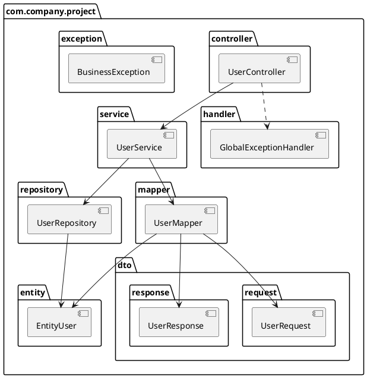

# Стандарты разработки Java / Spring Boot: архитектура и код

> Единый свод правил для backend-сервисов на Java и Spring Boot.
> Покрывает **слоистую (layered)** и **гексагональную (Ports & Adapters)** архитектуру —
> с DDD, без DDD и с CQRS.
>
> **Java:** 25 (LTS) · **Spring Boot:** 4.x · **Сборка:** Maven multi-module
> **Документ объединяет и заменяет:** `JavaCodeStyleAndGuidelines_ru.md`, `JavaCodeStyle.md`,
> `hexagonal-architecture-code-guidelines.md`, `hexagonal-ddd-code-style.md`,
> `spring-boot-4-best-practices.md`
>
> **Версия 3.0.** Целевая платформа стандарта — **Java 25 и Spring Boot 4.x**.
> Части II–V описывают правила, не зависящие от версии платформы; Часть VI — обязательные
> правила самой платформы 4.x и чеклист миграции для сервисов, ещё остающихся на 3.x.

---

## Содержание

**Часть 0. О документе**
- [0.1. Как пользоваться документом](#01-как-пользоваться-документом)
- [0.2. Уровни обязательности](#02-уровни-обязательности)
- [0.3. Матрица применимости разделов](#03-матрица-применимости-разделов)

**Часть I. Выбор архитектуры**
- [1.1. Четыре поддерживаемых варианта](#11-четыре-поддерживаемых-варианта)
- [1.2. Как выбрать](#12-как-выбрать)
- [1.3. Сравнительная таблица](#13-сравнительная-таблица)
- [1.4. Миграция между вариантами](#14-миграция-между-вариантами)

**Часть II. Общие правила кода (обязательны для всех вариантов)**
- [2.1. Запрещённые конструкции](#21-запрещённые-конструкции)
- [2.2. Именование](#22-именование)
- [2.3. Импорты](#23-импорты)
- [2.4. Форматирование](#24-форматирование)
- [2.5. Порядок элементов в классе](#25-порядок-элементов-в-классе)
- [2.6. Комментарии и Javadoc](#26-комментарии-и-javadoc)
- [2.7. Современные возможности Java](#27-современные-возможности-java)
- [2.8. Lombok: что можно и что нельзя](#28-lombok-что-можно-и-что-нельзя)
- [2.9. Идентификаторы: UUIDv7](#29-идентификаторы-uuidv7)
- [2.10. Внедрение зависимостей](#210-внедрение-зависимостей)
- [2.11. Сложность кода](#211-сложность-кода)

**Часть III. Архитектурные варианты**
- [3.1. Вариант A — Слоистая архитектура](#31-вариант-a--слоистая-архитектура)
- [3.2. Вариант B — Гексагональная без DDD](#32-вариант-b--гексагональная-без-ddd)
- [3.3. Вариант C — Гексагональная с DDD](#33-вариант-c--гексагональная-с-ddd)
- [3.4. Вариант D — Гексагональная с CQRS](#34-вариант-d--гексагональная-с-cqrs)
- [3.5. Правила маппинга по вариантам](#35-правила-маппинга-по-вариантам)
- [3.6. Контроль архитектуры: ArchUnit](#36-контроль-архитектуры-archunit)

**Часть IV. Сквозные практики**
- [4.1. REST API](#41-rest-api)
- [4.2. Валидация](#42-валидация)
- [4.3. Обработка ошибок](#43-обработка-ошибок)
- [4.4. Логирование](#44-логирование)
- [4.5. Наблюдаемость: метрики и трассировка](#45-наблюдаемость-метрики-и-трассировка)
- [4.6. Конфигурация](#46-конфигурация)
- [4.7. Персистентность и JPA](#47-персистентность-и-jpa)
- [4.8. Транзакции](#48-транзакции)
- [4.9. Интеграции: HTTP-клиенты](#49-интеграции-http-клиенты)
- [4.10. Messaging: Kafka](#410-messaging-kafka)
- [4.11. Outbox Pattern](#411-outbox-pattern)
- [4.12. Saga Pattern](#412-saga-pattern)
- [4.13. Безопасность](#413-безопасность)
- [4.14. Тестирование](#414-тестирование)
- [4.15. Производительность и кеширование](#415-производительность-и-кеширование)
- [4.16. Сборка, контейнеризация, CI/CD](#416-сборка-контейнеризация-cicd)

**Часть V. Чеклисты**
- [5.1. Новый сервис](#51-новый-сервис)
- [5.2. Новая сущность / агрегат](#52-новая-сущность--агрегат)
- [5.3. Code Review Checklist](#53-code-review-checklist)

**Часть VI. Платформа Spring Boot 4.x**
- [6.1. Область применения и версии](#61-область-применения-и-версии)
- [6.2. Карта влияния на стандарт](#62-карта-влияния-на-стандарт)
- [6.3. Модульные стартеры и зависимости](#63-модульные-стартеры-и-зависимости)
- [6.4. Null-safety: JSpecify](#64-null-safety-jspecify)
- [6.5. Конфигурация в 4.x](#65-конфигурация-в-4x)
- [6.6. Web в 4.x](#66-web-в-4x)
- [6.7. HTTP-клиенты: HTTP Service Clients](#67-http-клиенты-http-service-clients)
- [6.8. Сериализация: Jackson 3](#68-сериализация-jackson-3)
- [6.9. Отказоустойчивость: встроенные механизмы](#69-отказоустойчивость-встроенные-механизмы)
- [6.10. Данные в 4.x](#610-данные-в-4x)
- [6.11. Безопасность: Spring Security 7](#611-безопасность-spring-security-7)
- [6.12. Messaging в 4.x](#612-messaging-в-4x)
- [6.13. Наблюдаемость в 4.x](#613-наблюдаемость-в-4x)
- [6.14. Виртуальные потоки](#614-виртуальные-потоки)
- [6.15. Тестирование в 4.x](#615-тестирование-в-4x)
- [6.16. Сборка и образы в 4.x](#616-сборка-и-образы-в-4x)
- [6.17. Чеклист миграции 3.x → 4.x](#617-чеклист-миграции-3x--4x)
- [6.18. Антипаттерны 4.x](#618-антипаттерны-4x)

**Приложения**
- [A. Краткая справка](#приложение-a-краткая-справка)
- [B. Что где живёт](#приложение-b-что-где-живёт)
- [C. Антипаттерны](#приложение-c-антипаттерны)
- [D. Разрешение конфликтов исходных документов](#приложение-d-разрешение-конфликтов-исходных-документов)
- [E. Метаданные документа](#приложение-e-метаданные-документа)

---

# Часть 0. О документе

## 0.1. Как пользоваться документом

Документ состоит из четырёх слоёв правил:

1. **Общие правила кода (Часть II)** — действуют всегда, независимо от архитектуры.
   Это стиль, запреты, именование, Lombok, DI, сложность.
2. **Архитектурный вариант (Часть III)** — выбирается один раз на сервис.
   Определяет структуру модулей, пакетов, где живёт бизнес-логика и как устроен маппинг.
3. **Сквозные практики (Часть IV)** — REST, логирование, тесты, транзакции, outbox и т. д.
   Правила одни для всех; меняется только **место размещения** кода, оно указано в каждом разделе
   таблицей «Куда класть».

4. **Платформа (Часть VI)** — правила целевой платформы Java 25 / Spring Boot 4.x.
   Обязательны для всех новых сервисов; для сервисов, ещё работающих на Boot 3.x, действуют
   Части II–V, а переход выполняется по чеклисту [6.17](#617-чеклист-миграции-3x--4x).

**Порядок чтения для нового участника команды:** Часть 0 → Часть I → Часть II → свой вариант
из Части III → Часть IV по мере необходимости → Часть VI →
Часть V перед каждым PR.

## 0.2. Уровни обязательности

| Маркер | Значение |
|---|---|
| **ЗАПРЕЩЕНО** | Нарушение блокирует merge. Контролируется линтером / ArchUnit / code review |
| **ОБЯЗАТЕЛЬНО** | Требуется всегда; отклонение допускается только с ADR и подписью тимлида |
| **РЕКОМЕНДУЕТСЯ** | Дефолт по умолчанию; отклонение объясняется в описании PR |
| **ДОПУСТИМО** | Разрешённая альтернатива, выбор за командой |

## 0.3. Матрица применимости разделов

| Раздел | Layered | Hex без DDD | Hex + DDD | Hex + CQRS |
|---|---|---|---|---|
| Часть II (общие правила) | ✅ | ✅ | ✅ | ✅ |
| REST, валидация, ошибки, логирование, конфигурация | ✅ | ✅ | ✅ | ✅ |
| JPA, транзакции, HTTP-клиенты | ✅ | ✅ | ✅ | ✅ |
| Тестирование, сборка, CI/CD, безопасность | ✅ | ✅ | ✅ | ✅ |
| Часть VI (платформа Spring Boot 4.x) | ✅ | ✅ | ✅ | ✅ |
| Порты и адаптеры | ❌ | ✅ | ✅ | ✅ |
| Domain Model, Value Objects, Domain Events | ❌ | ❌ | ✅ | ✅ |
| Domain Service | ❌ | ❌ | ✅ | ✅ |
| Read Models / проекции | ❌ | ❌ | ❌ | ✅ |
| Outbox | ⚠️ опционально | ⚠️ опционально | ✅ при межсервисных событиях | ✅ |
| Saga | ❌ | ⚠️ опционально | ✅ при распределённых транзакциях | ✅ |

---

# Часть I. Выбор архитектуры

## 1.1. Четыре поддерживаемых варианта

| Вариант | Модулей Maven | Где бизнес-логика | Модель данных |
|---|---|---|---|
| **A. Слоистая** | 1 | В сервисах (`@Service`) | JPA-сущности (`EntityUser`) |
| **B. Гексагональная без DDD** | 3 | В Application Services | Анемичная (records / POJO) |
| **C. Гексагональная с DDD** | 4 | В агрегатах и Domain Services | Богатая доменная модель |
| **D. Гексагональная с CQRS** | 4 | В агрегатах (write) | Богатая (write) + View Models (read) |

## 1.2. Как выбрать

```
Сервис изменяет состояние по нетривиальным бизнес-правилам?
│
├─ НЕТ (CRUD, прокси, интеграционный шлюз, отчётность)
│   │
│   ├─ Сервис маленький (< ~15 endpoint'ов), команда 1–2 человека,
│   │  внешних интеграций почти нет
│   │      → ВАРИАНТ A. Слоистая
│   │
│   └─ Много внешних систем (БД + очереди + сторонние API),
│      важна подменяемость инфраструктуры и изоляция тестов
│          → ВАРИАНТ B. Гексагональная без DDD
│
└─ ДА (инварианты, состояния, переходы, деньги, согласования)
    │
    ├─ Нагрузка на чтение и запись сопоставима,
    │  одна модель покрывает оба сценария
    │      → ВАРИАНТ C. Гексагональная с DDD
    │
    └─ Чтение и запись расходятся: read >> write, нужны
       денормализованные проекции, отчёты, разные хранилища
           → ВАРИАНТ D. Гексагональная с CQRS
```

**Правила выбора:**

1. Вариант фиксируется **до начала разработки** и записывается в ADR сервиса.
2. **ЗАПРЕЩЕНО** смешивать варианты внутри одного Maven-модуля (например, «часть агрегатов
   богатые, часть — анемичные с логикой в сервисе»).
3. Сомневаетесь между A и B — берите **B**: переход A → B дороже, чем изначальная цена B.
4. Сомневаетесь между C и D — берите **C**: CQRS добавляется поверх C без переписывания домена.
5. Вариант A **не применяется** для сервисов, участвующих в распределённых транзакциях
   (saga/outbox) — для них минимум B.

## 1.3. Сравнительная таблица

| Критерий | A. Слоистая | B. Hex без DDD | C. Hex + DDD | D. Hex + CQRS |
|---|---|---|---|---|
| Сложность домена | Низкая | Низкая / средняя | Высокая | Высокая |
| Maven-модулей | 1 | 3 | 4 | 4 |
| Модель данных | JPA Entity | Records / POJO | Агрегаты + VO | Агрегаты (W) + Views (R) |
| Бизнес-логика в | `@Service` | Application Service | Агрегаты + Domain Service | Агрегаты (write side) |
| Порты | Нет | `application.port.in/out` | `application.port.in/out` | `port.in.command/query`, `port.out.write/read` |
| Точек маппинга | 1 (Entity ↔ DTO) | 2 | 3 | 5 |
| Контроллеры | Один на ресурс | Один на ресурс | Один на агрегат | Раздельные Command / Query |
| Хранилище | Одно | Одно | Одно | Одно или раздельные Write/Read |
| Порог входа для новичка | Низкий | Средний | Высокий | Высокий |
| Стоимость изменения инфраструктуры | Высокая | Низкая | Низкая | Низкая |
| Тестируемость бизнес-логики без Spring | Низкая | Средняя | Высокая | Высокая |
| Когда использовать | CRUD, админки, небольшие сервисы | Интеграционные сервисы, шлюзы | Ядро бизнеса, финансы, заказы | Разная нагрузка R/W, отчётность |

## 1.4. Миграция между вариантами

| Переход | Стоимость | Порядок действий |
|---|---|---|
| A → B | Средняя | Выделить интерфейсы портов → вынести `service` в модуль `application` → превратить репозитории в адаптеры → вынести JPA в `infrastructure` |
| B → C | Высокая | Ввести модуль `domain` → превратить records в агрегаты с поведением → перенести логику из Application Service в агрегаты/Domain Service → добавить domain events |
| C → D | Средняя | Добавить read-порты и View Models → выделить Query-контроллеры → добавить проекции, обновляемые по domain events |
| Обратные переходы | — | **Не выполняются.** Упрощение архитектуры делается только переписыванием сервиса |

---

# Часть II. Общие правила кода

Правила этой части действуют во **всех** вариантах архитектуры без исключений.

## 2.1. Запрещённые конструкции

### 2.1.1. Ключевое слово `var` — ЗАПРЕЩЕНО

```java
// ❌ ЗАПРЕЩЕНО
var users = userRepository.findAll();
var order = orderRepository.findById(orderId);
var lines = mapper.toOrderLines(command.items());

// ✅ ПРАВИЛЬНО — явный тип
List<EntityUser> users = userRepository.findAll();
Optional<Order> order = orderRepository.findById(orderId);
List<OrderLine> lines = mapper.toOrderLines(command.items());
```

**Причины:** снижает читаемость при code review (тип не виден в diff), скрывает результат
маппинга и generic-типы, усложняет рефакторинг и может маскировать ошибки приведения типов.

### 2.1.2. Generic wildcards в параметрах методов — ЗАПРЕЩЕНО

```java
// ❌ ЗАПРЕЩЕНО
public void processUsers(List<?> users) { }
public void addItems(List<? extends Item> items) { }
public void saveEntities(List<? super EntityUser> entities) { }

// ✅ ПРАВИЛЬНО — конкретный тип или type parameter
public void processUsers(List<EntityUser> users) { }
public void addItems(List<OrderItem> items) { }
public <T extends EntityUser> void saveEntities(List<T> entities) { }
```

**Исключение:** возвращаемые типы и приватные вспомогательные методы — ДОПУСТИМО, но
предпочтителен конкретный тип.

### 2.1.3. Wildcard-импорты — ЗАПРЕЩЕНО

Запрет распространяется на **все** виды импортов, включая статические:

```java
// ❌ ЗАПРЕЩЕНО
import java.util.*;
import jakarta.servlet.*;
import org.springframework.web.bind.annotation.*;
import static org.mockito.Mockito.*;
import static org.junit.jupiter.api.Assertions.*;
```

Запрет распространяется и на **module import declarations** из Java 25 — это массовый
wildcard-импорт целого модуля:

```java
// ❌ ЗАПРЕЩЕНО — импортирует все экспортируемые пакеты модуля
import module java.base;
```

### 2.1.4. Аннотация `@Value` для свойств — ЗАПРЕЩЕНО

Только `@ConfigurationProperties` (см. [4.6](#46-конфигурация)).

```java
// ❌ ЗАПРЕЩЕНО
@Value("${app.max-retry-count}")
private int maxRetryCount;

// ✅ ПРАВИЛЬНО
private final AppProperties appProperties;
```

### 2.1.5. Константные значения в YAML — ЗАПРЕЩЕНО

Все значения — через переменные окружения (см. [4.6.2](#462-переменные-окружения)).

### 2.1.6. Field и setter injection — ЗАПРЕЩЕНО

Только constructor injection (см. [2.10](#210-внедрение-зависимостей)).

### 2.1.7. Прочие запреты

| Конструкция | Почему запрещена | Что вместо |
|---|---|---|
| `@Data` на любом классе | Генерирует сеттеры и `equals` по всем полям, ломает иммутабельность и identity-семантику | `@Getter` + `@Builder`, явные `equals/hashCode` |
| `@Setter` на DTO, командах, доменных сущностях | Нарушает иммутабельность | `@Builder`, фабричные методы, бизнес-методы |
| Возврат JPA-сущности из контроллера | Утечка инфраструктуры наружу, ленивые прокси в JSON | Response DTO |
| `findAll()` без пагинации | Неограниченная выборка | `Pageable` |
| `FetchType.EAGER` | N+1 и неконтролируемая загрузка графа | `LAZY` + `JOIN FETCH` / projection |
| Бизнес-логика в контроллере | Нарушение разделения ответственности | Service / Use Case / Domain |
| Закомментированный код | Мусор в репозитории | Удалить, история есть в Git |
| Возврат HTTP 500 клиенту | Утечка внутренних деталей | Обработать в `@ControllerAdvice` |
| Чувствительные данные в URL | URL логируются и кешируются повсеместно | Request body / headers (см. [4.1.5](#415-чувствительные-данные-критично)) |
| `UUID.randomUUID()` как PK | Фрагментация B-tree индексов | UUIDv7 (см. [2.9](#29-идентификаторы-uuidv7)) |

## 2.2. Именование

### 2.2.1. Общие конвенции (Google Java Style)

| Элемент | Стиль | Пример |
|---|---|---|
| Класс, интерфейс, enum, record | `UpperCamelCase` | `OrderProcessingService` |
| Метод | `lowerCamelCase`, глагол | `processPayment()`, `findUserById()` |
| Переменная, параметр, поле | `lowerCamelCase` | `orderTotal`, `computedValues` |
| Константа | `UPPER_SNAKE_CASE` | `MAX_RETRY_COUNT`, `API_VERSION` |
| Пакет | строчные буквы, единственное число, без сокращений | `com.company.product.order` |
| Таблица БД | `snake_case`, множественное число | `order_items` |
| Колонка БД | `snake_case` | `created_at` |

**Методы, возвращающие `boolean`** — префиксы `is`, `has`, `can`:

```java
public boolean isActive() { }
public boolean hasPermission() { }
public boolean canExecute() { }
```

**Осмысленные имена:** однобуквенные переменные допустимы только как счётчики коротких циклов.

### 2.2.2. Именование классов по вариантам архитектуры

Таблицы конвенций для каждого варианта — в соответствующих разделах Части III:
[A](#316-именование-layered), [B](#325-именование-hex-без-ddd), [C](#3310-именование-hex--ddd),
[D](#346-именование-cqrs).

### 2.2.3. Тесты

| Элемент | Конвенция | Пример |
|---|---|---|
| Класс unit-теста | `{Класс}Test` | `OrderDomainServiceTest` |
| Класс интеграционного теста | `{Класс}IntegrationTest` / `{Класс}IT` | `OrderControllerIntegrationTest` |
| Метод теста | `{метод}_{состояние}_{ожидаемое поведение}` | `createUser_WithValidData_ReturnsUserResponse` |

ДОПУСТИМО в новых модулях: `should_{ожидаемое}_when_{состояние}` — но стиль выбирается
один на модуль и не смешивается.

## 2.3. Импорты

**Порядок групп** (между группами — пустая строка, внутри группы — алфавитная сортировка):

```java
// 1. Стандартная библиотека Java
import java.time.LocalDateTime;
import java.util.List;
import java.util.Optional;

// 2. Сторонние библиотеки
import org.springframework.stereotype.Service;
import org.springframework.transaction.annotation.Transactional;

import com.fasterxml.jackson.annotation.JsonProperty;

// 3. Пакеты приложения
import com.company.project.entity.EntityUser;
import com.company.project.repository.UserRepository;

// 4. Статические импорты — всегда с явным указанием элемента
import static com.company.project.util.Constants.MAX_PAGE_SIZE;
import static org.springframework.http.HttpStatus.OK;
```

✅ Статические импорты разрешены **только** поимённо:

```java
import static org.junit.jupiter.api.Assertions.assertEquals;
import static org.junit.jupiter.api.Assertions.assertThrows;
import static org.mockito.Mockito.verify;
import static org.mockito.Mockito.when;
```

Неиспользуемые импорты — **ЗАПРЕЩЕНЫ**, проверяются линтером.

## 2.4. Форматирование

| Параметр | Значение |
|---|---|
| Отступ блока | 2 пробела (табуляция запрещена) |
| Отступ продолжения строки | +4 пробела |
| Максимальная длина строки | 100 символов |
| Кодировка файлов | UTF-8 |
| Перевод строки | LF |
| Фигурные скобки | K&R (египетские), всегда, даже для однострочников |

> Единая настройка форматтера хранится в репозитории (`.editorconfig` + IDE code style)
> и применяется автоматически при сохранении.

```java
// ✅ ПРАВИЛЬНО — скобки всегда
if (condition) {
  doSomething();
} else {
  doSomethingElse();
}

// ❌ НЕПРАВИЛЬНО
if (condition)
  doSomething();
```

**Перенос длинных строк — в логических точках:**

```java
// Параметры метода
public UserResponse createUser(
  UserRequest request,
  String createdBy,
  LocalDateTime createdAt
) {
  // реализация
}

// Stream-операции — по одному шагу на строку
List<UserResponse> users = userRepository.findAll().stream()
  .filter(user -> user.getStatus() == UserStatus.ACTIVE)
  .map(userMapper::toResponse)
  .toList();
```

**Пробелы:** вокруг бинарных операторов, после ключевых слов и запятых; нет пробела перед
скобками списка параметров.

## 2.5. Порядок элементов в классе

```java
@Service
public class CustomUserService implements UserService {

  // 1. Статические константы (logger — первым)
  private static final Logger log = LoggerFactory.getLogger(CustomUserService.class);
  private static final int MAX_RETRY_COUNT = 3;

  // 2. Поля экземпляра — все final
  private final UserRepository userRepository;
  private final UserMapper userMapper;

  // 3. Конструктор
  public CustomUserService(UserRepository userRepository, UserMapper userMapper) {
    this.userRepository = userRepository;
    this.userMapper = userMapper;
  }

  // 4. Публичные методы (перегрузки — рядом)
  @Override
  public UserResponse createUser(UserRequest request) { }

  @Override
  public Optional<UserResponse> findUserById(Long userId) { }

  // 5. Приватные методы
  private void validateUser(UserRequest request) { }
}
```

## 2.6. Комментарии и Javadoc

### 2.6.1. Javadoc обязателен для

- всех публичных классов и интерфейсов;
- всех публичных и protected методов;
- всех публичных констант;
- **всех** методов утилитных классов, включая приватные;
- пакетов со сложной семантикой — `package-info.java`.

**Опционально:** приватные методы со сложной логикой.

**Порядок блочных тегов:** `@param` → `@return` → `@throws` → `@deprecated` → `@since` → `@see`.

```java
/**
 * Сервис для управления операциями с пользователями.
 * Обрабатывает создание, обновление и получение пользователей.
 *
 * @author Название команды
 * @since 1.0
 */
@Service
public class CustomUserService implements UserService {

  /**
   * Создает нового пользователя в системе.
   *
   * @param request запрос на создание пользователя с деталями
   * @return ответ с созданным пользователем и сгенерированным ID
   * @throws BusinessException если создание пользователя не удалось
   * @throws ValidationException если валидация запроса не удалась
   */
  @Override
  public UserResponse createUser(UserRequest request) {
    // реализация
  }
}
```

### 2.6.2. Утилитные классы

```java
/**
 * Утилитный класс для операций с датами.
 *
 * @author Название команды
 * @since 1.0
 */
public final class DateUtils {

  private DateUtils() {
    throw new UnsupportedOperationException("Утилитный класс не может быть инстанцирован");
  }

  /**
   * Форматирует LocalDateTime в строку формата ISO 8601.
   *
   * @param dateTime дата и время для форматирования
   * @return отформатированная строка даты и времени
   * @throws IllegalArgumentException если dateTime равен null
   */
  public static String formatToIso(LocalDateTime dateTime) {
    if (dateTime == null) {
      throw new IllegalArgumentException("DateTime не может быть null");
    }
    return dateTime.format(DateTimeFormatter.ISO_LOCAL_DATE_TIME);
  }
}
```

### 2.6.3. Встроенные комментарии

Используются **экономно** и только когда объясняют:
бизнес-правило, неочевидный алгоритм, обход ограничения внешней системы,
решение, связанное с безопасностью.

```java
@Override
public void processOrder(OrderRequest request) {
  validateOrderItems(request.getItems());

  // Бизнес-правило: заказы свыше 1000 USD требуют одобрения менеджера
  if (request.getTotalAmount() > 1000) {
    requestManagerApproval(request);
  }

  // TODO: Реализовать проверку инвентаря (JIRA-123)
  if (!request.isVipCustomer()) {
    checkInventory(request.getItems());
  }

  saveOrder(request);
}
```

### 2.6.4. Что НЕ комментировать

```java
// ❌ ПЛОХО — очевидно
// Установить имя пользователя
user.setName(name);

// ❌ ПЛОХО — избыточный Javadoc
/**
 * Получает имя.
 *
 * @return имя
 */
public String getName() {
  return name;
}

// ✅ ХОРОШО — добавляет ценность
/**
 * Получает полное имя пользователя в формате "Фамилия, Имя".
 *
 * @return отформатированное полное имя
 */
public String getFormattedFullName() {
  return String.format("%s, %s", lastName, firstName);
}
```

**Также не комментируем:** историю изменений (есть Git), закомментированный код (удаляем).

### 2.6.5. Язык

- **Javadoc и комментарии:** английский — предпочтительно; русский — ДОПУСТИМО для описания
  внутренних бизнес-правил.
- **В рамках одного файла язык не смешивается.**
- Сообщения исключений и логов — единый язык на сервис, зафиксированный в ADR.

## 2.7. Современные возможности Java

| Возможность | Статус | Где применять |
|---|---|---|
| `record` | РЕКОМЕНДУЕТСЯ | DTO, команды, запросы, View Models, Value Objects без поведения |
| Sealed-интерфейсы | РЕКОМЕНДУЕТСЯ | Моделирование результатов операций, алгебраические типы |
| Pattern matching для `switch` / `instanceof` | РЕКОМЕНДУЕТСЯ | Обработка sealed-иерархий вместо цепочек `if` |
| Text blocks | РЕКОМЕНДУЕТСЯ | Многострочные SQL, JSON в тестах |
| Virtual threads | РЕКОМЕНДУЕТСЯ (см. [6.14](#614-виртуальные-потоки)) | I/O-bound сервисы; включается осознанно, после чеклиста готовности |
| Flexible constructor bodies (Java 25) | ДОПУСТИМО | Валидация аргументов **до** вызова `super()` в Value Objects и агрегатах |
| `ScopedValue` (Java 25) | РЕКОМЕНДУЕТСЯ вместо `ThreadLocal` | Передача контекста при работе на виртуальных потоках |
| Structured Concurrency | ДОПУСТИМО только по ADR | В Java 25 — preview-API; fan-out к нескольким системам внутри одного запроса |
| Module import declarations (`import module`) | **ЗАПРЕЩЕНО** | Массовый wildcard-импорт, см. [2.1.3](#213-wildcard-импорты--запрещено) |
| `Optional` | ОБЯЗАТЕЛЬНО для возвращаемых значений поиска | Не использовать как поле класса и параметр метода |
| `var` | **ЗАПРЕЩЕНО** | — |

```java
// ✅ record как DTO
public record OrderResponse(
    UUID id,
    UUID customerId,
    OrderStatus status,
    BigDecimal totalAmount,
    Instant createdAt,
    List<OrderItemResponse> items
) {}

// ✅ sealed + pattern matching
public sealed interface PaymentResult
    permits PaymentSuccess, PaymentFailure, PaymentPending {
}

public record PaymentSuccess(String transactionId) implements PaymentResult {}
public record PaymentFailure(String errorCode, String message) implements PaymentResult {}
public record PaymentPending(String referenceId) implements PaymentResult {}

PaymentResult result = paymentGateway.authorize(request);
switch (result) {
  case PaymentSuccess success -> confirm(success.transactionId());
  case PaymentFailure failure -> throw new PaymentProcessingException(failure.message());
  case PaymentPending pending -> schedulePolling(pending.referenceId());
}

// ✅ text block
String sql = """
    SELECT o.id, o.status, o.created_at
    FROM orders o
    WHERE o.customer_id = ?
    ORDER BY o.created_at DESC
    """;

// ✅ flexible constructor bodies (Java 25) — валидация до вызова super()
public class Payment extends AggregateRoot<PaymentId> {

  private final Money amount;

  private Payment(PaymentId id, Money amount) {
    if (amount == null || !amount.isGreaterThanZero()) {
      throw new PaymentDomainException("Payment amount must be positive");
    }
    super(id);                       // Прологовый код допустим до super()
    this.amount = amount;
  }

  public static Payment create(Money amount) {
    return new Payment(PaymentId.generate(), amount);
  }
}
```

## 2.8. Lombok: что можно и что нельзя

Lombok — **compile-time** инструмент, в рантайм не попадает, поэтому ДОПУСТИМ даже в модуле
`domain` гексагональной архитектуры.

| Аннотация | Domain | Application DTO | JPA Entity | Spring-бины |
|---|---|---|---|---|
| `@Getter` | ✅ | ✅ | ✅ | ✅ |
| `@Setter` | ❌ | ❌ | ✅ | ❌ |
| `@Builder` / `@SuperBuilder` | ✅ | ✅ | ✅ | — |
| `@RequiredArgsConstructor` | ✅ | — | — | ✅ |
| `@AllArgsConstructor` | ✅ | ✅ | ✅ | ❌ |
| `@NoArgsConstructor` | ❌ (кроме нужд сериализации) | ❌ | ✅ (требование JPA) | ❌ |
| `@Slf4j` | ✅ | ✅ | — | ✅ |
| `@Data` | ❌ **ЗАПРЕЩЕНО** | ❌ | ❌ | ❌ |
| `@EqualsAndHashCode` на сущности | ❌ (identity по `id` пишется руками) | — | ❌ | — |
| `@Value` (Lombok) | ⚠️ не путать со Spring `@Value`; ДОПУСТИМО для VO | — | ❌ | ❌ |

**ОБЯЗАТЕЛЬНО:** при использовании Lombok вместе с MapStruct подключается
`lombok-mapstruct-binding` в `annotationProcessorPaths`.

## 2.9. Идентификаторы: UUIDv7

**ОБЯЗАТЕЛЬНО** для всех новых сущностей с UUID-первичным ключом использовать **UUIDv7**
(RFC 9562), а не UUIDv4.

**Почему:** UUIDv7 содержит временну́ю метку в старших битах и монотонно возрастает. Вставки
в B-tree идут «в конец» дерева — исчезают random page splits, снижается write amplification
и фрагментация индексов, ускоряются range-scan запросы.

```java
// ❌ Не использовать — случайный UUID фрагментирует индексы
UUID id = UUID.randomUUID(); // UUIDv4

// ✅ Правильно — сортируемый идентификатор
import com.fasterxml.uuid.Generators;

UUID id = Generators.timeBasedEpochGenerator().generate(); // UUIDv7
```

```xml
<dependency>
  <groupId>com.fasterxml.uuid</groupId>
  <artifactId>java-uuid-generator</artifactId>
  <version>5.1.0</version>
</dependency>
```

**Где инкапсулируется генерация:**

| Вариант | Место генерации |
|---|---|
| A. Слоистая | Утилитный класс `IdGenerator` либо `@GeneratedValue` при `Long`-ключах |
| B. Hex без DDD | Утилитный класс `IdGenerator` в модуле `application` |
| C / D. Hex + DDD | Фабричный метод ID Value Object: `OrderId.generate()` |

```java
// ✅ Вариант C/D — генерация внутри типизированного идентификатора
public class OrderId extends BaseId<UUID> {

  public OrderId(UUID value) {
    super(value);
  }

  public static OrderId generate() {
    return new OrderId(Generators.timeBasedEpochGenerator().generate());
  }
}
```

**Исключение:** в существующих сервисах варианта A с `Long` + `GenerationType.IDENTITY`
менять тип ключа не требуется; правило действует для новых таблиц.

## 2.10. Внедрение зависимостей

**ОБЯЗАТЕЛЬНО:** constructor injection. Field injection (`@Autowired` на поле) и setter
injection — **ЗАПРЕЩЕНЫ**.

```java
// ✅ Явный конструктор — @Autowired не нужен при единственном конструкторе
@Service
public class OrderService {

  private final OrderRepository repository;
  private final PaymentService paymentService;

  public OrderService(OrderRepository repository, PaymentService paymentService) {
    this.repository = repository;
    this.paymentService = paymentService;
  }
}

// ✅ Эквивалент через Lombok
@Service
@RequiredArgsConstructor
public class OrderService {

  private final OrderRepository repository;
  private final PaymentService paymentService;
}
```

**Правила:**
- все зависимости — `private final`;
- имя параметра конструктора совпадает с именем поля;
- в модулях `domain` (варианты C, D) **нет Spring-аннотаций** — бины создаются вручную
  в `BeanConfiguration` модуля `bootstrap`.

## 2.11. Сложность кода

**Максимально допустимая цикломатическая сложность метода: 25.**
Целевая для нового кода — **≤ 10**.

Сложность увеличивают: `if` / `else if`, `for`, `while`, `do-while`, `case`, `&&`, `||`,
тернарный оператор, `catch`.

### Техники снижения

1. **Извлечение методов** — разбить сложный метод на несколько сфокусированных.
2. **Ранний возврат (guard clause)** — уменьшить вложенность.
3. **Полиморфизм / стратегия** — заменить длинные `if-else` по типу.
4. **Табличный подход** — `Map` вместо цепочки условий.

```java
// ❌ ДО — сложность 15, вложенность 6
public void processOrder(Order order) {
  if (order != null) {
    if (order.getItems() != null && !order.getItems().isEmpty()) {
      for (OrderItem item : order.getItems()) {
        if (item.getQuantity() > 0) {
          if (item.getPrice() > 0) {
            if (inventory.hasStock(item.getProductId(), item.getQuantity())) {
              if (item.getDiscount() != null && item.getDiscount() > 0) {
                applyDiscount(item);
              }
              processItem(item);
            } else {
              handleOutOfStock(item);
            }
          } else {
            throw new InvalidPriceException();
          }
        }
      }
    } else {
      throw new EmptyOrderException();
    }
  }
}

// ✅ ПОСЛЕ — каждый метод сложностью 2–5
public void processOrder(Order order) {
  validateOrder(order);
  for (OrderItem item : order.getItems()) {
    processOrderItem(item);
  }
}

private void validateOrder(Order order) {
  if (order == null || order.getItems() == null || order.getItems().isEmpty()) {
    throw new EmptyOrderException();
  }
}

private void processOrderItem(OrderItem item) {
  validateItem(item);

  if (!inventory.hasStock(item.getProductId(), item.getQuantity())) {
    handleOutOfStock(item);
    return;
  }

  if (hasDiscount(item)) {
    applyDiscount(item);
  }

  processItem(item);
}

private void validateItem(OrderItem item) {
  if (item.getQuantity() <= 0) {
    throw new InvalidQuantityException();
  }
  if (item.getPrice() <= 0) {
    throw new InvalidPriceException();
  }
}

private boolean hasDiscount(OrderItem item) {
  return item.getDiscount() != null && item.getDiscount() > 0;
}
```

### Контроль сложности в сборке

```xml
<plugin>
  <groupId>org.apache.maven.plugins</groupId>
  <artifactId>maven-pmd-plugin</artifactId>
  <version>3.21.0</version>
  <configuration>
    <rulesets>
      <ruleset>pmd-ruleset.xml</ruleset>
    </rulesets>
  </configuration>
  <executions>
    <execution>
      <goals>
        <goal>check</goal>
      </goals>
    </execution>
  </executions>
</plugin>
```

```xml
<?xml version="1.0"?>
<ruleset name="Пользовательские правила">
  <rule ref="category/java/design.xml/CyclomaticComplexity">
    <properties>
      <property name="methodReportLevel" value="25"/>
    </properties>
  </rule>
</ruleset>
```

---

# Часть III. Архитектурные варианты

## 3.1. Вариант A — Слоистая архитектура

### 3.1.1. Обзор

Код организован по техническим слоям внутри **одного** Maven-модуля. Бизнес-логика живёт
в `@Service`-классах, модель данных — это JPA-сущности. Подходит для CRUD-сервисов, админок
и небольших приложений, где изоляция от фреймворка не окупается.

| Слой | Ответственность | Может вызывать |
|---|---|---|
| `controller` | HTTP-контракт, маршрутизация, валидация входа | `service` |
| `service` | Бизнес-логика, транзакции, оркестрация | `repository`, `mapper`, другие `service` |
| `repository` | Доступ к данным (Spring Data JPA) | `entity` |
| `entity` | JPA-модель | — |

**Правило направления вызовов:** `controller → service → repository`.
Обратные вызовы и «перепрыгивание» слоя (`controller → repository`) — **ЗАПРЕЩЕНЫ**.

### 3.1.2. Структура пакетов

```
com.company.project
├── config          # Классы конфигурации (@Configuration, @ConfigurationProperties)
├── controller      # REST контроллеры
├── service         # Бизнес-логика (интерфейс + реализация)
├── repository      # Слой доступа к данным
├── entity          # JPA сущности
├── enums           # Перечисления домена
├── dto             # Объекты передачи данных
│   ├── request     # DTO для запросов
│   └── response    # DTO для ответов
├── mapper          # Мапперы Entity <-> DTO (MapStruct)
├── exception       # Пользовательские исключения
├── handler         # Обработчики исключений и событий
├── interceptor     # HTTP перехватчики (в т.ч. RestTemplate)
├── filter          # Сервлетные фильтры
├── converter       # Jackson/Spring конвертеры
├── logging         # Фильтры и конвертеры логирования
└── util            # Утилитные классы
```

**Правила именования пакетов:** только строчные буквы, существительные в единственном числе,
без сокращений (`repository`, а не `repo`; `entity`, а не `entities`).

### 3.1.3. Диаграмма зависимостей



### 3.1.4. Слой Service

Сервис объявляется как **интерфейс + реализация**. Бизнес-логика, транзакции и логирование —
на уровне реализации.

```java
/**
 * Сервис для управления операциями с пользователями.
 *
 * @author Название команды
 * @since 1.0
 */
@Service
public class CustomUserService implements UserService {

  private static final Logger log = LoggerFactory.getLogger(CustomUserService.class);

  private final UserRepository userRepository;
  private final UserMapper userMapper;

  public CustomUserService(UserRepository userRepository, UserMapper userMapper) {
    this.userRepository = userRepository;
    this.userMapper = userMapper;
  }

  @Override
  @Transactional
  public UserResponse createUser(UserRequest request) {
    log.info("Создание пользователя с email: {}", request.getEmail());

    try {
      EntityUser user = userMapper.toEntity(request);
      EntityUser savedUser = userRepository.save(user);

      log.info("Пользователь успешно создан с id: {}", savedUser.getId());
      return userMapper.toResponse(savedUser);

    } catch (DataAccessException ex) {
      log.error("Не удалось создать пользователя с email: {}. Ошибка: {}",
        request.getEmail(), ex.getMessage(), ex);
      throw new BusinessException("100100", "Не удалось создать пользователя", ex);
    }
  }

  @Override
  @Transactional(readOnly = true)
  public Optional<UserResponse> findUserById(Long userId) {
    log.info("Поиск пользователя по id: {}", userId);

    Optional<EntityUser> user = userRepository.findById(userId);
    if (user.isEmpty()) {
      log.info("Пользователь не найден с id: {}", userId);
    }

    return user.map(userMapper::toResponse);
  }
}
```

### 3.1.5. Слой Repository

```java
/**
 * Репозиторий для операций с EntityUser.
 *
 * @author Название команды
 * @since 1.0
 */
@Repository
public interface UserRepository extends JpaRepository<EntityUser, Long> {

  /**
   * Находит пользователя по email.
   *
   * @param email email пользователя
   * @return Optional с пользователем, если найден
   */
  Optional<EntityUser> findByEmail(String email);

  /**
   * Находит всех пользователей с указанным статусом.
   *
   * @param status статус пользователя
   * @return список пользователей с данным статусом
   */
  List<EntityUser> findByStatus(UserStatus status);

  /**
   * Находит пользователей по домену email.
   *
   * @param domain домен email
   * @return список пользователей с email из указанного домена
   */
  @Query("SELECT u FROM EntityUser u WHERE u.email LIKE CONCAT('%@', :domain)")
  List<EntityUser> findByEmailDomain(@Param("domain") String domain);
}
```

### 3.1.6. Именование (layered)

| Тип | Шаблон | Пример |
|---|---|---|
| Сущность | `Entity{Название}` | `EntityUser`, `EntityOrder` |
| Контроллер | `{Название}Controller` | `UserController` |
| Интерфейс сервиса | `{Название}Service` | `UserService` |
| Реализация сервиса (единственная) | `Custom{Название}Service` | `CustomUserService` |
| Реализация сервиса (несколько) | `{Специфика}{Название}Service` | `EmailNotificationService` |
| Репозиторий | `{Название}Repository` | `UserRepository` |
| DTO запроса | `{Название}Request` | `UserRequest`, `CreateOrderRequest` |
| DTO ответа | `{Название}Response` | `UserResponse` |
| Маппер | `{Название}Mapper` | `UserMapper` |
| Исключение | `{Назначение}Exception` | `UserNotFoundException` |
| Обработчик | `{Назначение}Handler` | `GlobalExceptionHandler` |
| Конфигурация | `{Назначение}Config` | `SecurityConfig`, `RestTemplateConfig` |
| Фильтр | `{Назначение}Filter` | `RequestResponseLoggingFilter` |
| Перехватчик | `{Назначение}Interceptor` | `RestTemplateLoggingInterceptor` |
| Конвертер | `{Источник}To{Цель}Converter` | `StringToConfirmationStatusConverter` |
| Утилита | `{Назначение}Utils` | `DateUtils`, `ValidationUtils` |

### 3.1.7. Маппинг

**ОБЯЗАТЕЛЬНО:** MapStruct. Ручной маппинг в варианте A — **ЗАПРЕЩЁН** (кроме кастомных
методов внутри маппера).

```java
/**
 * Маппер для преобразования между EntityUser и DTO.
 *
 * @author Название команды
 * @since 1.0
 */
@Mapper(
  componentModel = "spring",
  nullValuePropertyMappingStrategy = NullValuePropertyMappingStrategy.IGNORE
)
public interface UserMapper {

  @Mapping(target = "id", ignore = true)
  @Mapping(target = "createdAt", ignore = true)
  @Mapping(target = "updatedAt", ignore = true)
  EntityUser toEntity(UserRequest request);

  UserResponse toResponse(EntityUser entity);

  @Mapping(target = "id", ignore = true)
  @Mapping(target = "createdAt", ignore = true)
  void updateEntityFromRequest(UserRequest request, @MappingTarget EntityUser entity);
}
```

```xml
<dependency>
  <groupId>org.mapstruct</groupId>
  <artifactId>mapstruct</artifactId>
  <version>1.5.5.Final</version>
</dependency>
```

```xml
<plugin>
  <groupId>org.apache.maven.plugins</groupId>
  <artifactId>maven-compiler-plugin</artifactId>
  <version>3.11.0</version>
  <configuration>
    <annotationProcessorPaths>
      <path>
        <groupId>org.mapstruct</groupId>
        <artifactId>mapstruct-processor</artifactId>
        <version>1.5.5.Final</version>
      </path>
      <path>
        <groupId>org.projectlombok</groupId>
        <artifactId>lombok</artifactId>
        <version>1.18.30</version>
      </path>
      <path>
        <groupId>org.projectlombok</groupId>
        <artifactId>lombok-mapstruct-binding</artifactId>
        <version>0.2.0</version>
      </path>
    </annotationProcessorPaths>
  </configuration>
</plugin>
```

### 3.1.8. Запрещено в варианте A

- Обращение контроллера напрямую к репозиторию, минуя сервис.
- Возврат `EntityUser` (JPA-сущности) из контроллера — только DTO.
- Бизнес-логика в контроллере, мапперах, репозиториях.
- Циклические зависимости между сервисами (разрывать выделением третьего сервиса).
- Ручной маппинг вместо MapStruct.

---

## 3.2. Вариант B — Гексагональная без DDD

### 3.2.1. Обзор

Облегчённый Ports & Adapters без выделенного доменного слоя. Бизнес-логика — в Application
Services; модель данных анемичная (records/POJO без поведения). Подходит для CRUD-тяжёлых
сервисов, интеграционных шлюзов и проектов с простой бизнес-логикой, но множеством внешних систем.

| Слой | Ответственность | Зависимости |
|---|---|---|
| **Application** | Бизнес-логика, use case'ы, порты, модели данных | Ни от чего (чистая Java) |
| **Infrastructure** | Реализация портов, контроллеры, persistence, внешние клиенты | Зависит от Application |
| **Bootstrap** | Конфигурация Spring, сборка, DI wiring | Зависит от всех слоёв |

### 3.2.2. Структура модулей и каталогов

```
order-service/                                  # Root project
├── pom.xml                                     # Parent POM (module declarations)
│
├── order-application/                          # Ядро: бизнес-логика + порты
│   ├── pom.xml                                 # Зависимости: ничего (чистая Java)
│   └── src/main/java/
│       └── com/company/order/application/
│           ├── port/
│           │   ├── in/                         # Входящие порты (Driving)
│           │   │   ├── CreateOrderUseCase.java
│           │   │   ├── CancelOrderUseCase.java
│           │   │   └── GetOrderQuery.java
│           │   └── out/                        # Исходящие порты (Driven)
│           │       ├── OrderPersistencePort.java
│           │       ├── PaymentPort.java
│           │       └── NotificationPort.java
│           ├── service/                        # Реализации use case'ов (бизнес-логика)
│           │   ├── CreateOrderService.java
│           │   ├── CancelOrderService.java
│           │   └── GetOrderQueryService.java
│           ├── model/                          # Модели данных ядра (не JPA!)
│           │   ├── Order.java                  # Record / POJO без аннотаций фреймворка
│           │   ├── OrderLine.java
│           │   ├── OrderStatus.java
│           │   └── Customer.java
│           ├── dto/
│           │   ├── command/
│           │   │   ├── CreateOrderCommand.java
│           │   │   └── CancelOrderCommand.java
│           │   ├── query/
│           │   │   └── OrderCriteria.java
│           │   └── result/
│           │       ├── OrderResult.java
│           │       └── OrderSummaryResult.java
│           └── exception/
│               ├── ApplicationException.java
│               ├── OrderNotFoundException.java
│               └── PaymentFailedException.java
│
├── order-infrastructure/                       # Адаптеры
│   ├── pom.xml                                 # Зависимости: order-application, spring-*
│   └── src/
│       ├── main/java/
│       │   └── com/company/order/infrastructure/
│       │       ├── in/                         # Driving-адаптеры
│       │       │   ├── rest/
│       │       │   │   ├── OrderController.java
│       │       │   │   ├── OrderRestMapper.java
│       │       │   │   ├── request/
│       │       │   │   │   └── CreateOrderRequest.java
│       │       │   │   ├── response/
│       │       │   │   │   └── OrderResponse.java
│       │       │   │   └── handler/
│       │       │   │       └── OrderExceptionHandler.java
│       │       │   ├── messaging/
│       │       │   │   └── OrderEventListener.java
│       │       │   └── scheduler/
│       │       │       └── OrderCleanupScheduler.java
│       │       ├── out/                        # Driven-адаптеры
│       │       │   ├── persistence/
│       │       │   │   ├── OrderPersistenceAdapter.java  # Реализует OrderPersistencePort
│       │       │   │   ├── OrderJpaRepository.java
│       │       │   │   ├── entity/
│       │       │   │   │   ├── OrderJpaEntity.java
│       │       │   │   │   └── OrderLineJpaEntity.java
│       │       │   │   └── mapper/
│       │       │   │       └── OrderPersistenceMapper.java
│       │       │   ├── payment/
│       │       │   │   ├── PaymentAdapter.java           # Реализует PaymentPort
│       │       │   │   └── dto/
│       │       │   │       └── PaymentRequestDto.java
│       │       │   └── notification/
│       │       │       └── EmailNotificationAdapter.java # Реализует NotificationPort
│       │       └── config/
│       │           ├── JpaConfig.java
│       │           └── RestClientConfig.java
│       └── main/resources/
│           └── db/migration/
│               ├── V001__create_orders.sql
│               └── V002__create_order_lines.sql
│
└── order-bootstrap/                            # Точка входа и сборка
    ├── pom.xml                                 # Зависимости: order-infrastructure
    └── src/
        ├── main/java/
        │   └── com/company/order/bootstrap/
        │       ├── Application.java            # @SpringBootApplication
        │       └── config/
        │           ├── BeanConfig.java         # Wiring application-бинов
        │           ├── SecurityConfig.java
        │           └── SwaggerConfig.java
        └── main/resources/
            ├── application.yml
            └── application-dev.yml
```

>
> **Про уровень `adapter/`:** в трёхмодульном варианте B адаптеры лежат прямо в
> `infrastructure/in/` и `infrastructure/out/` — лишний уровень вложенности не нужен.
> В четырёхмодульных вариантах C и D используется `infrastructure/adapter/in|out/`,
> поскольку там же живут `config/`, `saga/` и другие инфраструктурные подсистемы.
> Внутри одного сервиса схема не смешивается.

### 3.2.3. Правило зависимостей

```
Bootstrap → Infrastructure → Application
```

Application — самодостаточный слой без внешних зависимостей. Infrastructure знает об
Application (реализует его порты). Bootstrap связывает всё через DI.

### 3.2.4. Правила кодирования по слоям

#### Application

```java
// ✅ Application Model — анемичная модель без фреймворков
public record Order(
    UUID id,
    UUID customerId,
    List<OrderLine> lines,
    OrderStatus status,
    BigDecimal totalPrice,
    Instant createdAt
) {}
```

```java
// ✅ Входящий порт
public interface CreateOrderUseCase {
  OrderResult execute(CreateOrderCommand command);
}
```

```java
// ✅ Исходящий порт
public interface OrderPersistencePort {
  Optional<Order> findById(UUID id);
  Order save(Order order);
  void deleteById(UUID id);
  List<Order> findByCustomerId(UUID customerId);
}
```

```java
// ✅ Application Service — здесь живёт бизнес-логика
@RequiredArgsConstructor
public class CreateOrderService implements CreateOrderUseCase {

  private final OrderPersistencePort persistencePort;
  private final PaymentPort paymentPort;

  @Override
  @Transactional
  public OrderResult execute(CreateOrderCommand command) {
    BigDecimal totalPrice = command.items().stream()
        .map(item -> item.price().multiply(BigDecimal.valueOf(item.quantity())))
        .reduce(BigDecimal.ZERO, BigDecimal::add);

    if (totalPrice.compareTo(BigDecimal.ZERO) <= 0) {
      throw new ApplicationException("Order total must be positive");
    }

    paymentPort.authorize(command.customerId(), totalPrice);

    Order order = new Order(
        Generators.timeBasedEpochGenerator().generate(), // UUIDv7
        command.customerId(),
        mapToOrderLines(command.items()),
        OrderStatus.CREATED,
        totalPrice,
        Instant.now()
    );

    Order saved = persistencePort.save(order);
    return toResult(saved);
  }
}
```

**Запрещено в Application:**
- аннотации JPA (`@Entity`, `@Table`);
- HTTP-специфичные классы (`HttpServletRequest`, `ResponseEntity`);
- прямые вызовы Spring Data репозиториев;
- знание о конкретных технологиях (Kafka, RabbitMQ, PostgreSQL);
- ключевое слово `var`.

> `@Transactional` в модуле `application` — ДОПУСТИМО: Spring Tx API подключается как
> `provided`-зависимость и не тянет инфраструктуру. Альтернатива для строгой изоляции —
> обёртка-адаптер `TransactionRunner` (output port).

#### Infrastructure

```java
// ✅ Outbound-адаптер
@Repository
@RequiredArgsConstructor
public class OrderPersistenceAdapter implements OrderPersistencePort {

  private final OrderJpaRepository jpaRepository;
  private final OrderPersistenceMapper mapper;

  @Override
  public Optional<Order> findById(UUID id) {
    return jpaRepository.findById(id).map(mapper::toModel);
  }

  @Override
  public Order save(Order order) {
    OrderJpaEntity entity = mapper.toEntity(order);
    OrderJpaEntity saved = jpaRepository.save(entity);
    return mapper.toModel(saved);
  }
}
```

```java
// ✅ Inbound-адаптер
@RestController
@RequestMapping("/api/v1/orders")
@RequiredArgsConstructor
public class OrderController {

  private final CreateOrderUseCase createOrderUseCase;
  private final OrderRestMapper mapper;

  @PostMapping
  public ResponseEntity<OrderResponse> create(@Valid @RequestBody CreateOrderRequest request) {
    CreateOrderCommand command = mapper.toCommand(request);
    OrderResult result = createOrderUseCase.execute(command);
    return ResponseEntity.status(HttpStatus.CREATED).body(mapper.toResponse(result));
  }
}
```

#### Bootstrap

```java
@Configuration
public class BeanConfig {

  @Bean
  public CreateOrderUseCase createOrderUseCase(
      OrderPersistencePort persistencePort,
      PaymentPort paymentPort) {
    return new CreateOrderService(persistencePort, paymentPort);
  }

  @Bean
  public CancelOrderUseCase cancelOrderUseCase(OrderPersistencePort persistencePort) {
    return new CancelOrderService(persistencePort);
  }
}
```

### 3.2.5. Именование (hex без DDD)

| Тип | Конвенция | Пример |
|---|---|---|
| Входящий порт | `{Action}{Entity}UseCase` / `{Action}{Entity}Query` | `CreateOrderUseCase`, `GetOrderQuery` |
| Исходящий порт | `{Entity}{Tech}Port` | `OrderPersistencePort`, `PaymentPort` |
| Реализация use case | `{Action}{Entity}Service` | `CreateOrderService` |
| Inbound-адаптер | `{Entity}Controller`, `{Entity}EventListener` | `OrderController` |
| Outbound-адаптер | `{Entity}{Tech}Adapter` | `OrderPersistenceAdapter` |
| JPA Entity | `{Entity}JpaEntity` | `OrderJpaEntity` |
| Маппер | `{Entity}{Layer}Mapper` | `OrderRestMapper`, `OrderPersistenceMapper` |
| Команда | `{Action}{Entity}Command` | `CreateOrderCommand` |
| Результат | `{Entity}Result` | `OrderResult` |
| REST Request | `{Action}{Entity}Request` | `CreateOrderRequest` |
| REST Response | `{Entity}Response` | `OrderResponse` |

---

## 3.3. Вариант C — Гексагональная с DDD

### 3.3.1. Обзор

Богатая доменная модель в центре приложения. Домен полностью изолирован от инфраструктуры
и фреймворка: бизнес-логика живёт в агрегатах, Value Objects и Domain Services, а не
в Application Services. Порты определяются в слое Application.

| Слой | Ответственность | Зависимости |
|---|---|---|
| **Domain** | Бизнес-правила, агрегаты, Value Objects, Domain Events, Domain Services | Ни от чего (чистая Java) |
| **Application** | Порты, оркестрация use case'ов, транзакции, outbox | Зависит от Domain |
| **Infrastructure** | Реализация портов: БД, REST, очереди, файлы | Зависит от Application |
| **Bootstrap** | Конфигурация Spring, сборка, DI wiring | Зависит от всех слоёв |

### 3.3.2. Золотое правило

> **Domain — это чистая Java. Ни одной Spring-аннотации.**
>
> Никаких `@Component`, `@Service`, `@Autowired`, `@Transactional` в модуле `domain`.
> Domain Service регистрируется как `@Bean` в `BeanConfiguration` модуля `bootstrap`.
> Lombok ДОПУСТИМ — это compile-time инструмент, в рантайме его нет.

### 3.3.3. Правило портов

> **Порты определяются в `application`. Адаптеры реализуют порты в `infrastructure`.**
>
> Порт — интерфейс. Адаптер — `@Component`, реализующий этот интерфейс.
> Размещение портов в модуле `domain` — **ЗАПРЕЩЕНО**.

### 3.3.4. Структура модулей и каталогов

```
{context}-service/                              # Root project
├── pom.xml                                     # Parent POM (module declarations)
│
├── {context}-domain/                           # Ядро — чистая Java, 0 зависимостей
│   ├── pom.xml
│   └── src/main/java/
│       └── com/company/{context}/domain/
│           ├── model/                          # Агрегаты, сущности, Value Objects
│           │   ├── order/
│           │   │   ├── Order.java              # Aggregate Root
│           │   │   ├── OrderId.java            # BaseId<UUID>
│           │   │   ├── OrderStatus.java        # Enum статусов
│           │   │   ├── OrderLine.java          # Entity внутри агрегата
│           │   │   └── Money.java              # Value Object
│           │   └── customer/
│           │       ├── Customer.java
│           │       ├── CustomerId.java
│           │       ├── Email.java              # VO с self-validation
│           │       └── Address.java
│           ├── event/                          # Domain Events
│           │   ├── DomainEvent.java            # Базовый интерфейс
│           │   ├── OrderEvent.java             # Абстрактный базовый event агрегата
│           │   ├── OrderCreatedEvent.java
│           │   └── OrderCancelledEvent.java
│           ├── service/                        # Domain Services
│           │   ├── OrderDomainService.java     # Интерфейс
│           │   ├── OrderDomainServiceImpl.java # Чистая Java, без Spring
│           │   └── DiscountPolicy.java         # Доменная политика/стратегия
│           └── exception/
│               ├── DomainException.java
│               ├── OrderDomainException.java
│               └── OrderNotFoundException.java
│
├── {context}-application/                      # Оркестрация use case'ов
│   ├── pom.xml                                 # Зависимости: {context}-domain
│   └── src/main/java/
│       └── com/company/{context}/application/
│           ├── port/
│           │   ├── in/                         # Входящие порты (Driving)
│           │   │   ├── OrderApplicationService.java
│           │   │   ├── CreateOrderUseCase.java
│           │   │   └── PaymentResponseMessageListener.java
│           │   └── out/                        # Исходящие порты (Driven)
│           │       ├── OrderRepository.java
│           │       ├── PaymentGateway.java
│           │       ├── NotificationSender.java
│           │       ├── PaymentRequestMessagePublisher.java
│           │       └── PaymentOutboxRepository.java
│           ├── usecase/                        # Command/Query Handlers
│           │   ├── OrderCreateCommandHandler.java
│           │   └── OrderTrackQueryHandler.java
│           ├── dto/
│           │   ├── command/
│           │   │   └── CreateOrderCommand.java
│           │   ├── query/
│           │   │   └── TrackOrderQuery.java
│           │   ├── result/
│           │   │   └── CreateOrderResponse.java
│           │   └── message/
│           │       └── PaymentResponse.java    # Межсервисные сообщения
│           ├── mapper/
│           │   └── OrderDataMapper.java        # DTO <-> Domain
│           ├── outbox/                         # Outbox (если нужен)
│           │   ├── model/
│           │   │   └── OrderPaymentOutboxMessage.java
│           │   └── scheduler/
│           │       ├── PaymentOutboxHelper.java
│           │       ├── PaymentOutboxScheduler.java
│           │       └── PaymentOutboxCleanerScheduler.java
│           └── OrderApplicationServiceImpl.java
│
├── {context}-infrastructure/                   # Адаптеры — внешний мир
│   ├── pom.xml                                 # Зависимости: {context}-application, spring-*
│   └── src/
│       ├── main/java/
│       │   └── com/company/{context}/infrastructure/
│       │       ├── adapter/
│       │       │   ├── in/                     # Driving-адаптеры
│       │       │   │   ├── rest/
│       │       │   │   │   ├── OrderController.java
│       │       │   │   │   ├── mapper/
│       │       │   │   │   │   └── OrderRestMapper.java
│       │       │   │   │   ├── request/
│       │       │   │   │   │   └── CreateOrderRequest.java
│       │       │   │   │   ├── response/
│       │       │   │   │   │   └── OrderResponse.java
│       │       │   │   │   └── handler/
│       │       │   │   │       └── OrderGlobalExceptionHandler.java
│       │       │   │   ├── event/              # Kafka Consumers
│       │       │   │   │   └── PaymentResponseKafkaListener.java
│       │       │   │   └── scheduler/
│       │       │   │       └── OrderCleanupScheduler.java
│       │       │   └── out/                    # Driven-адаптеры
│       │       │       ├── persistence/
│       │       │       │   ├── entity/
│       │       │       │   │   ├── OrderEntity.java
│       │       │       │   │   └── OrderItemEntity.java
│       │       │       │   ├── repository/
│       │       │       │   │   └── OrderJpaRepository.java
│       │       │       │   ├── adapter/
│       │       │       │   │   └── OrderRepositoryImpl.java
│       │       │       │   └── mapper/
│       │       │       │       └── OrderDataAccessMapper.java
│       │       │       ├── messaging/
│       │       │       │   ├── publisher/
│       │       │       │   │   └── OrderPaymentEventKafkaPublisher.java
│       │       │       │   └── mapper/
│       │       │       │       └── OrderMessagingDataMapper.java
│       │       │       ├── external/           # Клиенты внешних API
│       │       │       │   └── PaymentGatewayAdapter.java
│       │       │       └── storage/            # File/Object Storage
│       │       └── config/
│       │           ├── JpaConfig.java
│       │           ├── KafkaConfig.java
│       │           └── RestClientConfig.java
│       └── main/resources/
│           └── db/migration/
│               ├── V001__create_orders.sql
│               └── V002__create_order_items.sql
│
└── {context}-bootstrap/                        # Сборка и запуск (без бизнес-логики)
    ├── pom.xml                                 # Зависимости: все модули
    └── src/
        ├── main/java/
        │   └── com/company/{context}/bootstrap/
        │       ├── OrderApplication.java       # @SpringBootApplication
        │       └── config/
        │           ├── BeanConfiguration.java  # @Bean для Domain Services
        │           ├── SecurityConfig.java
        │           ├── JacksonConfig.java
        │           ├── CorsConfig.java
        │           ├── OpenApiConfig.java
        │           ├── FlywayConfig.java
        │           └── ObservabilityConfig.java
        └── main/resources/
            ├── application.yml
            ├── application-dev.yml
            ├── application-prod.yml
            └── log4j2-spring.xml
```

**Artifact ID модулей:** `{context}-domain`, `{context}-application`, `{context}-infrastructure`,
`{context}-bootstrap`.

> **Про 4 модуля вместо 6:** REST-контроллеры, JPA persistence и Kafka messaging — это
> **адаптеры внутри одного модуля `infrastructure`**, а не отдельные Maven-модули. Это упрощает
> сборку и управление зависимостями, сохраняя разделение по пакетам. Выделять адаптеры
> в отдельные модули ДОПУСТИМО, когда их владеют разные команды или требуется раздельная
> поставка.

### 3.3.5. Правило зависимостей

```
Bootstrap → Infrastructure → Application → Domain
```

| Модуль | Зависит от | НЕ зависит от |
|---|---|---|
| `domain` | Ничего (чистая Java + Lombok + `jspecify`) | Spring, JPA, Kafka, Avro |
| `application` | `domain` | Spring Data, Kafka, Avro, JPA |
| `infrastructure` | `application` (транзитивно `domain`) | — |
| `bootstrap` | Все модули | — |

### 3.3.6. Domain Layer

#### 3.3.6.1. Базовые классы

Все сущности, агрегаты и идентификаторы наследуют базовые абстракции. Живут в `common-domain`
(общая библиотека) либо в `domain/model/base/` конкретного сервиса.

Иерархия наследования — UML-диаграмма: [`diagrams/domain-model-hierarchy.puml`](diagrams/domain-model-hierarchy.puml)

**`BaseId<T>` — типизированный идентификатор.** Неизменяемая обёртка над примитивным
идентификатором. Каждый агрегат определяет свой наследник (`OrderId`, `PaymentId`), что
исключает подмену идентификаторов разных агрегатов на уровне типов.

```java
public abstract class BaseId<T> implements Serializable {

  private final T value;

  protected BaseId(final T value) {
    this.value = value;
  }

  public T getValue() {
    return value;
  }

  @Override
  public boolean equals(final Object o) {
    if (this == o) return true;
    if (!(o instanceof BaseId<?> baseId)) return false;
    return Objects.equals(value, baseId.value);
  }

  @Override
  public int hashCode() {
    return Objects.hashCode(value);
  }
}
```

**`BaseEntity<T>` — абстрактная сущность.** Идентичность определяется по `id`: две сущности
с одинаковым `id` равны независимо от остальных полей. `@SuperBuilder` обязателен для
корректной работы Lombok Builder в наследниках.

```java
@SuperBuilder
public abstract class BaseEntity<T> implements Serializable {

  private T id;

  public BaseEntity() {
  }

  public T getId() {
    return id;
  }

  public void setId(final T id) {
    this.id = id;
  }

  @Override
  public boolean equals(final Object o) {
    if (this == o) return true;
    if (!(o instanceof BaseEntity<?> that)) return false;
    return Objects.equals(id, that.id);
  }

  @Override
  public int hashCode() {
    return Objects.hashCode(id);
  }
}
```

**`AggregateRoot<T>` — маркер корня агрегата.** Корень агрегата — граница транзакционной
консистентности. **Только агрегаты сохраняются через репозитории.**

```java
@SuperBuilder
public abstract class AggregateRoot<T> extends BaseEntity<T> {

  public AggregateRoot() {
  }
}
```

**`DomainEvent` — доменное событие.** Иммутабельный факт, произошедший в домене.

```java
public interface DomainEvent<T> {
}
```

#### 3.3.6.2. Aggregate Root

```java
// ✅ Builder, бизнес-логика внутри, никаких Spring-аннотаций
@Getter
@SuperBuilder
public class Order extends AggregateRoot<OrderId> {

  private final CustomerId customerId;
  private final RestaurantId restaurantId;
  private final StreetAddress deliveryAddress;
  private final Money price;
  private final List<OrderItem> items;

  // Мутабельные поля — изменяются только через бизнес-методы
  private TrackingId trackingId;
  private OrderStatus orderStatus;
  private List<String> failureMessages;

  // ✅ Бизнес-логика инкапсулирована в агрегате
  public void validateOrder() {
    validateInitialOrder();
    validateTotalPrice();
    validateItemsPrice();
  }

  public void initializeOrder() {
    setId(OrderId.generate());
    trackingId = TrackingId.generate();
    orderStatus = OrderStatus.PENDING;
    initializeOrderItems();
  }

  // ✅ Guard clause: проверка текущего состояния перед переходом
  public void pay() {
    if (orderStatus != OrderStatus.PENDING) {
      throw new OrderDomainException("Order is not in correct state for pay operation");
    }
    orderStatus = OrderStatus.PAID;
  }

  public void cancel(List<String> failureMessages) {
    if (!(orderStatus == OrderStatus.PENDING || orderStatus == OrderStatus.PAID)) {
      throw new OrderDomainException("Order is not in correct state for cancel operation");
    }
    orderStatus = OrderStatus.CANCELLED;
    updateFailureMessages(failureMessages);
  }

  // ✅ Приватные валидации
  private void validateTotalPrice() {
    if (price == null || !price.isGreaterThanZero()) {
      throw new OrderDomainException("Total price must be greater than zero!");
    }
  }

  private void validateItemsPrice() {
    Money orderItemsTotal = items.stream()
        .map(item -> {
          validateItemPrice(item);
          return item.getSubTotal();
        })
        .reduce(Money.ZERO, Money::add);

    if (!price.equals(orderItemsTotal)) {
      throw new OrderDomainException("Total price does not equal Order items total!");
    }
  }
}
```

**Правила для агрегатов:**

| # | Правило |
|---|---|
| 1 | Наследует `AggregateRoot<{Name}Id>` |
| 2 | `@Getter` + `@SuperBuilder`, **нет публичных сеттеров** |
| 3 | Создание — через фабричный метод или Builder, не через публичный конструктор |
| 4 | Вся бизнес-логика — методы агрегата (`validateOrder()`, `pay()`, `cancel()`) |
| 5 | Guard clauses в бизнес-методах: проверка текущего состояния перед переходом |
| 6 | Доступ к дочерним сущностям — только через корень агрегата |
| 7 | Агрегат **не создаёт** domain events — это делает Domain Service |
| 8 | Агрегат не знает о других агрегатах (ссылки — только по ID) |
| 9 | Исключения — domain-specific, наследуют `DomainException` |

#### 3.3.6.3. Value Objects

```java
// ✅ ID Value Object — всегда наследует BaseId<UUID>, генерация UUIDv7
public class OrderId extends BaseId<UUID> {

  public OrderId(UUID value) {
    super(value);
  }

  public static OrderId generate() {
    return new OrderId(Generators.timeBasedEpochGenerator().generate());
  }
}

// ✅ Non-ID Value Object — иммутабельный, с поведением
@Getter
public class Money {

  public static final Money ZERO = new Money(BigDecimal.ZERO);

  private final BigDecimal amount;

  public Money(BigDecimal amount) {
    this.amount = amount;
  }

  public boolean isGreaterThanZero() {
    return amount != null && amount.compareTo(BigDecimal.ZERO) > 0;
  }

  public boolean isGreaterThan(Money money) {
    return amount != null && amount.compareTo(money.getAmount()) > 0;
  }

  public Money add(Money money) {
    return new Money(setScale(amount.add(money.getAmount())));
  }

  public Money subtract(Money money) {
    return new Money(setScale(amount.subtract(money.getAmount())));
  }

  public Money multiply(int multiplier) {
    return new Money(setScale(amount.multiply(new BigDecimal(multiplier))));
  }

  // equals/hashCode по amount
}

// ✅ VO с self-validation — record подходит идеально
public record Email(String value) {

  public Email {
    if (value == null || !value.matches("^[\\w.-]+@[\\w.-]+\\.\\w{2,}$")) {
      throw new DomainException("Invalid email: " + value);
    }
  }
}

// ✅ Составной Value Object
@Getter
@Builder
@AllArgsConstructor
public class StreetAddress {

  private final UUID id;
  private final String street;
  private final String postalCode;
  private final String city;

  // equals/hashCode по всем полям, кроме id
}
```

**Правила для Value Objects:**

| # | Правило |
|---|---|
| 1 | ID-типы: один класс на сущность, наследует `BaseId<UUID>` |
| 2 | Non-ID: immutable — `final` поля, нет сеттеров |
| 3 | Валидация — в конструкторе/компактном конструкторе (self-validation) |
| 4 | `Money` — **единственный** способ работать с денежными суммами; `BigDecimal` напрямую в домене не используется |
| 5 | Разделяемые VO (`Money`, `OrderStatus`) — в `common-domain/valueobject/` |
| 6 | Специфичные для сервиса VO — в `domain/model/` |
| 7 | `equals`/`hashCode` — по значению всех полей |

#### 3.3.6.4. Domain Events

```java
// ✅ Абстрактный базовый класс события агрегата
@Getter
@AllArgsConstructor
public abstract class OrderEvent implements DomainEvent<Order> {

  private final Order order;
  private final ZonedDateTime createdAt;
}

// ✅ Конкретные события
public class OrderCreatedEvent extends OrderEvent {

  public OrderCreatedEvent(Order order, ZonedDateTime createdAt) {
    super(order, createdAt);
  }
}

public class OrderPaidEvent extends OrderEvent {

  public OrderPaidEvent(Order order, ZonedDateTime createdAt) {
    super(order, createdAt);
  }
}

public class OrderCancelledEvent extends OrderEvent {

  private final List<String> failureMessages;

  public OrderCancelledEvent(Order order, ZonedDateTime createdAt,
                             List<String> failureMessages) {
    super(order, createdAt);
    this.failureMessages = failureMessages;
  }
}
```

**Правила для Domain Events:**

| # | Правило |
|---|---|
| 1 | Реализуют `DomainEvent<T>` |
| 2 | Абстрактный базовый класс на агрегат (`OrderEvent`, `PaymentEvent`) |
| 3 | Содержат ссылку на агрегат (или его снимок) + `createdAt` |
| 4 | Создаются **Domain Service**, не агрегатом |
| 5 | Immutable — все поля `final` |
| 6 | Именуются в прошедшем времени: `OrderCreatedEvent`, `OrderPaidEvent` |

**Публикация событий — два допустимых способа:**

| Способ | Когда использовать | Механика |
|---|---|---|
| **Outbox (основной)** | Межсервисные события, требуется гарантия доставки | Domain Service возвращает event → Command Handler сериализует его в outbox-таблицу в той же транзакции → Scheduler публикует в Kafka (см. [4.11](#411-outbox-pattern)) |
| **Publisher port** | Внутрипроцессные события, проекции CQRS в той же БД | Domain Service возвращает event → Command Handler вызывает `EventPublisher` (output port) → адаптер публикует через Spring Events / Kafka |

Вариант с `DomainEvent.fire()` и generic-интерфейсом `DomainEventPublisher<T extends DomainEvent>`,
внедряемым в событие, **ДОПУСТИМ в существующих сервисах**, но для нового кода
не РЕКОМЕНДУЕТСЯ: он связывает событие с механизмом публикации и усложняет тестирование.

```java
// Альтернативный (legacy) вариант — publisher внутри события
public interface DomainEventPublisher<T extends DomainEvent> {
  void publish(T domainEvent);
}

public interface PaymentCreatedMessagePublisher
    extends DomainEventPublisher<PaymentCreatedEvent> {
}
```

#### 3.3.6.5. Domain Service

```java
// ✅ Интерфейс — в domain/service/
public interface OrderDomainService {
  OrderCreatedEvent validateAndInitiateOrder(Order order, Restaurant restaurant);
  OrderPaidEvent payOrder(Order order);
  void approveOrder(Order order);
  OrderCancelledEvent cancelOrderPayment(Order order, List<String> failureMessages);
}

// ✅ Реализация — plain Java, нет Spring
@Slf4j
public class OrderDomainServiceImpl implements OrderDomainService {

  @Override
  public OrderCreatedEvent validateAndInitiateOrder(Order order, Restaurant restaurant) {
    validateRestaurant(restaurant);
    setOrderProductInformation(order, restaurant);
    order.validateOrder();
    order.initializeOrder();
    log.info("Order with id: {} is initiated", order.getId().getValue());
    return new OrderCreatedEvent(order, ZonedDateTime.now(ZoneId.of("UTC")));
  }

  @Override
  public OrderPaidEvent payOrder(Order order) {
    order.pay();
    log.info("Order with id: {} is paid", order.getId().getValue());
    return new OrderPaidEvent(order, ZonedDateTime.now(ZoneId.of("UTC")));
  }

  @Override
  public OrderCancelledEvent cancelOrderPayment(Order order, List<String> failureMessages) {
    order.cancel(failureMessages);
    log.info("Order payment is cancelling for order id: {}", order.getId().getValue());
    return new OrderCancelledEvent(order, ZonedDateTime.now(ZoneId.of("UTC")));
  }
}
```

**Правила для Domain Service:**

| # | Правило |
|---|---|
| 1 | Интерфейс + реализация в `domain/service/` |
| 2 | **Чистая Java** — нет `@Service`, `@Component`, `@Transactional` |
| 3 | Оркестрирует поведение агрегатов, координирует несколько агрегатов |
| 4 | Возвращает domain events |
| 5 | Регистрируется как `@Bean` в `BeanConfiguration` модуля bootstrap |
| 6 | `@Slf4j` ДОПУСТИМ (Lombok + SLF4J — не Spring) |
| 7 | **Не обращается к репозиториям** и ничего не знает о persistence |

#### 3.3.6.6. Правило: работа с доменной моделью только через Domain Service

> **Ни один слой выше `domain` не вызывает бизнес-методы агрегатов напрямую.**
> Создание, валидация и переходы состояний выполняются исключительно через Domain Service.

**Почему:**
- Domain Service — единственная точка входа в доменную логику: гарантирует, что инварианты
  проверены, domain events созданы, операция выполнена целиком.
- Если Command Handler вызовет `order.pay()` напрямую, domain event не будет создан
  и межсервисная коммуникация сломается «тихо».
- Domain Service инкапсулирует сценарии с координацией нескольких агрегатов и внешних проверок.

```java
// ❌ НЕПРАВИЛЬНО — Command Handler дёргает агрегат напрямую
@Component
public class OrderCreateCommandHandler {

  @Transactional
  public CreateOrderResponse createOrder(CreateOrderCommand cmd) {
    Order order = orderDataMapper.createOrderCommandToOrder(cmd);
    order.validateOrder();       // ❌ Прямой вызов агрегата
    order.initializeOrder();     // ❌ Прямой вызов агрегата
    orderRepository.save(order);
    // ❌ Domain event не создан — payment service не узнает о новом заказе
    return orderDataMapper.orderToCreateOrderResponse(order, "Order created");
  }
}

// ✅ ПРАВИЛЬНО — делегирование в Domain Service
@Component
public class OrderCreateCommandHandler {

  private final OrderDomainService orderDomainService;

  @Transactional
  public CreateOrderResponse createOrder(CreateOrderCommand cmd) {
    Restaurant restaurant = checkRestaurant(cmd);
    Order order = orderDataMapper.createOrderCommandToOrder(cmd);

    // ✅ Domain Service валидирует, инициализирует и возвращает event
    OrderCreatedEvent event = orderDomainService.validateAndInitiateOrder(order, restaurant);

    orderRepository.save(order);
    paymentOutboxHelper.savePaymentOutboxMessage(/* ... из event ... */);
    return orderDataMapper.orderToCreateOrderResponse(order, "Order created");
  }
}
```

**Граница ответственности:**

| Слой | Что делает | Что НЕ делает |
|---|---|---|
| **Command Handler** (application) | Загружает данные, вызывает Domain Service, сохраняет результат, пишет в outbox | Не вызывает бизнес-методы агрегатов напрямую |
| **Domain Service** (domain) | Валидирует, вызывает бизнес-методы агрегатов, координирует агрегаты, создаёт domain events | Не обращается к репозиториям, не знает о persistence |
| **Aggregate** (domain) | Бизнес-логика, guard clauses, переходы состояний | Не создаёт domain events, не знает о других агрегатах |

**Запрещено в Domain:**
- аннотации Spring (`@Component`, `@Service`, `@Transactional`);
- аннотации JPA (`@Entity`, `@Table`, `@Column`);
- любые зависимости на фреймворки и инфраструктуру (Lombok — исключение);
- порты и интерфейсы внешних систем (определяются в Application);
- анемичные модели — сущности только с геттерами/сеттерами без поведения;
- ключевое слово `var`.

### 3.3.7. Application Layer

#### 3.3.7.1. Input Ports

```java
// ✅ Service Port — вызывается REST-контроллерами (port/in/)
public interface OrderApplicationService {
  CreateOrderResponse createOrder(CreateOrderCommand command);
  TrackOrderResponse trackOrder(TrackOrderQuery query);
}

// ✅ Message Listener Port — вызывается Kafka-консьюмерами (port/in/)
public interface PaymentResponseMessageListener {
  void paymentCompleted(PaymentResponse paymentResponse);
  void paymentCancelled(PaymentResponse paymentResponse);
}
```

#### 3.3.7.2. Output Ports

```java
// ✅ Repository Port (port/out/)
public interface OrderRepository {
  Order save(Order order);
  Optional<Order> findById(OrderId orderId);
  Optional<Order> findByTrackingId(TrackingId trackingId);
}

// ✅ Message Publisher Port с callback для outbox (port/out/)
public interface PaymentRequestMessagePublisher {
  void publish(OrderPaymentOutboxMessage orderPaymentOutboxMessage,
               BiConsumer<OrderPaymentOutboxMessage, OutboxStatus> outboxCallback);
}

// ✅ External System Port (port/out/)
public interface PaymentGateway {
  void authorize(Money amount, CustomerId customerId);
}
```

#### 3.3.7.3. DTOs

```java
// ✅ Command DTO
@Getter
@Builder
@AllArgsConstructor
public class CreateOrderCommand {

  @NotNull
  private final UUID customerId;
  @NotNull
  private final UUID restaurantId;
  @NotNull
  private final BigDecimal price;
  @NotNull
  private final List<OrderItem> items;
  @NotNull
  private final OrderAddress address;
}

// ✅ Response DTO
@Getter
@Builder
@AllArgsConstructor
public class CreateOrderResponse {

  private final UUID orderTrackingId;
  private final OrderStatus orderStatus;
  private final String message;
}

// ✅ Query DTO
@Getter
@Builder
@AllArgsConstructor
public class TrackOrderQuery {

  @NotNull
  private final UUID orderTrackingId;
}
```

**Правила для DTO:**

| # | Правило |
|---|---|
| 1 | `@Getter @Builder @AllArgsConstructor` — **нет сеттеров**; либо `record` |
| 2 | Валидация: `@NotNull` / `@NotBlank` на обязательных полях |
| 3 | Commands — `{Action}{Entity}Command` |
| 4 | Queries — `Track{Entity}Query` / `Get{Entity}Query` |
| 5 | Responses — `{Action}{Entity}Response` |
| 6 | Межсервисные сообщения — `{Entity}Response` / `{Entity}Request` |
| 7 | Размещение — `dto/command/`, `dto/query/`, `dto/result/`, `dto/message/` |

#### 3.3.7.4. Application Service и Handlers

```java
// ✅ Application Service — делегирует в handlers
@Slf4j
@Validated
@Service
@RequiredArgsConstructor
public class OrderApplicationServiceImpl implements OrderApplicationService {

  private final OrderCreateCommandHandler orderCreateCommandHandler;
  private final OrderTrackQueryHandler orderTrackQueryHandler;

  @Override
  public CreateOrderResponse createOrder(CreateOrderCommand createOrderCommand) {
    return orderCreateCommandHandler.createOrder(createOrderCommand);
  }

  @Override
  public TrackOrderResponse trackOrder(TrackOrderQuery trackOrderQuery) {
    return orderTrackQueryHandler.trackOrder(trackOrderQuery);
  }
}
```

```java
// ✅ Command Handler — @Component + @Transactional
@Slf4j
@Component
@RequiredArgsConstructor
public class OrderCreateCommandHandler {

  private final OrderDomainService orderDomainService;
  private final OrderRepository orderRepository;
  private final CustomerRepository customerRepository;
  private final RestaurantRepository restaurantRepository;
  private final OrderDataMapper orderDataMapper;
  private final PaymentOutboxHelper paymentOutboxHelper;
  private final OrderSagaHelper orderSagaHelper;

  @Transactional
  public CreateOrderResponse createOrder(CreateOrderCommand createOrderCommand) {
    checkCustomer(createOrderCommand.getCustomerId());
    Restaurant restaurant = checkRestaurant(createOrderCommand);
    Order order = orderDataMapper.createOrderCommandToOrder(createOrderCommand);

    OrderCreatedEvent orderCreatedEvent =
        orderDomainService.validateAndInitiateOrder(order, restaurant);

    Order orderResult = saveOrder(order);
    log.info("Order is created with id: {}", orderResult.getId().getValue());

    // Запись в outbox — в той же транзакции
    paymentOutboxHelper.savePaymentOutboxMessage(
        orderDataMapper.orderCreatedEventToOrderPaymentEventPayload(orderCreatedEvent),
        orderCreatedEvent.getOrder().getOrderStatus(),
        orderSagaHelper.orderStatusToSagaStatus(
            orderCreatedEvent.getOrder().getOrderStatus()),
        OutboxStatus.STARTED,
        UUID.randomUUID());

    return orderDataMapper.orderToCreateOrderResponse(orderResult, "Order created successfully");
  }

  private void checkCustomer(UUID customerId) {
    customerRepository.findCustomer(customerId).orElseThrow(() ->
        new OrderDomainException("Customer not found with id: " + customerId));
  }

  private Restaurant checkRestaurant(CreateOrderCommand createOrderCommand) {
    Restaurant restaurant = orderDataMapper.createOrderCommandToRestaurant(createOrderCommand);
    return restaurantRepository.findRestaurantInformation(restaurant).orElseThrow(() ->
        new OrderDomainException("Restaurant not found"));
  }

  private Order saveOrder(Order order) {
    Order orderResult = orderRepository.save(order);
    if (orderResult == null) {
      throw new OrderDomainException("Could not save order!");
    }
    return orderResult;
  }
}
```

**Правила для Application Layer:**

| # | Правило |
|---|---|
| 1 | `{Entity}ApplicationServiceImpl` — `@Service @Validated`, делегирует в handlers |
| 2 | Handlers — `@Component` с `@Transactional` |
| 3 | Один handler на use case (или группу тесно связанных операций) |
| 4 | Зависимости — constructor injection (`@RequiredArgsConstructor`) |
| 5 | Handler вызывает Domain Service для бизнес-логики |
| 6 | Handler сохраняет результат через Repository port |
| 7 | Handler пишет outbox-сообщение в той же транзакции |
| 8 | Логирование — на уровне handler, не Domain Service |
| 9 | **Нет бизнес-логики** — она в Domain |
| 10 | **Нет** HTTP-объектов (`HttpServletRequest`, `ResponseEntity`) и знаний о JPA/Kafka |

#### 3.3.7.5. Domain Mapper

```java
// ✅ Маппер DTO <-> Domain — @Component, ручной маппинг
@Component
public class OrderDataMapper {

  public Order createOrderCommandToOrder(CreateOrderCommand createOrderCommand) {
    return Order.builder()
        .customerId(new CustomerId(createOrderCommand.getCustomerId()))
        .restaurantId(new RestaurantId(createOrderCommand.getRestaurantId()))
        .deliveryAddress(orderAddressToStreetAddress(createOrderCommand.getAddress()))
        .price(new Money(createOrderCommand.getPrice()))
        .items(orderItemsToOrderItemEntities(createOrderCommand.getItems()))
        .build();
  }

  public CreateOrderResponse orderToCreateOrderResponse(Order order, String message) {
    return CreateOrderResponse.builder()
        .orderTrackingId(order.getTrackingId().getValue())
        .orderStatus(order.getOrderStatus())
        .message(message)
        .build();
  }
}
```

### 3.3.8. Infrastructure Layer

#### 3.3.8.1. Persistence-адаптер

```java
// ✅ JPA Entity — отдельный класс от доменной сущности
@Getter
@Setter
@Builder
@NoArgsConstructor
@AllArgsConstructor
@Table(name = "orders")
@Entity
public class OrderEntity {

  @Id
  private UUID id;

  private UUID customerId;
  private UUID restaurantId;
  private UUID trackingId;
  private BigDecimal price;

  @Enumerated(EnumType.STRING)
  private OrderStatus orderStatus;
  private String failureMessages;

  @OneToMany(mappedBy = "order", cascade = CascadeType.ALL)
  private List<OrderItemEntity> items;

  @OneToOne(mappedBy = "order", cascade = CascadeType.ALL)
  private OrderAddressEntity address;
}
```

```java
// ✅ Spring Data JPA — интерфейс
public interface OrderJpaRepository extends JpaRepository<OrderEntity, UUID> {
  Optional<OrderEntity> findByTrackingId(UUID trackingId);
}
```

```java
// ✅ Адаптер реализует output port
@Component
@RequiredArgsConstructor
public class OrderRepositoryImpl implements OrderRepository {

  private final OrderJpaRepository orderJpaRepository;
  private final OrderDataAccessMapper orderDataAccessMapper;

  @Override
  public Order save(Order order) {
    return orderDataAccessMapper.orderEntityToOrder(
        orderJpaRepository.save(orderDataAccessMapper.orderToOrderEntity(order)));
  }

  @Override
  public Optional<Order> findById(OrderId orderId) {
    return orderJpaRepository.findById(orderId.getValue())
        .map(orderDataAccessMapper::orderEntityToOrder);
  }

  @Override
  public Optional<Order> findByTrackingId(TrackingId trackingId) {
    return orderJpaRepository.findByTrackingId(trackingId.getValue())
        .map(orderDataAccessMapper::orderEntityToOrder);
  }
}
```

```java
// ✅ Маппер Domain <-> JPA Entity — @Component, ручной маппинг
@Component
public class OrderDataAccessMapper {

  public OrderEntity orderToOrderEntity(Order order) {
    OrderEntity orderEntity = OrderEntity.builder()
        .id(order.getId().getValue())
        .customerId(order.getCustomerId().getValue())
        .restaurantId(order.getRestaurantId().getValue())
        .trackingId(order.getTrackingId().getValue())
        .price(order.getPrice().getAmount())
        .orderStatus(order.getOrderStatus())
        .failureMessages(order.getFailureMessages() != null
            ? String.join(FAILURE_MESSAGE_DELIMITER, order.getFailureMessages())
            : "")
        .build();
    // ... установка дочерних сущностей
    return orderEntity;
  }

  public Order orderEntityToOrder(OrderEntity orderEntity) {
    return Order.builder()
        .orderId(new OrderId(orderEntity.getId()))
        .customerId(new CustomerId(orderEntity.getCustomerId()))
        .restaurantId(new RestaurantId(orderEntity.getRestaurantId()))
        .trackingId(new TrackingId(orderEntity.getTrackingId()))
        .price(new Money(orderEntity.getPrice()))
        .orderStatus(orderEntity.getOrderStatus())
        // ... маппинг дочерних сущностей
        .build();
  }
}
```

**Правила для persistence:**

| # | Правило |
|---|---|
| 1 | JPA Entity и Domain Entity — **разные классы** |
| 2 | JPA Entity: `@Getter @Setter @Builder @NoArgsConstructor @AllArgsConstructor` |
| 3 | Domain Entity: `@Getter @SuperBuilder` — **без `@Setter`** |
| 4 | Маппинг — через отдельный `@Component`-маппер |
| 5 | Маппинг Domain ↔ JPA — **ручной**, без MapStruct (нужны фабричные методы и VO) |
| 6 | Repository adapter: `@Component`, реализует output port |
| 7 | Spring Data repository: интерфейс, `extends JpaRepository` |
| 8 | Репозиторий принимает и возвращает **доменные** типы (`OrderId`, `Order`), не `UUID`/`OrderEntity` |

#### 3.3.8.2. REST-адаптер

```java
// ✅ REST Controller — тонкий, делегирует во входящий порт
@Slf4j
@RestController
@RequiredArgsConstructor
@RequestMapping("/api/v1/orders")
public class OrderController {

  private final OrderApplicationService orderApplicationService;
  private final OrderRestMapper mapper;

  @PostMapping
  public ResponseEntity<OrderResponse> createOrder(
      @Valid @RequestBody CreateOrderRequest request) {
    log.info("Creating order for customer: {}", request.customerId());

    CreateOrderCommand command = mapper.toCommand(request);
    CreateOrderResponse result = orderApplicationService.createOrder(command);

    log.info("Order created with tracking id: {}", result.getOrderTrackingId());
    return ResponseEntity.status(HttpStatus.CREATED).body(mapper.toResponse(result));
  }

  @GetMapping("/{trackingId}")
  public ResponseEntity<TrackOrderResponse> getOrderByTrackingId(
      @PathVariable UUID trackingId) {
    TrackOrderQuery query = TrackOrderQuery.builder().orderTrackingId(trackingId).build();
    return ResponseEntity.ok(orderApplicationService.trackOrder(query));
  }
}
```

**Правила для REST-адаптера:**

| # | Правило |
|---|---|
| 1 | `@RestController` — тонкий, только маршрутизация и маппинг |
| 2 | Делегирует во входящий порт (`{Entity}ApplicationService`) |
| 3 | Не содержит бизнес-логики и не обращается к репозиториям |
| 4 | Request/Response DTO — **свои**, не переиспользуются Command/Response из application |
| 5 | Логирование: входящий запрос + результат |

> **Версионирование:** основной способ — URI (`/api/v1/orders`). Версионирование через
> media type (`produces = "application/vnd.company.order-v1+json"`) — ДОПУСТИМО в сервисах,
> где оно уже применяется; смешивать способы в одном сервисе **ЗАПРЕЩЕНО**.

#### 3.3.8.3. Messaging-адаптер

См. [4.10. Messaging: Kafka](#410-messaging-kafka).

### 3.3.9. Bootstrap Module

```java
// ✅ Регистрация domain-бинов — единственное место DI для домена
@Configuration
public class BeanConfiguration {

  @Bean
  public OrderDomainService orderDomainService() {
    return new OrderDomainServiceImpl();
  }
}
```

```java
@SpringBootApplication(scanBasePackages = "com.company.order")
public class OrderApplication {

  public static void main(String[] args) {
    SpringApplication.run(OrderApplication.class, args);
  }
}
```

**Правила для Bootstrap:**

| # | Правило |
|---|---|
| 1 | `BeanConfiguration` — единственное место `@Bean` для domain services |
| 2 | `@SpringBootApplication` с явным `scanBasePackages` |
| 3 | **Никакой бизнес-логики** |
| 4 | Все Spring-конфигурации (`application.yml`, security, Kafka, Flyway) — здесь |

### 3.3.10. Именование (hex + DDD)

| Тип | Паттерн | Пример |
|---|---|---|
| Aggregate Root | `{EntityName}` | `Order`, `Payment` |
| Child Entity | `{EntityName}` | `OrderItem`, `Product` |
| ID Value Object | `{EntityName}Id` | `OrderId`, `PaymentId` |
| Value Object | Описательное имя | `Money`, `StreetAddress` |
| Status Enum | `{EntityName}Status` | `OrderStatus` |
| Domain Event (base) | `{Entity}Event` | `OrderEvent` |
| Domain Event (concrete) | `{Entity}{Action}Event` | `OrderCreatedEvent`, `OrderPaidEvent` |
| Domain Exception | `{Service}DomainException` | `OrderDomainException` |
| Domain Service | `{Service}DomainService` / `...Impl` | `OrderDomainService` |
| Input Port (service) | `{Entity}ApplicationService` | `OrderApplicationService` |
| Input Port (listener) | `{Event}MessageListener` | `PaymentResponseMessageListener` |
| Output Port (repo) | `{Entity}Repository` | `OrderRepository` |
| Output Port (publisher) | `{Event}MessagePublisher` | `PaymentRequestMessagePublisher` |
| Application Service Impl | `{Entity}ApplicationServiceImpl` | `OrderApplicationServiceImpl` |
| Command Handler | `{Entity}{Action}CommandHandler` | `OrderCreateCommandHandler` |
| Command DTO | `{Action}{Entity}Command` | `CreateOrderCommand` |
| Query DTO | `Track{Entity}Query` | `TrackOrderQuery` |
| Response DTO | `{Action}{Entity}Response` | `CreateOrderResponse` |
| JPA Entity | `{Entity}Entity` | `OrderEntity` |
| JPA Repository | `{Entity}JpaRepository` | `OrderJpaRepository` |
| Repository Adapter | `{Entity}RepositoryImpl` | `OrderRepositoryImpl` |
| Domain Mapper | `{Entity}DataMapper` | `OrderDataMapper` |
| Dataaccess Mapper | `{Entity}DataAccessMapper` | `OrderDataAccessMapper` |
| Messaging Mapper | `{Entity}MessagingDataMapper` | `OrderMessagingDataMapper` |
| Kafka Listener | `{Event}KafkaListener` | `PaymentResponseKafkaListener` |
| Kafka Publisher | `{Entity}{Event}KafkaPublisher` | `OrderPaymentEventKafkaPublisher` |
| REST Controller | `{Entity}Controller` | `OrderController` |
| Outbox Model | `{Entity}{Event}OutboxMessage` | `OrderPaymentOutboxMessage` |
| Outbox Helper / Scheduler | `{Event}OutboxHelper` / `{Event}OutboxScheduler` | `PaymentOutboxHelper` |
| Saga Step | `{Entity}{Action}Saga` | `OrderPaymentSaga` |

**Пакеты:**

```
com.company.{context}.domain
    .model            .event            .exception        .service

com.company.{context}.application
    .port.in          .port.out         .usecase          .dto
    .mapper           .outbox.model     .outbox.scheduler

com.company.{context}.infrastructure
    .adapter.in.rest              .adapter.in.event
    .adapter.out.persistence.entity        .adapter.out.persistence.repository
    .adapter.out.persistence.adapter       .adapter.out.persistence.mapper
    .adapter.out.messaging.publisher       .adapter.out.messaging.mapper
    .adapter.out.external                  .adapter.out.storage
    .config

com.company.{context}.bootstrap
    .config
```

---

## 3.4. Вариант D — Гексагональная с CQRS

### 3.4.1. Обзор

CQRS (Command Query Responsibility Segregation) разделяет модель на **Write Side** (команды,
изменяющие состояние) и **Read Side** (запросы, возвращающие данные). Каждая сторона имеет
собственные модели, порты, адаптеры и, при необходимости, отдельные хранилища. Это позволяет
независимо оптимизировать запись и чтение: нормализованная модель для write, денормализованные
проекции и View-модели для read.

Раздел описывает CQRS поверх гексагональной архитектуры **с DDD на стороне записи** — это
рекомендуемая комбинация. CQRS поверх варианта B (без DDD) ДОПУСТИМ, но тогда синхронизация
read-модели делается не через domain events, а явно в Application Service, что менее надёжно.

| Слой | Ответственность | Зависимости |
|---|---|---|
| **Domain** | Бизнес-правила, агрегаты, Domain Events (**только Write Side**) | Ни от чего |
| **Application** | Порты, Command Handlers, Query Handlers, синхронизация проекций | Domain |
| **Infrastructure** | Адаптеры записи и чтения, проекции, event listeners | Application |
| **Bootstrap** | Конфигурация, DI wiring, профили среды | Все слои |

### 3.4.2. Принцип разделения Write / Read

```
┌─────────────────────────────────────────────────────────────────┐
│                        Bootstrap                                │
├──────────────────────────┬──────────────────────────────────────┤
│      Write Side          │           Read Side                  │
├──────────────────────────┼──────────────────────────────────────┤
│  Controller (POST/PUT)   │   Controller (GET)                   │
│         ↓                │          ↓                           │
│  Command Handler         │   Query Handler                      │
│         ↓                │          ↓                           │
│  Domain Model            │   Read Model (View)                  │
│         ↓                │          ↑                           │
│  Write Repository        │   Read Repository                    │
│         ↓                │          ↑                           │
│  Write DB (normalized)   │   Read DB / View (denormalized)      │
│         │                │          ↑                           │
│         └── Domain Events ──→ Projection Updater ──┘            │
└─────────────────────────────────────────────────────────────────┘
```

Domain Events обеспечивают консистентность между write- и read-моделями.
Projection Updater слушает события и обновляет денормализованные read-таблицы.

### 3.4.3. Структура модулей и каталогов

```
order-service/
├── pom.xml
│
├── order-domain/                               # Domain — только Write Side
│   └── src/main/java/com/company/order/domain/
│       ├── model/order/
│       │   ├── Order.java                      # Aggregate Root
│       │   ├── OrderId.java                    # VO — UUIDv7
│       │   ├── OrderStatus.java
│       │   ├── OrderLine.java
│       │   └── Money.java
│       ├── event/                              # Domain Events — ключевой элемент CQRS
│       │   ├── DomainEvent.java
│       │   ├── OrderCreatedEvent.java
│       │   ├── OrderConfirmedEvent.java
│       │   ├── OrderCancelledEvent.java
│       │   └── OrderLineAddedEvent.java
│       ├── service/
│       │   └── OrderDomainService.java
│       └── exception/
│           ├── DomainException.java
│           └── OrderNotFoundException.java
│
├── order-application/
│   └── src/main/java/com/company/order/application/
│       ├── port/
│       │   ├── in/
│       │   │   ├── command/                    # Входящие порты — команды (Write)
│       │   │   │   ├── CreateOrderUseCase.java
│       │   │   │   ├── ConfirmOrderUseCase.java
│       │   │   │   └── CancelOrderUseCase.java
│       │   │   └── query/                      # Входящие порты — запросы (Read)
│       │   │       ├── GetOrderDetailsQuery.java
│       │   │       ├── GetOrderSummaryListQuery.java
│       │   │       └── GetOrderStatisticsQuery.java
│       │   └── out/
│       │       ├── write/                      # Исходящие порты — запись
│       │       │   ├── OrderRepository.java
│       │       │   ├── PaymentGateway.java
│       │       │   └── EventPublisher.java
│       │       └── read/                       # Исходящие порты — чтение
│       │           ├── OrderReadRepository.java
│       │           └── OrderStatisticsRepository.java
│       ├── command/                            # Command Handlers (Write Side)
│       │   ├── CreateOrderCommandHandler.java
│       │   ├── ConfirmOrderCommandHandler.java
│       │   └── CancelOrderCommandHandler.java
│       ├── query/                              # Query Handlers (Read Side)
│       │   ├── GetOrderDetailsQueryHandler.java
│       │   ├── GetOrderSummaryListQueryHandler.java
│       │   └── GetOrderStatisticsQueryHandler.java
│       ├── dto/
│       │   ├── command/
│       │   │   ├── CreateOrderCommand.java
│       │   │   ├── ConfirmOrderCommand.java
│       │   │   └── CancelOrderCommand.java
│       │   ├── query/
│       │   │   ├── OrderDetailsCriteria.java
│       │   │   ├── OrderListCriteria.java
│       │   │   └── OrderStatisticsCriteria.java
│       │   └── result/
│       │       ├── write/
│       │       │   └── OrderCommandResult.java
│       │       └── read/                       # Read Models (View Models)
│       │           ├── OrderDetailsView.java
│       │           ├── OrderSummaryView.java
│       │           └── OrderStatisticsView.java
│       └── mapper/
│           └── OrderApplicationMapper.java
│
├── order-infrastructure/
│   ├── src/main/java/com/company/order/infrastructure/
│   │   ├── adapter/
│   │   │   ├── in/
│   │   │   │   ├── rest/
│   │   │   │   │   ├── OrderCommandController.java  # POST/PUT/DELETE
│   │   │   │   │   ├── OrderQueryController.java    # GET
│   │   │   │   │   ├── request/
│   │   │   │   │   ├── response/
│   │   │   │   │   ├── mapper/
│   │   │   │   │   │   ├── OrderCommandRestMapper.java
│   │   │   │   │   │   └── OrderQueryRestMapper.java
│   │   │   │   │   └── handler/
│   │   │   │   │       └── OrderExceptionHandler.java
│   │   │   │   └── messaging/
│   │   │   │       └── OrderCommandListener.java    # Команды через очередь
│   │   │   └── out/
│   │   │       ├── write/
│   │   │       │   ├── persistence/
│   │   │       │   │   ├── OrderWritePersistenceAdapter.java
│   │   │       │   │   ├── OrderJpaRepository.java
│   │   │       │   │   ├── entity/
│   │   │       │   │   │   ├── OrderJpaEntity.java
│   │   │       │   │   │   └── OrderLineJpaEntity.java
│   │   │       │   │   └── mapper/
│   │   │       │   │       └── OrderWritePersistenceMapper.java
│   │   │       │   ├── payment/
│   │   │       │   │   └── PaymentGatewayAdapter.java
│   │   │       │   └── event/
│   │   │       │       └── SpringEventPublisher.java
│   │   │       └── read/
│   │   │           ├── persistence/
│   │   │           │   ├── OrderReadPersistenceAdapter.java
│   │   │           │   ├── OrderReadJpaRepository.java
│   │   │           │   ├── entity/
│   │   │           │   │   └── OrderReadEntity.java   # Денормализованная модель
│   │   │           │   └── mapper/
│   │   │           │       └── OrderReadPersistenceMapper.java
│   │   │           └── statistics/
│   │   │               ├── OrderStatisticsAdapter.java
│   │   │               └── OrderStatisticsJpaRepository.java
│   │   ├── projection/                          # Обновление read-моделей
│   │   │   ├── OrderProjectionUpdater.java      # Слушает Domain Events
│   │   │   └── OrderStatisticsUpdater.java
│   │   └── config/
│   │       ├── JpaConfig.java
│   │       ├── KafkaConfig.java
│   │       └── ReadDataSourceConfig.java        # Отдельный DataSource для read
│   └── src/main/resources/db/migration/
│       ├── V001__create_orders_write.sql
│       ├── V002__create_order_lines_write.sql
│       ├── V003__create_orders_read_view.sql
│       └── V004__create_order_statistics.sql
│
└── order-bootstrap/
    └── src/main/java/com/company/order/bootstrap/
        ├── Application.java
        └── config/
            ├── BeanConfig.java
            ├── SecurityConfig.java
            └── SwaggerConfig.java
```

### 3.4.4. Правила кодирования

#### Domain (только Write Side)

Идентичен варианту C, с одним дополнением: **агрегат накапливает domain events**, поскольку
они — источник синхронизации read-модели.

```java
// ✅ Aggregate Root накапливает события при изменении состояния
public class Order {

  private OrderId id;
  private CustomerId customerId;
  private List<OrderLine> lines;
  private OrderStatus status;
  private Money totalPrice;
  private final List<DomainEvent> domainEvents = new ArrayList<>();

  public static Order create(CustomerId customerId, List<OrderLine> lines) {
    Order order = new Order();
    order.id = OrderId.generate();
    order.customerId = customerId;
    order.lines = List.copyOf(lines);
    order.status = OrderStatus.CREATED;
    order.totalPrice = order.calculateTotal();
    order.domainEvents.add(new OrderCreatedEvent(
        order.id, order.customerId, order.lines, order.totalPrice, order.status));
    return order;
  }

  public void confirm() {
    if (this.status != OrderStatus.CREATED) {
      throw new DomainException("Only created orders can be confirmed");
    }
    this.status = OrderStatus.CONFIRMED;
    this.domainEvents.add(new OrderConfirmedEvent(this.id, this.status));
  }

  public void cancel() {
    if (this.status == OrderStatus.SHIPPED) {
      throw new DomainException("Cannot cancel shipped order");
    }
    this.status = OrderStatus.CANCELLED;
    this.domainEvents.add(new OrderCancelledEvent(this.id, this.status));
  }

  public List<DomainEvent> domainEvents() {
    return Collections.unmodifiableList(domainEvents);
  }

  public void clearEvents() {
    domainEvents.clear();
  }
}
```

> **Отличие от варианта C:** в C события создаёт Domain Service и возвращает наружу;
> в D агрегат копит их внутри, а Command Handler забирает и публикует. Оба подхода
> допустимы, но **в рамках одного сервиса используется только один**.

#### Application — порты

```java
// ✅ Входящий порт — команда (Write)
public interface CreateOrderUseCase {
  OrderCommandResult execute(CreateOrderCommand command);
}

// ✅ Входящий порт — запрос (Read)
public interface GetOrderDetailsQuery {
  OrderDetailsView execute(OrderDetailsCriteria criteria);
}

// ✅ Исходящий порт — запись
public interface OrderRepository {
  Optional<Order> findById(OrderId id);
  void save(Order order);
}

// ✅ Исходящий порт — чтение (работает с View Models, не с агрегатами)
public interface OrderReadRepository {
  Optional<OrderDetailsView> findDetailsById(UUID orderId);
  List<OrderSummaryView> findSummaries(OrderListCriteria criteria);
}
```

#### Application — Command Handler

```java
@RequiredArgsConstructor
public class CreateOrderCommandHandler implements CreateOrderUseCase {

  private final OrderRepository orderRepository;
  private final PaymentGateway paymentGateway;
  private final EventPublisher eventPublisher;
  private final OrderApplicationMapper mapper;

  @Override
  @Transactional
  public OrderCommandResult execute(CreateOrderCommand command) {
    CustomerId customerId = new CustomerId(command.customerId());
    List<OrderLine> lines = mapper.toOrderLines(command.items());

    Order order = Order.create(customerId, lines);

    paymentGateway.authorize(order.totalPrice(), customerId);
    orderRepository.save(order);

    // Публикация Domain Events для обновления read-модели
    order.domainEvents().forEach(eventPublisher::publish);
    order.clearEvents();

    return new OrderCommandResult(order.id().value(), order.status().name());
  }
}
```

#### Application — Query Handler

```java
// ✅ Только чтение, работает с View Models; Domain-модель не используется
@RequiredArgsConstructor
public class GetOrderDetailsQueryHandler implements GetOrderDetailsQuery {

  private final OrderReadRepository readRepository;

  @Override
  @Transactional(readOnly = true)
  public OrderDetailsView execute(OrderDetailsCriteria criteria) {
    return readRepository.findDetailsById(criteria.orderId())
        .orElseThrow(() -> new OrderNotFoundException(criteria.orderId()));
  }
}
```

#### Application — Read Models

```java
// ✅ Денормализованная модель, оптимизированная под отображение
public record OrderDetailsView(
    UUID orderId,
    String customerName,             // Денормализовано из Customer
    String customerEmail,
    List<OrderLineView> lines,
    String status,
    BigDecimal totalPrice,
    Instant createdAt,
    Instant updatedAt
) {}

public record OrderLineView(
    String productName,
    int quantity,
    BigDecimal unitPrice,
    BigDecimal lineTotal
) {}

// ✅ Облегчённая модель для списка
public record OrderSummaryView(
    UUID orderId,
    String customerName,
    String status,
    BigDecimal totalPrice,
    int itemCount,
    Instant createdAt
) {}

// ✅ Агрегированная статистика
public record OrderStatisticsView(
    long totalOrders,
    long activeOrders,
    long cancelledOrders,
    BigDecimal totalRevenue,
    BigDecimal averageOrderValue
) {}
```

#### Infrastructure — раздельные контроллеры

```java
// ✅ Command Controller — только мутирующие операции
@RestController
@RequestMapping("/api/v1/orders")
@RequiredArgsConstructor
public class OrderCommandController {

  private final CreateOrderUseCase createOrderUseCase;
  private final ConfirmOrderUseCase confirmOrderUseCase;
  private final CancelOrderUseCase cancelOrderUseCase;
  private final OrderCommandRestMapper mapper;

  @PostMapping
  public ResponseEntity<OrderCommandResponse> create(
      @Valid @RequestBody CreateOrderRequest request) {
    CreateOrderCommand command = mapper.toCommand(request);
    OrderCommandResult result = createOrderUseCase.execute(command);
    return ResponseEntity.status(HttpStatus.CREATED).body(mapper.toResponse(result));
  }

  @PostMapping("/{orderId}/confirm")
  public ResponseEntity<OrderCommandResponse> confirm(@PathVariable UUID orderId) {
    OrderCommandResult result = confirmOrderUseCase.execute(new ConfirmOrderCommand(orderId));
    return ResponseEntity.ok(mapper.toResponse(result));
  }

  @PostMapping("/{orderId}/cancel")
  public ResponseEntity<OrderCommandResponse> cancel(@PathVariable UUID orderId) {
    OrderCommandResult result = cancelOrderUseCase.execute(new CancelOrderCommand(orderId));
    return ResponseEntity.ok(mapper.toResponse(result));
  }
}

// ✅ Query Controller — только чтение
@RestController
@RequestMapping("/api/v1/orders")
@RequiredArgsConstructor
public class OrderQueryController {

  private final GetOrderDetailsQuery getOrderDetailsQuery;
  private final GetOrderSummaryListQuery getOrderSummaryListQuery;
  private final GetOrderStatisticsQuery getOrderStatisticsQuery;
  private final OrderQueryRestMapper mapper;

  @GetMapping("/{orderId}")
  public ResponseEntity<OrderDetailsResponse> getDetails(@PathVariable UUID orderId) {
    OrderDetailsView view = getOrderDetailsQuery.execute(new OrderDetailsCriteria(orderId));
    return ResponseEntity.ok(mapper.toDetailsResponse(view));
  }

  @GetMapping
  public ResponseEntity<List<OrderSummaryResponse>> list(
      @RequestParam(required = false) String status,
      @RequestParam(defaultValue = "0") int page,
      @RequestParam(defaultValue = "20") int size) {
    OrderListCriteria criteria = new OrderListCriteria(status, page, size);
    List<OrderSummaryView> views = getOrderSummaryListQuery.execute(criteria);
    return ResponseEntity.ok(mapper.toSummaryResponses(views));
  }

  @GetMapping("/statistics")
  public ResponseEntity<OrderStatisticsResponse> statistics(
      @RequestParam(required = false) Instant from,
      @RequestParam(required = false) Instant to) {
    OrderStatisticsView view =
        getOrderStatisticsQuery.execute(new OrderStatisticsCriteria(from, to));
    return ResponseEntity.ok(mapper.toStatisticsResponse(view));
  }
}
```

#### Infrastructure — Projection Updater

```java
// ✅ Слушает Domain Events и обновляет read-модель
@Component
@RequiredArgsConstructor
public class OrderProjectionUpdater {

  private final OrderReadJpaRepository readRepository;

  @TransactionalEventListener
  public void on(OrderCreatedEvent event) {
    OrderReadEntity readEntity = new OrderReadEntity();
    readEntity.setOrderId(event.orderId().value());
    readEntity.setCustomerName(event.customerName());
    readEntity.setStatus(event.status().name());
    readEntity.setTotalPrice(event.totalPrice().amount());
    readEntity.setItemCount(event.lines().size());
    readEntity.setCreatedAt(event.occurredAt());
    readEntity.setUpdatedAt(event.occurredAt());
    readRepository.save(readEntity);
  }

  @TransactionalEventListener
  public void on(OrderConfirmedEvent event) {
    OrderReadEntity readEntity = readRepository.findByOrderId(event.orderId().value())
        .orElseThrow();
    readEntity.setStatus(event.status().name());
    readEntity.setUpdatedAt(event.occurredAt());
    readRepository.save(readEntity);
  }
}
```

```java
// ✅ Read Entity — денормализованная, отличается от Write Entity
@Entity
@Table(name = "orders_read_view")
@Getter
@Setter
@NoArgsConstructor
public class OrderReadEntity {

  @Id
  private UUID orderId;

  @Column(name = "customer_name")
  private String customerName;

  @Column(name = "customer_email")
  private String customerEmail;

  private String status;

  @Column(name = "total_price")
  private BigDecimal totalPrice;

  @Column(name = "item_count")
  private int itemCount;

  @Column(name = "created_at")
  private Instant createdAt;

  @Column(name = "updated_at")
  private Instant updatedAt;
}
```

### 3.4.5. Варианты синхронизации Write → Read

| Вариант | Описание | Консистентность | Когда использовать |
|---|---|---|---|
| `@TransactionalEventListener` | Spring Events в той же транзакции | Strong (одна БД) | Одна БД, простые проекции |
| Kafka / RabbitMQ | Domain Events публикуются в очередь (через outbox) | Eventual | Разные БД, высокая нагрузка |
| Change Data Capture (Debezium) | Отслеживание изменений в WAL БД | Eventual | Без изменений в коде, legacy |
| Scheduled rebuild | Периодическая полная перестройка проекций | Eventual (задержка) | Аналитика, отчёты |

**ОБЯЗАТЕЛЬНО:** при eventual consistency в API документируется возможная задержка проекции,
а клиентский контракт не предполагает «read-your-own-write» без явной поддержки.

### 3.4.6. Именование (CQRS)

Наследует таблицу варианта C с уточнениями:

| Тип | Конвенция | Пример |
|---|---|---|
| Command Handler | `{Action}{Entity}CommandHandler` | `CreateOrderCommandHandler` |
| Query Handler | `Get{Entity}{Aspect}QueryHandler` | `GetOrderDetailsQueryHandler` |
| Входящий порт запроса | `Get{Entity}{Aspect}Query` | `GetOrderSummaryListQuery` |
| Критерии запроса | `{Entity}{Aspect}Criteria` | `OrderListCriteria` |
| Read Model | `{Entity}{Aspect}View` | `OrderDetailsView`, `OrderSummaryView` |
| Read Entity | `{Entity}ReadEntity` | `OrderReadEntity` |
| Write-адаптер | `{Entity}WritePersistenceAdapter` | `OrderWritePersistenceAdapter` |
| Read-адаптер | `{Entity}ReadPersistenceAdapter` | `OrderReadPersistenceAdapter` |
| Проекция | `{Entity}ProjectionUpdater` | `OrderProjectionUpdater` |
| Контроллеры | `{Entity}CommandController` / `{Entity}QueryController` | `OrderCommandController` |

### 3.4.7. Запрещено в CQRS

- Использование Write Repository в Query Handler — нарушает разделение.
- Чтение доменного агрегата для отображения данных — для этого есть View Models.
- Прямое обновление read-модели из Command Handler — только через Domain Events.
- Бизнес-логика в Query Handler — он только читает и маппит.
- Мутирующие операции в Query Controller (GET не меняет состояние).
- Один контроллер для команд и запросов.

---

## 3.5. Правила маппинга по вариантам

**Принцип:** на каждой границе — **свой** маппер. Один универсальный маппер «на всё»
**ЗАПРЕЩЁН** — он протекает абстракциями между слоями.

### 3.5.1. Точки маппинга

| Вариант | Границы | Мапперы |
|---|---|---|
| **A. Слоистая** | Entity ↔ DTO | `{Entity}Mapper` (MapStruct) |
| **B. Hex без DDD** | REST ↔ Application<br>Persistence ↔ Application | `OrderRestMapper`<br>`OrderPersistenceMapper` |
| **C. Hex + DDD** | REST ↔ Application<br>Application ↔ Domain<br>Domain ↔ Persistence | `OrderRestMapper`<br>`OrderDataMapper`<br>`OrderDataAccessMapper` |
| **D. Hex + CQRS** | REST Command → Application<br>REST Query ← Application<br>Application → Domain (Write)<br>Domain ↔ Write Persistence<br>Read Persistence → Application | `OrderCommandRestMapper`<br>`OrderQueryRestMapper`<br>`OrderApplicationMapper`<br>`OrderWritePersistenceMapper`<br>`OrderReadPersistenceMapper` |

### 3.5.2. Поток данных (вариант C)

```
REST Request  ──→  Command DTO  ──→  Domain Entity  ──→  JPA Entity
                  (RestMapper)      (DataMapper)       (DataAccessMapper)

REST Response ←──  Response DTO ←──  Domain Entity  ←──  JPA Entity
                  (RestMapper)      (DataMapper)       (DataAccessMapper)

Kafka Avro    ──→  Message DTO  ──→  Domain processing
                  (MessagingDataMapper)
```

### 3.5.3. MapStruct или ручной маппинг

| Граница | Инструмент | Почему |
|---|---|---|
| Entity ↔ DTO (вариант A) | **MapStruct, ОБЯЗАТЕЛЬНО** | Плоские структуры, тривиальные преобразования |
| REST DTO ↔ Application DTO | **MapStruct, РЕКОМЕНДУЕТСЯ** | Плоские структуры |
| Application DTO ↔ Domain | **Ручной маппер, ОБЯЗАТЕЛЬНО** | Value Objects, фабричные методы, приватные конструкторы — MapStruct их не соберёт корректно |
| Domain ↔ JPA Entity | **Ручной маппер, ОБЯЗАТЕЛЬНО** | То же + восстановление агрегата из плоской таблицы |
| Avro ↔ DTO | **Ручной маппер, ОБЯЗАТЕЛЬНО** | Avro-билдеры, версии схем |

### 3.5.4. Общие правила маппинга

| # | Правило |
|---|---|
| 1 | Все мапперы — `@Component` (или MapStruct `componentModel = "spring"`) |
| 2 | Маппер **stateless** — только методы преобразования, никакого состояния и обращений к БД |
| 3 | Каждый маппер работает только на своей границе |
| 4 | Слои не пропускаются: REST-контроллер **не** маппит напрямую в JPA Entity |
| 5 | Маппер не содержит бизнес-логики и не бросает доменные исключения |

---

## 3.6. Контроль архитектуры: ArchUnit

**ОБЯЗАТЕЛЬНО** для вариантов B, C, D. Для варианта A — РЕКОМЕНДУЕТСЯ (контроль направления
вызовов между слоями).

```xml
<dependency>
  <groupId>com.tngtech.archunit</groupId>
  <artifactId>archunit-junit5</artifactId>
  <scope>test</scope>
</dependency>
```

### 3.6.1. Правила для гексагональных вариантов (B, C, D)

```java
@AnalyzeClasses(packages = "com.company.order", importOptions = ImportOption.DoNotIncludeTests.class)
class HexagonalArchitectureTest {

  @ArchTest
  static final ArchRule domainShouldNotDependOnAnything =
      noClasses()
          .that().resideInAPackage("..domain..")
          .should().dependOnClassesThat()
          .resideInAnyPackage("..application..", "..infrastructure..", "..bootstrap..");

  @ArchTest
  static final ArchRule domainShouldBeFrameworkFree =
      noClasses()
          .that().resideInAPackage("..domain..")
          .should().dependOnClassesThat()
          .resideInAnyPackage(
              "org.springframework..", "jakarta.persistence..", "org.apache.kafka..");

  @ArchTest
  static final ArchRule applicationShouldNotDependOnInfrastructure =
      noClasses()
          .that().resideInAPackage("..application..")
          .should().dependOnClassesThat()
          .resideInAnyPackage("..infrastructure..", "..bootstrap..");

  @ArchTest
  static final ArchRule applicationShouldNotUseJpa =
      noClasses()
          .that().resideInAPackage("..application..")
          .should().dependOnClassesThat()
          .resideInAnyPackage("jakarta.persistence..", "org.springframework.data..");

  @ArchTest
  static final ArchRule portsShouldBeInterfaces =
      classes()
          .that().resideInAPackage("..application.port..")
          .should().beInterfaces();

  @ArchTest
  static final ArchRule controllersShouldNotAccessRepositories =
      noClasses()
          .that().haveSimpleNameEndingWith("Controller")
          .should().dependOnClassesThat().haveSimpleNameEndingWith("JpaRepository");

  @ArchTest
  static final ArchRule jpaEntitiesStayInPersistenceAdapter =
      classes()
          .that().areAnnotatedWith(Entity.class)
          .should().resideInAPackage("..adapter.out..persistence..");

  @ArchTest
  static final ArchRule noVarargsWildcardPorts =
      noClasses()
          .that().resideInAPackage("..application.port.out..")
          .should().dependOnClassesThat().resideInAPackage("..infrastructure..");
}
```

### 3.6.2. Дополнительные правила для CQRS (вариант D)

```java
@AnalyzeClasses(packages = "com.company.order")
class CqrsArchitectureTest {

  @ArchTest
  static final ArchRule queryHandlersShouldNotUseWriteRepositories =
      noClasses()
          .that().resideInAPackage("..application.query..")
          .should().dependOnClassesThat()
          .resideInAPackage("..application.port.out.write..");

  @ArchTest
  static final ArchRule queryHandlersShouldNotUseDomainModel =
      noClasses()
          .that().resideInAPackage("..application.query..")
          .should().dependOnClassesThat().resideInAPackage("..domain.model..");

  @ArchTest
  static final ArchRule queryControllerHasOnlyGetMappings =
      noMethods()
          .that().areDeclaredInClassesThat().haveSimpleNameEndingWith("QueryController")
          .should().beAnnotatedWith(PostMapping.class)
          .orShould().beAnnotatedWith(PutMapping.class)
          .orShould().beAnnotatedWith(DeleteMapping.class);
}
```

### 3.6.3. Правила для слоистой архитектуры (вариант A)

```java
@AnalyzeClasses(packages = "com.company.project")
class LayeredArchitectureTest {

  @ArchTest
  static final ArchRule layerDependenciesAreRespected =
      layeredArchitecture().consideringOnlyDependenciesInLayers()
          .layer("Controller").definedBy("..controller..")
          .layer("Service").definedBy("..service..")
          .layer("Repository").definedBy("..repository..")
          .layer("Entity").definedBy("..entity..")
          .whereLayer("Controller").mayNotBeAccessedByAnyLayer()
          .whereLayer("Service").mayOnlyBeAccessedByLayers("Controller")
          .whereLayer("Repository").mayOnlyBeAccessedByLayers("Service");

  @ArchTest
  static final ArchRule controllersReturnDtosOnly =
      noMethods()
          .that().areDeclaredInClassesThat().resideInAPackage("..controller..")
          .should().haveRawReturnType(resideInAPackage("..entity.."));

  @ArchTest
  static final ArchRule noFieldInjection =
      noFields().should().beAnnotatedWith(Autowired.class);
}
```

---

# Часть IV. Сквозные практики

Правила этой части одинаковы для всех вариантов архитектуры. Различается только **место
размещения** кода — оно указано в таблице «Куда класть» в начале каждого раздела.

## 4.1. REST API

**Куда класть**

| Вариант | Размещение |
|---|---|
| A | `controller/`, `dto/request/`, `dto/response/` |
| B | `infrastructure/in/rest/` |
| C | `infrastructure/adapter/in/rest/` |
| D | `infrastructure/adapter/in/rest/` — раздельно Command/Query контроллеры |

### 4.1.1. Структура URL

```
/api/{версия}/{ресурс}[/{id}][/{подресурс}]
```

```
GET    /api/v1/users
GET    /api/v1/users/{id}
POST   /api/v1/users
PUT    /api/v1/users/{id}
PATCH  /api/v1/users/{id}
DELETE /api/v1/users/{id}
GET    /api/v1/users/{id}/orders
POST   /api/v1/orders/{id}/confirm          # Действие над ресурсом — допустимо
```

✅ **ДЕЛАЙТЕ:** существительные, множественное число для коллекций, строчные буквы,
дефисы для составных слов (`/order-items`), иерархическая структура.

❌ **НЕ ДЕЛАЙТЕ:** глаголы (`/getUsers`), смешение единственного и множественного числа,
подчёркивания (`/order_items`), camelCase (`/orderItems`).

**ОБЯЗАТЕЛЬНО:** путь **без завершающего слэша**. При `PathPatternParser` (единственный парсер
начиная со Spring Framework 7) `/api/v1/users` и `/api/v1/users/` — разные URL, автоматическое
сопоставление trailing slash отключено.

### 4.1.2. Версионирование

**ОБЯЗАТЕЛЬНО:** версионирование через URL — `/api/v1/`, `/api/v2/`.

```java
@RestController
@RequestMapping("/api/v1/users")
public class UserController {
  // endpoints
}
```

Content-negotiation версионирование (`produces = "application/vnd.company.order-v1+json"`) —
ДОПУСТИМО в сервисах, где уже применяется. **Смешивать два способа в одном сервисе ЗАПРЕЩЕНО.**

### 4.1.3. HTTP-методы и коды статуса

| Метод | Действие | Успех | Ошибка |
|---|---|---|---|
| **GET** | Получить ресурс(ы), идемпотентен, без тела запроса | 200 OK | 404 Not Found |
| **POST** | Создать ресурс / выполнить действие | 201 Created (+ `Location`) | 400, 422 |
| **PUT** | Полная замена ресурса, идемпотентен | 200 OK | 400, 404 |
| **PATCH** | Частичное обновление | 200 OK | 400, 404 |
| **DELETE** | Удалить ресурс, идемпотентен | 204 No Content | 404 |

| Код | Когда |
|---|---|
| 200 | Успешное чтение/обновление |
| 201 | Ресурс создан |
| 204 | Успешное удаление, тело отсутствует |
| 400 | Бизнес-ошибка |
| 401 | Не аутентифицирован |
| 403 | Недостаточно прав |
| 404 | Ресурс не найден |
| 409 | Конфликт состояния (оптимистическая блокировка, дубликат) |
| 422 | Ошибка валидации входных данных |
| **500** | **НИКОГДА не возвращается приложением** — всё перехватывается `@ControllerAdvice` |

### 4.1.4. Query-параметры

Используются для фильтрации, сортировки и пагинации:

```
GET /api/v1/users?status=active&page=0&size=20&sort=createdAt,desc
```

```java
@GetMapping
public ResponseEntity<Page<UserResponse>> getUsers(
  @RequestParam(required = false) String status,
  @RequestParam(defaultValue = "0") int page,
  @RequestParam(defaultValue = "20") int size,
  @RequestParam(defaultValue = "createdAt,desc") String sort
) {
  // реализация
}
```

**ОБЯЗАТЕЛЬНО:** у всех коллекционных endpoint'ов есть пагинация с разумным `size` по умолчанию
и жёстким максимумом (`MAX_PAGE_SIZE`).

```java
// ✅ Обёртка постраничного ответа
public record PagedResponse<T>(
    List<T> content,
    int page,
    int size,
    long totalElements,
    int totalPages,
    boolean first,
    boolean last
) {}
```

### 4.1.5. Чувствительные данные (КРИТИЧНО)

**КРИТИЧЕСКИ ВАЖНО:** чувствительные данные **НИКОГДА** не передаются в URL — ни в path,
ни в query параметрах.

❌ **СТРОГО ЗАПРЕЩЕНО в URL:**

- номера банковских карт (PAN), CVV/CVC;
- пароли;
- токены доступа (access/refresh);
- персональные идентификаторы (ИНН, СНИЛС, паспортные данные);
- номера счетов;
- API-ключи и секретные ключи;
- биометрические и медицинские данные.

**Причины:** URL логируются на всех уровнях (серверы, прокси, балансировщики, CDN), сохраняются
в истории браузера, утекают через HTTP `Referer`, копируются и пересылаются, попадают в логи
систем мониторинга.

```java
// ❌ КРИТИЧЕСКАЯ ОШИБКА — PAN в URL
@GetMapping("/api/v1/cards/{pan}")
public ResponseEntity<CardResponse> getCardByPan(@PathVariable String pan) { }

// ❌ КРИТИЧЕСКАЯ ОШИБКА — пароль в query
@PostMapping("/api/v1/auth/login")
public ResponseEntity<TokenResponse> login(
  @RequestParam String username,
  @RequestParam String password
) { }

// ❌ КРИТИЧЕСКАЯ ОШИБКА — токен в URL
@GetMapping("/api/v1/users/profile")
public ResponseEntity<UserResponse> getProfile(@RequestParam String accessToken) { }

// ❌ КРИТИЧЕСКАЯ ОШИБКА — персональные данные в URL
@GetMapping("/api/v1/citizens/{inn}")
public ResponseEntity<CitizenResponse> getCitizenByInn(@PathVariable String inn) { }
```

✅ **ПРАВИЛЬНО — тело запроса или заголовок:**

```java
// ✅ Чувствительные данные в request body
@PostMapping("/api/v1/cards/search")
public ResponseEntity<CardResponse> findCard(@Valid @RequestBody CardSearchRequest request) {
  return ResponseEntity.ok(cardService.findByPan(request.getPan()));
}

// ✅ Credentials в request body
@PostMapping("/api/v1/auth/login")
public ResponseEntity<TokenResponse> login(@Valid @RequestBody LoginRequest request) {
  return ResponseEntity.ok(authService.authenticate(request));
}

// ✅ Токен в Authorization header
@GetMapping("/api/v1/users/profile")
public ResponseEntity<UserResponse> getProfile(
  @RequestHeader("Authorization") String authHeader
) {
  return ResponseEntity.ok(userService.getProfile(authHeader));
}
```

✅ **ПРАВИЛЬНО — неочевидные идентификаторы вместо чувствительных данных:**

```java
// ✅ UUID в URL безопасен
@GetMapping("/api/v1/cards/{cardId}")
public ResponseEntity<CardResponse> getCard(@PathVariable UUID cardId) {
  return ResponseEntity.ok(cardService.findById(cardId));
}

// ✅ Только последние 4 цифры — не полный PAN
@GetMapping("/api/v1/cards")
public ResponseEntity<List<CardResponse>> getCardsByLast4(@RequestParam String last4) {
  return ResponseEntity.ok(cardService.findByLast4(last4));
}
```

**Маскированные данные** (`****-****-****-1234`) ДОПУСТИМЫ в query только для фильтрации
и отображения — **НЕ** для идентификации и выполнения операций.

### 4.1.6. Пример контроллера (вариант A)

```java
/**
 * REST контроллер для операций с пользователями.
 *
 * @author Название команды
 * @since 1.0
 */
@RestController
@RequestMapping("/api/v1/users")
public class UserController {

  private final UserService userService;

  public UserController(UserService userService) {
    this.userService = userService;
  }

  /**
   * Получает пользователя по ID.
   *
   * @param id ID пользователя
   * @return ответ с пользователем
   */
  @GetMapping("/{id}")
  public ResponseEntity<UserResponse> getUserById(@PathVariable Long id) {
    UserResponse user = userService.findUserById(id)
      .orElseThrow(() -> new NotFoundException("300100", "Пользователь не найден с id: " + id));
    return ResponseEntity.ok(user);
  }

  /**
   * Создает нового пользователя.
   *
   * @param request запрос на создание пользователя
   * @return ответ с созданным пользователем
   */
  @PostMapping
  public ResponseEntity<UserResponse> createUser(@Valid @RequestBody UserRequest request) {
    UserResponse createdUser = userService.createUser(request);
    return ResponseEntity
      .created(URI.create("/api/v1/users/" + createdUser.getId()))
      .body(createdUser);
  }

  /**
   * Удаляет пользователя по ID.
   *
   * @param id ID пользователя
   * @return ответ без содержимого
   */
  @DeleteMapping("/{id}")
  public ResponseEntity<Void> deleteUser(@PathVariable Long id) {
    userService.deleteUser(id);
    return ResponseEntity.noContent().build();
  }
}
```

---

## 4.2. Валидация

**ОБЯЗАТЕЛЬНО:** `spring-boot-starter-validation` и `@Valid` на входящих DTO контроллеров.

```xml
<dependency>
  <groupId>org.springframework.boot</groupId>
  <artifactId>spring-boot-starter-validation</artifactId>
</dependency>
```

### 4.2.1. Три уровня валидации

| Уровень | Где | Чем | Что проверяет |
|---|---|---|---|
| **Синтаксическая** | REST Request DTO | Bean Validation (`@NotBlank`, `@Email`, `@Size`) | Формат, обязательность, длины, диапазоны |
| **Прикладная** | Application Service / Command Handler | Явный код, обращения к портам | Существование связанных сущностей, права, уникальность |
| **Доменная** | Агрегат / Value Object (варианты C, D) | Guard clauses, self-validation | Инварианты бизнес-модели |

**Правило:** доменные инварианты **не дублируются** аннотациями на DTO и наоборот — каждая
проверка живёт на своём уровне.

### 4.2.2. Bean Validation на DTO

```java
/**
 * DTO для запроса создания пользователя.
 *
 * @author Название команды
 * @since 1.0
 */
public class UserRequest {

  @NotBlank(message = "Email не может быть пустым")
  @Email(message = "Некорректный формат email")
  @Size(max = 255, message = "Email не может быть длиннее 255 символов")
  private String email;

  @NotBlank(message = "Имя не может быть пустым")
  @Size(min = 2, max = 100, message = "Имя должно быть от 2 до 100 символов")
  private String firstName;

  @NotNull(message = "Возраст не может быть null")
  @Min(value = 18, message = "Возраст должен быть не менее 18")
  @Max(value = 120, message = "Возраст должен быть не более 120")
  private Integer age;

  @Pattern(regexp = "^\\+?[1-9]\\d{1,14}$", message = "Некорректный формат телефона")
  private String phone;

  // Геттеры и сеттеры
}
```

```java
// ✅ record с валидацией — предпочтительный вариант для новых DTO
public record CreateOrderRequest(
    @NotNull(message = "Customer ID is required") UUID customerId,
    @NotEmpty(message = "Order must have at least one item") @Valid List<OrderItemRequest> items,
    @DecimalMin(value = "0.01", message = "Total must be positive") BigDecimal expectedTotal,
    String notes
) {}
```

**ОБЯЗАТЕЛЬНО:** `@Valid` на вложенных объектах и коллекциях — иначе вложенная валидация
не срабатывает.

### 4.2.3. Валидация в контроллере

```java
@PostMapping
public ResponseEntity<UserResponse> createUser(@Valid @RequestBody UserRequest request) {
  UserResponse createdUser = userService.createUser(request);
  return ResponseEntity.status(HttpStatus.CREATED).body(createdUser);
}

@PutMapping("/{id}")
public ResponseEntity<UserResponse> updateUser(
  @PathVariable Long id,
  @Valid @RequestBody UserRequest request
) {
  return ResponseEntity.ok(userService.updateUser(id, request));
}
```

Для валидации параметров методов сервиса — `@Validated` на классе + аннотации на параметрах.

### 4.2.4. Кастомная сериализация в DTO

**ОБЯЗАТЕЛЬНО** использовать `@JsonSerialize` / `@JsonDeserialize` для нетривиальных типов
(enum со специальным представлением, форматы дат, маскируемые поля).

```java
public class ConfirmationRequest {

  @JsonDeserialize(converter = StringToConfirmationStatusConverter.class)
  @JsonSerialize(converter = ConfirmationStatusToStringConverter.class)
  private ConfirmationStatus status;

  private String confirmationCode;

  // Геттеры и сеттеры
}
```

```java
/**
 * Конвертер для преобразования строки в ConfirmationStatus.
 *
 * @author Название команды
 * @since 1.0
 */
public class StringToConfirmationStatusConverter
  extends StdConverter<String, ConfirmationStatus> {

  @Override
  public ConfirmationStatus convert(String value) {
    if (value == null || value.isEmpty()) {
      return null;
    }
    try {
      return ConfirmationStatus.valueOf(value.toUpperCase());
    } catch (IllegalArgumentException e) {
      throw new IllegalArgumentException("Некорректное значение статуса: " + value);
    }
  }
}

/**
 * Конвертер для преобразования ConfirmationStatus в строку.
 *
 * @author Название команды
 * @since 1.0
 */
public class ConfirmationStatusToStringConverter
  extends StdConverter<ConfirmationStatus, String> {

  @Override
  public String convert(ConfirmationStatus value) {
    return value == null ? null : value.name().toLowerCase();
  }
}
```

---

## 4.3. Обработка ошибок

**Куда класть**

| Вариант | Исключения | Обработчик |
|---|---|---|
| A | `exception/` | `handler/GlobalExceptionHandler` |
| B | `application/exception/` | `infrastructure/in/rest/handler/` |
| C, D | `domain/exception/` (доменные), `application/exception/` (прикладные) | `infrastructure/adapter/in/rest/handler/` |

### 4.3.1. Единая иерархия исключений

Все пользовательские исключения **ОБЯЗАТЕЛЬНО** наследуются от `RuntimeException`.
Checked-исключения в прикладном коде — **ЗАПРЕЩЕНЫ**.

```
RuntimeException
└── BaseException (code, message)                      # общий корень
    ├── BusinessException            → HTTP 400
    ├── ValidationException          → HTTP 422
    ├── NotFoundException            → HTTP 404
    │   └── {Entity}NotFoundException
    ├── UnauthorizedException        → HTTP 401
    ├── ForbiddenException           → HTTP 403
    ├── ConflictException            → HTTP 409
    ├── IntegrationException         → HTTP 400 (ошибка внешней системы)
    └── DomainException              → HTTP 400   [только варианты C, D]
        └── {Service}DomainException
```

**Размещение корня иерархии:**

| Вариант | Где живут `BaseException` и наследники |
|---|---|
| A | `com.company.project.exception` |
| B | `{ctx}-application` → `application.exception` |
| C, D | `common-domain` (или `domain.exception`) — чтобы `DomainException` мог наследоваться без зависимостей |

```java
/**
 * Базовое исключение приложения с кодом ошибки.
 *
 * @author Название команды
 * @since 1.0
 */
public abstract class BaseException extends RuntimeException {

  private final String code;

  protected BaseException(String code, String message) {
    super(message);
    this.code = code;
  }

  protected BaseException(String code, String message, Throwable cause) {
    super(message, cause);
    this.code = code;
  }

  public String getCode() {
    return code;
  }
}
```

```java
public class BusinessException extends BaseException {

  public BusinessException(String code, String message) {
    super(code, message);
  }

  public BusinessException(String code, String message, Throwable cause) {
    super(code, message, cause);
  }
}

public class NotFoundException extends BaseException {

  public NotFoundException(String code, String message) {
    super(code, message);
  }
}

public class UnauthorizedException extends BaseException {

  public UnauthorizedException(String code, String message) {
    super(code, message);
  }
}

public class ForbiddenException extends BaseException {

  public ForbiddenException(String code, String message) {
    super(code, message);
  }
}

public class ConflictException extends BaseException {

  public ConflictException(String code, String message) {
    super(code, message);
  }
}
```

```java
public class ValidationException extends BaseException {

  private final List<FieldError> fieldErrors;

  public ValidationException(String code, List<FieldError> fieldErrors) {
    super(code, "Ошибка валидации");
    this.fieldErrors = List.copyOf(fieldErrors);
  }

  public List<FieldError> getFieldErrors() {
    return fieldErrors;
  }

  public record FieldError(String fieldName, String message) {}
}
```

**Доменные исключения (варианты C, D):**

```java
// ✅ В common-domain / domain.exception
public class DomainException extends BaseException {

  public DomainException(String code, String message) {
    super(code, message);
  }

  public DomainException(String code, String message, Throwable cause) {
    super(code, message, cause);
  }
}

// ✅ В domain/exception/ конкретного сервиса
public class OrderDomainException extends DomainException {

  public OrderDomainException(String message) {
    super("100000", message);
  }

  public OrderDomainException(String code, String message) {
    super(code, message);
  }
}

public class OrderNotFoundException extends NotFoundException {

  public OrderNotFoundException(UUID orderId) {
    super("300100", "Order not found with id: " + orderId);
  }
}
```

### 4.3.2. Соглашение по кодам ошибок

Код ошибки — **шестизначный**, структурированный:

```
[Категория][Подкатегория][Специфика]
 XX         XX            XX

100xxx — операции с сущностями (создание/обновление/удаление)
  100100 — Ошибка создания пользователя
  100200 — Ошибка обновления пользователя
  100300 — Ошибка удаления пользователя
200xxx — валидация
  200000 — Ошибка валидации (общая)
  200100 — Ошибка валидации email
  200200 — Ошибка валидации пароля
300xxx — «не найдено»
  300100 — Пользователь / заказ не найден
  300200 — Товар не найден
400xxx — доступ
  400100 — Требуется аутентификация
  400200 — Недостаточно прав доступа
500xxx — внешние системы
  500100 — Ошибка внешнего сервиса
999999 — непредвиденная ошибка
```

**ОБЯЗАТЕЛЬНО:** справочник кодов сервиса ведётся в одном месте — классе-константах
`ErrorCodes` — и покрывается ссылками из Javadoc исключений.

### 4.3.3. DTO ответов с ошибками

```java
public record ErrorResponse(
    String code,
    String message,
    Instant timestamp,
    String path,
    String traceId
) {}

public record ValidationErrorResponse(
    String code,
    Instant timestamp,
    String path,
    List<FieldErrorDto> fields
) {
  public record FieldErrorDto(String fieldName, String message) {}
}
```

**Формат ответов:**

```json
// Бизнес-ошибка (400)
{
  "code": "100100",
  "message": "Не удалось сохранить сущность",
  "timestamp": "2026-09-19T10:15:30Z",
  "path": "/api/v1/users",
  "traceId": "3f2a9c1e5b7d4a80"
}
```

```json
// Ошибка валидации (422)
{
  "code": "200000",
  "timestamp": "2026-09-19T10:15:30Z",
  "path": "/api/v1/users",
  "fields": [
    { "fieldName": "email", "message": "Неверный формат" },
    { "fieldName": "age", "message": "Должно быть не менее 18" }
  ]
}
```

```json
// Не найдено (404)
{ "code": "300100", "message": "Пользователь не найден" }
```

```json
// Не авторизован (401)
{ "code": "400100", "message": "Требуется аутентификация" }
```

```json
// Запрещено (403)
{ "code": "400200", "message": "Недостаточно прав доступа" }
```

### 4.3.4. Глобальный обработчик

```java
/**
 * Централизованная обработка исключений REST-слоя.
 *
 * @author Название команды
 * @since 1.0
 */
@RestControllerAdvice
public class GlobalExceptionHandler {

  private static final Logger log = LoggerFactory.getLogger(GlobalExceptionHandler.class);

  /**
   * Обрабатывает бизнес-исключения и доменные исключения.
   *
   * @param ex исключение
   * @return ответ с ошибкой и статусом 400
   */
  @ExceptionHandler({BusinessException.class, DomainException.class})
  public ResponseEntity<ErrorResponse> handleBusinessException(BaseException ex) {
    log.error("Произошла бизнес-ошибка: {} - {}", ex.getCode(), ex.getMessage(), ex);
    return ResponseEntity.badRequest().body(toErrorResponse(ex));
  }

  /**
   * Обрабатывает исключения "не найдено".
   *
   * @param ex исключение
   * @return ответ с ошибкой и статусом 404
   */
  @ExceptionHandler(NotFoundException.class)
  public ResponseEntity<ErrorResponse> handleNotFoundException(NotFoundException ex) {
    log.error("Ресурс не найден: {} - {}", ex.getCode(), ex.getMessage());
    return ResponseEntity.status(HttpStatus.NOT_FOUND).body(toErrorResponse(ex));
  }

  /**
   * Обрабатывает исключения неавторизованного доступа.
   *
   * @param ex исключение
   * @return ответ с ошибкой и статусом 401
   */
  @ExceptionHandler(UnauthorizedException.class)
  public ResponseEntity<ErrorResponse> handleUnauthorizedException(UnauthorizedException ex) {
    log.error("Неавторизованный доступ: {} - {}", ex.getCode(), ex.getMessage());
    return ResponseEntity.status(HttpStatus.UNAUTHORIZED).body(toErrorResponse(ex));
  }

  /**
   * Обрабатывает исключения запрета доступа.
   *
   * @param ex исключение
   * @return ответ с ошибкой и статусом 403
   */
  @ExceptionHandler(ForbiddenException.class)
  public ResponseEntity<ErrorResponse> handleForbiddenException(ForbiddenException ex) {
    log.error("Доступ запрещен: {} - {}", ex.getCode(), ex.getMessage());
    return ResponseEntity.status(HttpStatus.FORBIDDEN).body(toErrorResponse(ex));
  }

  /**
   * Обрабатывает конфликты состояния.
   *
   * @param ex исключение
   * @return ответ с ошибкой и статусом 409
   */
  @ExceptionHandler({ConflictException.class, OptimisticLockingFailureException.class})
  public ResponseEntity<ErrorResponse> handleConflict(Exception ex) {
    log.error("Конфликт состояния: {}", ex.getMessage());
    return ResponseEntity.status(HttpStatus.CONFLICT)
      .body(new ErrorResponse("409000", "Ресурс был изменён другим процессом",
        Instant.now(), currentPath(), currentTraceId()));
  }

  /**
   * Обрабатывает доменные ошибки валидации.
   *
   * @param ex исключение валидации
   * @return ответ с ошибками валидации и статусом 422
   */
  @ExceptionHandler(ValidationException.class)
  public ResponseEntity<ValidationErrorResponse> handleValidationException(
    ValidationException ex
  ) {
    log.error("Произошла ошибка валидации: {}", ex.getCode());

    List<ValidationErrorResponse.FieldErrorDto> fields = ex.getFieldErrors().stream()
      .map(error -> new ValidationErrorResponse.FieldErrorDto(
        error.fieldName(), error.message()))
      .toList();

    return ResponseEntity.unprocessableEntity()
      .body(new ValidationErrorResponse(ex.getCode(), Instant.now(), currentPath(), fields));
  }

  /**
   * Обрабатывает ошибки Bean Validation.
   *
   * @param ex исключение Spring
   * @return ответ с ошибками валидации и статусом 422
   */
  @ExceptionHandler(MethodArgumentNotValidException.class)
  public ResponseEntity<ValidationErrorResponse> handleBeanValidation(
    MethodArgumentNotValidException ex
  ) {
    List<ValidationErrorResponse.FieldErrorDto> fields = ex.getBindingResult()
      .getFieldErrors()
      .stream()
      .map(error -> new ValidationErrorResponse.FieldErrorDto(
        error.getField(), error.getDefaultMessage()))
      .toList();

    return ResponseEntity.unprocessableEntity()
      .body(new ValidationErrorResponse("200000", Instant.now(), currentPath(), fields));
  }

  /**
   * Обрабатывает все неожиданные исключения.
   * Важно: предотвращает возврат ошибок 500 клиентам.
   *
   * @param ex неожиданное исключение
   * @return ответ с обобщённой ошибкой и статусом 400
   */
  @ExceptionHandler(Exception.class)
  public ResponseEntity<ErrorResponse> handleUnexpectedException(Exception ex) {
    log.error("Произошла неожиданная ошибка: {}", ex.getMessage(), ex);
    return ResponseEntity.badRequest().body(new ErrorResponse(
      "999999", "Произошла непредвиденная ошибка",
      Instant.now(), currentPath(), currentTraceId()));
  }
}
```

**Правила обработки ошибок:**

| # | Правило |
|---|---|
| 1 | Все пользовательские исключения — `RuntimeException`, checked запрещены |
| 2 | Один базовый класс на сервис для доменных ошибок (`{Service}DomainException`) |
| 3 | `NotFoundException` — отдельная ветка, маппится в 404 |
| 4 | Guard clause в бизнес-методах бросает доменное исключение при нарушении инварианта |
| 5 | `@RestControllerAdvice` — единственное место формирования HTTP-ответа об ошибке |
| 6 | Наружу **никогда** не уходит stack trace, SQL, имена таблиц и классов |
| 7 | В лог пишется полный stack trace, в ответ — код и человекочитаемое сообщение |
| 8 | Kafka consumers: `try/catch` на каждое сообщение, log error, обработка продолжается |
| 9 | В ответ добавляется `traceId` из MDC — связывает ошибку клиента с логами |

### 4.3.5. Исключения в асинхронном коде

```java
@Service
public class CustomUserService implements UserService {

  private static final Logger log = LoggerFactory.getLogger(CustomUserService.class);

  @Async
  public CompletableFuture<UserResponse> processUserAsync(UserRequest request) {
    return CompletableFuture.supplyAsync(() -> {
      try {
        return createUser(request);
      } catch (BaseException ex) {
        log.error("Асинхронная обработка не удалась: {}", ex.getMessage(), ex);
        throw ex;
      } catch (Exception ex) {
        log.error("Неожиданная ошибка при асинхронной обработке: {}", ex.getMessage(), ex);
        throw new BusinessException("100500", "Асинхронная обработка не удалась", ex);
      }
    });
  }
}
```

**ОБЯЗАТЕЛЬНО:** в `@Async`-методах и пулах потоков MDC (`traceId`) пробрасывается явно —
через `TaskDecorator` либо `MdcTaskDecorator`, иначе теряется корреляция логов.

---

## 4.4. Логирование

**Куда класть**

| Вариант | Фильтры, интерсепторы, маскирование |
|---|---|
| A | `filter/`, `interceptor/`, `logging/` |
| B | `infrastructure/in/rest/filter/`, `infrastructure/out/.../interceptor/` |
| C, D | `infrastructure/adapter/in/rest/filter/`, `infrastructure/config/logging/` |

Конфигурация логирования (`log4j2-spring.xml`, `JsonLayout.json`) всегда лежит в модуле,
который собирает приложение: `src/main/resources` варианта A или `{ctx}-bootstrap` в B/C/D.

### 4.4.1. Фреймворк

**ОБЯЗАТЕЛЬНО:** SLF4J API + реализация **Log4j2**. `spring-boot-starter-logging` (Logback)
исключается из всех starter'ов.

```java
import org.slf4j.Logger;
import org.slf4j.LoggerFactory;

@Service
public class CustomUserService implements UserService {

  private static final Logger log = LoggerFactory.getLogger(CustomUserService.class);
}
```

ДОПУСТИМО: Lombok `@Slf4j` — генерирует ровно то же поле.

```xml
<dependency>
  <groupId>org.springframework.boot</groupId>
  <artifactId>spring-boot-starter-web</artifactId>
  <exclusions>
    <exclusion>
      <groupId>org.springframework.boot</groupId>
      <artifactId>spring-boot-starter-logging</artifactId>
    </exclusion>
  </exclusions>
</dependency>
<dependency>
  <groupId>org.springframework.boot</groupId>
  <artifactId>spring-boot-starter-log4j2</artifactId>
</dependency>
<dependency>
  <groupId>org.apache.logging.log4j</groupId>
  <artifactId>log4j-layout-template-json</artifactId>
</dependency>
```

### 4.4.2. Уровни логирования

| Уровень | Использование |
|---|---|
| **INFO** | Нормальный поток: бизнес-операции, старт/остановка, входящие и исходящие вызовы |
| **ERROR** | Ошибки, требующие внимания: исключения, неуспешные операции, сбои интеграций |

**В прикладном коде используются только INFO и ERROR.**
`DEBUG` и `TRACE` в production-коде — **ЗАПРЕЩЕНЫ** (их место — временная локальная отладка,
не попадающая в main).
`WARN` — ДОПУСТИМ **только** в конфигурации уровней сторонних библиотек
(`org.springframework`, `org.hibernate.SQL`), но не в коде сервиса.

### 4.4.3. Структурированное логирование (JSON)

**ОБЯЗАТЕЛЬНО** для всех сред, кроме локальной разработки.

```xml
<!-- log4j2-spring.xml -->
<?xml version="1.0" encoding="UTF-8"?>
<Configuration status="WARN" packages="com.company.project.logging">
  <Appenders>
    <!-- Production: JSON в stdout -->
    <Console name="ConsoleAppender" target="SYSTEM_OUT">
      <JsonTemplateLayout eventTemplateUri="classpath:JsonLayout.json"/>
      <Filters>
        <SensitiveDataMaskingFilter/>
      </Filters>
    </Console>

    <!-- Local: читаемый формат -->
    <Console name="ConsoleLocal" target="SYSTEM_OUT">
      <PatternLayout pattern="%d{HH:mm:ss.SSS} [%t] %-5level %logger{36} - %msg%n"/>
    </Console>

    <!-- Production: доставка логов в Kafka -->
    <Kafka name="Kafka" topic="${env:LOG_KAFKA_TOPIC}">
      <JsonTemplateLayout eventTemplateUri="classpath:JsonLayout.json"/>
      <Property name="bootstrap.servers">${env:LOG_BOOTSTRAP_SERVER}</Property>
      <Property name="security.protocol">SASL_PLAINTEXT</Property>
      <Property name="sasl.mechanism">PLAIN</Property>
      <Property name="sasl.jaas.config">org.apache.kafka.common.security.plain.PlainLoginModule required username="${env:KAFKA_LOG_USERNAME}" password="${env:KAFKA_LOG_PASSWORD}";</Property>
    </Kafka>
  </Appenders>

  <Loggers>
    <AsyncLogger name="com.company.project" level="INFO" additivity="false">
      <AppenderRef ref="ConsoleAppender"/>
      <AppenderRef ref="Kafka"/>
    </AsyncLogger>

    <Logger name="org.springframework" level="WARN"/>
    <Logger name="org.hibernate.SQL" level="WARN"/>

    <Root level="INFO">
      <AppenderRef ref="ConsoleAppender"/>
    </Root>
  </Loggers>
</Configuration>
```

> **В контейнерах `FileAppender` не используется.** Логи пишутся в stdout и/или доставляются
> Kafka-аппендером. Файловый аппендер ДОПУСТИМ только для локального запуска.

**Шаблон JSON (`src/main/resources/JsonLayout.json`):**

```json
{
  "timestamp": {
    "$resolver": "timestamp",
    "pattern": { "format": "yyyy-MM-dd'T'HH:mm:ss.SSSZ", "timeZone": "UTC" }
  },
  "level": { "$resolver": "level", "field": "name" },
  "service": "${spring:spring.application.name:-unknown}",
  "logger": { "$resolver": "logger", "field": "name" },
  "thread": { "$resolver": "thread", "field": "name" },
  "message": { "$resolver": "message", "stringified": true },
  "traceId": { "$resolver": "mdc", "key": "traceId" },
  "spanId": { "$resolver": "mdc", "key": "spanId" },
  "userId": { "$resolver": "mdc", "key": "userId" },
  "requestId": { "$resolver": "mdc", "key": "requestId" },
  "operation": { "$resolver": "mdc", "key": "operation" },
  "entityType": { "$resolver": "mdc", "key": "entityType" },
  "entityId": { "$resolver": "mdc", "key": "entityId" },
  "exception": {
    "$resolver": "exception",
    "field": { "className": "className", "message": "message", "stackTrace": "stackTrace" }
  },
  "mdc": { "$resolver": "mdc", "flatten": true, "stringified": true },
  "environment": "${env:ENVIRONMENT:-local}",
  "version": "${env:APPLICATION_VERSION:-1.0.0}",
  "host": { "$resolver": "hostname" },
  "processId": { "$resolver": "processId" }
}
```

**Конфигурация по профилям:**

```
src/main/resources/
├── log4j2-spring.xml          # Общая конфигурация с <SpringProfile>
├── JsonLayout.json
└── (или) log4j2-local.xml / log4j2-dev.xml / log4j2-prod.xml
```

**Асинхронное логирование — РЕКОМЕНДУЕТСЯ для нагруженных сервисов:**

```bash
-Dlog4j2.contextSelector=org.apache.logging.log4j.core.async.AsyncLoggerContextSelector
-Dlog4j2.asyncLoggerRingBufferSize=262144
-Dlog4j2.asyncLoggerWaitStrategy=Block
-Dlog4j2.garbageFreeThreadContextMap=true
```

### 4.4.4. Маскирование чувствительных данных

**ОБЯЗАТЕЛЬНО.** Пароли, токены, PAN, email и другие чувствительные поля маскируются
до записи в лог.

```java
package com.company.project.logging;

import org.apache.logging.log4j.core.Filter;
import org.apache.logging.log4j.core.LogEvent;
import org.apache.logging.log4j.core.config.plugins.Plugin;
import org.apache.logging.log4j.core.config.plugins.PluginFactory;
import org.apache.logging.log4j.core.filter.AbstractFilter;

import java.util.regex.Pattern;

/**
 * Фильтр для маскировки чувствительных данных в логах.
 *
 * @author Название команды
 * @since 1.0
 */
@Plugin(name = "SensitiveDataMaskingFilter", category = "Core",
        elementType = Filter.ELEMENT_TYPE, printObject = true)
public class SensitiveDataMaskingFilter extends AbstractFilter {

  private static final Pattern PASSWORD_PATTERN =
    Pattern.compile("(password|passwd|pwd)[\"']?\\s*[:=]\\s*[\"']?([^\"',\\s}]+)",
      Pattern.CASE_INSENSITIVE);

  private static final Pattern CARD_PATTERN =
    Pattern.compile("(\\d{4})[\\s-]?(\\d{4})[\\s-]?(\\d{4})[\\s-]?(\\d{4})");

  private static final Pattern EMAIL_PATTERN =
    Pattern.compile("([a-zA-Z0-9._%+-]+)@([a-zA-Z0-9.-]+\\.[a-zA-Z]{2,})");

  private static final Pattern TOKEN_PATTERN =
    Pattern.compile("(token|authorization|bearer)[\"']?\\s*[:=]\\s*[\"']?([^\"',\\s}]+)",
      Pattern.CASE_INSENSITIVE);

  @PluginFactory
  public static SensitiveDataMaskingFilter createFilter() {
    return new SensitiveDataMaskingFilter();
  }

  @Override
  public Result filter(LogEvent event) {
    return Result.NEUTRAL;
  }

  /**
   * Маскирует чувствительные данные в строке сообщения.
   *
   * @param message исходное сообщение
   * @return сообщение с замаскированными данными
   */
  public String maskSensitiveData(String message) {
    if (message == null) {
      return null;
    }

    String masked = message;
    masked = PASSWORD_PATTERN.matcher(masked).replaceAll("$1: ********");
    masked = CARD_PATTERN.matcher(masked).replaceAll("****-****-****-$4");
    masked = EMAIL_PATTERN.matcher(masked).replaceAll("$1***@$2");
    masked = TOKEN_PATTERN.matcher(masked).replaceAll("$1: ********");
    return masked;
  }
}
```

> Маскирование регулярными выражениями — «последний рубеж». Основной способ — **не класть
> чувствительные данные в лог**: DTO логируются выборочно, а не целиком через `toString()`.

### 4.4.5. Логирование HTTP-запросов и ответов

**ОБЯЗАТЕЛЬНО:** все входящие HTTP-запросы и ответы логируются через фильтр.

```java
/**
 * Фильтр для логирования всех входящих и исходящих HTTP запросов.
 * Логирует URL, метод, headers, request body, response body и время обработки.
 *
 * @author Название команды
 * @since 1.0
 */
@Component
public class RequestResponseLoggingFilter implements Filter {

  private static final Logger log = LoggerFactory.getLogger(RequestResponseLoggingFilter.class);

  private final ObjectMapper objectMapper;

  public RequestResponseLoggingFilter(ObjectMapper objectMapper) {
    this.objectMapper = objectMapper;
  }

  @Override
  public void doFilter(ServletRequest request, ServletResponse response, FilterChain chain)
      throws IOException, ServletException {

    ContentCachingRequestWrapper requestWrapper =
      new ContentCachingRequestWrapper((HttpServletRequest) request);
    ContentCachingResponseWrapper responseWrapper =
      new ContentCachingResponseWrapper((HttpServletResponse) response);

    long startTime = System.currentTimeMillis();

    try {
      chain.doFilter(requestWrapper, responseWrapper);
    } finally {
      long duration = System.currentTimeMillis() - startTime;
      logRequestResponse(requestWrapper, responseWrapper, duration);
      responseWrapper.copyBodyToResponse();
    }
  }

  private void logRequestResponse(
    ContentCachingRequestWrapper request,
    ContentCachingResponseWrapper response,
    long duration
  ) {
    try {
      Map<String, Object> logData = new HashMap<>();

      logData.put("type", "HTTP_REQUEST_RESPONSE");
      logData.put("method", request.getMethod());
      logData.put("url", request.getRequestURL().toString());
      logData.put("queryString", request.getQueryString());
      logData.put("requestHeaders", getHeaders(request));
      logData.put("requestBody", getRequestBody(request));
      logData.put("status", response.getStatus());
      logData.put("responseHeaders", getResponseHeaders(response));
      logData.put("responseBody", getResponseBody(response));
      logData.put("processingTimeMs", duration);
      logData.put("timestamp", System.currentTimeMillis());

      log.info(objectMapper.writeValueAsString(logData));

    } catch (Exception e) {
      log.error("Ошибка при логировании request/response", e);
    }
  }

  // getHeaders / getResponseHeaders / getRequestBody / getResponseBody
}
```

```java
/**
 * Конфигурация фильтров.
 *
 * @author Название команды
 * @since 1.0
 */
@Configuration
public class FilterConfig {

  /**
   * Регистрирует фильтр логирования запросов/ответов.
   *
   * @param loggingFilter фильтр логирования
   * @return bean регистрации фильтра
   */
  @Bean
  public FilterRegistrationBean<RequestResponseLoggingFilter> loggingFilter(
    RequestResponseLoggingFilter loggingFilter
  ) {
    FilterRegistrationBean<RequestResponseLoggingFilter> registrationBean =
      new FilterRegistrationBean<>();

    registrationBean.setFilter(loggingFilter);
    registrationBean.addUrlPatterns("/api/*");
    registrationBean.setOrder(1);

    return registrationBean;
  }
}
```

**ОБЯЗАТЕЛЬНО:** для endpoint'ов, принимающих чувствительные данные, тело запроса
не логируется целиком — либо исключается по URL-паттерну, либо маскируется.

### 4.4.6. Логирование межсервисных вызовов

**ОБЯЗАТЕЛЬНО:** все исходящие HTTP-вызовы логируются через интерсептор HTTP-клиента.
Пример для `RestTemplate` — см. [4.9](#49-интеграции-http-клиенты).

### 4.4.7. Корреляция: MDC и traceId

**ОБЯЗАТЕЛЬНО:** каждый лог содержит `traceId`. Источник — Micrometer Tracing / OpenTelemetry
(см. [4.5](#45-наблюдаемость-метрики-и-трассировка)) либо собственный фильтр, читающий
заголовок `X-Request-Id` и кладущий его в MDC.

```java
MDC.put("operation", "createOrder");
MDC.put("entityType", "Order");
MDC.put("entityId", order.getId().getValue().toString());
try {
  // ...
} finally {
  MDC.clear();
}
```

**ОБЯЗАТЕЛЬНО:** MDC очищается в `finally`, иначе значения «протекут» на следующий запрос
в переиспользуемом потоке.

### 4.4.8. Примеры логирования в коде

```java
@Override
@Transactional
public UserResponse createUser(UserRequest request) {
  log.info("Создание пользователя с email: {}", request.getEmail());

  try {
    EntityUser savedUser = userRepository.save(userMapper.toEntity(request));
    log.info("Пользователь успешно создан с id: {}", savedUser.getId());
    return userMapper.toResponse(savedUser);

  } catch (DataAccessException ex) {
    log.error("Не удалось создать пользователя с email: {}. Ошибка: {}",
      request.getEmail(), ex.getMessage(), ex);
    throw new BusinessException("100100", "Не удалось создать пользователя", ex);
  }
}
```

### 4.4.9. Лучшие практики

✅ **ДЕЛАЙТЕ:**
- логируйте начало важных операций и их успешное завершение;
- логируйте все исключения со stack trace;
- используйте плейсхолдеры `{}` — не конкатенацию строк;
- включайте контекст: ID сущностей, корреляционные идентификаторы;
- пишите в JSON-формате;
- маскируйте чувствительные данные.

❌ **НЕ ДЕЛАЙТЕ:**
- не логируйте чувствительные данные без маскировки;
- не используйте конкатенацию строк в log-выражениях (`log.info("id " + id)`);
- не логируйте внутри циклов по коллекциям — агрегируйте;
- не дублируйте одно событие на нескольких уровнях и в нескольких слоях;
- не логируйте и одновременно бросайте исключение в одном и том же месте («log and throw»)
  — логирует тот, кто обрабатывает.

---

## 4.5. Наблюдаемость: метрики и трассировка

**Куда класть:** конфигурация — в модуле сборки (`config/` варианта A, `bootstrap/config/`
в B/C/D); кастомные метрики — рядом с кодом, который они измеряют.

### 4.5.1. Зависимости

```xml
<dependency>
  <groupId>org.springframework.boot</groupId>
  <artifactId>spring-boot-starter-actuator</artifactId>
</dependency>
<dependency>
  <groupId>io.micrometer</groupId>
  <artifactId>micrometer-registry-prometheus</artifactId>
</dependency>
<dependency>
  <groupId>io.micrometer</groupId>
  <artifactId>micrometer-tracing-bridge-otel</artifactId>
</dependency>
<dependency>
  <groupId>io.opentelemetry</groupId>
  <artifactId>opentelemetry-exporter-otlp</artifactId>
</dependency>
```

### 4.5.2. Actuator

```yaml
management:
  server:
    port: ${MANAGEMENT_PORT:9090}        # Отдельный порт, наружу не публикуется
  endpoints:
    web:
      exposure:
        include: ${ACTUATOR_ENDPOINTS:health,prometheus,metrics,info}
  endpoint:
    health:
      show-details: when-authorized
      show-components: always
      probes:
        enabled: true
      group:
        readiness:
          include: readinessState,db,kafka   # Реальные зависимости сервиса
  info:
    env:
      enabled: false                     # Не раскрывать окружение через /info
  metrics:
    distribution:
      percentiles-histogram:
        http:
          server:
            requests: true
    tags:
      application: ${spring.application.name}
      environment: ${spring.profiles.active}
  prometheus:
    metrics:
      export:
        enabled: ${PROMETHEUS_ENABLED:true}
```

**ОБЯЗАТЕЛЬНО:**
- `/actuator/health/liveness` и `/actuator/health/readiness` включены и используются
  в probes Kubernetes;
- **`liveness` проверяет только состояние самого приложения.** Проверки БД, брокера и внешних
  систем в liveness — **ЗАПРЕЩЕНЫ**: инцидент зависимости вызовет каскадный рестарт всех реплик.
  Внешние зависимости — только в группе `readiness`;
- Actuator слушает **отдельный порт** (`management.server.port`) и закрывается собственной
  `SecurityFilterChain`; наружу через ingress не публикуется;
- endpoint `env`, `heapdump`, `threaddump`, `shutdown` в production — **ЗАПРЕЩЕНЫ**;
- `/info` не раскрывает окружение (`management.info.env.enabled=false`); `build-info`
  генерируется сборкой и доступен для идентификации версии.

### 4.5.3. Бизнес-метрики с Micrometer

**ОБЯЗАТЕЛЬНО:** ключевые бизнес-операции покрываются счётчиками и таймерами.

```java
@Component
public class OrderMetrics {

  private final Counter ordersCreated;
  private final Counter ordersCancelled;
  private final Timer orderProcessingTimer;

  public OrderMetrics(MeterRegistry meterRegistry) {
    this.ordersCreated = Counter.builder("orders.created.total")
        .description("Total orders created")
        .register(meterRegistry);
    this.ordersCancelled = Counter.builder("orders.cancelled.total")
        .description("Total orders cancelled")
        .register(meterRegistry);
    this.orderProcessingTimer = Timer.builder("orders.processing.duration")
        .description("Order processing duration")
        .register(meterRegistry);
  }

  public void orderCreated() {
    ordersCreated.increment();
  }

  public <T> T recordProcessing(Supplier<T> operation) {
    return orderProcessingTimer.record(operation);
  }
}
```

**Куда подключать метрики по вариантам:**

| Вариант | Где вызывается `OrderMetrics` |
|---|---|
| A | В `@Service` |
| B | В Application Service |
| C, D | В Command/Query Handler (**не** в Domain — он не знает о Micrometer) |

**Правила именования метрик:** `{домен}.{сущность}.{действие}.{единица}` в нижнем регистре,
через точку; измерения (labels) — через теги, не через имена метрик.
Высококардинальные значения (ID сущностей, email) в тегах — **ЗАПРЕЩЕНЫ**.

### 4.5.4. Трассировка

`micrometer-tracing-bridge-otel` автоматически проставляет `traceId`/`spanId` в MDC —
они попадают в JSON-логи через `JsonLayout.json`. Контекст трассировки распространяется
через HTTP-заголовки (W3C Trace Context) и Kafka-заголовки.

**ОБЯЗАТЕЛЬНО:** при ручном создании потоков и в `@Async` контекст трассировки
пробрасывается явно.

---

## 4.6. Конфигурация

**Куда класть**

| Вариант | Properties-классы | YAML |
|---|---|---|
| A | `config/` | `src/main/resources/` |
| B, C, D | `infrastructure/config/` (инфраструктурные), `bootstrap/config/` (общие) | `{ctx}-bootstrap/src/main/resources/` |

### 4.6.1. Стили конфигурации

Используется **смешанный подход**:
- **YAML** (`application.yml`) — стандартные свойства Spring;
- **`@ConfigurationProperties`-классы** — группировка связанных свойств приложения;
- **Java Config** (`@Configuration`) — создание бинов.

### 4.6.2. Переменные окружения

**ОБЯЗАТЕЛЬНО:** в YAML **нет** константных значений — всё через переменные окружения.

```yaml
# ❌ НЕПРАВИЛЬНО — константы
spring:
  datasource:
    url: jdbc:postgresql://localhost:5432/userdb
    username: postgres
    password: postgres
server:
  port: 8080
```

```yaml
# ✅ ПРАВИЛЬНО — переменные окружения
spring:
  application:
    name: ${APP_NAME}

  datasource:
    url: ${DB_URL}
    username: ${DB_USERNAME}
    password: ${DB_PASSWORD}
    driver-class-name: ${DB_DRIVER:org.postgresql.Driver}

  jpa:
    hibernate:
      ddl-auto: ${JPA_DDL_AUTO:validate}
    show-sql: ${JPA_SHOW_SQL:false}
    properties:
      hibernate:
        format_sql: ${HIBERNATE_FORMAT_SQL:true}
        jdbc:
          batch_size: ${HIBERNATE_BATCH_SIZE:20}

  jackson:
    serialization:
      write-dates-as-timestamps: ${JACKSON_DATES_AS_TIMESTAMPS:false}
    time-zone: ${JACKSON_TIMEZONE:UTC}

server:
  port: ${SERVER_PORT:8080}
  servlet:
    context-path: ${SERVER_CONTEXT_PATH:/}

app:
  max-retry-count: ${APP_MAX_RETRY_COUNT:3}
  timeout: ${APP_TIMEOUT:30s}
  api:
    base-url: ${APP_API_BASE_URL}
    connection-timeout: ${APP_API_CONNECTION_TIMEOUT:5000}
```

**Синтаксис:**
- `${VARIABLE_NAME}` — обязательная переменная, без неё приложение не стартует;
- `${VARIABLE_NAME:default}` — опциональная переменная со значением по умолчанию.

**Правило:** секреты (пароли, токены, ключи) **никогда** не имеют default-значения
и не хранятся в репозитории. Источник — Vault / Kubernetes Secrets / переменные окружения CI.

**Пример `.env` для локальной разработки** (в `.gitignore`):

```bash
APP_NAME=user-service
DB_URL=jdbc:postgresql://localhost:5432/userdb
DB_USERNAME=postgres
DB_PASSWORD=postgres
SERVER_PORT=8080
LOG_LEVEL_ROOT=INFO
APP_MAX_RETRY_COUNT=3
APP_API_BASE_URL=https://dev-api.example.com
```

### 4.6.3. Профили

**ОБЯЗАТЕЛЬНО:** отличающиеся между средами свойства выносятся в отдельные файлы профилей.

```
src/main/resources/
├── application.yml              # Общие свойства (через переменные окружения)
├── application-local.yml
├── application-dev.yml
├── application-test.yml
├── application-staging.yml
└── application-prod.yml
```

```yaml
# application-dev.yml
spring:
  jpa:
    show-sql: ${JPA_SHOW_SQL:true}
    hibernate:
      ddl-auto: ${JPA_DDL_AUTO:update}

logging:
  level:
    com.company.project: ${LOG_LEVEL_APP:INFO}
    org.hibernate.SQL: ${LOG_LEVEL_SQL:WARN}
```

```yaml
# application-prod.yml
spring:
  jpa:
    show-sql: ${JPA_SHOW_SQL:false}
    hibernate:
      ddl-auto: ${JPA_DDL_AUTO:validate}

logging:
  level:
    com.company.project: ${LOG_LEVEL_APP:INFO}
    org.hibernate.SQL: ${LOG_LEVEL_SQL:WARN}
```

**Активация профиля:**

```bash
export SPRING_PROFILES_ACTIVE=prod
java -jar app.jar --spring.profiles.active=prod
docker run -e SPRING_PROFILES_ACTIVE=prod app:latest
```

**ЗАПРЕЩЕНО:** `ddl-auto: update` / `create` в `test`, `staging`, `prod` — только `validate`,
схемой управляет Flyway.

### 4.6.4. @ConfigurationProperties

**ОБЯЗАТЕЛЬНО** вместо `@Value`.

```java
@Configuration
@ConfigurationProperties(prefix = "app")
@Validated
public class AppProperties {

  @NotBlank(message = "App name cannot be blank")
  private String name;

  @Min(value = 1, message = "Max retry count must be at least 1")
  @Max(value = 10, message = "Max retry count must be at most 10")
  private int maxRetryCount;

  @NotNull(message = "Timeout cannot be null")
  private Duration timeout;

  @NotNull(message = "API configuration cannot be null")
  @Valid
  private Api api;

  // Геттеры и сеттеры

  public static class Api {

    @NotBlank(message = "API base URL cannot be blank")
    @Pattern(regexp = "^https?://.*", message = "API base URL must start with http:// or https://")
    private String baseUrl;

    @Min(value = 1000, message = "Connection timeout must be at least 1000ms")
    @Max(value = 60000, message = "Connection timeout must be at most 60000ms")
    private int connectionTimeout;

    // Геттеры и сеттеры
  }
}
```

ДОПУСТИМО (и РЕКОМЕНДУЕТСЯ для новых классов) — `record` в качестве properties-класса:

```java
@ConfigurationProperties("app.payment")
@Validated
public record PaymentProperties(
    @NotBlank String apiUrl,
    @NotNull Duration timeout,
    @Valid Security security
) {
  public record Security(@NotBlank String username, @NotBlank String password) {}
}
```

**Использование:**

```java
@Service
public class CustomUserService {

  private final AppProperties appProperties;

  public CustomUserService(AppProperties appProperties) {
    this.appProperties = appProperties;
  }

  public void processUser() {
    int maxRetries = appProperties.getMaxRetryCount();
    String apiUrl = appProperties.getApi().getBaseUrl();
  }
}
```

**Преимущества над `@Value`:** типобезопасность и валидация на старте, группировка свойств,
вложенные объекты, автодополнение в IDE, простая подмена в тестах.

**ОБЯЗАТЕЛЬНО:** `@Validated` на properties-классе — ошибка конфигурации должна ронять
приложение на старте, а не в рантайме под нагрузкой.

### 4.6.5. Java-конфигурация бинов

```java
/**
 * Конфигурация для сериализации JSON с помощью Jackson.
 *
 * @author Название команды
 * @since 1.0
 */
@Configuration
public class JacksonConfig {

  /**
   * Настраивает ObjectMapper с пользовательскими настройками.
   *
   * @return настроенный экземпляр ObjectMapper
   */
  @Bean
  public ObjectMapper objectMapper() {
    return JsonMapper.builder()
      .addModule(new JavaTimeModule())
      .disable(SerializationFeature.WRITE_DATES_AS_TIMESTAMPS)
      .build();
  }
}
```

---

## 4.7. Персистентность и JPA

**Куда класть**

| Вариант | JPA Entity | Spring Data Repository | Адаптер |
|---|---|---|---|
| A | `entity/` (`EntityUser`) | `repository/` | — (репозиторий используется напрямую сервисом) |
| B | `infrastructure/out/persistence/entity/` (`OrderJpaEntity`) | `.../persistence/` | `OrderPersistenceAdapter` |
| C | `infrastructure/adapter/out/persistence/entity/` (`OrderEntity`) | `.../repository/` | `OrderRepositoryImpl` |
| D | то же + `.../read/entity/` (`OrderReadEntity`) | `.../read/` | `OrderWrite/ReadPersistenceAdapter` |

### 4.7.1. Именование

| Элемент | Правило |
|---|---|
| Класс JPA-сущности | Вариант A: `Entity{Название}`; варианты B/C/D: `{Entity}JpaEntity` / `{Entity}Entity` |
| Таблица | `snake_case`, множественное число: `orders`, `order_items` |
| Колонка | `snake_case`: `created_at`, `customer_id` |
| Первичный ключ | `id` |
| Внешний ключ | `{referenced_table_singular}_id`: `customer_id` |
| Индекс | `idx_{table}_{columns}`: `idx_orders_customer_id` |
| Ограничение | `uk_…` (unique), `fk_…` (foreign key), `ck_…` (check) |

### 4.7.2. Пример сущности

```java
/**
 * Сущность, представляющая пользователя в системе.
 *
 * @author Название команды
 * @since 1.0
 */
@Entity
@Table(name = "users", indexes = {
  @Index(name = "idx_users_email", columnList = "email", unique = true),
  @Index(name = "idx_users_status", columnList = "status")
})
public class EntityUser {

  @Id
  @GeneratedValue(strategy = GenerationType.IDENTITY)
  @Column(name = "id")
  private Long id;

  @Column(name = "email", nullable = false, unique = true, length = 255)
  private String email;

  @Column(name = "first_name", nullable = false, length = 100)
  private String firstName;

  @Column(name = "last_name", nullable = false, length = 100)
  private String lastName;

  @Enumerated(EnumType.STRING)
  @Column(name = "status", nullable = false, length = 20)
  private UserStatus status;

  @Version
  @Column(name = "version", nullable = false)
  private Long version;

  @Column(name = "created_at", nullable = false, updatable = false)
  private LocalDateTime createdAt;

  @Column(name = "updated_at")
  private LocalDateTime updatedAt;

  @PrePersist
  protected void onCreate() {
    createdAt = LocalDateTime.now();
  }

  @PreUpdate
  protected void onUpdate() {
    updatedAt = LocalDateTime.now();
  }

  public EntityUser() {
  }

  // Геттеры и сеттеры
}
```

**ОБЯЗАТЕЛЬНО:**
- явные `@Column(name, nullable, length)` — не полагаться на неявную стратегию именования;
- `@Enumerated(EnumType.STRING)` — `ORDINAL` **ЗАПРЕЩЁН**;
- поля аудита (`created_at`, `updated_at`) через `@PrePersist`/`@PreUpdate`
  или `@CreationTimestamp`/`@UpdateTimestamp`;
- `@Version` на сущностях, изменяемых конкурентно (оптимистическая блокировка);
- `spring.jpa.open-in-view=false` — **всегда**. Open Session In View удерживает соединение
  на весь HTTP-запрос и первым исчерпывает пул под нагрузкой (особенно на виртуальных потоках);
- ленивые коллекции не покидают границу транзакции — наружу уходит DTO, не прокси.

### 4.7.3. Связи

```java
// One-to-Many
@Entity
@Table(name = "orders")
public class EntityOrder {

  @Id
  @GeneratedValue(strategy = GenerationType.IDENTITY)
  private Long id;

  @ManyToOne(fetch = FetchType.LAZY)
  @JoinColumn(name = "user_id", nullable = false,
    foreignKey = @ForeignKey(name = "fk_orders_user"))
  private EntityUser user;

  @OneToMany(mappedBy = "order", cascade = CascadeType.ALL, orphanRemoval = true)
  private List<EntityOrderItem> items = new ArrayList<>();
}

// Many-to-Many
@Entity
@Table(name = "students")
public class EntityStudent {

  @Id
  @GeneratedValue(strategy = GenerationType.IDENTITY)
  private Long id;

  @ManyToMany
  @JoinTable(
    name = "student_course",
    joinColumns = @JoinColumn(name = "student_id"),
    inverseJoinColumns = @JoinColumn(name = "course_id")
  )
  private Set<EntityCourse> courses = new HashSet<>();
}
```

**ОБЯЗАТЕЛЬНО:** `FetchType.LAZY` по умолчанию для всех связей. `EAGER` — только с обоснованием
в комментарии.

> В вариантах C и D связь между агрегатами хранится **по идентификатору** (`customerId`),
> а не JPA-ассоциацией. `@ManyToOne` между корнями разных агрегатов — **ЗАПРЕЩЁН**.

### 4.7.4. Репозитории

```java
/**
 * Репозиторий для операций с EntityUser.
 *
 * @author Название команды
 * @since 1.0
 */
@Repository
public interface UserRepository extends JpaRepository<EntityUser, Long> {

  Optional<EntityUser> findByEmail(String email);

  List<EntityUser> findByStatus(UserStatus status);

  Page<EntityUser> findByCreatedAtBetween(
    LocalDateTime startDate, LocalDateTime endDate, Pageable pageable);

  @Query("SELECT u FROM EntityUser u WHERE u.status = 'ACTIVE'")
  List<EntityUser> findActiveUsers();

  @Modifying
  @Query("UPDATE EntityUser u SET u.status = :status WHERE u.id IN :ids")
  int updateStatusBatch(@Param("ids") List<Long> ids, @Param("status") UserStatus status);
}
```

### 4.7.5. Лучшие практики JPA

✅ **ДЕЛАЙТЕ:**
- `Optional<T>` для запросов с одним результатом;
- projection DTO для read-only запросов — не тащите полные сущности;
- `JOIN FETCH` или `@EntityGraph` для устранения N+1;
- индексы на часто фильтруемых и сортируемых колонках;
- пакетные операции (`batch_size`) для массовых вставок/обновлений;
- `Stream` + `@QueryHints(HINT_FETCH_SIZE)` для больших выборок.

❌ **НЕ ДЕЛАЙТЕ:**
- `FetchType.EAGER` без веской причины;
- возврат сущностей из контроллеров;
- `findAll()` без пагинации;
- native-запросы там, где достаточно JPQL;
- запись без `@Transactional`.

```java
// ✅ Projection вместо полной сущности
@Query("SELECT new com.company.dto.OrderSummary(o.id, o.customerId, o.status, o.totalAmount) "
     + "FROM OrderJpaEntity o WHERE o.customerId = :customerId")
List<OrderSummary> findOrderSummariesByCustomer(@Param("customerId") Long customerId);

// ✅ Стриминг больших выборок
@QueryHints(@QueryHint(name = HINT_FETCH_SIZE, value = "50"))
@Query("SELECT o FROM OrderJpaEntity o WHERE o.createdAt < :cutoff")
Stream<OrderJpaEntity> streamOldOrders(@Param("cutoff") LocalDateTime cutoff);
```

### 4.7.6. Миграции: Flyway

**ОБЯЗАТЕЛЬНО:** схемой БД управляет Flyway. `ddl-auto` в средах выше локальной — `validate`.

```yaml
spring:
  flyway:
    enabled: ${FLYWAY_ENABLED:true}
    locations: classpath:db/migration
    baseline-on-migrate: ${FLYWAY_BASELINE_ON_MIGRATE:true}
    validate-on-migrate: true
    clean-disabled: true
```

**Именование:** `V{номер}__{Описание_через_подчёркивания}.sql`

```sql
-- V001__create_orders_table.sql
CREATE TABLE orders (
    id              UUID PRIMARY KEY,
    customer_id     UUID           NOT NULL,
    status          VARCHAR(20)    NOT NULL,
    total_amount    DECIMAL(19, 2) NOT NULL,
    version         BIGINT         NOT NULL DEFAULT 0,
    created_at      TIMESTAMP      NOT NULL DEFAULT CURRENT_TIMESTAMP,
    updated_at      TIMESTAMP
);

CREATE INDEX idx_orders_customer_id ON orders (customer_id);
CREATE INDEX idx_orders_status ON orders (status);
CREATE INDEX idx_orders_created_at ON orders (created_at);
```

**Правила миригаций:**

| # | Правило |
|---|---|
| 1 | Применённая миграция **никогда** не изменяется — только новая поверх |
| 2 | `flyway.clean` отключён во всех средах |
| 3 | Разрушающие изменения (`DROP COLUMN`, `NOT NULL` на заполненной таблице) — в два шага, с совместимостью версий |
| 4 | Каждая миграция идемпотентна на уровне логики отката или сопровождается `U`-скриптом отката |
| 5 | Тестовые данные — в `db/testdata`, не в `db/migration` |

---

## 4.8. Транзакции

### 4.8.1. Где размещается `@Transactional`

| Вариант | Где |
|---|---|
| A | На методах `@Service` |
| B | На методах Application Service |
| C | На методах Command/Query Handler |
| D | На Command Handler (write), на Query Handler — `readOnly = true` |

**ЗАПРЕЩЕНО** размещать `@Transactional`:
- на методах контроллера — слишком широкая граница, транзакция живёт во время сериализации;
- на методах репозитория — уже обработано Spring Data;
- на Domain Service (варианты C, D) — домен не знает о транзакциях;
- на приватных методах и методах, вызываемых внутри того же класса — прокси не сработает.

### 4.8.2. Read-only транзакции

**ОБЯЗАТЕЛЬНО** для всех операций чтения:

```java
@Transactional(readOnly = true)
public List<UserResponse> findActiveUsers() {
  return userRepository.findByStatus(UserStatus.ACTIVE).stream()
    .map(userMapper::toResponse)
    .toList();
}
```

**Преимущества:** БД и Hibernate оптимизируют доступ (нет dirty checking и flush),
предотвращаются случайные записи, явное намерение в коде.

### 4.8.3. Распространение

По умолчанию `REQUIRED`. Остальные — только при необходимости:

```java
// Новая независимая транзакция — коммитится даже при откате родительской
@Transactional(propagation = Propagation.REQUIRES_NEW)
public void auditUserAction(Long userId, String action) {
  auditRepository.save(new EntityAudit(userId, action));
}

// Выполнение вне транзакции — внешние вызовы не должны держать соединение с БД
@Transactional(propagation = Propagation.NOT_SUPPORTED)
public void sendEmailNotification(String email, String message) {
  emailClient.send(email, message);
}
```

### 4.8.4. Правила границ транзакции

| # | Правило |
|---|---|
| 1 | Транзакция охватывает **одну** бизнес-операцию |
| 2 | Внутри транзакции **нет** вызовов внешних систем (HTTP, Kafka, email) — используйте outbox или `REQUIRES_NEW`/`NOT_SUPPORTED` |
| 3 | Запись в outbox — **в той же** транзакции, что и изменение состояния |
| 4 | Откат происходит на любом `RuntimeException`; для checked нужен `rollbackFor` (но checked запрещены) |
| 5 | В вариантах C/D **один агрегат = одна транзакция**; изменение нескольких агрегатов — через saga |
| 6 | Длинные транзакции (> нескольких секунд) — **ЗАПРЕЩЕНЫ**, разбиваются на шаги |
| 7 | Побочные эффекты, которым нужен факт коммита, — через `@TransactionalEventListener(phase = AFTER_COMMIT)` |

```java
@Transactional
public void transferFunds(Long fromUserId, Long toUserId, BigDecimal amount) {
  EntityUser fromUser = userRepository.findById(fromUserId)
    .orElseThrow(() -> new NotFoundException("300100", "Исходный пользователь не найден"));

  EntityUser toUser = userRepository.findById(toUserId)
    .orElseThrow(() -> new NotFoundException("300100", "Целевой пользователь не найден"));

  if (fromUser.getBalance().compareTo(amount) < 0) {
    // Транзакция автоматически откатится
    throw new BusinessException("100400", "Недостаточно средств");
  }

  fromUser.setBalance(fromUser.getBalance().subtract(amount));
  toUser.setBalance(toUser.getBalance().add(amount));
}
```

---

## 4.9. Интеграции: HTTP-клиенты

**Куда класть**

| Вариант | Клиент и конфигурация |
|---|---|
| A | `service/ExternalApiService`, `config/RestTemplateConfig`, `interceptor/` |
| B | `infrastructure/out/{system}/`, `infrastructure/config/` |
| C, D | `infrastructure/adapter/out/external/`, `infrastructure/config/` |

В вариантах B/C/D класс-клиент **реализует output port** — прикладной код не знает
ни о `RestTemplate`, ни о `RestClient`.

### 4.9.1. Выбор клиента

| Клиент | Статус | Когда |
|---|---|---|
| HTTP Service Clients (`@HttpExchange`) | РЕКОМЕНДУЕТСЯ на Spring Boot 4 (см. [6.7](#67-http-клиенты-http-service-clients)) | Все исходящие интеграции |
| `RestClient` | ДОПУСТИМ | Синхронные вызовы, низкоуровневый контроль (стриминг, нестандартная обработка ошибок) |
| `RestTemplate` | **ЗАПРЕЩЁН в новом коде** (deprecated с Framework 7.1) | Только существующий код до миграции |
| `WebClient` | ДОПУСТИМ | Реактивный стек, стриминг |
| Прямой `HttpClient` / OkHttp | **ЗАПРЕЩЁН** в прикладном коде | — |

Правила ниже показаны на `RestTemplate`; для `RestClient` применяются те же требования
(таймауты, интерсептор логирования, обработчик ошибок).

### 4.9.2. Конфигурация

**ОБЯЗАТЕЛЬНО:** явные таймауты, интерсептор логирования, кастомный обработчик ошибок.
Клиент без таймаутов — **ЗАПРЕЩЁН**.

```java
/**
 * Конфигурация RestTemplate для межсервисного взаимодействия.
 *
 * @author Название команды
 * @since 1.0
 */
@Configuration
public class RestTemplateConfig {

  private final RestTemplateLoggingInterceptor loggingInterceptor;
  private final AppProperties appProperties;

  public RestTemplateConfig(
    RestTemplateLoggingInterceptor loggingInterceptor,
    AppProperties appProperties
  ) {
    this.loggingInterceptor = loggingInterceptor;
    this.appProperties = appProperties;
  }

  /**
   * Создает ClientHttpRequestFactory с буферизацией для логирования тела.
   *
   * @return настроенный request factory
   */
  @Bean
  public ClientHttpRequestFactory clientHttpRequestFactory() {
    SimpleClientHttpRequestFactory factory = new SimpleClientHttpRequestFactory();
    factory.setConnectTimeout(appProperties.getApi().getConnectionTimeout());
    factory.setReadTimeout(appProperties.getApi().getReadTimeout());
    return new BufferingClientHttpRequestFactory(factory);
  }

  /**
   * Создает настроенный RestTemplate бин.
   *
   * @param builder builder для RestTemplate
   * @return настроенный RestTemplate
   */
  @Bean
  public RestTemplate restTemplate(RestTemplateBuilder builder) {
    return builder
      .requestFactory(this::clientHttpRequestFactory)
      .interceptors(List.of(loggingInterceptor))
      .errorHandler(new CustomRestTemplateErrorHandler())
      .build();
  }
}
```

### 4.9.3. Интерсептор логирования

**ОБЯЗАТЕЛЬНО:** все исходящие вызовы логируются.

```java
/**
 * Перехватчик для логирования всех исходящих HTTP запросов через RestTemplate.
 *
 * @author Название команды
 * @since 1.0
 */
@Component
public class RestTemplateLoggingInterceptor implements ClientHttpRequestInterceptor {

  private static final Logger log =
    LoggerFactory.getLogger(RestTemplateLoggingInterceptor.class);

  private final ObjectMapper objectMapper;

  public RestTemplateLoggingInterceptor(ObjectMapper objectMapper) {
    this.objectMapper = objectMapper;
  }

  @Override
  public ClientHttpResponse intercept(
    HttpRequest request,
    byte[] body,
    ClientHttpRequestExecution execution
  ) throws IOException {

    long startTime = System.currentTimeMillis();
    logRequest(request, body);

    ClientHttpResponse response = execution.execute(request, body);

    logResponse(request, response, System.currentTimeMillis() - startTime);
    return response;
  }

  private void logRequest(HttpRequest request, byte[] body) {
    try {
      Map<String, Object> logData = new HashMap<>();
      logData.put("type", "OUTGOING_HTTP_REQUEST");
      logData.put("method", request.getMethod().name());
      logData.put("url", request.getURI().toString());
      logData.put("headers", request.getHeaders().toSingleValueMap());

      if (body.length > 0) {
        logData.put("requestBody", new String(body, StandardCharsets.UTF_8));
      }

      log.info(objectMapper.writeValueAsString(logData));

    } catch (Exception e) {
      log.error("Ошибка при логировании исходящего запроса", e);
    }
  }

  private void logResponse(HttpRequest request, ClientHttpResponse response, long duration) {
    try {
      Map<String, Object> logData = new HashMap<>();
      logData.put("type", "OUTGOING_HTTP_RESPONSE");
      logData.put("method", request.getMethod().name());
      logData.put("url", request.getURI().toString());
      logData.put("status", response.getStatusCode().value());
      logData.put("headers", response.getHeaders().toSingleValueMap());

      byte[] responseBody = StreamUtils.copyToByteArray(response.getBody());
      if (responseBody.length > 0) {
        logData.put("responseBody", new String(responseBody, StandardCharsets.UTF_8));
      }

      logData.put("processingTimeMs", duration);
      log.info(objectMapper.writeValueAsString(logData));

    } catch (Exception e) {
      log.error("Ошибка при логировании ответа", e);
    }
  }
}
```

### 4.9.4. Обработчик ошибок

```java
/**
 * Кастомный обработчик ошибок для RestTemplate.
 *
 * @author Название команды
 * @since 1.0
 */
public class CustomRestTemplateErrorHandler implements ResponseErrorHandler {

  private static final Logger log =
    LoggerFactory.getLogger(CustomRestTemplateErrorHandler.class);

  @Override
  public boolean hasError(ClientHttpResponse response) throws IOException {
    HttpStatusCode statusCode = response.getStatusCode();
    return statusCode.is4xxClientError() || statusCode.is5xxServerError();
  }

  @Override
  public void handleError(ClientHttpResponse response) throws IOException {
    HttpStatusCode statusCode = response.getStatusCode();

    log.error("Ошибка при вызове внешнего сервиса. Статус: {}", statusCode.value());

    if (statusCode.is5xxServerError()) {
      throw new IntegrationException("500100", "Ошибка внешнего сервиса");
    }
    if (statusCode.value() == HttpStatus.NOT_FOUND.value()) {
      throw new IntegrationException("500404", "Ресурс не найден во внешнем сервисе");
    }
    throw new IntegrationException("500400", "Ошибка клиента при обращении к внешнему сервису");
  }
}
```

### 4.9.5. Устойчивость

**ОБЯЗАТЕЛЬНО** для всех синхронных вызовов внешних систем:

| Механизм | Требование |
|---|---|
| Таймауты (connect + read) | Всегда, значения из конфигурации |
| Retry | Только для идемпотентных операций (GET, PUT, DELETE), с экспоненциальной задержкой и джиттером |
| Circuit Breaker | Для критичных зависимостей — Resilience4j |
| Fallback | Определён явно: деградация или быстрый отказ |
| Идемпотентность | POST-запросы к внешним системам несут `Idempotency-Key` |

```java
@Service
@RequiredArgsConstructor
public class PaymentGatewayAdapter implements PaymentGateway {

  private final RestTemplate restTemplate;
  private final AppProperties properties;

  @Override
  @Retry(name = "paymentGateway")
  @CircuitBreaker(name = "paymentGateway", fallbackMethod = "authorizeFallback")
  public void authorize(Money amount, CustomerId customerId) {
    // вызов внешней системы
  }

  private void authorizeFallback(Money amount, CustomerId customerId, Throwable throwable) {
    throw new IntegrationException("500100", "Payment gateway unavailable");
  }
}
```

**ЗАПРЕЩЕНО:** хардкод URL и токенов в коде — только через `@ConfigurationProperties`.

---

## 4.10. Messaging: Kafka

**Куда класть**

| Вариант | Consumer | Producer | Мапперы |
|---|---|---|---|
| B | `infrastructure/in/messaging/` | `infrastructure/out/messaging/` | рядом с адаптером |
| C, D | `infrastructure/adapter/in/event/` | `infrastructure/adapter/out/messaging/publisher/` | `.../messaging/mapper/` |

В варианте A messaging ДОПУСТИМ в пакетах `listener/` и `publisher/`, но сервис с активным
event-driven взаимодействием — повод перейти на вариант B или выше.

### 4.10.1. Consumer

```java
/**
 * Kafka-консьюмер ответов платёжного сервиса.
 * Делегирует обработку во входящий порт, бизнес-логики не содержит.
 *
 * @author Название команды
 * @since 1.0
 */
@Slf4j
@Component
@RequiredArgsConstructor
public class PaymentResponseKafkaListener implements KafkaConsumer<PaymentResponseAvroModel> {

  private final PaymentResponseMessageListener paymentResponseMessageListener;
  private final OrderMessagingDataMapper orderMessagingDataMapper;

  @Override
  @KafkaListener(
      id = "${kafka-consumer-config.payment-consumer-group-id}",
      topics = "${order-service.payment-response-topic-name}")
  public void receive(
      @Payload List<PaymentResponseAvroModel> messages,
      @Header(KafkaHeaders.RECEIVED_KEY) List<String> keys,
      @Header(KafkaHeaders.RECEIVED_PARTITION) List<Integer> partitions,
      @Header(KafkaHeaders.OFFSET) List<Long> offsets) {

    log.info("{} payment responses received with keys: {}, partitions: {}, offsets: {}",
        messages.size(), keys, partitions, offsets);

    messages.forEach(paymentResponseAvroModel -> {
      try {
        PaymentStatus paymentStatus =
            PaymentStatus.valueOf(paymentResponseAvroModel.getPaymentStatus().name());

        if (PaymentStatus.COMPLETED == paymentStatus) {
          paymentResponseMessageListener.paymentCompleted(
              orderMessagingDataMapper
                  .paymentResponseAvroModelToPaymentResponse(paymentResponseAvroModel));

        } else if (PaymentStatus.CANCELLED == paymentStatus
            || PaymentStatus.FAILED == paymentStatus) {
          paymentResponseMessageListener.paymentCancelled(
              orderMessagingDataMapper
                  .paymentResponseAvroModelToPaymentResponse(paymentResponseAvroModel));
        }

      } catch (Exception e) {
        // Ошибка одного сообщения не роняет весь batch
        log.error("Error processing payment response for order id: {}",
            paymentResponseAvroModel.getOrderId(), e);
      }
    });
  }
}
```

### 4.10.2. Producer

```java
/**
 * Публикация событий платежа в Kafka. Реализует исходящий порт.
 *
 * @author Название команды
 * @since 1.0
 */
@Slf4j
@Component
@RequiredArgsConstructor
public class OrderPaymentEventKafkaPublisher implements PaymentRequestMessagePublisher {

  private final OrderMessagingDataMapper orderMessagingDataMapper;
  private final KafkaProducer<String, PaymentRequestAvroModel> kafkaProducer;
  private final OrderServiceConfigData orderServiceConfigData;
  private final KafkaMessageHelper kafkaMessageHelper;

  @Override
  public void publish(OrderPaymentOutboxMessage outboxMessage,
                      BiConsumer<OrderPaymentOutboxMessage, OutboxStatus> outboxCallback) {

    OrderPaymentEventPayload payload = kafkaMessageHelper.getOrderEventPayload(
        outboxMessage.getPayload(), OrderPaymentEventPayload.class);
    String sagaId = outboxMessage.getSagaId().toString();

    try {
      PaymentRequestAvroModel avroModel =
          orderMessagingDataMapper.orderPaymentEventToPaymentRequestAvroModel(sagaId, payload);

      kafkaProducer.send(
          orderServiceConfigData.getPaymentRequestTopicName(),
          sagaId,                                  // ключ = sagaId → порядок в партиции
          avroModel,
          kafkaMessageHelper.getKafkaCallback(
              orderServiceConfigData.getPaymentRequestTopicName(),
              avroModel, outboxMessage, outboxCallback,
              payload.getOrderId(), "PaymentRequestAvroModel"));

      log.info("PaymentRequest sent to Kafka for order id: {} and saga id: {}",
          payload.getOrderId(), sagaId);

    } catch (Exception e) {
      log.error("Error while sending PaymentRequest to Kafka for order id: {}, saga id: {}",
          payload.getOrderId(), sagaId, e);
    }
  }
}
```

### 4.10.3. Правила messaging

| # | Правило |
|---|---|
| 1 | Consumer — `@Component`, **делегирует во входящий порт**, бизнес-логики не содержит |
| 2 | Publisher — `@Component`, **реализует исходящий порт** |
| 3 | Avro-модели генерируются из `.avsc`-схем; ручное написание — **ЗАПРЕЩЕНО** |
| 4 | Маппинг Avro ↔ DTO — отдельный `@Component`-маппер |
| 5 | Ключ сообщения выбирается так, чтобы связанные события попадали в одну партицию (`sagaId`, `aggregateId`) |
| 6 | `try/catch` на каждое сообщение — ошибка одного не теряет batch |
| 7 | Логируются keys, partitions, offsets |
| 8 | Consumer **идемпотентен**: повторная доставка не меняет результат |
| 9 | Публикация событий наружу — только через **outbox**, не напрямую из бизнес-транзакции |
| 10 | Для неразбираемых сообщений настроен DLT (dead letter topic) |
| 11 | Эволюция схем — обратносовместимая (BACKWARD), контролируется Schema Registry |
| 12 | Producer: `enable.idempotence=true`, `acks=all`, явный `client.id` |
| 13 | Consumer критичных потоков: ручной ack (`AckMode.MANUAL_IMMEDIATE`) |
| 14 | `DefaultErrorHandler` + `DeadLetterPublishingRecoverer` с экспоненциальным backoff и джиттером |

---

## 4.11. Outbox Pattern

**Применимость:** ОБЯЗАТЕЛЕН, когда изменение состояния должно приводить к публикации
события наружу (варианты C, D; для B — при наличии межсервисных событий).

**Куда класть:** `application/outbox/` (модель и шедулеры), порт репозитория —
`application/port/out/`, реализация — `infrastructure/adapter/out/persistence/`.

### 4.11.1. Назначение

Гарантирует, что событие будет опубликовано **тогда и только тогда**, когда изменение состояния
зафиксировано: запись в outbox-таблицу происходит в **той же транзакции**, что и изменение
доменного состояния.

### 4.11.2. Компоненты

```
application/
├── outbox/
│   ├── model/
│   │   └── OrderPaymentOutboxMessage.java   # Модель outbox-сообщения
│   └── scheduler/
│       ├── PaymentOutboxHelper.java         # CRUD для outbox-сообщений
│       ├── PaymentOutboxScheduler.java      # @Scheduled — публикация
│       └── PaymentOutboxCleanerScheduler.java # @Scheduled — очистка
└── port/out/
    └── PaymentOutboxRepository.java         # Порт persistence для outbox
```

### 4.11.3. Модель сообщения

```java
@Getter
@Setter                      // Setter нужен для обновления статуса
@Builder
@AllArgsConstructor
public class OrderPaymentOutboxMessage {

  private UUID id;
  private UUID sagaId;
  private ZonedDateTime createdAt;
  private ZonedDateTime processedAt;
  private String type;
  private String payload;            // JSON-сериализованный payload события
  private SagaStatus sagaStatus;
  private OrderStatus orderStatus;
  private OutboxStatus outboxStatus; // STARTED → COMPLETED
  private int version;               // Оптимистическая блокировка
}
```

### 4.11.4. Жизненный цикл

```
1. Command Handler: сохраняет domain state + outbox message (STARTED) в одной @Transactional
2. Scheduler: читает STARTED-сообщения, вызывает publisher
3. Publisher: отправляет в Kafka, вызывает callback
4. Callback: обновляет outbox message → COMPLETED
5. Cleaner Scheduler: удаляет COMPLETED-сообщения старше N дней
```

### 4.11.5. Outbox Helper

```java
@Slf4j
@Component
@RequiredArgsConstructor
public class PaymentOutboxHelper {

  private final PaymentOutboxRepository paymentOutboxRepository;
  private final ObjectMapper objectMapper;

  @Transactional(readOnly = true)
  public Optional<List<OrderPaymentOutboxMessage>> getPaymentOutboxMessage(
      OutboxStatus outboxStatus, SagaStatus... sagaStatus) {
    return paymentOutboxRepository.findByTypeAndOutboxStatusAndSagaStatus(
        ORDER_SAGA_NAME, outboxStatus, sagaStatus);
  }

  @Transactional
  public void save(OrderPaymentOutboxMessage message) {
    paymentOutboxRepository.save(message);
  }

  @Transactional
  public void savePaymentOutboxMessage(
      OrderPaymentEventPayload payload,
      OrderStatus orderStatus,
      SagaStatus sagaStatus,
      OutboxStatus outboxStatus,
      UUID sagaId) {
    save(OrderPaymentOutboxMessage.builder()
        .id(UUID.randomUUID())
        .sagaId(sagaId)
        .createdAt(payload.getCreatedAt())
        .type(ORDER_SAGA_NAME)
        .payload(createPayload(payload))
        .orderStatus(orderStatus)
        .sagaStatus(sagaStatus)
        .outboxStatus(outboxStatus)
        .build());
  }

  @Transactional
  public void deletePaymentOutboxMessage(OutboxStatus outboxStatus, SagaStatus... sagaStatus) {
    paymentOutboxRepository.deleteByTypeAndOutboxStatusAndSagaStatus(
        ORDER_SAGA_NAME, outboxStatus, sagaStatus);
  }

  private String createPayload(OrderPaymentEventPayload payload) {
    try {
      return objectMapper.writeValueAsString(payload);
    } catch (JsonProcessingException e) {
      throw new OrderDomainException("Cannot create payload for outbox message", e);
    }
  }
}
```

### 4.11.6. Scheduler

```java
@Slf4j
@Component
@RequiredArgsConstructor
public class PaymentOutboxScheduler implements OutboxScheduler {

  private final PaymentOutboxHelper paymentOutboxHelper;
  private final PaymentRequestMessagePublisher paymentRequestMessagePublisher;

  @Override
  @Transactional
  @Scheduled(fixedDelayString = "${order-service.outbox-scheduler-fixed-rate}",
             initialDelayString = "${order-service.outbox-scheduler-initial-delay}")
  public void processOutboxMessage() {
    Optional<List<OrderPaymentOutboxMessage>> response =
        paymentOutboxHelper.getPaymentOutboxMessage(
            OutboxStatus.STARTED, SagaStatus.STARTED, SagaStatus.COMPENSATING);

    if (response.isEmpty() || response.get().isEmpty()) {
      return;
    }

    List<OrderPaymentOutboxMessage> outboxMessages = response.get();
    log.info("Received {} OrderPaymentOutboxMessage, sending to message bus", outboxMessages.size());

    outboxMessages.forEach(outboxMessage ->
        paymentRequestMessagePublisher.publish(outboxMessage, this::updateOutboxStatus));
  }

  private void updateOutboxStatus(OrderPaymentOutboxMessage message, OutboxStatus status) {
    message.setOutboxStatus(status);
    paymentOutboxHelper.save(message);
    log.info("OrderPaymentOutboxMessage is updated with outbox status: {}", status.name());
  }
}
```

### 4.11.7. Правила outbox

| # | Правило |
|---|---|
| 1 | Запись в outbox — **строго в той же транзакции**, что и изменение состояния |
| 2 | Публикация — **вне** бизнес-транзакции, отдельным шедулером |
| 3 | Таблица outbox имеет индекс по `(type, outbox_status, saga_status)` |
| 4 | `version` для оптимистической блокировки — при нескольких инстансах сервиса |
| 5 | При нескольких репликах используется блокировка выборки (`FOR UPDATE SKIP LOCKED`) или ShedLock |
| 6 | Cleaner удаляет `COMPLETED`-сообщения по расписанию — таблица не растёт бесконечно |
| 7 | Consumer на другой стороне идемпотентен — доставка «at least once» |

---

## 4.12. Saga Pattern

**Применимость:** распределённые транзакции между сервисами (варианты C, D; для B — по ADR).

**Куда класть:** `application/usecase/` (шаги саги), вспомогательные классы —
`application/saga/`.

### 4.12.1. Интерфейс шага

```java
public interface SagaStep<T> {
  void process(T data);
  void rollback(T data);
}
```

### 4.12.2. Реализация

```java
@Slf4j
@Component
@RequiredArgsConstructor
public class OrderPaymentSaga implements SagaStep<PaymentResponse> {

  private final OrderDomainService orderDomainService;
  private final OrderSagaHelper orderSagaHelper;
  private final PaymentOutboxHelper paymentOutboxHelper;
  private final ApprovalOutboxHelper approvalOutboxHelper;
  private final OrderDataMapper orderDataMapper;

  @Override
  @Transactional
  public void process(PaymentResponse paymentResponse) {
    // 1. Найти outbox message по sagaId (если не найден — сообщение-дубликат, выйти)
    // 2. Загрузить агрегат Order
    // 3. Вызвать Domain Service (payOrder) — получить событие
    // 4. Обновить saga status → PROCESSING
    // 5. Записать следующее outbox-сообщение (approval request)
  }

  @Override
  @Transactional
  public void rollback(PaymentResponse paymentResponse) {
    // 1. Найти outbox message по sagaId
    // 2. Загрузить агрегат Order
    // 3. Вызвать Domain Service (cancelOrderPayment)
    // 4. Обновить saga status → COMPENSATED
  }
}
```

### 4.12.3. Статусы саги

```
OrderCreated  ──→  PaymentCompleted  ──→  RestaurantApproved  ──→  COMPLETED
     │                    │                       │
     ↓                    ↓                       ↓
  STARTED            PROCESSING              SUCCEEDED
     │                    │                       │
     ↓ (fail)             ↓ (fail)                ↓ (fail)
 COMPENSATING        COMPENSATING            COMPENSATING
     ↓                    ↓                       ↓
 COMPENSATED         COMPENSATED             COMPENSATED
```

| Статус | Описание |
|---|---|
| `STARTED` | Saga инициирована, ожидание ответа |
| `PROCESSING` | Промежуточный шаг завершён, ожидание следующего |
| `SUCCEEDED` | Все шаги завершены успешно |
| `COMPENSATING` | Запущена компенсация |
| `COMPENSATED` | Компенсация завершена |

### 4.12.4. Правила саги

| # | Правило |
|---|---|
| 1 | Каждый шаг идемпотентен — повторная доставка сообщения не ломает состояние |
| 2 | У каждого шага есть компенсирующее действие (`rollback`) |
| 3 | Состояние саги персистентно (в outbox-сообщении либо отдельной таблице) |
| 4 | Переходы состояний агрегата делает Domain Service, не сам шаг саги |
| 5 | `sagaId` — сквозной идентификатор, присутствует во всех сообщениях и логах |
| 6 | Компенсация может не выполниться — предусматривается ручное вмешательство и алерт |
| 7 | Таймауты шагов отслеживаются: «зависшая» сага переходит в компенсацию |

---

## 4.13. Безопасность

**Куда класть:** `SecurityConfig` — в модуле сборки (`config/` варианта A,
`bootstrap/config/` в B/C/D).

### 4.13.1. Конфигурация Spring Security

```java
/**
 * Конфигурация безопасности приложения.
 *
 * @author Название команды
 * @since 1.0
 */
@Configuration
@EnableMethodSecurity
public class SecurityConfig {

  /**
   * Настраивает цепочку фильтров безопасности.
   *
   * @param http конфигуратор HTTP-безопасности
   * @return цепочка фильтров
   * @throws Exception если конфигурация некорректна
   */
  @Bean
  public SecurityFilterChain filterChain(HttpSecurity http) throws Exception {
    return http
      .authorizeHttpRequests(requests -> requests
        .requestMatchers("/actuator/health/**").permitAll()
        .requestMatchers("/api/public/**").permitAll()
        .anyRequest().authenticated())
      .oauth2ResourceServer(oauth2 -> oauth2.jwt(Customizer.withDefaults()))
      .sessionManagement(session ->
        session.sessionCreationPolicy(SessionCreationPolicy.STATELESS))
      .csrf(AbstractHttpConfigurer::disable)   // Stateless API с JWT
      .build();
  }

  /**
   * Предоставляет бин кодировщика паролей.
   *
   * @return BCrypt кодировщик паролей
   */
  @Bean
  public PasswordEncoder passwordEncoder() {
    return new BCryptPasswordEncoder();
  }
}
```

> CSRF отключается **только** для stateless API с токенной аутентификацией. Для сессионных
> приложений CSRF **ОБЯЗАТЕЛЕН** (`CookieCsrfTokenRepository.withHttpOnlyFalse()`).

### 4.13.2. Авторизация на уровне методов

```java
@Service
public class OrderService {

  @PreAuthorize("hasRole('USER')")
  public Order createOrder(OrderRequest request) { }

  @PreAuthorize("hasRole('ADMIN') or #order.customerId == authentication.name")
  public void cancelOrder(Order order) { }

  @PreAuthorize("@orderSecurityService.canAccess(#orderId, authentication)")
  public Order getOrder(UUID orderId) { }
}
```

**Куда вешать `@PreAuthorize`:**

| Вариант | Где |
|---|---|
| A | `@Service` |
| B | Application Service |
| C, D | Application Service / Command Handler — **не** в Domain |

### 4.13.3. Обязательные требования

| # | Требование |
|---|---|
| 1 | Чувствительные данные **не передаются в URL** (см. [4.1.5](#415-чувствительные-данные-критично)) |
| 2 | Чувствительные данные **маскируются в логах** (см. [4.4.4](#444-маскирование-чувствительных-данных)) |
| 3 | Секреты не хранятся в репозитории и в YAML с default-значениями |
| 4 | Пароли — только через `PasswordEncoder` (BCrypt / Argon2), никогда в открытом виде |
| 5 | Все endpoint'ы закрыты по умолчанию; публичные — перечисляются явно |
| 6 | Входные данные валидируются на границе (см. [4.2](#42-валидация)) |
| 7 | SQL — только через параметризованные запросы; конкатенация в JPQL/native **ЗАПРЕЩЕНА** |
| 8 | Ответы об ошибках не раскрывают внутреннее устройство (классы, SQL, стек) |
| 9 | Зависимости проверяются на уязвимости в CI (см. [4.16.5](#4165-сканирование-безопасности)) |
| 10 | Контейнер запускается от non-root пользователя |
| 11 | Ограничение частоты запросов (rate limiting) на публичных endpoint'ах |

### 4.13.4. Тестирование безопасности

```java
@WebMvcTest(OrderController.class)
@Import(SecurityConfig.class)
class OrderControllerSecurityTest {

  @Autowired
  private MockMvc mockMvc;

  @Test
  void getOrders_WhenNotAuthenticated_ReturnsUnauthorized() throws Exception {
    mockMvc.perform(get("/api/v1/orders"))
        .andExpect(status().isUnauthorized());
  }

  @Test
  @WithMockUser(roles = "USER")
  void getOrders_WhenAuthenticated_ReturnsOk() throws Exception {
    mockMvc.perform(get("/api/v1/orders"))
        .andExpect(status().isOk());
  }

  @Test
  @WithMockUser(roles = "USER")
  void deleteOrder_WhenUserRole_ReturnsForbidden() throws Exception {
    mockMvc.perform(delete("/api/v1/orders/{id}", UUID.randomUUID()))
        .andExpect(status().isForbidden());
  }
}
```

---

## 4.14. Тестирование

### 4.14.1. Инструменты

| Задача | Инструмент |
|---|---|
| Тест-фреймворк | JUnit 5 (Jupiter) |
| Мокирование | Mockito; в Spring-контексте — `@MockitoBean` (см. [6.15](#615-тестирование-в-4x)) |
| Утверждения | AssertJ (РЕКОМЕНДУЕТСЯ) или JUnit Assertions |
| Spring-тесты | `spring-boot-starter-test` |
| Интеграция с БД и брокерами | Testcontainers |
| Архитектурные тесты | ArchUnit |
| Контрактные тесты | Spring Cloud Contract / Pact (по необходимости) |

### 4.14.2. Покрытие

| Область | Минимум (блокирует сборку) | Целевое значение |
|---|---|---|
| Проект в целом | **60 %** | 80 % |
| `domain` (варианты C, D) | **90 %** | 95 % |
| `application` (use cases, handlers) | **80 %** | 90 % |
| Адаптеры (infrastructure) | 50 % | 70 % (покрываются интеграционно) |
| Слой A: `service` | **80 %** | 90 % |

**Приоритет тестирования:** бизнес-логика → контракты endpoint'ов → кастомные запросы
репозиториев → утилитные классы.

**Не тестируем:** код фреймворка, тривиальные геттеры/сеттеры, сгенерированный код (MapStruct,
Avro, Lombok).

### 4.14.3. Стратегия по слоям

| Вариант | Слой | Тип теста | Инструменты |
|---|---|---|---|
| **A** | `service` | Unit с моками репозиториев | JUnit 5, Mockito |
| **A** | `controller` | Слайс `@WebMvcTest` | MockMvc |
| **A** | `repository` | Интеграционный | `@DataJpaTest` + Testcontainers |
| **A** | всё приложение | E2E | `@SpringBootTest` + Testcontainers |
| **B** | Application Service | Unit с моками портов | JUnit 5, Mockito |
| **B** | Адаптеры | Интеграционные | `@DataJpaTest`, `@WebMvcTest`, Testcontainers |
| **C, D** | Domain (агрегаты, VO, Domain Service) | **Чистые unit, без Spring и моков** | JUnit 5, AssertJ |
| **C, D** | Command/Query Handlers | Unit с моками output-портов | JUnit 5, Mockito |
| **C, D** | Адаптеры persistence | Интеграционные | `@DataJpaTest` + Testcontainers |
| **C, D** | Адаптеры messaging | Интеграционные | Embedded Kafka / Testcontainers Kafka |
| **C, D** | REST-адаптеры | Слайс | `@WebMvcTest` + MockMvc |
| **D** | Проекции | Интеграционные: event → read model | `@DataJpaTest`, Spring Events |
| **B, C, D** | Архитектура | ArchUnit | см. [3.6](#36-контроль-архитектуры-archunit) |
| Все | Bootstrap | Smoke / E2E | `@SpringBootTest` + Testcontainers |

### 4.14.4. Именование и структура

**Шаблон имени теста:** `{метод}_{состояние}_{ожидаемое поведение}`

```java
createUser_WithValidData_ReturnsUserResponse
findUserById_WhenUserExists_ReturnsUser
findUserById_WhenUserNotFound_ReturnsEmpty
updateUser_WithInvalidEmail_ThrowsValidationException
```

**Структура теста:** Given-When-Then (он же Arrange-Act-Assert), один сценарий на метод.

```
src/test/java/com/company/{context}/
├── domain/              # Чистые unit-тесты домена (C, D)
├── application/         # Тесты use cases / handlers
├── infrastructure/
│   ├── rest/            # @WebMvcTest
│   ├── persistence/     # @DataJpaTest + Testcontainers
│   └── messaging/       # Kafka-тесты
├── architecture/        # ArchUnit
└── integration/         # E2E
```

### 4.14.5. Unit-тест домена (варианты C, D)

```java
// ✅ Ни Spring, ни моков инфраструктуры
class OrderDomainServiceTest {

  private OrderDomainService orderDomainService;

  @BeforeEach
  void init() {
    orderDomainService = new OrderDomainServiceImpl();
  }

  @Test
  void validateAndInitiateOrder_WithValidOrder_InitiatesOrderAndReturnsEvent() {
    // Given
    Restaurant restaurant = createRestaurant();
    Order order = createOrder();

    // When
    OrderCreatedEvent event = orderDomainService.validateAndInitiateOrder(order, restaurant);

    // Then
    assertEquals(OrderStatus.PENDING, order.getOrderStatus());
    assertNotNull(event.getCreatedAt());
  }

  @Test
  void validateAndInitiateOrder_WithWrongTotalPrice_ThrowsOrderDomainException() {
    // Given
    Order order = createOrderWithWrongPrice();
    Restaurant restaurant = createRestaurant();

    // When & Then
    assertThrows(OrderDomainException.class,
        () -> orderDomainService.validateAndInitiateOrder(order, restaurant));
  }

  @Test
  void pay_WhenOrderIsNotPending_ThrowsOrderDomainException() {
    // Given
    Order order = createPaidOrder();

    // When & Then
    assertThrows(OrderDomainException.class, order::pay);
  }
}
```

### 4.14.6. Unit-тест сервиса / use case

```java
/**
 * Unit-тесты для CustomUserService.
 *
 * @author Название команды
 * @since 1.0
 */
@ExtendWith(MockitoExtension.class)
class CustomUserServiceTest {

  @Mock
  private UserRepository userRepository;

  @Mock
  private UserMapper userMapper;

  @InjectMocks
  private CustomUserService userService;

  private UserRequest userRequest;
  private EntityUser entityUser;
  private UserResponse userResponse;

  @BeforeEach
  void setUp() {
    userRequest = new UserRequest();
    userRequest.setEmail("test@example.com");

    entityUser = new EntityUser();
    entityUser.setId(1L);
    entityUser.setEmail("test@example.com");

    userResponse = new UserResponse();
    userResponse.setId(1L);
    userResponse.setEmail("test@example.com");
  }

  @Test
  void createUser_WithValidData_ReturnsUserResponse() {
    // Given
    when(userMapper.toEntity(userRequest)).thenReturn(entityUser);
    when(userRepository.save(any(EntityUser.class))).thenReturn(entityUser);
    when(userMapper.toResponse(entityUser)).thenReturn(userResponse);

    // When
    UserResponse result = userService.createUser(userRequest);

    // Then
    assertNotNull(result);
    assertEquals(userResponse.getId(), result.getId());

    verify(userRepository).save(any(EntityUser.class));
    verify(userMapper).toResponse(entityUser);
  }

  @Test
  void findUserById_WhenUserNotFound_ReturnsEmpty() {
    // Given
    when(userRepository.findById(999L)).thenReturn(Optional.empty());

    // When
    Optional<UserResponse> result = userService.findUserById(999L);

    // Then
    assertFalse(result.isPresent());
    verify(userMapper, never()).toResponse(any());
  }
}
```

### 4.14.7. Слайс-тест REST

```java
@WebMvcTest(OrderController.class)
@Import(GlobalExceptionHandler.class)
class OrderControllerTest {

  @Autowired
  private MockMvc mockMvc;

  @Autowired
  private ObjectMapper objectMapper;

  @MockBean
  private CreateOrderUseCase createOrderUseCase;

  @Test
  void createOrder_WithValidRequest_ReturnsCreated() throws Exception {
    // Given
    when(createOrderUseCase.execute(any(CreateOrderCommand.class)))
        .thenReturn(new OrderResult(ORDER_ID, "CREATED"));

    // When & Then
    mockMvc.perform(post("/api/v1/orders")
            .contentType(MediaType.APPLICATION_JSON)
            .content(objectMapper.writeValueAsString(validRequest())))
        .andExpect(status().isCreated())
        .andExpect(jsonPath("$.orderId").value(ORDER_ID.toString()))
        .andExpect(jsonPath("$.status").value("CREATED"));
  }

  @Test
  void createOrder_WithInvalidRequest_ReturnsUnprocessableEntity() throws Exception {
    // Given — пустой список позиций
    CreateOrderRequest invalidRequest = new CreateOrderRequest(null, List.of(), null, null);

    // When & Then
    mockMvc.perform(post("/api/v1/orders")
            .contentType(MediaType.APPLICATION_JSON)
            .content(objectMapper.writeValueAsString(invalidRequest)))
        .andExpect(status().isUnprocessableEntity())
        .andExpect(jsonPath("$.code").value("200000"))
        .andExpect(jsonPath("$.fields").isArray());

    verifyNoInteractions(createOrderUseCase);
  }

  @Test
  void getOrder_WhenNotFound_ReturnsNotFound() throws Exception {
    // Given
    when(getOrderUseCase.execute(any())).thenThrow(new OrderNotFoundException(ORDER_ID));

    // When & Then
    mockMvc.perform(get("/api/v1/orders/{id}", ORDER_ID))
        .andExpect(status().isNotFound())
        .andExpect(jsonPath("$.code").value("300100"));
  }
}
```

### 4.14.8. Интеграционный тест с Testcontainers

**ОБЯЗАТЕЛЬНО:** интеграционные тесты БД выполняются на **той же СУБД и версии**, что
в production. H2 вместо PostgreSQL — **ЗАПРЕЩЁН**.

```java
@DataJpaTest
@AutoConfigureTestDatabase(replace = AutoConfigureTestDatabase.Replace.NONE)
@Testcontainers
class OrderJpaRepositoryTest {

  @Container
  static final PostgreSQLContainer<?> POSTGRES =
      new PostgreSQLContainer<>("postgres:16-alpine")
          .withDatabaseName("testdb")
          .withUsername("test")
          .withPassword("test");

  @DynamicPropertySource
  static void configureProperties(DynamicPropertyRegistry registry) {
    registry.add("spring.datasource.url", POSTGRES::getJdbcUrl);
    registry.add("spring.datasource.username", POSTGRES::getUsername);
    registry.add("spring.datasource.password", POSTGRES::getPassword);
  }

  @Autowired
  private TestEntityManager entityManager;

  @Autowired
  private OrderJpaRepository repository;

  @Test
  void findByCustomerId_WhenOrdersExist_ReturnsOnlyCustomerOrders() {
    // Given
    UUID customerId = UUID.randomUUID();
    entityManager.persistAndFlush(createOrderEntity(customerId, "CREATED"));
    entityManager.persistAndFlush(createOrderEntity(customerId, "CONFIRMED"));
    entityManager.persistAndFlush(createOrderEntity(UUID.randomUUID(), "CREATED"));

    // When
    List<OrderEntity> found = repository.findByCustomerId(customerId);

    // Then
    assertThat(found).hasSize(2);
    assertThat(found).extracting(OrderEntity::getCustomerId).containsOnly(customerId);
  }

  @Test
  void save_WhenConcurrentModification_ThrowsOptimisticLockingFailure() {
    // Given
    OrderEntity saved = entityManager.persistFlushFind(createOrderEntity(UUID.randomUUID(), "CREATED"));
    entityManager.detach(saved);

    OrderEntity first = repository.findById(saved.getId()).orElseThrow();
    OrderEntity second = repository.findById(saved.getId()).orElseThrow();

    first.setStatus("CONFIRMED");
    repository.saveAndFlush(first);

    // When & Then
    second.setStatus("CANCELLED");
    assertThatThrownBy(() -> repository.saveAndFlush(second))
        .isInstanceOf(OptimisticLockingFailureException.class);
  }
}
```

**РЕКОМЕНДУЕТСЯ:** singleton-контейнер (статический, переиспользуемый между тестовыми классами)
— ускоряет прогон в разы.

### 4.14.9. Тест Application Service со Spring-контекстом

```java
@SpringBootTest(classes = OrderTestConfiguration.class)
class OrderApplicationServiceTest {

  @Autowired
  private OrderApplicationService orderApplicationService;

  @MockBean
  private OrderRepository orderRepository;

  @MockBean
  private CustomerRepository customerRepository;

  @MockBean
  private RestaurantRepository restaurantRepository;

  @MockBean
  private PaymentRequestMessagePublisher paymentRequestMessagePublisher;

  @Test
  void createOrder_WithValidCommand_ReturnsPendingOrder() {
    // Given
    when(customerRepository.findCustomer(CUSTOMER_ID)).thenReturn(Optional.of(new Customer()));
    when(restaurantRepository.findRestaurantInformation(any()))
        .thenReturn(Optional.of(createRestaurant()));
    when(orderRepository.save(any(Order.class))).thenReturn(createOrder());

    // When
    CreateOrderResponse response = orderApplicationService.createOrder(createOrderCommand);

    // Then
    assertEquals(OrderStatus.PENDING, response.getOrderStatus());
    assertNotNull(response.getOrderTrackingId());
  }
}
```

### 4.14.10. Лучшие практики

✅ **ДЕЛАЙТЕ:**
- Given-When-Then, один сценарий на тест;
- описательные имена тестов;
- мокируйте только внешние границы (порты, репозитории), не внутренние классы;
- проверяйте позитивные **и** негативные сценарии;
- изолируйте данные: `@Transactional` в тестах или явная очистка;
- фиксируйте время через `Clock`, а не `Instant.now()` в тестируемом коде.

❌ **НЕ ДЕЛАЙТЕ:**
- не тестируйте фреймворк (Spring, JPA, Lombok);
- не используйте реальную БД в unit-тестах;
- не делите изменяемое состояние между тестами;
- не пишите тесты, зависящие от порядка выполнения;
- не игнорируйте падающие тесты (`@Disabled` без задачи в трекере — **ЗАПРЕЩЁН**);
- не мокируйте доменные объекты (варианты C, D) — они создаются напрямую.

---

## 4.15. Производительность и кеширование

### 4.15.1. Пул соединений

```yaml
spring:
  datasource:
    hikari:
      maximum-pool-size: ${DB_POOL_MAX_SIZE:20}
      minimum-idle: ${DB_POOL_MIN_IDLE:5}
      idle-timeout: ${DB_POOL_IDLE_TIMEOUT:300000}
      max-lifetime: ${DB_POOL_MAX_LIFETIME:1200000}
      connection-timeout: ${DB_POOL_CONNECTION_TIMEOUT:20000}
      validation-timeout: ${DB_POOL_VALIDATION_TIMEOUT:5000}
      leak-detection-threshold: ${DB_POOL_LEAK_DETECTION:60000}
```

**Правило:** `maximum-pool-size` согласуется с лимитами БД и числом реплик сервиса:
`реплики × pool_size ≤ max_connections БД × 0.8`.

### 4.15.2. Оптимизация запросов

| Приём | Когда |
|---|---|
| Projection DTO | Read-only выборки, не нужны все поля |
| `JOIN FETCH` / `@EntityGraph` | Устранение N+1 |
| Пакетные `@Modifying`-запросы | Массовое обновление статусов |
| `Stream` + `HINT_FETCH_SIZE` | Обработка больших выборок |
| `hibernate.jdbc.batch_size` | Массовые вставки |
| Индексы | Колонки в `WHERE`, `ORDER BY`, `JOIN` |
| Пагинация keyset (seek) | Глубокая пагинация вместо `OFFSET` |

### 4.15.3. Кеширование

**ОБЯЗАТЕЛЬНО:** кеш вводится по измеренной проблеме, а не «на всякий случай»;
у каждого кеша есть явные TTL и стратегия инвалидации.

```java
@Service
@CacheConfig(cacheNames = "orders")
public class OrderQueryService {

  @Cacheable(key = "#orderId")
  public OrderDetailsView findOrder(UUID orderId) {
    return readRepository.findDetailsById(orderId)
        .orElseThrow(() -> new OrderNotFoundException(orderId));
  }

  @CacheEvict(key = "#order.id")
  public void evict(Order order) {
  }
}
```

```yaml
spring:
  cache:
    type: ${CACHE_TYPE:redis}
    redis:
      time-to-live: ${CACHE_TTL:600000}
      cache-null-values: false
  data:
    redis:
      host: ${REDIS_HOST}
      port: ${REDIS_PORT:6379}
      timeout: ${REDIS_TIMEOUT:2000ms}
      lettuce:
        pool:
          max-active: ${REDIS_POOL_MAX_ACTIVE:8}
          max-idle: ${REDIS_POOL_MAX_IDLE:8}
          min-idle: ${REDIS_POOL_MIN_IDLE:0}
```

**Куда вешать `@Cacheable`:**

| Вариант | Где |
|---|---|
| A | `@Service` |
| B | Application Service |
| C, D | Query Handler или адаптер чтения — **не** в Domain |

### 4.15.4. JVM в контейнере

```yaml
env:
  - name: JAVA_TOOL_OPTIONS
    value: >-
      -XX:+UseContainerSupport
      -XX:MaxRAMPercentage=75.0
      -XX:+UseG1GC
      -XX:+UseStringDeduplication
      -Dfile.encoding=UTF-8
      -Djava.security.egd=file:/dev/./urandom
```

**Правило:** heap задаётся через `MaxRAMPercentage`, а не фиксированный `-Xmx` — так JVM
корректно реагирует на изменение лимитов контейнера.

---

## 4.16. Сборка, контейнеризация, CI/CD

### 4.16.1. Многомодульная сборка Maven

```
{context}-service/
├── pom.xml                      # Parent: <packaging>pom</packaging>, dependencyManagement
├── {context}-domain/pom.xml     # Зависимости: только Lombok (provided)
├── {context}-application/pom.xml # Зависимости: domain, spring-tx (provided)
├── {context}-infrastructure/pom.xml # Зависимости: application, spring-boot-starter-*
└── {context}-bootstrap/pom.xml  # Зависимости: все модули, spring-boot-maven-plugin
```

**Parent POM:**

```xml
<project>
  <modelVersion>4.0.0</modelVersion>

  <groupId>com.company</groupId>
  <artifactId>order-service</artifactId>
  <version>1.0.0-SNAPSHOT</version>
  <packaging>pom</packaging>

  <modules>
    <module>order-domain</module>
    <module>order-application</module>
    <module>order-infrastructure</module>
    <module>order-bootstrap</module>
  </modules>

  <properties>
    <java.version>25</java.version>
    <maven.compiler.release>25</maven.compiler.release>
    <spring-boot.version>4.1.1</spring-boot.version>
    <project.build.sourceEncoding>UTF-8</project.build.sourceEncoding>
  </properties>

  <dependencyManagement>
    <dependencies>
      <dependency>
        <groupId>org.springframework.boot</groupId>
        <artifactId>spring-boot-dependencies</artifactId>
        <version>${spring-boot.version}</version>
        <type>pom</type>
        <scope>import</scope>
      </dependency>
      <!-- Версии собственных модулей -->
    </dependencies>
  </dependencyManagement>
</project>
```

**Domain POM — ключевой инвариант архитектуры:**

```xml
<project>
  <parent>
    <groupId>com.company</groupId>
    <artifactId>order-service</artifactId>
    <version>1.0.0-SNAPSHOT</version>
  </parent>

  <artifactId>order-domain</artifactId>
  <packaging>jar</packaging>

  <dependencies>
    <!-- НЕТ Spring, НЕТ JPA, НЕТ Kafka -->
    <dependency>
      <groupId>org.jspecify</groupId>
      <artifactId>jspecify</artifactId>
    </dependency>
    <dependency>
      <groupId>org.projectlombok</groupId>
      <artifactId>lombok</artifactId>
      <scope>provided</scope>
    </dependency>
    <dependency>
      <groupId>com.fasterxml.uuid</groupId>
      <artifactId>java-uuid-generator</artifactId>
    </dependency>

    <dependency>
      <groupId>org.junit.jupiter</groupId>
      <artifactId>junit-jupiter</artifactId>
      <scope>test</scope>
    </dependency>
    <dependency>
      <groupId>org.assertj</groupId>
      <artifactId>assertj-core</artifactId>
      <scope>test</scope>
    </dependency>
  </dependencies>
</project>
```

**ОБЯЗАТЕЛЬНО:** Logback исключается из всех starter'ов, подключается `spring-boot-starter-log4j2`
(см. [4.4.1](#441-фреймворк)).

**Bootstrap POM — единственный, собирающий исполняемый артефакт:**

```xml
<build>
  <plugins>
    <plugin>
      <groupId>org.springframework.boot</groupId>
      <artifactId>spring-boot-maven-plugin</artifactId>
      <configuration>
        <mainClass>com.company.order.bootstrap.OrderApplication</mainClass>
      </configuration>
    </plugin>
  </plugins>
</build>
```

> Gradle ДОПУСТИМ как альтернатива Maven, если это стандарт команды; в рамках одного
> репозитория используется одна система сборки.

### 4.16.2. Обязательные плагины сборки

| Плагин | Назначение | Поведение при нарушении |
|---|---|---|
| `maven-compiler-plugin` | Версия Java, annotation processors | — |
| `maven-surefire-plugin` | Unit-тесты | Fail |
| `maven-failsafe-plugin` | Интеграционные тесты (`*IT`) | Fail |
| `jacoco-maven-plugin` | Покрытие с порогами из [4.14.2](#4142-покрытие) | Fail |
| `maven-pmd-plugin` | Цикломатическая сложность | Fail |
| `maven-checkstyle-plugin` | Стиль, запрет wildcard-импортов | Fail |
| `spotbugs-maven-plugin` | Статический анализ | Fail на High |
| `dependency-check-maven` (OWASP) | CVE в зависимостях | Fail при CVSS ≥ 7 |
| `maven-enforcer-plugin` | Запрет конфликтующих версий, banned dependencies | Fail |

### 4.16.3. Контейнер

```dockerfile
# Multi-stage build
FROM eclipse-temurin:25-jdk-alpine AS builder
WORKDIR /app
COPY . .
RUN ./mvnw -B clean package -DskipTests

FROM eclipse-temurin:25-jre-alpine
WORKDIR /app

# Non-root пользователь
RUN addgroup -g 1001 -S appuser && adduser -u 1001 -S appuser -G appuser

COPY --from=builder /app/order-bootstrap/target/*.jar app.jar

RUN chown appuser:appuser app.jar
USER appuser:appuser

EXPOSE 8080
ENTRYPOINT ["java", "-jar", "app.jar"]
```

**ОБЯЗАТЕЛЬНО:** multi-stage build, non-root пользователь, фиксированный тег базового образа
(не `latest`), отсутствие секретов в слоях образа.

### 4.16.4. Kubernetes

```yaml
apiVersion: apps/v1
kind: Deployment
metadata:
  name: order-service
  labels:
    app: order-service
spec:
  replicas: 3
  selector:
    matchLabels:
      app: order-service
  template:
    metadata:
      labels:
        app: order-service
    spec:
      containers:
        - name: order-service
          image: registry.company.com/order-service:1.4.2
          ports:
            - containerPort: 8080
          env:
            - name: SPRING_PROFILES_ACTIVE
              value: "prod"
          envFrom:
            - secretRef:
                name: order-service-secrets
          resources:
            requests:
              memory: "512Mi"
              cpu: "250m"
            limits:
              memory: "1Gi"
              cpu: "500m"
          livenessProbe:
            httpGet:
              path: /actuator/health/liveness
              port: 8080
            initialDelaySeconds: 30
            periodSeconds: 10
          readinessProbe:
            httpGet:
              path: /actuator/health/readiness
              port: 8080
            initialDelaySeconds: 5
            periodSeconds: 5
          securityContext:
            runAsNonRoot: true
            runAsUser: 1001
            runAsGroup: 1001
            allowPrivilegeEscalation: false
            readOnlyRootFilesystem: true
```

### 4.16.5. Сканирование безопасности

```xml
<plugin>
  <groupId>org.owasp</groupId>
  <artifactId>dependency-check-maven</artifactId>
  <configuration>
    <formats>
      <format>HTML</format>
      <format>JSON</format>
    </formats>
    <failBuildOnCVSS>7</failBuildOnCVSS>
    <suppressionFile>dependency-check-suppressions.xml</suppressionFile>
  </configuration>
  <executions>
    <execution>
      <goals>
        <goal>check</goal>
      </goals>
    </execution>
  </executions>
</plugin>
```

```yaml
- name: Run Trivy vulnerability scanner
  uses: aquasecurity/trivy-action@master
  with:
    image-ref: 'order-service:${{ github.sha }}'
    format: 'sarif'
    output: 'trivy-results.sarif'

- name: Upload Trivy scan results
  uses: github/codeql-action/upload-sarif@v3
  with:
    sarif_file: 'trivy-results.sarif'
```

### 4.16.6. Пайплайн CI/CD

**ОБЯЗАТЕЛЬНЫЕ стадии:**

```
1. build          — компиляция всех модулей
2. unit-test      — surefire, падение блокирует
3. quality        — checkstyle, pmd, spotbugs, jacoco (пороги покрытия)
4. arch-test      — ArchUnit (для вариантов B, C, D)
5. integration    — failsafe + Testcontainers
6. security       — OWASP dependency-check, секрет-сканер
7. package        — сборка образа
8. image-scan     — Trivy
9. publish        — push в registry (только с main / release-ветки)
10. deploy        — деплой в среду по стратегии команды
```

```yaml
name: CI/CD Pipeline
on:
  push:
    branches: [ main, develop ]
  pull_request:
    branches: [ main ]

jobs:
  build:
    runs-on: ubuntu-latest
    steps:
      - uses: actions/checkout@v4

      - name: Set up JDK 25
        uses: actions/setup-java@v4
        with:
          java-version: '25'
          distribution: 'temurin'
          cache: maven

      - name: Build and unit tests
        run: ./mvnw -B clean verify

      - name: Security scan
        run: ./mvnw -B org.owasp:dependency-check-maven:check

      - name: Build image
        run: ./mvnw -B -pl order-bootstrap spring-boot:build-image
             -Dspring-boot.build-image.imageName=order-service:${{ github.sha }}

      - name: Push to registry
        if: github.ref == 'refs/heads/main'
        run: |
          docker tag order-service:${{ github.sha }} \
            registry.company.com/order-service:${{ github.sha }}
          docker push registry.company.com/order-service:${{ github.sha }}
```

**Правила:** сборка воспроизводима (версии зафиксированы), в артефакт не попадают секреты,
любой красный этап блокирует merge.

---

# Часть V. Чеклисты

## 5.1. Новый сервис

### 5.1.1. Общие шаги (для всех вариантов)

- [ ] Выбран архитектурный вариант, решение зафиксировано в ADR сервиса
- [ ] Создан репозиторий, настроен `.editorconfig` и code style IDE
- [ ] Parent POM с `dependencyManagement`, зафиксированы версии Java и Spring Boot
- [ ] Logback исключён, подключён Log4j2 + `log4j-layout-template-json`
- [ ] `log4j2-spring.xml` + `JsonLayout.json`, маскирование чувствительных данных
- [ ] `RequestResponseLoggingFilter` зарегистрирован
- [ ] `@ConfigurationProperties`-классы с `@Validated`; `@Value` отсутствует
- [ ] `application.yml` — только переменные окружения, без констант
- [ ] Профили `local/dev/test/staging/prod`
- [ ] Flyway подключён, `ddl-auto: validate`
- [ ] Иерархия исключений + `@RestControllerAdvice` + справочник `ErrorCodes`
- [ ] Actuator: `health/liveness`, `health/readiness`, `prometheus`
- [ ] Micrometer + tracing, `traceId` в логах
- [ ] Spring Security: всё закрыто по умолчанию, публичные endpoint'ы перечислены
- [ ] Плагины сборки: surefire, failsafe, jacoco, checkstyle, pmd, spotbugs, OWASP
- [ ] Dockerfile (multi-stage, non-root), манифесты K8s с probes и лимитами
- [ ] Пайплайн CI со всеми обязательными стадиями
- [ ] README: назначение сервиса, контракты, переменные окружения, запуск локально

### 5.1.2. Вариант A — Слоистая

- [ ] Созданы пакеты: `config`, `controller`, `service`, `repository`, `entity`, `dto/request`,
      `dto/response`, `mapper`, `exception`, `handler`, `filter`, `interceptor`, `util`
- [ ] Сервисы — интерфейс + реализация (`UserService` / `CustomUserService`)
- [ ] Мапперы на MapStruct с `componentModel = "spring"`
- [ ] ArchUnit-тест на направление вызовов между слоями
- [ ] Контроллеры возвращают только DTO

### 5.1.3. Вариант B — Гексагональная без DDD

- [ ] Созданы 3 модуля: `application`, `infrastructure`, `bootstrap`
- [ ] `application` не имеет зависимостей на Spring Boot / JPA / Kafka
- [ ] Определены входящие порты (`{Action}{Entity}UseCase`)
- [ ] Определены исходящие порты (`{Entity}{Tech}Port`)
- [ ] Модели ядра — records/POJO без аннотаций фреймворка
- [ ] Адаптеры реализуют порты, JPA-сущности только в `infrastructure`
- [ ] `BeanConfig` в bootstrap связывает use case'ы с портами
- [ ] ArchUnit-тесты на правило зависимостей

### 5.1.4. Вариант C — Гексагональная с DDD

- [ ] Созданы 4 модуля: `domain`, `application`, `infrastructure`, `bootstrap`
- [ ] `domain` не имеет зависимостей, кроме Lombok и генератора UUID
- [ ] Базовые классы: `BaseId`, `BaseEntity`, `AggregateRoot`, `DomainEvent`
- [ ] Определены агрегаты, дочерние сущности и Value Objects в `domain/model/`
- [ ] Определены domain events в `domain/event/`
- [ ] Domain Service (интерфейс + impl) в `domain/service/`, без Spring
- [ ] Входящие порты в `application/port/in/`
- [ ] Исходящие порты в `application/port/out/`
- [ ] DTO (commands, queries, responses) в `application/dto/`
- [ ] `{Entity}DataMapper` в `application/mapper/`
- [ ] Command/Query Handlers в `application/usecase/` с `@Transactional`
- [ ] `{Entity}ApplicationServiceImpl` делегирует в handlers
- [ ] Persistence: JPA Entity + Spring Data repo + adapter + `DataAccessMapper`
- [ ] REST-контроллер в `infrastructure/adapter/in/rest/`
- [ ] Kafka listeners/publishers (если нужны)
- [ ] `BeanConfiguration` регистрирует Domain Services
- [ ] Outbox/Saga — при распределённых транзакциях
- [ ] ArchUnit-тесты: домен без Spring, зависимости направлены внутрь

### 5.1.5. Вариант D — Гексагональная с CQRS

- [ ] Выполнен чеклист варианта C
- [ ] Порты разделены: `port/in/command`, `port/in/query`, `port/out/write`, `port/out/read`
- [ ] Command Handlers в `application/command/`, Query Handlers в `application/query/`
- [ ] Read Models (View) в `application/dto/result/read/`
- [ ] Раздельные контроллеры: `{Entity}CommandController`, `{Entity}QueryController`
- [ ] Денормализованные read-таблицы и `{Entity}ReadEntity`
- [ ] `{Entity}ProjectionUpdater` слушает domain events
- [ ] Выбран и задокументирован способ синхронизации Write → Read
- [ ] Задержка проекции отражена в документации API
- [ ] ArchUnit-тесты CQRS: Query Handler не видит write-порты и domain-модель

### 5.1.6. Дополнительно для сервисов на Spring Boot 4.x

- [ ] Подключены **модульные** стартеры; `spring-boot-starter-classic` отсутствует
- [ ] `spring-boot-starter-validation` подключён явно (в `webmvc`-стартер он не входит)
- [ ] Java 25, никаких `javax.*` в коде
- [ ] JSpecify: `@NullMarked` в `package-info.java` всех пакетов, NullAway в CI как ошибка
- [ ] Все `@Configuration` — с `proxyBeanMethods = false`
- [ ] Исходящие интеграции — HTTP Service Clients с группой на систему и явными таймаутами
- [ ] TLS через SSL Bundles, а не `javax.net.ssl.*`
- [ ] Jackson 3: импорты `tools.jackson.*`, `JsonMapperBuilderCustomizer`
- [ ] Retry / bulkhead — встроенные `@Retryable` / `@ConcurrencyLimit`, Spring Retry удалён
- [ ] `spring.jpa.open-in-view=false`
- [ ] Версионирование API настроено через `spring.mvc.apiversion.*`, все `supported`-версии покрыты тестами
- [ ] Actuator на отдельном порту, `liveness` не проверяет внешние зависимости
- [ ] Тесты: `@MockitoBean`, явные `@AutoConfigure*`, `@ServiceConnection` на Testcontainers
- [ ] Если включены виртуальные потоки — пройден чеклист [6.14](#614-виртуальные-потоки)

## 5.2. Новая сущность / агрегат

### 5.2.1. Вариант A

- [ ] `Entity{Название}` с явными `@Column`, `@Version`, полями аудита
- [ ] Миграция Flyway + индексы
- [ ] `{Название}Repository extends JpaRepository`
- [ ] `{Название}Request` / `{Название}Response` с валидацией
- [ ] `{Название}Mapper` (MapStruct)
- [ ] `{Название}Service` + `Custom{Название}Service` с `@Transactional`
- [ ] `{Название}Controller` c `@Valid`
- [ ] Unit-тесты сервиса, слайс-тест контроллера, интеграционный тест репозитория

### 5.2.2. Варианты C и D

- [ ] Aggregate Root (`extends AggregateRoot<{Name}Id>`) с бизнес-методами и guard clauses
- [ ] ID Value Object (`extends BaseId<UUID>`) с `generate()` на UUIDv7
- [ ] Необходимые Value Objects
- [ ] Domain events (`{Entity}Event` + конкретные)
- [ ] Методы в Domain Service (или новый Domain Service)
- [ ] Repository output port
- [ ] DTO: commands, queries, responses
- [ ] Command handler(s), расширение Application Service
- [ ] JPA Entity, Spring Data repo, adapter, `DataAccessMapper`
- [ ] Миграция Flyway + индексы
- [ ] REST endpoint(s) + Request/Response DTO + маппер
- [ ] Регистрация новых domain-бинов в `BeanConfiguration`
- [ ] Unit-тесты домена, тесты handler'ов, интеграционные тесты адаптеров
- [ ] (D) Read Model, read-порт, read-адаптер, обновление проекции

## 5.3. Code Review Checklist

### Общие правила

- [ ] Нет `var`, wildcard-импортов, generic wildcards в параметрах методов
- [ ] Нет `@Value` для свойств, нет констант в YAML
- [ ] Нет field/setter injection — только конструктор, поля `final`
- [ ] Нет `@Data`, нет `@Setter` на DTO и доменных объектах
- [ ] Отступы 2 пробела, строки ≤ 100 символов, скобки всегда
- [ ] Импорты сгруппированы и отсортированы, неиспользуемых нет
- [ ] Javadoc на всех публичных классах и методах, на утилитных классах — везде
- [ ] Нет закомментированного кода и комментариев-очевидностей
- [ ] Цикломатическая сложность методов в пределах нормы
- [ ] Именование соответствует таблице конвенций выбранного варианта

### Архитектура

- [ ] (B, C, D) Зависимости направлены внутрь, ArchUnit-тесты зелёные
- [ ] (C, D) В `domain` нет Spring/JPA/Kafka-аннотаций
- [ ] (C, D) Domain Service зарегистрирован как `@Bean` в `BeanConfiguration`
- [ ] (C, D) Бизнес-логика в агрегатах и Domain Service, не в handlers
- [ ] (C, D) Бизнес-методы агрегатов вызываются только из Domain Service
- [ ] (B, C, D) Все порты — интерфейсы в `application`, адаптеры — `@Component` в `infrastructure`
- [ ] (D) Query Handler не использует write-репозитории и доменную модель
- [ ] (A) Контроллер не обращается к репозиторию напрямую
- [ ] Маппинг — через отдельные мапперы на каждой границе, слои не пропускаются
- [ ] Из контроллера не возвращаются JPA-сущности

### Поведение и данные

- [ ] `@Transactional` на правильном уровне; `readOnly = true` на чтении
- [ ] Внутри транзакции нет вызовов внешних систем
- [ ] Outbox-сообщение пишется в той же транзакции, что и изменение состояния
- [ ] Связи JPA — `LAZY`; нет N+1 (проверено логом SQL или тестом)
- [ ] Коллекционные endpoint'ы поддерживают пагинацию
- [ ] Новые колонки и индексы добавлены миграцией Flyway
- [ ] UUID-идентификаторы генерируются как UUIDv7

### Контракты и безопасность

- [ ] Чувствительные данные не передаются в URL
- [ ] Чувствительные данные маскируются в логах, тела запросов не логируются целиком
- [ ] Входящие DTO валидируются `@Valid`, вложенные объекты тоже
- [ ] Коды ошибок из справочника, HTTP-статусы соответствуют таблице
- [ ] Наружу не уходят stack trace, SQL и имена классов
- [ ] Новые endpoint'ы закрыты авторизацией либо явно внесены в публичный список
- [ ] Внешние HTTP-вызовы имеют таймауты и обработчик ошибок

### Дополнительно на Spring Boot 4.x

- [ ] Нет `RestTemplate`, `@MockBean`, `com.fasterxml.jackson.databind.*`, `javax.*` в новом коде
- [ ] Новые пакеты размечены `@NullMarked`, `@Nullable` расставлены осознанно
- [ ] Новые `@Configuration` — с `proxyBeanMethods = false`
- [ ] Новые внешние вызовы идут через HTTP Service Client с таймаутами и SSL Bundle
- [ ] Ретраи объявлены на порте, только для идемпотентных операций, с джиттером
- [ ] Новые Actuator-эндпоинты не попали в публичную цепочку фильтров

### Наблюдаемость и тесты

- [ ] Логируются начало и результат бизнес-операции, ошибки — со stack trace
- [ ] Используются плейсхолдеры `{}`, не конкатенация
- [ ] Ключевые операции покрыты метриками
- [ ] Добавлены тесты на позитивный и негативный сценарии
- [ ] Пороги покрытия соблюдены, все тесты зелёные
- [ ] Kafka consumer идемпотентен и не теряет batch при ошибке одного сообщения

---

# Часть VI. Платформа Spring Boot 4.x

Часть описывает правила целевой платформы стандарта — **Java 25 и Spring Boot 4.x**.
Всё из Частей II–IV остаётся в силе; здесь — то, что добавляет или уточняет платформа.
Для сервисов, ещё работающих на Boot 3.x, действуют Части II–V, а переход выполняется
по чеклисту [6.17](#617-чеклист-миграции-3x--4x).

## 6.1. Область применения и версии

| Параметр | Требование |
|---|---|
| Java | **25 (LTS)** — `maven.compiler.release=25` |
| Spring Boot | **4.x** (целевая — актуальный 4.1.x) |
| Spring Framework | 7.x (подтягивается BOM) |
| Spring Security | 7.x |
| Jakarta EE | 11 (Servlet 6.1, JPA 3.2, Validation 3.1) |
| Jackson | 3 (`tools.jackson`) |
| Hibernate | 7.x (JPA 3.2) |

**Правила версионирования платформы:**

| # | Правило |
|---|---|
| 1 | Линия версий держится **одним BOM** Spring Boot; версии Framework / Data / Security вручную не переопределяются |
| 2 | Патч-релизы (4.1.x) — обновление в текущем спринте |
| 3 | Минорные (4.0 → 4.1) — в течение квартала |
| 4 | Пакеты `javax.*` — **ЗАПРЕЩЕНЫ**: Framework 7 удалил поддержку `javax.annotation.*` и `javax.inject.*` |
| 5 | Undertow как web-контейнер — **ЗАПРЕЩЁН** (удалён в 4.0, несовместим с Servlet 6.1). Tomcat 11 — по умолчанию, Jetty 12.1 — альтернатива |
| 6 | Версия Java — **25** и единая для всех модулей: `maven.compiler.release=25`, тот же toolchain в CI и в образе |
| 7 | Понижение версии Java или Spring Boot в отдельном сервисе — только через ADR с указанием срока возврата на стандарт |

## 6.2. Карта влияния на стандарт

| Область | Boot 3.x | Boot 4.x | Раздел |
|---|---|---|---|
| Стартеры | Монолитный `spring-boot-autoconfigure` | Модульные `spring-boot-<tech>` | [6.3](#63-модульные-стартеры-и-зависимости) |
| Null-safety | JSR-305 / `org.springframework.lang` | JSpecify | [6.4](#64-null-safety-jspecify) |
| Конфигурация | `@Configuration` по умолчанию с прокси | `proxyBeanMethods = false`, `BeanRegistrar` | [6.5](#65-конфигурация-в-4x) |
| Версионирование API | Вручную | `spring.mvc.apiversion.*`, `@RequestMapping(version=…)` | [6.6](#66-web-в-4x) |
| HTTP-клиент | `RestTemplate` / `RestClient` | HTTP Service Clients; `RestTemplate` deprecated | [6.7](#67-http-клиенты-http-service-clients) |
| JSON | Jackson 2 (`com.fasterxml.jackson`) | Jackson 3 (`tools.jackson`) | [6.8](#68-сериализация-jackson-3) |
| Отказоустойчивость | Spring Retry / Resilience4j | Встроенные `@Retryable`, `@ConcurrencyLimit` | [6.9](#69-отказоустойчивость-встроенные-механизмы) |
| Тесты | `@MockBean`, неявный `MockMvc` | `@MockitoBean`, явные `@AutoConfigure*` | [6.15](#615-тестирование-в-4x) |
| Actuator probes | Выключены вне Kubernetes | liveness/readiness включены по умолчанию | [6.13](#613-наблюдаемость-в-4x) |
| Batch | Метаданные в БД по умолчанию | In-memory по умолчанию | [6.10](#610-данные-в-4x) |

## 6.3. Модульные стартеры и зависимости

В 4.x автоконфигурация разложена по технологическим модулям:

```
spring-boot-<tech>               — автоконфигурация и код
spring-boot-starter-<tech>       — стартер (transitive runtime)
spring-boot-<tech>-test          — тестовые срезы для технологии
spring-boot-starter-<tech>-test  — тестовый стартер
```

### 6.3.1. Переименованные стартеры

| Было (3.x) | Стало (4.x) |
|---|---|
| `spring-boot-starter-web` | `spring-boot-starter-webmvc` |
| `spring-boot-starter-aop` | `spring-boot-starter-aspectj` |
| `spring-boot-starter-web-services` | `spring-boot-starter-webservices` |
| `spring-boot-starter-oauth2-resource-server` | `spring-boot-starter-security-oauth2-resource-server` |
| `spring-boot-starter-oauth2-client` | `spring-boot-starter-security-oauth2-client` |
| `spring-boot-starter-tomcat` (для WAR) | `spring-boot-starter-tomcat-runtime` |
| `spring-boot-starter-batch` (с БД) | `spring-boot-starter-batch-jdbc` |
| `spring-boot-starter-test` (всё сразу) | `spring-boot-starter-test` + `spring-boot-starter-<tech>-test` |

### 6.3.2. Точечные зависимости

| Нужно | Берите |
|---|---|
| Только HTTP-клиент без сервера | `spring-boot-starter-restclient` |
| Только JSON без web | `spring-boot-starter-json` |
| JDBC без JPA | `spring-boot-starter-jdbc` / `spring-boot-starter-data-jdbc` |
| Валидация | `spring-boot-starter-validation` — **не** входит в `webmvc`-стартер |
| Экспорт OpenTelemetry | `spring-boot-starter-opentelemetry` |

### 6.3.3. Правила

| # | Правило |
|---|---|
| 1 | `spring-boot-starter-classic` / `spring-boot-starter-test-classic` — **только на время миграции**, не дольше одного спринта. Они возвращают монолитный classpath и обнуляют выигрыш модуляризации |
| 2 | Каждый адаптер тянет **только свой** `spring-boot-starter-<tech>`. Модуляризация Boot ложится на порты и адаптеры один к одному |
| 3 | `spring-boot-maven-plugin` (`repackage`) применяется **только к модулю `bootstrap`**; остальные модули собираются как обычный `jar` |
| 4 | Раз в квартал — ревизия транзитивных зависимостей (`mvn dependency:tree`), вычистка неиспользуемого |

> **Про раздельные adapter-модули.** Модуляризация Boot 4 делает практичным вариант, когда
> каждый адаптер — отдельный Maven-модуль (`{ctx}-adapter-web`, `{ctx}-adapter-persistence`,
> `{ctx}-adapter-kafka`, `{ctx}-adapter-http`) вместо пакетов внутри `{ctx}-infrastructure`.
> Это ДОПУСТИМО и фиксируется в ADR сервиса; правило зависимостей то же:
> адаптеры зависят от `application` и `domain`, но **не друг от друга**.

## 6.4. Null-safety: JSpecify

Spring Framework 7 и Boot 4 полностью размечены JSpecify: `@Nullable` в сигнатуре фреймворка —
реальный контракт, а не декорация.

**ОБЯЗАТЕЛЬНО на Boot 4:**

| # | Правило |
|---|---|
| 1 | `org.jspecify:jspecify` подключён **во все модули, включая `domain`** (версия — из BOM) |
| 2 | В каждом пакете — `package-info.java` с `@NullMarked`: всё не-null по умолчанию, исключения помечаются `@Nullable` |
| 3 | Статическая проверка включена в CI **как ошибка**: NullAway (Error Prone) с `-XepOpt:NullAway:AnnotatedPackages=com.company` |
| 4 | `org.springframework.lang.Nullable` и `javax.annotation.Nonnull` — удалены из кода |
| 5 | `Optional` — только в возвращаемых значениях поиска; в полях record'ов — `@Nullable` |
| 6 | Разметка либо сплошная, либо отсутствует: частичная даёт ложную уверенность и запрещена |

```java
// package-info.java
@NullMarked
package com.company.order.domain.model;

import org.jspecify.annotations.NullMarked;
```

## 6.5. Конфигурация в 4.x

### 6.5.1. Конфигурационные классы

| # | Правило |
|---|---|
| 1 | `@Configuration(proxyBeanMethods = false)` — **по умолчанию** для всех конфигураций |
| 2 | Один конфигурационный класс на технологический адаптер |
| 3 | `@EnableConfigurationProperties(XxxProperties.class)` в конфигурации адаптера предпочтительнее глобального `@ConfigurationPropertiesScan` — properties-класс остаётся в границах своего адаптера |
| 4 | `spring-boot-configuration-processor` подключён как `annotationProcessor` — метаданные для IDE и проверки на CI |
| 5 | Массовая программная регистрация бинов (например, по клиенту на внешнюю систему) — через `BeanRegistrar` из Framework 7, не через `BeanDefinitionRegistryPostProcessor` |

```java
public class ExternalSystemsRegistrar implements BeanRegistrar {

  @Override
  public void register(BeanRegistry registry, Environment env) {
    registry.registerBean("crmClient", CrmClient.class, spec -> spec
        .description("CRM HTTP client")
        .supplier(ctx -> ctx.bean(RestClient.Builder.class).baseUrl("...").build()));
  }
}
```

> Правила из [4.6](#46-конфигурация) сохраняются полностью: `@ConfigurationProperties`
> на record'ах с `@Validated`, значения только из переменных окружения, `@Value` —
> **ЗАПРЕЩЕНА** (в том числе для «одиночных точечных значений»).

### 6.5.2. Профили

| # | Правило |
|---|---|
| 1 | Профили — **только по среде** (`local`, `dev`, `test`, `stage`, `prod`) |
| 2 | Функциональные переключатели — свойства + `@ConditionalOnProperty`, **не** профили |
| 3 | Группы профилей: `spring.profiles.group.prod=prod-db,prod-kafka,prod-observability` |
| 4 | `@Profile` **ЗАПРЕЩЁН** на доменных и прикладных бинах; допустим только на конфигурациях адаптеров (например, in-memory заглушка для `dev`) |
| 5 | Секреты — Vault / Kubernetes Secrets / `spring.config.import=optional:configtree:/run/secrets/`; в файлах репозитория их нет |

### 6.5.3. Переименованные свойства

| Было (3.x) | Стало (4.x) |
|---|---|
| `management.tracing.enabled` | `management.tracing.export.enabled` |
| `spring.dao.exceptiontranslation.enabled` | `spring.persistence.exceptiontranslation.enabled` |
| `spring.jackson.read.*` / `spring.jackson.parser.*` | `spring.jackson.json.read.*` |
| `spring.jackson.write.*` | `spring.jackson.json.write.*` |
| `spring.data.mongodb.*` | `spring.mongodb.*` |
| `spring.session.redis.*` | `spring.session.data.redis.*` |
| `spring.kafka.retry.topic.backoff.random` | `spring.kafka.retry.topic.backoff.jitter` |

Новые полезные свойства: `spring.datasource.connection-fetch=lazy` (4.1),
`server.tomcat.resource.cache-max-size`, кодировка при импорте конфигурации
(`spring.config.import=classpath:legacy.properties[encoding=windows-1251]`).

### 6.5.4. SSL Bundles

**ОБЯЗАТЕЛЬНО на Boot 4:** TLS-материал настраивается через `spring.ssl.bundle.*`, а не через
системные свойства `javax.net.ssl.*`.

```yaml
spring:
  ssl:
    bundle:
      pem:
        internal-ca:
          truststore:
            certificate: ${INTERNAL_CA_CERT_PATH}
      watch:
        file:
          quiet-period: ${SSL_WATCH_QUIET_PERIOD:10s}   # Ротация без рестарта
```

## 6.6. Web в 4.x

### 6.6.1. Версионирование API

Boot 4 даёт встроенный механизм версионирования — он **заменяет самописные фильтры
и дублирование контроллеров**, но не меняет принятую стратегию: транспорт версии по умолчанию
остаётся **сегментом пути** (`/api/v1/...`, см. [4.1.2](#412-версионирование)).

```yaml
spring:
  mvc:
    apiversion:
      use:
        path-segment: 2            # /api/{version}/... — принятая стратегия
      default-version: "1.0"
      supported: ["1.0", "1.1", "2.0"]
```

```java
@RestController
@RequestMapping("/api/{version}/orders")
public class OrderController {

  @GetMapping(path = "/{id}", version = "1.0")
  public ResponseEntity<OrderResponseV1> getV1(@PathVariable UUID id) { }

  @GetMapping(path = "/{id}", version = "2.0+")   // 2.0 и выше
  public ResponseEntity<OrderResponseV2> getV2(@PathVariable UUID id) { }
}
```

| # | Правило |
|---|---|
| 1 | Транспорт версии — один на сервис, зафиксирован в конфигурации; смешение способов **ЗАПРЕЩЕНО** |
| 2 | Заголовок (`header: X-API-Version`) ДОПУСТИМ для внутренних сервисов по ADR — он не ломает пути и дружит с API Gateway |
| 3 | Семантика: `"1.0"` — точное совпадение, `"1.0+"` — не ниже. `+` — для обратно совместимых изменений, фиксированная версия — для breaking changes |
| 4 | Прекращение поддержки версии оформляется `ApiVersionDeprecationHandler` (заголовки `Deprecation`, `Sunset`, `Link`), а не сообщением в вики |
| 5 | Клиенты используют тот же механизм: `ApiVersionInserter` на билдере клиента и `.apiVersion("2.0")` на запросе |
| 6 | Все версии из `supported` покрыты тестами |

### 6.6.2. Сервер

| # | Правило |
|---|---|
| 1 | Только `PathPatternParser`; `PathMatcher`, suffix- и trailing-slash-матчинг удалены |
| 2 | `server.forward-headers-strategy=framework` за reverse-proxy |
| 3 | Graceful shutdown включён по умолчанию; `spring.lifecycle.timeout-per-shutdown-phase` согласуется с `terminationGracePeriodSeconds` в Kubernetes |
| 4 | WebFlux — **только** если весь стек реактивный (R2DBC, реактивный Kafka). Смешение блокирующих драйверов с WebFlux **ЗАПРЕЩЕНО**; в остальных случаях MVC + виртуальные потоки дают тот же throughput при линейном коде |

## 6.7. HTTP-клиенты: HTTP Service Clients

### 6.7.1. Иерархия выбора на Boot 4

1. **HTTP Service Clients** (`@HttpExchange`-интерфейсы) — по умолчанию для всех исходящих интеграций.
2. **`RestClient`** — когда нужен низкоуровневый контроль (стриминг, нестандартная обработка ошибок).
3. **`WebClient`** — только в реактивном стеке.
4. **`RestTemplate`** — **ЗАПРЕЩЁН в новом коде** (deprecated с Framework 7.1); существующий мигрируется, мост — `RestClient.create(restTemplate)`.

### 6.7.2. Декларативный клиент

```java
// infrastructure/adapter/out/external/
@HttpExchange("/api/v1/customers")
public interface CustomerServiceClient {

  @GetExchange("/{id}")
  CustomerDto findById(@PathVariable String id);

  @PostExchange
  CustomerDto create(@RequestBody CreateCustomerRequest request);
}

@Configuration(proxyBeanMethods = false)
@ImportHttpServices(group = "crm", types = CustomerServiceClient.class)
class CrmClientConfiguration {}
```

```yaml
spring:
  http:
    clients:                       # Глобальные значения по умолчанию
      connect-timeout: ${HTTP_CONNECT_TIMEOUT:2s}
      read-timeout: ${HTTP_READ_TIMEOUT:5s}
      redirects: dont-follow
    serviceclient:
      crm:                         # Имя группы = внешняя система
        base-url: ${CRM_BASE_URL}
        connect-timeout: ${CRM_CONNECT_TIMEOUT:2s}
        read-timeout: ${CRM_READ_TIMEOUT:5s}
        ssl-bundle: internal-ca
```

| # | Правило |
|---|---|
| 1 | Одна группа (`group`) на внешнюю систему; настройки группы — в свойствах, не в коде |
| 2 | Интерфейс клиента живёт в адаптере; **порт — в `application`**. Адаптер реализует порт, маппит DTO в домен и переводит `RestClientResponseException` в доменные/интеграционные исключения |
| 3 | Все таймауты заданы явно — значение по умолчанию (бесконечность) **ЗАПРЕЩЕНО** |
| 4 | TLS — через SSL Bundles ([6.5.4](#654-ssl-bundles)) |
| 5 | Ретраи настраиваются **на уровне порта** (`@Retryable`, [6.9](#69-отказоустойчивость-встроенные-механизмы)), а не внутри клиента — политика должна быть видна в прикладном слое |
| 6 | `RestClient.Builder` инжектируется, а не создаётся через `RestClient.create()` — иначе теряются observation и конвертеры |
| 7 | Если base-URL приходит из данных (callback-URL партнёра, редирект) — настраивается `InetAddressFilter`, блокирующий приватные диапазоны и metadata-адреса (защита от SSRF) |

Требования [4.9.3](#493-интерсептор-логирования) (логирование исходящих вызовов),
[4.9.4](#494-обработчик-ошибок) и [4.9.5](#495-устойчивость) действуют без изменений.

## 6.8. Сериализация: Jackson 3

### 6.8.1. Что изменилось

| Было (Jackson 2) | Стало (Jackson 3) |
|---|---|
| `com.fasterxml.jackson.*` | `tools.jackson.*` (аннотации остались в `com.fasterxml.jackson.annotation`) |
| Мутабельный `ObjectMapper` | `JsonMapper.builder()`, после сборки иммутабелен |
| `Jackson2ObjectMapperBuilderCustomizer` | `JsonMapperBuilderCustomizer` |
| `@JsonComponent` | `@JacksonComponent` |
| `@JsonMixin` | `@JacksonMixin` |
| `JsonObjectSerializer` | `ObjectValueSerializer` |
| `HttpMessageConverters` | `ServerHttpMessageConvertersCustomizer` / `ClientHttpMessageConvertersCustomizer` |

Изменились и дефолты: `java.time` пишется в ISO-8601, `FAIL_ON_UNKNOWN_PROPERTIES=false`,
неизвестные enum дают ошибку. **Контракты проверяются тестами до миграции.**

### 6.8.2. Практики

```java
@Configuration(proxyBeanMethods = false)
public class JacksonConfiguration {

  @Bean
  public JsonMapperBuilderCustomizer jsonDefaults() {
    return builder -> builder
        .changeDefaultPropertyInclusion(incl -> incl.withValueInclusion(JsonInclude.Include.NON_NULL))
        .disable(DateTimeFeature.WRITE_DATES_AS_TIMESTAMPS)
        .enable(DeserializationFeature.FAIL_ON_NULL_FOR_PRIMITIVES);
  }
}
```

| # | Правило |
|---|---|
| 1 | Один `JsonMapper` на приложение из автоконфигурации; для внешнего контракта с другим форматом — отдельный именованный бин в адаптере |
| 2 | Деньги — `BigDecimal`, в JSON строкой (`@JsonFormat(shape = STRING)`); `double` для денег **ЗАПРЕЩЁН** |
| 3 | Даты — только `java.time`, ISO-8601, явная зона. `Date` / `Calendar` **ЗАПРЕЩЕНЫ** |
| 4 | В модуле `domain` аннотаций Jackson **нет**; если нужна сериализация домена — `@JacksonMixin` в адаптере |
| 5 | Глобальный `@JsonIgnoreProperties(ignoreUnknown = true)` «на всякий случай» не используется — осознанный контракт важнее |
| 6 | Полиморфизм — sealed-интерфейс + `@JsonTypeInfo` |

Правило [4.2.4](#424-кастомная-сериализация-в-dto) (`@JsonSerialize` / `@JsonDeserialize`
для нетривиальных типов) сохраняется.

## 6.9. Отказоустойчивость: встроенные механизмы

Framework 7 встроил базовую отказоустойчивость в `org.springframework.core.retry`.
Spring Retry исключён из BOM Boot 4.

```java
@Configuration(proxyBeanMethods = false)
@EnableResilientMethods
public class ResilienceConfiguration {}

@Component
@RequiredArgsConstructor
public class PaymentGatewayAdapter implements PaymentGateway {

  @Override
  @Retryable(
      includes = PaymentTransientException.class,
      maxAttempts = 3,
      delay = 200, multiplier = 2, maxDelay = 2_000, jitter = 100)
  @ConcurrencyLimit(20)
  public void authorize(Money amount, CustomerId customerId) { }
}
```

| # | Правило |
|---|---|
| 1 | На Boot 4 retry и bulkhead — встроенные `@Retryable` / `@ConcurrencyLimit`; Spring Retry в новом коде **ЗАПРЕЩЁН** |
| 2 | Ретраятся **только идемпотентные** операции. Операция без ключа идемпотентности не ретраится |
| 3 | `includes` — только транзиентные исключения (таймаут, 503, connection reset). Бизнес-ошибки (4xx) не ретраятся **никогда** |
| 4 | Экспоненциальная задержка с джиттером **ОБЯЗАТЕЛЬНА**; фиксированная — только для локальных ресурсов |
| 5 | `@ConcurrencyLimit` — на адаптеры к «хрупким» системам (legacy, внешние API с квотами) |
| 6 | Там, где прокси не работает (вызов внутри класса) — программный `RetryTemplate` + `RetryPolicy.builder()` |
| 7 | Circuit breaker в Framework 7 **отсутствует**: при необходимости — Resilience4j (явная версия) либо реализация на уровне API Gateway / service mesh |
| 8 | Каждый ретрай виден в метриках: `RetryListener`, публикующий Micrometer-счётчик |

Правило [4.9.5](#495-устойчивость) (таймауты, идемпотентность, fallback) остаётся в силе;
меняется только реализация retry/bulkhead.

## 6.10. Данные в 4.x

| # | Правило |
|---|---|
| 1 | Hibernate 7.x (JPA 3.2); annotation processor — `hibernate-processor` (бывший `hibernate-jpamodelgen`) |
| 2 | `@EntityScan` импортируется из `org.springframework.boot.persistence.autoconfigure` |
| 3 | `spring.jpa.open-in-view=false` — всегда (см. [4.7.2](#472-пример-сущности)) |
| 4 | `JdbcClient` — предпочтительный API для ручного SQL вместо `JdbcTemplate` / `NamedParameterJdbcTemplate` |
| 5 | `spring.datasource.connection-fetch=lazy` (4.1) — соединение берётся из пула при первом запросе, а не при открытии транзакции |
| 6 | `maximum-pool-size` считается от ресурсов БД и числа реплик (см. [4.15.1](#4151-пул-соединений)), а не «побольше» |
| 7 | Spring Batch: метаданные по умолчанию **in-memory**. Для батчей, которым нужны restart и аудит, — `spring-boot-starter-batch-jdbc` и отдельная схема метаданных |
| 8 | `hibernate.query.fail_on_pagination_over_collection_fetch=true` в тестовом профиле — ловит пагинацию поверх fetch join |

## 6.11. Безопасность: Spring Security 7

| # | Правило |
|---|---|
| 1 | Только lambda DSL; цепочки `and()` удалены |
| 2 | Матчеры — `PathPatternRequestMatcher` (по умолчанию); `AntPathRequestMatcher` и `MvcRequestMatcher` удалены |
| 3 | Отдельные `SecurityFilterChain` для API, Actuator и UI — с `@Order` и `securityMatcher` |
| 4 | Actuator — на отдельном порту и с отдельной цепочкой (см. [4.5.2](#452-actuator)) |
| 5 | Авторизация бизнес-операций — `@PreAuthorize` на use case в `application`, не в контроллере; сложные правила — бинами `AuthorizationManager`, а не длинными SpEL-строками |
| 6 | Роли из нестандартных claim'ов — через `spring.security.oauth2.resourceserver.jwt.authorities-claim-expressions` (4.1), без самописных конвертеров |
| 7 | Spring Authorization Server — часть Security; версия управляется `spring-security.version` |
| 8 | Заголовки безопасности (HSTS, CSP) — на API Gateway; дефолты Spring Security в приложении не отключаются |

```java
@Configuration(proxyBeanMethods = false)
@EnableWebSecurity
@EnableMethodSecurity
public class SecurityConfiguration {

  @Bean
  @Order(1)
  public SecurityFilterChain apiFilterChain(HttpSecurity http) throws Exception {
    return http
        .securityMatcher("/api/**")
        .csrf(AbstractHttpConfigurer::disable)        // Только для stateless API с bearer-токенами
        .sessionManagement(s -> s.sessionCreationPolicy(SessionCreationPolicy.STATELESS))
        .authorizeHttpRequests(auth -> auth
            .requestMatchers("/api/public/**").permitAll()
            .requestMatchers(HttpMethod.POST, "/api/v1/orders/**").hasAuthority("SCOPE_orders:write")
            .anyRequest().authenticated())
        .oauth2ResourceServer(o -> o.jwt(Customizer.withDefaults()))
        .build();
  }
}
```

## 6.12. Messaging в 4.x

### Kafka

| # | Правило |
|---|---|
| 1 | Стартер — `spring-boot-starter-kafka` (spring-kafka 4.x) |
| 2 | Kafka Streams конфигурируется `StreamsBuilderFactoryBeanConfigurer` (прежний `StreamBuilderFactoryBeanCustomizer` удалён) |
| 3 | Observability listener'ов автоконфигурируется — трассировка producer → consumer работает без ручной настройки |
| 4 | `spring.kafka.retry.topic.backoff.jitter` вместо удалённого `...backoff.random` |

### JMS

`JmsClient` (Framework 7) — предпочтительный API вместо `JmsTemplate` / `JmsMessagingTemplate`,
автоконфигурируется в 4.0.

```java
jmsClient.destination("ORDER.EVENTS.OUT")
    .withTimeToLive(Duration.ofMinutes(5))
    .send(orderEvent);
```

`@JmsListener` с `sessionTransacted=true` для транзакционного потребления.
XA-транзакции — только при прямом регуляторном требовании; во всех остальных случаях — outbox
(см. [4.11](#411-outbox-pattern)).

### RabbitMQ

Кастомайзеры переименованы: `RabbitTemplateRetrySettingsCustomizer` /
`RabbitListenerRetrySettingsCustomizer` вместо `RabbitRetryTemplateCustomizer`.

## 6.13. Наблюдаемость в 4.x

| # | Правило |
|---|---|
| 1 | Трассировка — `spring-boot-starter-opentelemetry`, экспорт OTLP в коллектор |
| 2 | Семплирование в prod — parent-based ratio (`management.opentelemetry.tracing.sampler`), 1.0 только в dev/stage |
| 3 | `management.tracing.export.enabled=false` в тестовом профиле — тесты не ждут экспортёр |
| 4 | Бизнес-наблюдения — через `@Observed` / Observation API с `@ObservationKeyValue` на параметрах: одно наблюдение даёт метрику, span и лог-контекст. Прямые `Counter.increment()` (см. [4.5.3](#453-бизнес-метрики-с-micrometer)) остаются ДОПУСТИМЫМИ, но на Boot 4 предпочтительнее Observation |
| 5 | Бизнес-корреляторы (`orderId`, `customerId`) — через key-values наблюдения; ручной `MDC.put` остаётся ДОПУСТИМЫМ для чисто логовых атрибутов и **ОБЯЗАТЕЛЬНО** очищается в `finally` |
| 6 | Контекст трассировки в `@Async` распространяется автоматически (4.1); для собственных `ExecutorService` — `ContextPropagatingTaskDecorator` |
| 7 | SSL health показывает истекающие цепочки: `management.health.ssl.certificate-validity-warning-threshold` + алерт |
| 8 | `build-info` генерируется сборкой и отдаётся через `/info` |
| 9 | Log4j2 в 4.1 поддерживает ротацию `size` / `time` / `size-and-time` / `cron` через свойства; `logging.console.enabled=false`, если вывод только в файл |

## 6.14. Виртуальные потоки

`spring.threads.virtual.enabled=true` — РЕКОМЕНДУЕТСЯ для MVC-сервисов.
Включение переводит на виртуальные потоки Tomcat, `@Async`, `@Scheduled`, Kafka listener'ы
и JDK `HttpClient`.

На Java 25 пиннинг carrier-потока из-за `synchronized` устранён (JEP 491), поэтому массовая
замена `synchronized` больше не требуется. Пиннинг сохраняется для нативных кадров (JNI)
и для `Object.wait()` внутри критических секций — эти места проверяются точечно.

**ОБЯЗАТЕЛЬНЫЙ чеклист перед включением:**

| # | Проверка |
|---|---|
| 1 | Пул HikariCP становится главным ограничителем вместо пула Tomcat — размер пересчитан, на тяжёлые адаптеры выставлен `@ConcurrencyLimit` |
| 2 | Проверены оставшиеся источники пиннинга: JNI-вызовы и `Object.wait()` в критических секциях — при наличии заменяются на `ReentrantLock` |
| 3 | Драйверы и библиотеки проверены на пиннинг: `-Djdk.tracePinnedThreads=full` на stage |
| 4 | `ThreadLocal` для контекста заменён на `ScopedValue` (финализирован в Java 25) или контекст наблюдения |
| 5 | `@Async` — только с явным `Executor`-бином; возвращаемый тип `CompletableFuture` (`ListenableFuture` удалён) |
| 6 | `@Scheduled` при нескольких репликах — под ShedLock либо вынесен в оркестратор |
| 7 | Проведён нагрузочный smoke на stage — до и после включения |

## 6.15. Тестирование в 4.x

### 6.15.1. Изменения API

| Было (3.x) | Стало (4.x) |
|---|---|
| `@MockBean` / `@SpyBean` | `@MockitoBean` / `@MockitoSpyBean` |
| `@SpringBootTest` неявно даёт `MockMvc` / `TestRestTemplate` | Явные `@AutoConfigureMockMvc`, `@AutoConfigureTestRestTemplate`, `@AutoConfigureRestTestClient` |
| `org.springframework.boot.test.web.client.TestRestTemplate` | `org.springframework.boot.resttestclient.TestRestTemplate` |
| `spring-boot-starter-test` «всё сразу» | `spring-boot-starter-test` + `spring-boot-starter-<tech>-test` |
| JUnit 4 (`SpringRunner`) | Deprecated, только JUnit 5 |

```java
@WebMvcTest(OrderController.class)
@Import(GlobalExceptionHandler.class)
class OrderControllerTest {

  @Autowired
  private MockMvcTester mvc;

  @MockitoBean
  private CreateOrderUseCase createOrderUseCase;

  @Test
  void createOrder_WhenNotFound_ReturnsNotFound() {
    given(createOrderUseCase.execute(any())).willThrow(new OrderNotFoundException(ORDER_ID));

    assertThat(mvc.get().uri("/api/v1/orders/{id}", ORDER_ID))
        .hasStatus(HttpStatus.NOT_FOUND)
        .bodyJson().extractingPath("$.code").isEqualTo("300100");
  }
}
```

### 6.15.2. Дополнительные практики

| # | Правило |
|---|---|
| 1 | `@ServiceConnection` на Testcontainers-бинах вместо ручного `@DynamicPropertySource`; один `TestcontainersConfiguration` на модуль, подключается через `@Import` |
| 2 | Use case тестируется **фейками портов** (`InMemoryOrderRepository`), а не Mockito на каждый метод; Mockito — там, где смысл теста именно во взаимодействии |
| 3 | Контекст-кэш: одинаковые наборы `@MockitoBean` и свойств в тестах одного модуля, иначе каждый тест поднимает свой контекст |
| 4 | Тестовые фикстуры доменного модуля выносятся в `test-jar` / `test-fixtures` и переиспользуются адаптерами |
| 5 | `MockMvcTester` (AssertJ-стиль) или `RestTestClient` — предпочтительнее «сырого» `MockMvc` в новом коде |
| 6 | Контрактные тесты (Spring Cloud Contract / Pact) покрывают **все** версии из `supported` |

Пирамида тестов, пороги покрытия и именование — без изменений, по [4.14](#414-тестирование).

## 6.16. Сборка и образы в 4.x

| # | Правило |
|---|---|
| 1 | Classic loader удалён — конфигурация `loaderImplementation = CLASSIC` убирается |
| 2 | Layered jar — по умолчанию; `layertools` jar mode удалён в 4.1, распаковка слоёв: `java -Djarmode=tools -jar app.jar extract --layers` |
| 3 | `build-info` генерируется задачей сборки и попадает в `/info` |
| 4 | Воспроизводимая сборка: фиксированный порядок файлов, отключённые timestamps, залоченные версии зависимостей |
| 5 | SBOM генерируется в сборке (CycloneDX ≥ 3.0) и отдаётся через `/actuator/sbom` |
| 6 | CDS/AOT-кэш (`-XX:AutoCreateSharedArchive -XX:SharedArchiveFile=app.jsa`) — РЕКОМЕНДУЕТСЯ: сокращает старт на 30–50 % без перехода на native |
| 7 | GraalVM native — **только по ADR с замером**: для долгоживущих сервисов с JIT-нагрузкой выгода обычно ниже стоимости сопровождения reachability metadata. Если принято — минимум GraalVM 25, `RuntimeHints` в адаптерах, `nativeTest` в CI, отказ от reflection-heavy кода |

Требования [4.16.3](#4163-контейнер) (multi-stage, non-root, фиксированный тег базового образа)
и [4.16.4](#4164-kubernetes) действуют без изменений.

## 6.17. Чеклист миграции 3.x → 4.x

**Порядок обязателен: сначала последний 3.5.x, затем 4.0.x, затем 4.1.x.**
Прыжок с 3.2 напрямую в 4.1 даёт несовместимости, которые невозможно локализовать.

- [ ] 1. Обновиться до последнего 3.5.x, устранить **все** deprecation-предупреждения
- [ ] 2. Поднять Java до **25** (`maven.compiler.release=25`), синхронизировать toolchain в CI и базовый образ, обновить систему сборки
- [ ] 3. Перейти на Boot 4.0.x; временно подключить `spring-boot-starter-classic` / `-test-classic` — только чтобы собраться
- [ ] 4. Заменить стартеры на модульные ([6.3.1](#631-переименованные-стартеры)), удалить classic-стартеры
- [ ] 5. Jackson 3: массовая замена импортов и кастомайзеров (OpenRewrite-рецепт закрывает большую часть), вручную — проверить изменившиеся дефолты контракт-тестами
- [ ] 6. Тесты: `@MockBean` → `@MockitoBean`, добавить явные `@AutoConfigure*`, заменить пакет `TestRestTemplate`, подключить `spring-boot-starter-<tech>-test`
- [ ] 7. Свойства: подключить `spring-boot-properties-migrator` на одну итерацию, исправить всё из отчёта, затем удалить модуль
- [ ] 8. Null-safety: убрать `org.springframework.lang.*` и `javax.annotation.*`, ввести JSpecify ([6.4](#64-null-safety-jspecify))
- [ ] 9. Web: убрать `PathMatcher`, suffix- и trailing-slash-матчинг; проверить `/path` vs `/path/`
- [ ] 10. Security 7: lambda DSL, `PathPatternRequestMatcher`
- [ ] 11. Undertow → Tomcat/Jetty; Spring Retry → встроенный `@Retryable`
- [ ] 12. Actuator: проверить, что включённые по умолчанию probes не сломали readiness; `management.tracing.enabled` → `.export.enabled`
- [ ] 13. Kafka / Rabbit / Elasticsearch: переименованные кастомайзеры
- [ ] 14. Batch: явно выбрать JDBC-хранилище метаданных
- [ ] 15. Сборка: убрать classic loader, обновить CycloneDX, проверить optional-зависимости в uber-jar
- [ ] 16. Поднять до 4.1.x, включить `spring.datasource.connection-fetch=lazy`
- [ ] 17. Полный прогон: unit → слайсы → `@SpringBootTest` с Testcontainers → контрактные тесты → нагрузочный smoke на stage (особенно после включения виртуальных потоков и смены web-контейнера)

Инструменты: OpenRewrite (`rewrite-spring`), `spring-boot-properties-migrator`.

## 6.18. Антипаттерны 4.x

| Антипаттерн | Почему плохо | Замена |
|---|---|---|
| `spring-boot-starter-classic` в production | Возвращает монолитный classpath, скрывает лишние автоконфигурации | Модульные стартеры |
| `RestTemplate` в новом коде | Deprecated, нет observation и версионирования «из коробки» | HTTP Service Clients / `RestClient` |
| `@MockBean` | Удалён | `@MockitoBean` |
| `com.fasterxml.jackson.databind.*` | Jackson 2 deprecated, двойной classpath | `tools.jackson.*` |
| `open-in-view=true` | Держит соединение весь запрос; с виртуальными потоками исчерпывает пул | `spring.jpa.open-in-view=false` |
| Spring Retry «по привычке» | Не управляется BOM, дублирует Framework 7 | `@Retryable` / `RetryTemplate` из `core.retry` |
| Профили как feature-флаги | Комбинаторный взрыв конфигураций | Свойства + `@ConditionalOnProperty` |
| Liveness с проверкой БД | Каскадные рестарты при инциденте зависимости | Liveness — только состояние приложения |
| Частичная разметка JSpecify | Ложная уверенность в null-контрактах | Либо сплошная разметка, либо никакой |
| `ThreadLocal` для контекста на виртуальных потоках | Не переносится через границы задач, течёт при переиспользовании | `ScopedValue` (Java 25) или контекст наблюдения |
| JNI-вызовы и `Object.wait()` в горячем коде с виртуальными потоками | Оставшиеся источники пиннинга carrier-потока на Java 25 | `ReentrantLock`, вынос нативных вызовов на platform-пул |
| Actuator на основном порту без отдельной цепочки | Утечка env / heapdump | Отдельный порт + отдельный `SecurityFilterChain` |
| `javax.*` в коде | Удалены в Framework 7 | `jakarta.*` |

---

# Приложение A. Краткая справка

### Запрещённые конструкции

- ❌ `var` — СТРОГО ЗАПРЕЩЕНО
- ❌ Generic wildcards в параметрах методов
- ❌ Wildcard-импорты, включая статические (`import static org.mockito.Mockito.*;`)
- ❌ `@Value` для свойств — только `@ConfigurationProperties`
- ❌ Константные значения в YAML — только переменные окружения
- ❌ Field / setter injection
- ❌ `@Data`; `@Setter` на DTO и доменных объектах
- ❌ Возврат JPA-сущности из контроллера
- ❌ HTTP 500 наружу
- ❌ Чувствительные данные в URL
- ❌ `UUID.randomUUID()` как первичный ключ — только UUIDv7
- ❌ `ddl-auto: update` вне локальной среды
- ❌ `open-in-view: true`

**Дополнительно на Spring Boot 4.x:**

- ❌ Пакеты `javax.*` (удалены в Framework 7)
- ❌ `RestTemplate` в новом коде — HTTP Service Clients / `RestClient`
- ❌ `@MockBean` / `@SpyBean` — `@MockitoBean` / `@MockitoSpyBean`
- ❌ `com.fasterxml.jackson.databind.*` — `tools.jackson.*`
- ❌ Spring Retry — встроенный `@Retryable`
- ❌ Undertow как web-контейнер
- ❌ `spring-boot-starter-classic` дольше срока миграции
- ❌ Частичная разметка JSpecify

### Платформа

| Параметр | Значение |
|---|---|
| Java | **25 (LTS)**, `maven.compiler.release=25` |
| Spring Boot | **4.x** (актуальный 4.1.x) |
| Spring Framework / Security | 7.x (через BOM) |
| Jakarta EE | 11 |
| Jackson | 3 (`tools.jackson`) |
| Web-контейнер | Tomcat 11 (Jetty 12.1 — альтернатива; Undertow запрещён) |

### Стиль кода

- Отступ: 2 пробела; продолжение строки: +4
- Длина строки: 100 символов
- Кодировка: UTF-8, перевод строки LF
- Фигурные скобки: всегда, K&R
- Максимальная цикломатическая сложность: 25 (цель ≤ 10)

### HTTP-коды

| Код | Значение |
|---|---|
| 200 | OK |
| 201 | Created |
| 204 | No Content |
| 400 | Бизнес-ошибка |
| 401 | Unauthorized |
| 403 | Forbidden |
| 404 | Not Found |
| 409 | Conflict |
| 422 | Ошибка валидации |
| 500 | **НИКОГДА не возвращать из приложения** |

### Коды ошибок

```
100xxx — операции с сущностями      300xxx — не найдено
200xxx — валидация                  400xxx — доступ
500xxx — внешние системы            999999 — непредвиденная ошибка
```

### Обязательные библиотеки

| Назначение | Библиотека |
|---|---|
| Логирование | SLF4J + Log4j2 + `log4j-layout-template-json` |
| Маппинг (A, REST-границы) | MapStruct |
| Маппинг (Domain ↔ DTO/JPA) | Ручные `@Component`-мапперы |
| Валидация | `spring-boot-starter-validation` |
| HTTP-клиент | `RestClient` (новое) / `RestTemplate` (существующее) |
| Миграции | Flyway |
| UUIDv7 | `com.fasterxml.uuid:java-uuid-generator` |
| Метрики | Micrometer + Prometheus registry |
| Трассировка | `micrometer-tracing-bridge-otel` |
| Тесты | JUnit 5, Mockito, AssertJ, Testcontainers, ArchUnit |
| Null-safety (Boot 4) | JSpecify + NullAway |
| Устойчивость | Resilience4j |

### Тестирование

- Именование: `{метод}_{состояние}_{ожидаемое поведение}`
- Покрытие: минимум 60 % (домен 90 %), цель 80 %
- БД в интеграционных тестах — Testcontainers с production-СУБД

### Структуры пакетов

```
A. Слоистая:
config, controller, service, repository, entity, dto/request, dto/response,
mapper, exception, handler, interceptor, filter, converter, logging, util

B. Hex без DDD (3 модуля):
application: port/in, port/out, service, model, dto, exception
infrastructure: in/rest, in/messaging, out/persistence, out/{system}, config
bootstrap: config

C. Hex + DDD (4 модуля):
domain: model, event, exception, service
application: port/in, port/out, usecase, dto, mapper, outbox
infrastructure: adapter/in/{rest,event}, adapter/out/{persistence,messaging,external}, config
bootstrap: config

D. Hex + CQRS (4 модуля):
application: port/in/{command,query}, port/out/{write,read}, command, query,
             dto/{command,query,result/{write,read}}, mapper
infrastructure: adapter/in/rest/{Command,Query}Controller,
                adapter/out/{write,read}, projection, config
```

---

# Приложение B. Что где живёт

### Варианты C и D (гексагональная с DDD)

| Что | Где | Spring? |
|---|---|---|
| Aggregate Root | `domain/model/` | Нет |
| Value Object | `domain/model/` | Нет |
| Domain Event | `domain/event/` | Нет |
| Domain Service | `domain/service/` | Нет (`@Bean` в bootstrap) |
| Domain Exception | `domain/exception/` | Нет |
| Input Port | `application/port/in/` | Нет (интерфейс) |
| Output Port | `application/port/out/` | Нет (интерфейс) |
| Command / Query DTO | `application/dto/` | Только `@NotNull` |
| Command Handler | `application/usecase/` (D: `application/command/`) | `@Component @Transactional` |
| Query Handler (D) | `application/query/` | `@Component @Transactional(readOnly)` |
| Application Service | `application/` | `@Service @Validated` |
| Domain Mapper | `application/mapper/` | `@Component` |
| Read Model (D) | `application/dto/result/read/` | Нет |
| Outbox Helper | `application/outbox/` | `@Component @Transactional` |
| Outbox Scheduler | `application/outbox/scheduler/` | `@Component @Scheduled` |
| Saga Step | `application/usecase/` | `@Component @Transactional` |
| JPA Entity | `infrastructure/adapter/out/persistence/entity/` | `@Entity @Table` |
| JPA Repository | `infrastructure/adapter/out/persistence/repository/` | `JpaRepository` |
| Repository Adapter | `infrastructure/adapter/out/persistence/adapter/` | `@Component` |
| Dataaccess Mapper | `infrastructure/adapter/out/persistence/mapper/` | `@Component` |
| Read Entity (D) | `infrastructure/adapter/out/read/entity/` | `@Entity @Table` |
| Projection Updater (D) | `infrastructure/projection/` | `@Component` |
| Kafka Listener | `infrastructure/adapter/in/event/` | `@Component @KafkaListener` |
| Kafka Publisher | `infrastructure/adapter/out/messaging/publisher/` | `@Component` |
| Messaging Mapper | `infrastructure/adapter/out/messaging/mapper/` | `@Component` |
| REST Controller | `infrastructure/adapter/in/rest/` | `@RestController` |
| REST Mapper | `infrastructure/adapter/in/rest/mapper/` | `@Component` / MapStruct |
| Exception Handler | `infrastructure/adapter/in/rest/handler/` | `@RestControllerAdvice` |
| Инфраструктурный конфиг | `infrastructure/config/` | `@Configuration` |
| BeanConfiguration | `bootstrap/config/` | `@Configuration @Bean` |
| Application Main | `bootstrap/` | `@SpringBootApplication` |

### Вариант A (слоистая)

| Что | Где | Spring? |
|---|---|---|
| JPA Entity | `entity/` | `@Entity @Table` |
| Repository | `repository/` | `@Repository` + `JpaRepository` |
| Бизнес-логика | `service/` | `@Service @Transactional` |
| REST Controller | `controller/` | `@RestController` |
| Request / Response DTO | `dto/request/`, `dto/response/` | Bean Validation |
| Маппер | `mapper/` | MapStruct `@Mapper(componentModel = "spring")` |
| Исключения | `exception/` | Нет |
| Exception Handler | `handler/` | `@RestControllerAdvice` |
| Фильтры | `filter/` | `@Component` |
| Интерсепторы | `interceptor/` | `@Component` |
| Конфигурация | `config/` | `@Configuration`, `@ConfigurationProperties` |
| Утилиты | `util/` | Нет (final class, private constructor) |

---

# Приложение C. Антипаттерны

Антипаттерны, специфичные для платформы Spring Boot 4.x, — в [6.18](#618-антипаттерны-4x).

| Антипаттерн | Почему плохо | Как правильно |
|---|---|---|
| Использование `var` | Скрывает типы при review, снижает читаемость | Явное указание типа |
| `UUID.randomUUID()` (v4) как PK | Фрагментация B-tree индексов, деградация записи | UUIDv7 через `Generators.timeBasedEpochGenerator()` |
| JPA-аннотации в доменной модели | Связывает домен с инфраструктурой | Отдельная JPA Entity + маппер |
| Анемичная модель в варианте C/D | Домен превращается в набор структур, логика растекается | Поведение в агрегате, координация в Domain Service |
| Бизнес-логика в контроллере | Нарушение разделения ответственности | Логика в Service / Use Case / Domain |
| Прямой вызов репозитория из контроллера | Пропуск слоя, нет оркестрации и транзакции | Контроллер → Use Case → Port |
| `@Service` на доменном классе (C, D) | Привязка домена к Spring | Wiring в bootstrap через `@Bean` |
| Вызов `order.pay()` из Command Handler | Domain events не создаются, интеграция ломается молча | Только через Domain Service |
| Один маппер на все слои | Утечка абстракций между слоями | Отдельный маппер на каждой границе |
| Возврат JPA Entity из контроллера | Утечка инфраструктуры, ленивые прокси в JSON | Response DTO |
| Общий пакет `shared` / `common` «для всего» | Превращается в свалку, нарушает модульность | Дублирование допустимо, либо явный `shared-kernel` с владельцем |
| Публикация в Kafka прямо из бизнес-транзакции | Событие уйдёт даже при откате транзакции | Outbox |
| Внешний HTTP-вызов внутри транзакции | Соединение с БД удерживается на время сетевого вызова | Вынести за границу транзакции |
| Write Repository в Query Handler (D) | Нарушает разделение, нет оптимизации чтения | Read Repository + View Models |
| Чтение агрегата для отображения (D) | Загрузка тяжёлого графа ради простого GET | Денормализованная read-модель |
| Обновление read-модели из Command Handler (D) | Связывает write и read, мешает масштабированию | Синхронизация через Domain Events |
| Один контроллер для команд и запросов (D) | Смешение ответственностей | Раздельные Command/Query контроллеры |
| `@Transactional` на контроллере | Транзакция живёт во время сериализации ответа | На сервисе / handler'е |
| H2 в интеграционных тестах вместо PostgreSQL | Расхождение диалектов, баги всплывают в production | Testcontainers с production-СУБД |
| «Log and throw» | Одна ошибка логируется многократно на каждом уровне | Логирует тот, кто обрабатывает |
| `catch (Exception e) { }` | Ошибка исчезает бесследно | Обработать или пробросить, всегда с логом |
| Кеш «на всякий случай» | Невалидируемые данные, сложные баги | Кеш по измеренной проблеме, с TTL и инвалидацией |
| Секреты в `application.yml` | Утечка через репозиторий и образ | Переменные окружения / Vault / K8s Secrets |

---

# Приложение D. Разрешение конфликтов исходных документов

Исходные документы местами противоречили друг другу. Ниже — принятые решения.

## D.1. Решения по документам версии 2.0

| № | Вопрос | Источники | Принято |
|---|---|---|---|
| 1 | Длина строки | RU-стандарт: 80; Google Java Style (англ. спецификация): 100 | **100 символов.** Отступ остаётся 2 пробела, как в обоих источниках |
| 2 | Уровни логирования | RU-стандарт: только INFO/ERROR; англ.: используется WARN и DEBUG | **INFO/ERROR в прикладном коде.** WARN — только в конфигурации уровней сторонних библиотек; DEBUG/TRACE в main-коде запрещены |
| 3 | Покрытие тестами | RU: 60 %; англ.: 85–90 % | **60 % — блокирующий минимум, 80 % — цель;** для `domain` в C/D — 90 % |
| 4 | Где определяются порты | Англ. спецификация противоречит сама себе («ports only in domain», но примеры в `application`); RU-документы: в `application` | **Порты только в `application`.** Размещение в `domain` запрещено |
| 5 | MapStruct vs ручной маппинг | RU-слоистый: MapStruct обязателен; hex+DDD: MapStruct запрещён | **Разделено по границам:** MapStruct на плоских границах (Entity ↔ DTO, REST ↔ Application), ручные мапперы для Domain ↔ DTO и Domain ↔ JPA (VO и фабричные методы) |
| 6 | Создание domain events | Один документ: Domain Service создаёт и возвращает; другой: агрегат накапливает список; третий: `event.fire()` с внедрённым publisher | **Основной способ — вариант C:** Domain Service создаёт и возвращает событие. **Для CQRS (D)** — накопление в агрегате. `fire()` с publisher внутри события — legacy, допустим в существующих сервисах. В рамках одного сервиса используется один способ |
| 7 | Публикация событий | Прямой publisher vs outbox | **Outbox** для межсервисных событий; publisher port — для внутрипроцессных и проекций в той же БД |
| 8 | Структура infrastructure | `in/out` vs `adapter/input|output` | **`in`/`out`.** В вариантах C/D — с уровнем `adapter/`; в варианте B — без него |
| 9 | Именование JPA-сущностей | `EntityUser` (слоистая) vs `OrderJpaEntity` / `OrderEntity` (hex) | **Оставлено по вариантам:** `Entity{Название}` в A, `{Entity}Entity` / `{Entity}JpaEntity` в B/C/D |
| 10 | Версионирование API | URL (`/api/v1`) vs media type (`application/vnd.api.v1+json`) | **URL — основной способ.** Media type допустим в существующих сервисах; смешение в одном сервисе запрещено |
| 11 | Тип первичного ключа | `Long` + IDENTITY (слоистая) vs UUID (hex) | **UUIDv7 для новых таблиц.** `Long` + IDENTITY сохраняется в существующих сервисах варианта A |
| 12 | Иерархия исключений | `BaseException(code)` (слоистая) vs `DomainException` (hex) | **Объединено:** `BaseException(code, message)` — общий корень; `DomainException extends BaseException` — в вариантах C/D |
| 13 | Обработка неожиданных ошибок | RU: возвращать 400 с кодом `999999`; англ.: стандартные коды | **400 + `999999`.** Наружу не уходит 500 и внутренние детали |
| 14 | Логирование в файл | RU: `RollingFile`; англ.: только Kafka/stdout в контейнере | **В контейнере — stdout и/или Kafka appender.** `FileAppender` — только локально |
| 15 | Версия Java / Spring Boot | Java 17 / 21 / 25, Spring Boot 2.6 / 3.x / 4 | **Java 25 (LTS) и Spring Boot 4.x** — целевая платформа стандарта ([6.1](#61-область-применения-и-версии)). Сервисы на 3.x мигрируют по [6.17](#617-чеклист-миграции-3x--4x); отклонение — только через ADR |

## D.2. Решения по `spring-boot-4-best-practices.md` (версия 3.0)

| № | Вопрос | Позиция источника | Принято |
|---|---|---|---|
| 16 | `@Value` | «Допустима для одиночных, действительно точечных значений» | **Не принято.** Запрет `@Value` сохраняется без исключений ([2.1.4](#214-аннотация-value-для-свойств--запрещено)): исключение «для точечных значений» на практике размывается до повсеместного использования и лишает конфигурацию валидации на старте |
| 17 | Формат ошибок `ProblemDetail` (RFC 9457) | `ProblemDetail` + `spring.mvc.problemdetails.enabled=true` как основной формат | **Не принято по умолчанию.** Контракт ошибок остаётся прежним ([4.3.3](#433-dto-ответов-с-ошибками)): шестизначный `code`, `message`, `timestamp`, `path`, `traceId` — он уже реализован потребителями. `ProblemDetail` ДОПУСТИМ по ADR для новых внешних API при требовании стандарта, но тогда `code` **обязательно** передаётся расширенным свойством, а маппинг статусов берётся из [4.1.3](#413-http-методы-и-коды-статуса) |
| 18 | Транспорт версии API | Заголовок `X-API-Version` для внутренних сервисов | **Частично.** Основной транспорт остаётся сегментом пути ([4.1.2](#412-версионирование)); заголовок — ДОПУСТИМ по ADR. Принят сам встроенный механизм `spring.mvc.apiversion.*` и `@RequestMapping(version=…)` вместо самописных фильтров ([6.6.1](#661-версионирование-api)) |
| 19 | Структурированные логи | `logging.structured.format.console=ecs` | **Не принято как основной способ.** Стандарт логирования — Log4j2 + `JsonTemplateLayout` с шаблоном `JsonLayout.json` ([4.4.3](#443-структурированное-логирование-json)); Logback из сборки исключён. Из источника приняты `logging.console.enabled` и свойства ротации Log4j2 ([6.13](#613-наблюдаемость-в-4x)) |
| 20 | Бизнес-контекст в логах | «Бизнес-корреляторы — через `Observation` key-values, а не ручной `MDC.put`» | **Частично.** `@Observed` / Observation API — РЕКОМЕНДУЕТСЯ на Boot 4, но ручной `MDC.put` остаётся ДОПУСТИМЫМ для чисто логовых атрибутов при условии очистки в `finally` ([4.4.7](#447-корреляция-mdc-и-traceid), [6.13](#613-наблюдаемость-в-4x)) |
| 21 | Система сборки | Gradle multi-module, `buildSrc`-конвенции, `bootJar` | **Не принято как основная.** Стандарт сборки — Maven multi-module ([4.16.1](#4161-многомодульная-сборка-maven)); Gradle остаётся допустимой альтернативой по решению команды. Правила переложены на Maven: `spring-boot-maven-plugin` — только в `bootstrap`-модуле |
| 22 | Раздельные Maven-модули на каждый адаптер | `adapter-web`, `adapter-persistence`, `adapter-kafka`, `app` | **ДОПУСТИМО по ADR.** По умолчанию сохраняется схема из [3.3.4](#334-структура-модулей-и-каталогов): адаптеры — пакеты внутри `infrastructure`; разнесение по модулям оправдано при разных владельцах или раздельной поставке ([6.3.3](#633-правила)) |
| 23 | Виртуальные потоки | «Включать для всех MVC-сервисов на Java 21+» | **Принято как РЕКОМЕНДУЕТСЯ с обязательным чеклистом** ([6.14](#614-виртуальные-потоки)): без пересчёта пула HikariCP включение упирается в пул соединений. Рекомендация источника заменять `synchronized` на `ReentrantLock` относится к Java 21 — на целевой Java 25 пиннинг из-за `synchronized` устранён (JEP 491), остаются только JNI и `Object.wait()` |
| 24 | `RestTemplate` | Deprecated, в новом коде запрещён | **Принято.** На целевой платформе (Boot 4) — ЗАПРЕЩЁН в новом коде ([4.9.1](#491-выбор-клиента), [6.7.1](#671-иерархия-выбора-на-boot-4)); существующий мигрируется |
| 26 | Минимальная версия Java | «Минимум 17, для нового кода 21 или 25» | **Java 25 без вилки.** Единая версия на все сервисы устраняет расхождения toolchain между сборкой, CI и образом; `ScopedValue` и flexible constructor bodies доступны как штатный инструмент |
| 25 | Circuit breaker | В Framework 7 отсутствует | **Принято.** Retry и bulkhead — встроенные; Resilience4j остаётся **только** для circuit breaker ([6.9](#69-отказоустойчивость-встроенные-механизмы)) |

---

# Приложение E. Метаданные документа

**Версия:** 3.0 (объединённая, с платформой Spring Boot 4.x)
**Дата сборки:** 2026-09-19
**Предыдущая версия:** 2.0 — `java-spring-code-guidelines.md` (без Части VI)
**Основан на документах:**

| Исходный документ | Что вошло |
|---|---|
| `JavaCodeStyleAndGuidelines_ru.md` | Общие правила кода, запреты, логирование, исключения, REST, JPA, транзакции, конфигурация, валидация, сложность, слоистая архитектура |
| `hexagonal-architecture-code-guidelines.md` | Варианты B, C, D: структуры модулей, правила по слоям, базовые классы домена, UUIDv7, сравнение подходов, антипаттерны |
| `hexagonal-ddd-code-style.md` | Вариант C: детальный стиль кода по слоям, Outbox, Saga, именование, чеклисты, messaging |
| `JavaCodeStyle.md` | Multi-module Maven/Gradle, современные возможности Java, Testcontainers, ArchUnit, Micrometer/OpenTelemetry, Flyway, производительность, контейнеризация, CI/CD, сканирование безопасности |
| `spring-boot-4-best-practices.md` | Часть VI целиком: модульные стартеры, JSpecify, версионирование API, HTTP Service Clients, Jackson 3, встроенный retry, Security 7, виртуальные потоки, изменения тестового API, миграция 3.x → 4.x. Плюс версионно-нейтральные правила, перенесённые в Части II–IV: `open-in-view=false`, отдельный порт Actuator, liveness без внешних проверок, настройки Kafka-продюсера и DLT, `@TransactionalEventListener(AFTER_COMMIT)`, запрет завершающего слэша в URL |

**Поддерживается:** командой разработки
**Следующий пересмотр:** 2027-03-19
**Пересмотр Части VI:** при выходе каждого минорного релиза Spring Boot

Документ является живым руководством. Изменения вносятся через PR с обоснованием;
отклонения от правил в конкретном сервисе оформляются ADR.
